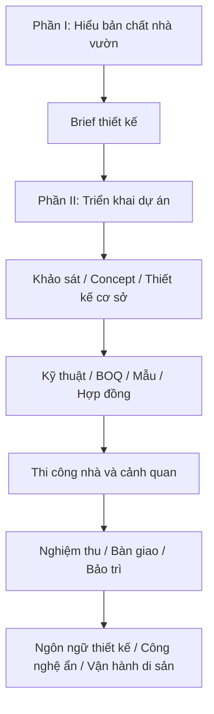

<!-- source: giao_trinh_nha_vuon_nghi_duong/00_muc_luc_va_huong_dan_hoc.md -->

# Bộ Giáo Trình Thiết Kế Nhà Vườn Nghỉ Dưỡng Nhiệt Đới

## Mục tiêu tổng quát

Bộ giáo trình này giúp người học hiểu bản chất của nhà vườn nghỉ dưỡng và làm chủ quá trình triển khai dự án từ tư duy, brief, khảo sát, thiết kế, thi công, nghiệm thu đến bảo trì. Mục tiêu không phải thay thế chuyên gia, mà là đủ năng lực đặt đề bài đúng, hỏi đúng, duyệt đúng và kiểm soát chất lượng bằng tiêu chí.

Sau khi học xong, người học cần có khả năng:

- Đọc khu đất, khí hậu, trải nghiệm, cây, nước, vật liệu và bảo trì ở mức nền tảng vững.
- Xây dựng brief thiết kế và brief triển khai đủ rõ.
- Kiểm soát concept, thiết kế cơ sở, hồ sơ kỹ thuật, BOQ, mẫu, tiến độ, thi công, nghiệm thu và bảo trì.
- Làm việc hiệu quả với kiến trúc sư, cảnh quan, kỹ sư, nhà thầu và đơn vị bảo trì.
- Tự kiểm tra dự án bằng checklist thay vì duyệt cảm tính.
- Đọc, lập nhiệm vụ và duyệt thiết kế phần nhà: pháp lý, công năng, mặt bằng, mặt cắt, vỏ nhà, kết cấu, MEP, vật liệu và hồ sơ.
- Kiểm soát ngôn ngữ thiết kế tổng thể, công nghệ ẩn và vận hành dài hạn để công trình có khả năng trở thành di sản.

## Tư duy xuyên suốt



## Cách học khuyến nghị

| Giai đoạn | Cách học | Kết quả cần đạt |
|---|---|---|
| 1. Nắm nền tảng | Học Module 01-12 | Có ngôn ngữ đúng về nhà vườn, khí hậu, trải nghiệm, cây, nước, vật liệu, bảo trì và brief |
| 2. Làm chủ triển khai | Học Module 13-19 | Biết kiểm soát brief, khảo sát, concept, thiết kế cơ sở, kỹ thuật, BOQ và ngân sách |
| 3. Kiểm soát thi công | Học Module 20-25 | Biết duyệt mẫu, chọn đội ngũ, quản lý hiện trường, thi công nhà-vườn, nghiệm thu và bàn giao |
| 4. Vận hành dài hạn | Học Module 26 và phụ lục | Có kế hoạch bảo trì 12 tháng và kịch bản 1-3-5 năm |
| 5. Đi sâu thiết kế nhà | Học Module 27-34 | Có brief kiến trúc, zoning, mặt cắt, checklist vỏ nhà, phối hợp kỹ thuật và tiêu chuẩn duyệt hồ sơ |
| 6. Nâng cấp thành tài sản di sản | Học Module 35-37 và phụ lục S-U | Có ngôn ngữ thiết kế thống nhất, công nghệ ẩn và hồ sơ vận hành 20-50 năm |

## Mục lục chi tiết

### Phần I. Nền tảng thiết kế nhà vườn

| Tài liệu | Nội dung | Đầu ra chính |
|---|---|---|
| [Module 01](modules/module-01-tu-duy-nen-tang.md) | Tư duy nền tảng | Tuyên ngôn thiết kế nhà vườn |
| [Module 02](modules/module-02-doc-khu-dat.md) | Đọc khu đất | Phiếu khảo sát nắng, gió, nước, đất, view |
| [Module 03](modules/module-03-trai-nghiem-con-nguoi.md) | Trải nghiệm con người | Hành trình không gian và điểm dừng |
| [Module 04](modules/module-04-kien-truc-nhiet-doi.md) | Kiến trúc nhiệt đới | Checklist nhà mát và hiên sống được |
| [Module 05](modules/module-05-quan-he-nha-va-vuon.md) | Quan hệ nhà - vườn | Sơ đồ kết nối trong nhà, hiên, sân, vườn |
| [Module 06](modules/module-06-cay-xanh-nhieu-tang.md) | Cây xanh nhiều tầng | Sơ đồ tầng cây và vai trò cây |
| [Module 07](modules/module-07-dat-nuoc-thoat-nuoc-tuoi.md) | Đất, nước, thoát nước, tưới | Bản đồ nước và yêu cầu kỹ thuật nền |
| [Module 08](modules/module-08-vat-lieu-mau-sac-chat-cam.md) | Vật liệu, màu sắc, chất cảm | Bảng vật liệu có lý do chọn |
| [Module 09](modules/module-09-anh-sang-am-thanh-mui-huong.md) | Ánh sáng và giác quan | Bản đồ giác quan |
| [Module 10](modules/module-10-thoi-gian-va-bao-tri.md) | Thời gian và bảo trì | Kế hoạch chăm sóc và kịch bản 5 năm |
| [Module 11](modules/module-11-quy-trinh-lam-viec.md) | Quy trình làm việc | Bộ câu hỏi kiểm soát thiết kế-thi công |
| [Module 12](modules/module-12-brief-thiet-ke.md) | Brief tổng hợp | Brief thiết kế nhà vườn hoàn chỉnh |

### Phần II. Triển khai dự án nhà vườn từ brief đến bảo trì

| Tài liệu | Nội dung | Đầu ra chính |
|---|---|---|
| [Module 13](modules/module-13-tong-quan-lo-trinh-trien-khai-du-an.md) | Tổng quan lộ trình triển khai | Master roadmap dự án |
| [Module 14](modules/module-14-brief-trien-khai-va-yeu-cau-dau-bai.md) | Brief triển khai | Master brief triển khai |
| [Module 15](modules/module-15-khao-sat-hien-trang-phap-ly-do-dac-ha-tang.md) | Khảo sát hiện trạng, pháp lý, đo đạc, hạ tầng | Báo cáo khảo sát đầu vào |
| [Module 16](modules/module-16-concept-tong-the-nha-vuon.md) | Concept tổng thể nhà - vườn | Checklist duyệt concept |
| [Module 17](modules/module-17-thiet-ke-co-so-va-phuong-an-thiet-ke.md) | Thiết kế cơ sở | Checklist duyệt thiết kế cơ sở |
| [Module 18](modules/module-18-ho-so-ky-thuat-kien-truc-ket-cau-mep-canh-quan.md) | Hồ sơ kỹ thuật | Ma trận hồ sơ kỹ thuật |
| [Module 19](modules/module-19-du-toan-boq-pham-vi-cong-viec-ngan-sach.md) | Dự toán, BOQ, phạm vi, ngân sách | BOQ và kiểm soát ngân sách |
| [Module 20](modules/module-20-mau-mockup-vat-lieu-cay-thiet-bi-duyet-mau.md) | Mẫu, mockup và duyệt mẫu | Phiếu duyệt mẫu |
| [Module 21](modules/module-21-lua-chon-doi-ngu-hop-dong-tien-do-quan-ly-thay-doi.md) | Đội ngũ, hợp đồng, tiến độ, thay đổi | Khung quản lý hợp đồng-tiến độ |
| [Module 22](modules/module-22-chuan-bi-thi-cong-quan-ly-hien-truong-an-toan-chat-luong.md) | Chuẩn bị thi công và hiện trường | Checklist trước khởi công |
| [Module 23](modules/module-23-thi-cong-phan-nha-tho-hoan-thien-he-thong-ky-thuat.md) | Thi công phần nhà | Checklist mốc che lấp và hoàn thiện |
| [Module 24](modules/module-24-thi-cong-canh-quan-dat-nuoc-cay-tuoi-den-vat-lieu-ngoai-troi.md) | Thi công cảnh quan | Checklist đất-nước-cây-tưới-đèn |
| [Module 25](modules/module-25-nghiem-thu-ban-giao-van-hanh-thu-ho-so-hoan-cong.md) | Nghiệm thu và bàn giao | Checklist bàn giao và hồ sơ hoàn công |
| [Module 26](modules/module-26-bao-tri-theo-doi-sau-ban-giao-kich-ban-1-3-5-nam.md) | Bảo trì sau bàn giao | Kế hoạch 12 tháng và kịch bản 1-3-5 năm |

### Phần III. Thiết kế nhà nghỉ dưỡng gia đình trong khu nhà vườn

| Tài liệu | Nội dung | Đầu ra chính |
|---|---|---|
| [Module 27](modules/module-27-nhiem-vu-thiet-ke-nha-va-chuan-dau-vao-du-an.md) | Nhiệm vụ thiết kế nhà và chuẩn đầu vào dự án | Brief kiến trúc, ma trận người dùng-hoạt động-không gian |
| [Module 28](modules/module-28-phap-ly-quy-hoach-giay-phep-va-gioi-han-thiet-ke.md) | Pháp lý, quy hoạch, giấy phép và giới hạn thiết kế | Checklist pháp lý, sơ đồ vùng được xây |
| [Module 29](modules/module-29-cong-nang-zoning-va-ma-tran-quan-he-phong.md) | Công năng, zoning và ma trận quan hệ phòng | Sơ đồ zoning, ma trận quan hệ phòng |
| [Module 30](modules/module-30-mat-bang-mat-cat-cao-do-va-to-chuc-hinh-khoi.md) | Mặt bằng, mặt cắt, cao độ và tổ chức hình khối | Mặt cắt chính, sơ đồ cao độ, bảng so sánh phương án |
| [Module 31](modules/module-31-thiet-ke-khi-hau-cho-vo-nha-mai-hien-cua-kinh-lam.md) | Thiết kế khí hậu cho vỏ nhà | Ma trận mái-hiên-cửa-kính-lam |
| [Module 32](modules/module-32-phoi-hop-ket-cau-mep-va-ky-thuat-van-hanh.md) | Phối hợp kết cấu, MEP và kỹ thuật vận hành | Checklist phối hợp bộ môn, sơ đồ vùng kỹ thuật |
| [Module 33](modules/module-33-vat-lieu-cau-tao-chong-tham-chong-nong-va-bao-tri.md) | Vật liệu, cấu tạo, chống thấm, chống nóng và bảo trì | Bảng vật liệu, checklist cấu tạo rủi ro |
| [Module 34](modules/module-34-ho-so-thiet-ke-checklist-duyet-phuong-an-va-tieu-chuan-nghiem-thu.md) | Hồ sơ thiết kế, checklist duyệt và tiêu chuẩn nghiệm thu | Danh mục hồ sơ, mẫu nghiệm thu thiết kế |

### Phần IV. Thiết kế tổng thể, công nghệ ẩn và vận hành di sản

| Tài liệu | Nội dung | Đầu ra chính |
|---|---|---|
| [Module 35](modules/module-35-ngon-ngu-thiet-ke-tong-the-noi-that-ngoai-that-canh-quan.md) | Ngôn ngữ thiết kế tổng thể, nội thất - ngoại thất - cảnh quan | Tuyên ngôn ngôn ngữ thiết kế, material board, checklist duyệt tổng thể |
| [Module 36](modules/module-36-cong-nghe-an-an-ninh-an-toan-tien-nghi-khong-pho-truong.md) | Công nghệ ẩn, an ninh, an toàn và tiện nghi không phô trương | Ma trận công nghệ ẩn, kịch bản vận hành, checklist bàn giao số |
| [Module 37](modules/module-37-van-hanh-tu-dong-bao-tri-du-bao-ho-so-tai-san-di-san.md) | Vận hành tự động, bảo trì dự báo và hồ sơ tài sản sau bàn giao | Asset register, kế hoạch 20-50 năm, sổ tay di sản |

## Phụ lục thực hành

| Phụ lục | Nội dung |
|---|---|
| [Phụ lục A](phu_luc/checklist_tong_hop.md) | Checklist tổng hợp đánh giá nhà vườn |
| [Phụ lục B](phu_luc/lo_trinh_hoc_30_ngay.md) | Lộ trình học 30 ngày |
| [Phụ lục C](phu_luc/mau_phieu_khao_sat_khu_dat.md) | Mẫu phiếu khảo sát khu đất |
| [Phụ lục D](phu_luc/mau_brief_thiet_ke.md) | Mẫu brief thiết kế nhà vườn nghỉ dưỡng |
| [Phụ lục E](phu_luc/mau_danh_gia_thiet_ke.md) | Mẫu đánh giá phương án thiết kế |
| [Phụ lục F](phu_luc/ban_tom_tat_1_trang.md) | Bản tóm tắt 1 trang |
| [Phụ lục G](phu_luc/mau_master_brief_trien_khai_du_an.md) | Mẫu master brief triển khai dự án |
| [Phụ lục H](phu_luc/phieu_khao_sat_hien_trang_phap_ly.md) | Phiếu khảo sát hiện trạng và pháp lý |
| [Phụ lục I](phu_luc/checklist_duyet_concept.md) | Checklist duyệt concept |
| [Phụ lục J](phu_luc/checklist_duyet_thiet_ke_co_so.md) | Checklist duyệt thiết kế cơ sở |
| [Phụ lục K](phu_luc/ma_tran_ho_so_ky_thuat_can_co.md) | Ma trận hồ sơ kỹ thuật cần có |
| [Phụ lục L](phu_luc/mau_duyet_vat_lieu_cay_thiet_bi.md) | Mẫu duyệt vật liệu/cây/thiết bị |
| [Phụ lục M](phu_luc/mau_boq_pham_vi_cong_viec.md) | Mẫu BOQ/phạm vi công việc |
| [Phụ lục N](phu_luc/mau_tien_do_tong_the.md) | Mẫu tiến độ tổng thể |
| [Phụ lục O](phu_luc/mau_nhat_ky_thay_doi_phat_sinh.md) | Mẫu nhật ký thay đổi và phát sinh |
| [Phụ lục P](phu_luc/checklist_kiem_tra_hien_truong.md) | Checklist kiểm tra hiện trường |
| [Phụ lục Q](phu_luc/checklist_nghiem_thu_ban_giao.md) | Checklist nghiệm thu bàn giao |
| [Phụ lục R](phu_luc/ke_hoach_bao_tri_12_thang_1_3_5_nam.md) | Kế hoạch bảo trì 12 tháng và kịch bản 1-3-5 năm |
| [Phụ lục S](phu_luc/checklist_ngon_ngu_thiet_ke_tong_the.md) | Checklist duyệt ngôn ngữ thiết kế tổng thể |
| [Phụ lục T](phu_luc/ma_tran_cong_nghe_an_an_ninh_an_toan_tien_nghi.md) | Ma trận công nghệ ẩn, an ninh, an toàn và tiện nghi |
| [Phụ lục U](phu_luc/mau_ho_so_tai_san_va_ke_hoach_van_hanh_di_san_20_50_nam.md) | Mẫu hồ sơ tài sản và kế hoạch vận hành di sản 20-50 năm |

## Chuẩn trình bày trong từng module

Mỗi module đều dùng cùng một khung 15 phần để dễ học, dễ rà soát và đủ sâu khi áp dụng vào dự án thật:

1. Vai trò của module trong toàn bộ giáo trình.
2. Mục tiêu học tập.
3. Tư duy cốt lõi.
4. Bản chất vấn đề.
5. Kiến thức nền cần hiểu đúng.
6. Các nguyên lý chính.
7. Công cụ phân tích.
8. Quy trình áp dụng từng bước.
9. Ví dụ thực tế.
10. Lỗi thường gặp và cách tránh.
11. Checklist kiểm tra.
12. Bài tập thực hành.
13. Tiêu chí tự đánh giá.
14. Liên kết với các module khác.
15. Ghi chú giới hạn chuyên môn.

Module 27-34 dùng khung chuyên sâu hơn cho phần nhà: vai trò, mục tiêu, kiến thức đầu vào, khái niệm cốt lõi, nguyên lý thiết kế, quy chuẩn/pháp lý cần kiểm tra, công cụ phân tích, quy trình, đầu ra bắt buộc, ví dụ, lỗi thường gặp, checklist, bài tập, tiêu chí tự đánh giá và giới hạn chuyên môn.

Module 35-37 dùng khung chuyên sâu cho lớp tổng thể và vận hành di sản: ngôn ngữ thiết kế, công nghệ ẩn, an ninh, an toàn, tiện nghi, hồ sơ tài sản, bảo trì dự báo, kế hoạch vòng đời và nguyên tắc chuyển giao 20-50 năm.

## Giới hạn của giáo trình

Giáo trình đủ để chủ nhà hiểu bản chất, lập đề bài, kiểm soát thiết kế, làm việc với chuyên gia, theo dõi thi công và nghiệm thu ở mức có tiêu chí. Tài liệu không thay thế hồ sơ thiết kế, tư vấn pháp lý, tính toán kỹ thuật, giám sát chuyên môn, hợp đồng pháp lý hoặc trách nhiệm nghề nghiệp của các đơn vị tư vấn-thi công.

---

<!-- source: giao_trinh_nha_vuon_nghi_duong/modules/module-01-tu-duy-nen-tang.md -->

# Module 01. Tư Duy Nền Tảng Về Nhà Vườn Nghỉ Dưỡng

## 1. Vai trò của module trong toàn bộ giáo trình

Module này đặt hệ quy chiếu cho toàn bộ giáo trình. Nó nhận đầu vào từ mong muốn sống thật của chủ nhà và tạo ra bộ nguyên tắc để đọc khu đất, tổ chức trải nghiệm, kiểm tra khí hậu, chọn cây, chọn vật liệu và lập brief tổng hợp. Nếu phần tư duy nền sai, các module sau dễ biến thành thao tác trang trí rời rạc.

## 2. Mục tiêu học tập

- Nhận biết nhà vườn nghỉ dưỡng như một hệ sống, không phải phép cộng giữa nhà và cây.
- Giải thích được vì sao cảm xúc sống, khu đất, vận hành và thời gian phải đi trước phong cách.
- Phân tích được nhu cầu người dùng, mức bảo trì, điều cần tránh và hình ảnh khu vườn sau nhiều năm.
- Viết được tuyên ngôn thiết kế đủ rõ để kiểm tra mọi quyết định về sau.

## 3. Tư duy cốt lõi

> Đừng thiết kế “nhà + cây”. Hãy thiết kế một hệ sống nơi con người, kiến trúc, vườn, đất, nước, ánh sáng, gió và thời gian hỗ trợ lẫn nhau.

## 4. Bản chất vấn đề

Nhà vườn nghỉ dưỡng không phải là một phối cảnh đẹp đặt trên đất, mà là một môi trường sống có nhịp dùng hằng ngày, nhịp mùa và nhịp trưởng thành theo năm tháng.

Bản chất của thiết kế là chọn đúng mối quan hệ: nhà với vườn, người với không gian, cây với đất, nước với cao độ, vật liệu với khí hậu, mong muốn với khả năng chăm sóc.

Người mới thường bắt đầu bằng ảnh mẫu, phong cách hoặc danh sách cây. Cách này dễ bỏ qua câu hỏi quan trọng hơn: ai sẽ sống ở đây, họ muốn cảm thấy gì, khu đất cho phép điều gì, và thiết kế sẽ vận hành ra sao sau 1 năm, 3 năm, 5 năm.

## 5. Kiến thức nền cần hiểu đúng

### 5.1. Hệ sống

**Khái niệm:** Một hệ sống gồm nhiều thành phần ảnh hưởng qua lại: người, nhà, cây, đất, nước, gió, ánh sáng, vật liệu và bảo trì.

**Bản chất:** Nếu một phần sai, ví dụ thoát nước kém hoặc cây đặt quá sát nhà, chất lượng của nhiều phần khác cũng giảm theo.

**Hệ quả thiết kế:** Mọi quyết định phải được kiểm bằng tác động dây chuyền, không xem từng chi tiết riêng lẻ.

### 5.2. Chất lượng sống

**Khái niệm:** Chất lượng sống là cảm giác ở thật: mát, thoáng, riêng tư, an toàn, dễ dùng và có lý do để đi chậm lại.

**Bản chất:** Không gian nghỉ dưỡng thất bại khi chỉ đẹp để nhìn nhưng nóng, trơn, muỗi, thiếu bóng hoặc khó chăm.

**Hệ quả thiết kế:** Ưu tiên trải nghiệm sử dụng trước hình thức trang trí.

### 5.3. Thứ tự thiết kế

**Khái niệm:** Thứ tự đúng là xác định đời sống mong muốn, đọc khu đất, tổ chức quan hệ nhà-vườn, rồi mới chọn cây, vật liệu, đèn và chi tiết.

**Bản chất:** Làm ngược thứ tự khiến các quyết định sau phải sửa lỗi cho quyết định trước.

**Hệ quả thiết kế:** Không chọn chi tiết khi chưa rõ vai trò của nó trong tổng thể.

### 5.4. Tính trưởng thành

**Khái niệm:** Cây lớn lên, vật liệu cũ đi, nhu cầu gia đình đổi và hệ thống kỹ thuật xuống cấp.

**Bản chất:** Một thiết kế tốt phải đẹp lúc bàn giao và vẫn có phẩm chất khi già đi.

**Hệ quả thiết kế:** Mỗi phương án cần kịch bản 1 năm, 3 năm, 5 năm.

### 5.5. Năng lực vận hành

**Khái niệm:** Mức chăm sóc thực tế quyết định thiết kế có sống được không.

**Bản chất:** Vườn vượt quá thời gian, ngân sách hoặc kỹ năng chăm sóc sẽ nhanh xuống cấp.

**Hệ quả thiết kế:** Xác định mức bảo trì từ đầu và dùng nó làm ranh giới thiết kế.

## 6. Các nguyên lý thiết kế chính

| Nguyên lý | Vì sao quan trọng | Cách áp dụng |
|---|---|---|
| Cảm xúc trước hình thức | Cảm xúc là tiêu chí ra quyết định, hình thức chỉ là phương tiện. | Viết 3-5 từ khóa cảm xúc trước khi chọn phong cách. |
| Tổng thể trước chi tiết | Chi tiết đẹp sai chỗ làm tổng thể rối. | Chốt cấu trúc không gian, hành trình, khoảng mở rồi mới chọn cây, đá, đèn. |
| Ít nhưng đúng vai | Không gian nghỉ dưỡng cần khoảng thở. | Mỗi cây, ghế, đèn, hồ nước phải có vai trò rõ. |
| Dễ sống là tiêu chí cao | Đẹp nhưng khó dùng không phải thiết kế tốt. | Kiểm tra nóng, trơn, muỗi, ẩm, riêng tư, bảo trì trước khi duyệt. |
| Thiết kế cho thời gian | Nhà vườn thay đổi liên tục. | Hỏi phương án sẽ ra sao sau 1 năm, 3 năm, 5 năm. |

## 7. Công cụ phân tích

- Bản tuyên ngôn thiết kế 10-12 câu.
- Ma trận người dùng - hoạt động - cảm xúc - yêu cầu không gian.
- Danh sách điều không chấp nhận: nóng, ẩm, rối, khó chăm, thiếu riêng tư.
- Thang bảo trì: thấp, vừa, cao, kèm người chịu trách nhiệm.

## 8. Quy trình áp dụng từng bước

1. Ghi người sử dụng chính, người ghé thăm, người chăm và nhu cầu đặc biệt.
2. Viết 3-5 cảm xúc chủ đạo cần đạt.
3. Liệt kê 5 hoạt động quan trọng nhất sẽ diễn ra trong nhà vườn.
4. Xác định mức bảo trì có thể chấp nhận và các giới hạn ngân sách, thời gian, nhân lực.
5. Ghi 5 điều không muốn xảy ra trong vận hành.
6. Chuyển toàn bộ thành 5-7 nguyên tắc thiết kế dùng để review các module sau.

## 9. Ví dụ thực tế

| Tình huống | Dấu hiệu nhận biết | Nguyên nhân | Hướng xử lý |
|---|---|---|---|
| Gia đình muốn nghỉ cuối tuần | Nhu cầu thiên về phục hồi, tụ họp, ít chăm. | Nếu chạy theo khu vườn cầu kỳ sẽ mệt khi vận hành. | Ưu tiên hiên rộng, bóng mát, bếp kết nối ngoài trời, cây khỏe, ít chi tiết khó chăm. |
| Chủ nhà muốn cảm giác như rừng nhỏ | Mong muốn nhiều tầng xanh và cảm giác được bao bọc. | Nếu trồng dày thiếu kiểm soát sẽ tối, ẩm, muỗi. | Tạo cây nhiều tầng nhưng giữ khoảng mở, lối bảo trì và thông gió. |
| Đất nhỏ nhưng muốn nghỉ dưỡng | Không đủ chỗ cho nhiều tiểu cảnh. | Nhồi nhiều điểm nhấn làm mất chiều sâu. | Tập trung một khung nhìn chính, một hiên tốt và vài lớp cây chọn lọc. |
| Muốn vườn ít chăm | Năng lực vận hành thấp. | Chọn cây hoa mùa vụ hoặc vật liệu khó vệ sinh sẽ xuống cấp nhanh. | Dùng cấu trúc đơn giản, cây khỏe, phủ gốc, tưới theo vùng. |
| Thích nhiều phong cách ảnh mẫu | Tín hiệu thẩm mỹ bị phân tán. | Phối nhiều ngôn ngữ làm nhà-vườn thiếu bản sắc. | Quy về cảm xúc gốc rồi chọn một hệ vật liệu và cây nhất quán. |

## 10. Lỗi thường gặp và cách tránh

| Lỗi | Vì sao sai | Hậu quả | Cách tránh |
|---|---|---|---|
| Bắt đầu bằng ảnh mẫu | Ảnh mẫu che khuất điều kiện thật của khu đất. | Dễ sao chép hình thức sai khí hậu, sai nhu cầu. | Dùng ảnh mẫu chỉ để gọi tên cảm xúc, không sao chép bố cục. |
| Mua cây trước khi có tổng thể | Cây chưa có vai trò không gian. | Cây sai vị trí, khó sống, tốn chi phí di dời. | Chỉ chọn cây sau khi có sơ đồ lớp và điểm nhìn. |
| Làm quá nhiều điểm nhấn | Mắt không có nơi nghỉ. | Không gian mất chất nghỉ dưỡng. | Chọn một vài điểm chủ đạo, phần còn lại làm nền. |
| Không dự đoán cây lớn | Quên thời gian là một phần thiết kế. | Nhà tối, ẩm, rễ phá sân hoặc đường ống. | Kiểm tra kích thước cây trưởng thành. |
| Không tính người chăm | Thiết kế vượt năng lực vận hành. | Sau bàn giao nhanh xuống cấp. | Chốt mức bảo trì trước khi duyệt phương án. |

## 11. Checklist kiểm tra

| Câu hỏi kiểm tra | Dấu hiệu đạt | Rủi ro nếu chưa đạt | Hành động sửa |
|---|---|---|---|
| Đã có 3-5 cảm xúc chủ đạo chưa? | Cảm xúc cụ thể, không chỉ “đẹp” hoặc “sang”. | Thiết kế dễ chạy theo ảnh mẫu. | Viết lại bằng từ mô tả trải nghiệm sống. |
| Đã xác định người dùng chính chưa? | Có danh sách người ở, khách, người chăm, nhu cầu đặc biệt. | Không gian thiếu đúng người phục vụ. | Lập bảng người dùng và hoạt động. |
| Đã có mức bảo trì chưa? | Có mức thấp, vừa hoặc cao kèm người chịu trách nhiệm. | Vườn vượt khả năng chăm sóc. | Giảm chi tiết, chọn cây và vật liệu phù hợp. |
| Đã hình dung trạng thái sau 5 năm chưa? | Có kịch bản cây lớn, vật liệu cũ, nhu cầu thay đổi. | Thiết kế đẹp lúc đầu nhưng già đi xấu. | Bổ sung kịch bản trưởng thành. |
| Đã có nguyên tắc review xuyên suốt chưa? | Có 5-7 câu dùng để duyệt quyết định. | Các module sau thiếu tiêu chí chung. | Chuyển tuyên ngôn thành checklist. |

## 12. Bài tập thực hành

| Mức | Bài tập |
|---|---|
| Cơ bản | Viết 5 mong muốn sống thật và 5 điều không muốn xảy ra trong khu nhà vườn. |
| Trung cấp | Lập ma trận người dùng - hoạt động - cảm xúc - yêu cầu không gian cho một dự án giả định. |
| Nâng cao | Viết tuyên ngôn thiết kế 10-12 câu và rút ra 7 nguyên tắc review cho toàn bộ dự án. |

## 13. Tiêu chí tự đánh giá

| Mức | Biểu hiện |
|---|---|
| Cơ bản | Nêu được cảm xúc và nhu cầu nhưng còn chung. |
| Khá | Giải thích được vì sao nhu cầu đó ảnh hưởng tới thiết kế. |
| Tốt | Chuyển được nhu cầu thành nguyên tắc thiết kế cụ thể. |
| Xuất sắc | Tuyên ngôn đủ rõ để kiểm tra bản vẽ, vật liệu, cây, ánh sáng và brief. |

## 14. Liên kết với các module khác

Đầu vào từ mong muốn sống của chủ nhà. Đầu ra cho Module 02 khi đọc khu đất, Module 03 khi thiết kế trải nghiệm và Module 12 khi lập brief tổng hợp.

## 15. Ghi chú giới hạn chuyên môn

Đây là module định hướng tư duy, chưa thay thế khảo sát hiện trạng, thiết kế kỹ thuật hoặc tư vấn chuyên môn cho một dự án cụ thể.

---

<!-- source: giao_trinh_nha_vuon_nghi_duong/modules/module-02-doc-khu-dat.md -->

# Module 02. Đọc Khu Đất: Nắng, Gió, Nước, Đất, View

## 1. Vai trò của module trong toàn bộ giáo trình

Module này chuyển tư duy nền tảng thành dữ liệu hiện trạng. Nó nhận nguyên tắc sống từ Module 01 và tạo bản đồ đầu vào cho kiến trúc nhiệt đới, trải nghiệm con người, quan hệ nhà-vườn, cây xanh, thoát nước và brief.

## 2. Mục tiêu học tập

- Nhận biết khu đất như một hệ có sẵn nắng, gió, nước, đất, cây, view, tiếng ồn và ranh giới.
- Giải thích được vì sao quan sát theo thời điểm quan trọng hơn nhìn một lần.
- Phân tích được cơ hội và rủi ro trên sơ đồ hiện trạng.
- Tạo được bản đồ đọc đất đủ rõ để đưa vào brief thiết kế.

## 3. Tư duy cốt lõi

> Khu đất không phải tờ giấy trắng. Nó là một hệ đang vận hành; nhiệm vụ đầu tiên là đọc đúng hệ đó.

## 4. Bản chất vấn đề

Đọc khu đất là tìm quy luật trước khi can thiệp. Nắng đi theo giờ, nước đi theo cao độ, gió đi theo khoảng trống và vật cản, cây phản ánh đất, còn view và tiếng ồn quyết định cách mở hoặc che.

Người mới thường nhìn khu đất như diện tích trống để đặt nhà và trồng cây. Cách đọc đúng là xem khu đất đang buộc ta phải tôn trọng điều gì và đang trao cơ hội gì.

Dữ liệu tốt phải có vị trí trên sơ đồ. Nhận xét bằng lời mà không gắn vào hướng, cao độ, khoảng cách và thời điểm sẽ khó dùng để thiết kế.

## 5. Kiến thức nền cần hiểu đúng

### 5.1. Nắng

**Khái niệm:** Nắng thay đổi theo giờ và theo mùa, nắng sáng thường dễ chịu hơn nắng chiều.

**Bản chất:** Nắng Tây/Tây Nam có bức xạ xiên, kéo dài, làm nóng tường, kính, sân và không gian sau đó.

**Hệ quả thiết kế:** Lập bản đồ nắng sáng, trưa, chiều và đánh dấu vùng cần che.

### 5.2. Gió

**Khái niệm:** Gió có hướng, tốc độ, mùa và chất lượng khác nhau.

**Bản chất:** Gió tốt làm mát nhưng cũng có thể mang bụi, mùi, tiếng ồn hoặc mưa tạt.

**Hệ quả thiết kế:** Ghi hướng gió tốt/xấu, vùng bí và vật cản gió.

### 5.3. Nước

**Khái niệm:** Nước mưa cho thấy cao độ thật và lỗi mặt bằng.

**Bản chất:** Điểm đọng nước thường báo trước nguy cơ trơn, bẩn, muỗi, úng cây và hư vật liệu.

**Hệ quả thiết kế:** Quan sát sau mưa, vẽ hướng nước chảy và điểm cần thoát.

### 5.4. Đất

**Khái niệm:** Đất quyết định sức khỏe rễ, khả năng thoát nước và lựa chọn cây.

**Bản chất:** Đất cát thoát nhanh nhưng nghèo dinh dưỡng, đất sét giữ nước nhưng dễ bí, đất nén làm rễ khó thở.

**Hệ quả thiết kế:** Ghi loại đất sơ bộ, vùng đất nén, vùng cần cải tạo.

### 5.5. View và riêng tư

**Khái niệm:** View đẹp cần mở có chủ đích, view xấu và hướng nhìn từ hàng xóm cần xử lý.

**Bản chất:** Không phải mọi hướng trống đều đáng mở cửa.

**Hệ quả thiết kế:** Đánh dấu view nên mở, view cần che, điểm nhìn bị lộ.

### 5.6. Cây hiện trạng

**Khái niệm:** Cây lớn khỏe là tài sản thời gian.

**Bản chất:** Loại bỏ cây sai có thể làm mất bóng mát nhiều năm; giữ cây bệnh có thể tạo rủi ro.

**Hệ quả thiết kế:** Lập bảng giữ, cắt tỉa, di dời, loại bỏ.

## 6. Các nguyên lý thiết kế chính

| Nguyên lý | Vì sao quan trọng | Cách áp dụng |
|---|---|---|
| Quan sát theo thời điểm | Khu đất thay đổi theo giờ và sau mưa. | Khảo sát sáng, trưa, chiều và ít nhất một lần sau mưa. |
| Ghi nhận bằng bản đồ | Dữ liệu không có vị trí thì khó thiết kế. | Đặt nắng, gió, nước, view, cây lên cùng sơ đồ. |
| Tách cơ hội và rủi ro | Không phải yếu tố nào cũng cần sửa. | Ghi mỗi điểm là giữ, mở, che, nâng, thoát, tránh hoặc xử lý. |
| Không chống lại khu đất | Chống quy luật tự nhiên thường tốn chi phí. | Đặt hoạt động phù hợp với nắng, gió, nước và view. |
| Chuyển quan sát thành yêu cầu | Khảo sát chỉ có giá trị khi dẫn tới quyết định. | Mỗi dữ liệu phải có hệ quả thiết kế. |

## 7. Công cụ phân tích

- Bản đồ 7 lớp: nắng, gió, nước, đất, cây, view, tiếng ồn.
- Bảng cơ hội - rủi ro - quyết định thiết kế.
- Album ảnh hiện trạng theo vị trí chụp và thời điểm.
- Danh sách 10 nhận định thiết kế quan trọng nhất.

## 8. Quy trình áp dụng từng bước

1. Vẽ sơ đồ đất, hướng Bắc, ranh, cổng, công trình, cây lớn, cao độ tương đối.
2. Chụp ảnh từ cổng, các góc đất, vị trí dự kiến hiên, cửa và điểm nhìn.
3. Đánh dấu nắng sáng, trưa, chiều, đặc biệt hướng Tây và Tây Nam.
4. Ghi gió tốt, gió xấu, vùng bí, nguồn bụi, mùi, tiếng ồn.
5. Sau mưa, đánh dấu hướng nước chảy, điểm đọng, vùng bùn, vùng trơn.
6. Kiểm tra đất và cây hiện trạng ở mức sơ bộ.
7. Tóm tắt thành 10 quyết định thiết kế ban đầu.

## 9. Ví dụ thực tế

| Tình huống | Dấu hiệu nhận biết | Nguyên nhân | Hướng xử lý |
|---|---|---|---|
| Phía Tây trống và nóng | Tường, sân hoặc phòng chính nhận nắng chiều. | Bức xạ xiên tích nhiệt mạnh. | Giảm kính, thêm hiên, lam, cây bóng mát hoặc đặt chức năng ít ở lâu. |
| Góc Đông Nam có gió mát | Có gió dễ chịu vào thời điểm sử dụng. | Hướng gió phù hợp với khoảng mở. | Ưu tiên hiên, cửa mở hoặc điểm nghỉ. |
| Nước đọng ở lối vào | Sau mưa có vũng hoặc bùn. | Cao độ và độ dốc mặt sân sai. | Xử lý cao độ, rãnh, vật liệu thấm trước khi trang trí. |
| Có view ruộng hoặc vườn xa | Tầm nhìn có chiều sâu. | View là tài sản không gian. | Giữ trục nhìn, không trồng cây chắn view quý. |
| Hàng xóm nhìn trực diện | Vị trí ngồi hoặc phòng ngủ bị lộ. | Thiếu lớp riêng tư. | Dùng cây, cao độ, lam hoặc đổi hướng mở. |

## 10. Lỗi thường gặp và cách tránh

| Lỗi | Vì sao sai | Hậu quả | Cách tránh |
|---|---|---|---|
| Chỉ khảo sát một lần | Một thời điểm không đại diện cho cả ngày và mùa. | Bỏ sót nắng chiều, nước sau mưa, gió xấu. | Khảo sát ít nhất sáng, trưa, chiều và sau mưa. |
| Không chụp ảnh hiện trạng | Ký ức dễ sai khi trao đổi. | Brief và thiết kế thiếu bằng chứng. | Chụp theo vị trí, đánh số và ghi hướng. |
| Xem cây hiện trạng là vật cản | Không định giá bóng mát và thời gian. | Mất cây lớn khỏe, khu đất nóng hơn. | Đánh giá cây trước khi quyết định bỏ. |
| Không kiểm tra nước | Lỗi nước thường lộ sau thi công. | Ngập, trơn, bẩn, úng cây. | Quan sát khi mưa và sau mưa. |
| Không ghi view xấu | Chỉ chú ý view đẹp. | Cửa và hiên mở sai hướng. | Đánh dấu cả view nên mở và view cần che. |

## 11. Checklist kiểm tra

| Câu hỏi kiểm tra | Dấu hiệu đạt | Rủi ro nếu chưa đạt | Hành động sửa |
|---|---|---|---|
| Có bản đồ nắng 3 thời điểm chưa? | Đánh dấu sáng, trưa, chiều trên sơ đồ. | Mở cửa, đặt hiên hoặc cây sai hướng. | Khảo sát lại theo giờ và bổ sung sơ đồ. |
| Có bản đồ nước sau mưa chưa? | Có hướng nước chảy và điểm đọng. | Ngập, trơn, bẩn, úng rễ. | Bổ sung cao độ, rãnh, vật liệu thấm. |
| Có phân loại cây hiện trạng chưa? | Có bảng giữ, tỉa, di dời, bỏ. | Mất tài sản bóng mát hoặc giữ cây rủi ro. | Mời chuyên gia cây kiểm tra cây lớn nếu cần. |
| Có ghi view và riêng tư chưa? | Có view mở, view che, điểm bị nhìn. | Cửa lớn mở sai hướng. | Điều chỉnh khung nhìn và lớp che. |
| Mỗi quan sát đã thành quyết định chưa? | Có hành động mở, che, nâng, thoát, giữ, bỏ. | Khảo sát không giúp thiết kế. | Viết bảng cơ hội - rủi ro - quyết định. |

## 12. Bài tập thực hành

| Mức | Bài tập |
|---|---|
| Cơ bản | Chụp 12 ảnh hiện trạng và ghi hướng, giờ, điều quan sát được. |
| Trung cấp | Vẽ bản đồ 7 lớp của một khu đất thật hoặc giả định. |
| Nâng cao | Tạo bảng 10 nhận định thiết kế, mỗi nhận định có dữ liệu, rủi ro và quyết định tương ứng. |

## 13. Tiêu chí tự đánh giá

| Mức | Biểu hiện |
|---|---|
| Cơ bản | Ghi nhận được hiện trạng chính nhưng còn rời rạc. |
| Khá | Phân biệt được cơ hội và rủi ro. |
| Tốt | Chuyển được dữ liệu hiện trạng thành yêu cầu thiết kế. |
| Xuất sắc | Bản đồ đọc đất đủ rõ để kiến trúc sư và cảnh quan dùng làm đầu vào. |

## 14. Liên kết với các module khác

Đầu vào từ Module 01. Đầu ra trực tiếp cho Module 03, 04, 05, 06, 07 và Module 12.

## 15. Ghi chú giới hạn chuyên môn

Khảo sát trong module này là nền tảng cho chủ nhà. Cao độ, địa chất, cây lớn, thoát nước phức tạp và ranh pháp lý vẫn cần chuyên gia kiểm tra.

---

<!-- source: giao_trinh_nha_vuon_nghi_duong/modules/module-03-trai-nghiem-con-nguoi.md -->

# Module 03. Thiết Kế Trải Nghiệm Con Người

## 1. Vai trò của module trong toàn bộ giáo trình

Module này biến dữ liệu khu đất thành hành trình sống. Nó nhận cảm xúc từ Module 01 và dữ liệu hiện trạng từ Module 02, sau đó tạo nền cho quan hệ nhà-vườn, vị trí hiên, điểm dừng, ánh sáng, âm thanh và brief.

## 2. Mục tiêu học tập

- Nhận biết nhà vườn như một chuỗi trải nghiệm thay vì một mặt bằng tĩnh.
- Giải thích được vai trò của hành trình, điểm dừng, mở-kín, prospect-refuge và tỷ lệ cơ thể.
- Phân tích được vì sao một không gian đẹp có thể ít được dùng.
- Vẽ được sơ đồ hành trình một ngày và dùng nó để chỉnh phương án.

## 3. Tư duy cốt lõi

> Một không gian nghỉ dưỡng tốt không phơi bày mọi thứ cùng lúc; nó dẫn người đi chậm lại qua các lớp mở-kín, sáng-tối, động-tĩnh.

## 4. Bản chất vấn đề

Trải nghiệm không gian là cảm giác nối tiếp theo thời gian: tiếp cận, bước vào, dừng lại, nhìn ra, quay về, dùng ban ngày và dùng ban đêm.

Bản chất của module là thiết kế lý do để con người di chuyển và ở lại. Ghế, lối đi, hiên, cây, ánh sáng chỉ có giá trị khi chúng hỗ trợ hành vi thật.

Người mới thường thiết kế mặt bằng nhìn đẹp từ trên xuống nhưng quên cảm giác của người đứng trong không gian: nhìn gì, nắng ở đâu, có tựa lưng không, có bị nhìn thấy không, đường đi có mời gọi không.

## 5. Kiến thức nền cần hiểu đúng

### 5.1. Hành trình không gian

**Khái niệm:** Hành trình là chuỗi di chuyển từ cổng, sân, hiên, nhà, vườn và điểm nghỉ.

**Bản chất:** Hành trình tốt có nhịp, có chuyển tiếp và không làm người dùng mệt hoặc lạc.

**Hệ quả thiết kế:** Vẽ đường đi theo hoạt động thật, không chỉ theo lối kỹ thuật.

### 5.2. Điểm dừng

**Khái niệm:** Điểm dừng là nơi có lý do để ở lại.

**Bản chất:** Một chỗ ngồi tốt cần bóng, view, điểm tựa, an toàn và tiếp cận thuận tiện.

**Hệ quả thiết kế:** Không đặt ghế nếu chưa biết người ngồi nhìn gì và được che ra sao.

### 5.3. Mở-kín

**Khái niệm:** Mở cho cảm giác thoáng, kín cho cảm giác được ôm và riêng tư.

**Bản chất:** Chỉ mở toàn bộ làm mất chiều sâu, chỉ kín toàn bộ làm bí.

**Hệ quả thiết kế:** Tổ chức nhịp luân phiên bằng cây, tường thấp, mái, cao độ, ánh sáng.

### 5.4. Prospect-refuge

**Khái niệm:** Prospect là nhìn ra, refuge là được che chở.

**Bản chất:** Con người thường thích ngồi nơi có tầm nhìn phía trước và điểm tựa phía sau hoặc bên cạnh.

**Hệ quả thiết kế:** Thiết kế điểm nghỉ có lưng tựa, mép cây, tường thấp hoặc mái che.

### 5.5. Tỷ lệ cơ thể

**Khái niệm:** Khoảng cách, bậc, lối đi, ghế, tay vịn và tầm nhìn phải hợp cơ thể người thật.

**Bản chất:** Sai tỷ lệ làm không gian mỏi, nguy hiểm hoặc ít dùng.

**Hệ quả thiết kế:** Kiểm bằng người già, trẻ nhỏ, người mang đồ và sử dụng ban đêm.

## 6. Các nguyên lý thiết kế chính

| Nguyên lý | Vì sao quan trọng | Cách áp dụng |
|---|---|---|
| Thiết kế theo hoạt động | Không gian phải phục vụ hành vi thật. | Bắt đầu bằng lịch một ngày của người sử dụng. |
| Mỗi điểm ngồi phải có lý do | Ghế không có bóng, view hoặc riêng tư sẽ bị bỏ. | Kiểm tra bóng, nhìn gì, tựa đâu, đi tới ra sao. |
| Tạo nhịp mở-kín | Nhịp tạo chiều sâu nghỉ dưỡng. | Dùng lớp cây, mái, tường thấp và ánh sáng để dẫn dắt. |
| Ưu tiên cảm giác an toàn | Không an toàn thì người dùng không ở lại. | Kiểm tra trơn, tối, khuất, bị nhìn trực diện. |
| Thiết kế theo thời điểm | Sáng, chiều, tối có nhu cầu khác nhau. | Review cùng một điểm ở nhiều giờ. |

## 7. Công cụ phân tích

- Sơ đồ hành trình một ngày.
- Bảng điểm dừng: hoạt động, bóng, view, tựa, riêng tư, tiếp cận.
- Bản đồ mở-kín và vùng động-tĩnh.
- Ma trận người dùng: trẻ nhỏ, người già, khách, người chăm.

## 8. Quy trình áp dụng từng bước

1. Lập danh sách hoạt động trong ngày và trong tuần.
2. Vẽ đường di chuyển của từng hoạt động trên sơ đồ.
3. Chọn 3-5 điểm dừng quan trọng nhất.
4. Mô tả cảm giác mong muốn tại từng điểm dừng.
5. Kiểm tra từng điểm theo bóng, view, tựa, riêng tư, an toàn, tiếp cận.
6. Điều chỉnh lối đi để tránh cắt ngang vùng nghỉ tĩnh hoặc mở thẳng vào view xấu.

## 9. Ví dụ thực tế

| Tình huống | Dấu hiệu nhận biết | Nguyên nhân | Hướng xử lý |
|---|---|---|---|
| Từ cổng vào nhà | Đi thẳng thấy hết nhà và sân. | Thiếu lớp chuyển tiếp nên trải nghiệm bị phơi bày. | Thêm lớp cây, tường thấp hoặc đoạn ngoặt nhẹ để làm chậm nhịp. |
| Góc uống trà sáng | Có nắng nhẹ, view cây thấp, ít người đi ngang. | Điều kiện phù hợp hoạt động tĩnh. | Giữ góc này như điểm dừng chính, tránh đặt lối kỹ thuật cắt qua. |
| Bàn ăn ngoài hiên | Xa bếp hoặc mưa tạt. | Thiếu liên kết chức năng và che chắn. | Đặt gần bếp, đủ rộng, có mái che và đèn ấm. |
| Lối đi trong vườn | Quá thẳng và không có điểm dừng. | Chỉ là đường kỹ thuật, không tạo trải nghiệm. | Tạo đoạn mở, đoạn khép, một vài điểm nhìn và chỗ nghỉ nhỏ. |
| Khu trẻ chơi | Xa tầm nhìn người lớn. | An toàn thị giác bị thiếu. | Đặt trong tầm nhìn từ bếp, hiên hoặc phòng khách. |

## 10. Lỗi thường gặp và cách tránh

| Lỗi | Vì sao sai | Hậu quả | Cách tránh |
|---|---|---|---|
| Thiết kế chỉ theo mặt bằng đẹp | Mặt bằng không phản ánh cảm giác đứng trong không gian. | Không gian thiếu trải nghiệm sống thật. | Kiểm bằng hành trình người dùng. |
| Lối đi quá thẳng | Đi nhanh, không có nhịp nghỉ. | Mất cảm giác khám phá. | Tạo lớp chuyển tiếp và điểm dừng. |
| Điểm ngồi không có bóng | Không dùng được vào giờ nóng. | Ghế thành trang trí. | Kiểm nắng theo giờ trước khi đặt. |
| Mở toàn bộ view | Không còn chiều sâu và riêng tư. | Không gian bị phơi bày. | Chọn view chính, che view phụ. |
| Quên người già và trẻ nhỏ | Không xét tốc độ, tầm nhìn, nguy cơ ngã. | Bậc, nền, lối đi thành rủi ro. | Review bằng người dùng yếu thế nhất. |

## 11. Checklist kiểm tra

| Câu hỏi kiểm tra | Dấu hiệu đạt | Rủi ro nếu chưa đạt | Hành động sửa |
|---|---|---|---|
| Có hành trình một ngày chưa? | Có đường đi cho các hoạt động chính. | Thiết kế không bám đời sống thật. | Lập lịch và vẽ đường di chuyển. |
| Mỗi điểm dừng có lý do chưa? | Có hoạt động, bóng, view, tựa, riêng tư. | Điểm ngồi bị bỏ trống. | Bổ sung điều kiện sử dụng hoặc bỏ điểm thừa. |
| Có nhịp mở-kín chưa? | Có đoạn mở, đoạn khép, vùng chuyển tiếp. | Không gian phẳng và thiếu chiều sâu. | Thêm lớp cây, mái, cao độ hoặc tường thấp. |
| Có kiểm an toàn ban đêm chưa? | Đường đi đọc được, nền không trơn, không có góc khuất nguy hiểm. | Người dùng tránh ra vườn buổi tối. | Bổ sung ánh sáng dẫn hướng và xử lý nền. |
| Lối đi có tránh vùng nghỉ tĩnh không? | Không cắt ngang điểm ngồi chính. | Không gian nghỉ bị quấy nhiễu. | Điều chỉnh tuyến đi hoặc đổi vị trí điểm dừng. |

## 12. Bài tập thực hành

| Mức | Bài tập |
|---|---|
| Cơ bản | Ghi lại hành trình một ngày của một người dùng chính trong nhà vườn. |
| Trung cấp | Vẽ sơ đồ đường đi, 3 điểm dừng và phân tích bóng, view, tựa, riêng tư. |
| Nâng cao | Chỉnh một mặt bằng có sẵn để cải thiện nhịp mở-kín và chất lượng điểm dừng. |

## 13. Tiêu chí tự đánh giá

| Mức | Biểu hiện |
|---|---|
| Cơ bản | Có sơ đồ đường đi và vài điểm dừng. |
| Khá | Giải thích được vì sao điểm dừng dùng được hoặc không dùng được. |
| Tốt | Đề xuất được chỉnh sửa theo hành vi, bóng, view và riêng tư. |
| Xuất sắc | Hành trình đủ rõ để điều chỉnh mặt bằng, hiên, lối đi, cây và ánh sáng. |

## 14. Liên kết với các module khác

Nhận đầu vào từ Module 01 và 02. Tạo nền cho Module 05 về quan hệ nhà-vườn, Module 09 về giác quan và Module 12 về brief.

## 15. Ghi chú giới hạn chuyên môn

Module này định hướng trải nghiệm. Kích thước chi tiết, bậc, lan can, chiếu sáng kỹ thuật và an toàn cần kiểm tra theo tiêu chuẩn thiết kế hiện hành.

---

<!-- source: giao_trinh_nha_vuon_nghi_duong/modules/module-04-kien-truc-nhiet-doi.md -->

# Module 04. Nguyên Lý Kiến Trúc Nhiệt Đới

## 1. Vai trò của module trong toàn bộ giáo trình

Module này chuyển dữ liệu nắng, gió, mưa và ẩm thành quyết định kiến trúc. Nó nhận bản đồ khu đất từ Module 02 và hành trình sử dụng từ Module 03, rồi tạo tiêu chí cho mái, hiên, cửa, kính, vật liệu, cây và brief.

## 2. Mục tiêu học tập

- Nhận biết các nguyên nhân làm nhà nóng, bí, chói, ẩm và mưa tạt.
- Giải thích được cơ chế bức xạ, dẫn nhiệt, đối lưu, bay hơi và tiện nghi nhiệt.
- Phân tích được mái, hiên, cửa, kính, sân, cây và vật liệu theo khí hậu nóng ẩm.
- Tạo checklist review phương án nhà vườn nhiệt đới ở mức có thể dùng với bản vẽ thật.

## 3. Tư duy cốt lõi

> Nhà mát không bắt đầu từ điều hòa, mà từ lớp vỏ biết che nắng, đón gió, giảm bức xạ, thoát khí nóng và tránh mưa tạt.

## 4. Bản chất vấn đề

Kiến trúc nhiệt đới giải quyết đồng thời nóng, ẩm, mưa, chói, gió và bảo trì. Nhà không chỉ cần nhiệt độ thấp hơn mà cần bề mặt ít phát nhiệt, không khí chuyển động, bóng râm đúng chỗ và vùng chuyển tiếp sống được.

Cảm giác nóng không chỉ đến từ nhiệt độ không khí. Sân bê tông, mái, tường Tây, kính nắng và vật liệu tối màu có thể phát nhiệt vào người dù phòng có gió.

Sai lầm phổ biến là dùng điều hòa hoặc kính lớn để bù cho lớp vỏ yếu. Thiết kế đúng phải giảm tải khí hậu từ bên ngoài trước khi dùng thiết bị cơ điện.

## 5. Kiến thức nền cần hiểu đúng

### 5.1. Tiện nghi nhiệt

**Khái niệm:** Tiện nghi nhiệt là cảm giác của cơ thể trước nhiệt độ không khí, độ ẩm, tốc độ gió, bức xạ và nhiệt bề mặt.

**Bản chất:** Độ ẩm cao làm mồ hôi khó bay hơi, bề mặt nóng làm người thấy nóng dù không khí không quá cao.

**Hệ quả thiết kế:** Giảm bức xạ, tăng gió có kiểm soát và giảm vật liệu tích nhiệt quanh người.

### 5.2. Bức xạ mặt trời

**Khái niệm:** Bức xạ truyền nhiệt trực tiếp vào mái, tường, kính và sân.

**Bản chất:** Nắng Tây nguy hiểm vì góc xiên, kéo dài và tích nhiệt cuối ngày.

**Hệ quả thiết kế:** Che nắng bên ngoài bằng mái, hiên, lam, cây, lùi cửa và giảm kính trực tiếp.

### 5.3. Mái nhiệt đới

**Khái niệm:** Mái là lớp nhận nắng và mưa lớn nhất.

**Bản chất:** Mái nóng truyền nhiệt xuống, mái thoát nước kém gây dột, bẩn và bảo trì cao.

**Hệ quả thiết kế:** Dùng mái đua, lớp cách nhiệt, khoảng thông gió, màu phù hợp và thoát nước rõ.

### 5.4. Hiên và vùng đệm

**Khái niệm:** Hiên là bộ lọc khí hậu giữa trong và ngoài.

**Bản chất:** Hiên quá nông không chặn nắng, mưa và không đủ dùng thật.

**Hệ quả thiết kế:** Thiết kế hiên đủ sâu, có bóng, gió, view, thoát nước và liên kết hoạt động.

### 5.5. Thông gió tự nhiên

**Khái niệm:** Gió cần cửa vào, cửa ra và đường đi qua vùng người ở.

**Bản chất:** Một cửa lớn một phía không tạo dòng chảy hiệu quả.

**Hệ quả thiết kế:** Tạo thông gió chéo, cửa thoát cao, kiểm soát mưa tạt, bụi và riêng tư.

### 5.6. Kính

**Khái niệm:** Kính mở view nhưng cũng đưa nhiệt, chói và mất riêng tư vào nhà.

**Bản chất:** Kính lớn sai hướng biến view thành tải nhiệt.

**Hệ quả thiết kế:** Đặt kính ở hướng phù hợp, lùi sau hiên, dùng che ngoài và kiểm soát chói.

### 5.7. Ẩm và mưa tạt

**Khái niệm:** Khí hậu nóng ẩm làm vật liệu lâu khô, dễ rêu, mốc, trơn và muỗi.

**Bản chất:** Mưa ngang có thể làm hỏng cửa, bậc, hiên và chân tường.

**Hệ quả thiết kế:** Tạo mái che, độ dốc, thoát nước, khe thoáng và vật liệu chịu ẩm.

## 6. Các nguyên lý thiết kế chính

| Nguyên lý | Vì sao quan trọng | Cách áp dụng |
|---|---|---|
| Che nắng trước khi làm mát | Nhiệt chặn bên ngoài hiệu quả hơn xử lý bên trong. | Ưu tiên mái, hiên, lam, cây và lớp vỏ. |
| Giảm bức xạ quanh người | Bề mặt nóng làm giảm tiện nghi. | Hạn chế sân bê tông trống, tường tối, mái thấp nóng, kính nắng. |
| Đón gió có kiểm soát | Gió tốt phải đi qua vùng sử dụng. | Mở cửa theo hướng gió, có cửa ra, vẫn chặn mưa, bụi, riêng tư. |
| Tạo vùng đệm sống được | Ranh giới trong-ngoài là nơi quan trọng nhất của nhà vườn. | Thiết kế hiên, sân bán ngoài trời, cây và mái đua như không gian thật. |
| Kiểm soát nước mưa | Nhiệt đới luôn đi kèm mưa lớn. | Mái, máng, cao độ, bậc, nền và cửa phải có đường nước rõ. |
| Phối hợp nhà với vườn | Vườn là hạ tầng vi khí hậu. | Dùng cây, mặt đất thấm, bóng đổ và khoảng mở để làm mát. |

## 7. Công cụ phân tích

- Bản đồ nắng theo giờ cho các mặt nhà.
- Sơ đồ đường gió vào, gió ra và vùng người ở.
- Ma trận mái-hiên-kính-cửa-sân-cây theo rủi ro nóng, chói, mưa, ẩm.
- Checklist review lớp vỏ nhiệt đới cho bản vẽ mặt bằng, mặt cắt và phối cảnh.

## 8. Quy trình áp dụng từng bước

1. Đánh dấu các mặt chịu nắng sáng, trưa, chiều, đặc biệt Tây và Tây Nam.
2. Kiểm tra mái: độ vươn, cách nhiệt, thoát nước, bảo vệ cửa và tường.
3. Kiểm tra hiên: độ sâu, bóng, gió, diện tích sử dụng, thoát nước và view.
4. Vẽ đường gió cho từng phòng chính, xác định cửa vào, cửa ra và vùng bí.
5. Kiểm tra kính: hướng, kích thước, chói, nắng trực tiếp, mưa tạt, riêng tư.
6. Kiểm tra sân và vật liệu: tích nhiệt, phản xạ chói, trơn, thấm, khô sau mưa.
7. Kết luận thành danh sách sửa: che thêm, mở thêm, giảm kính, lùi cửa, thêm cây, đổi vật liệu, xử lý cao độ.

## 9. Ví dụ thực tế

| Tình huống | Dấu hiệu nhận biết | Nguyên nhân | Hướng xử lý |
|---|---|---|---|
| Nhà mặt Tây dùng kính lớn | Phòng nóng và chói từ chiều đến tối. | Kính nhận bức xạ xiên và phát nhiệt vào trong. | Giảm kính trực tiếp, thêm hiên, lam, cây hoặc đổi chức năng ít ở lâu. |
| Phòng khách chỉ mở một mặt | Có cửa lớn nhưng không khí đứng. | Thiếu cửa ra hoặc chênh áp để tạo dòng gió. | Thêm cửa thoát gió, ô cao hoặc mở phụ hướng khác. |
| Hiên đẹp nhưng nông | Không đặt được bàn ghế, mưa tạt, nắng chiếu. | Hiên chỉ là chi tiết mặt đứng. | Tăng chiều sâu, gắn hoạt động, kiểm tra nắng mưa theo giờ. |
| Sân bê tông rộng không bóng | Nóng quanh nhà cả sau khi tắt nắng. | Bê tông tích nhiệt và phát nhiệt ngược. | Thêm cây, vật liệu thấm, mảng xanh, giảm diện tích cứng. |
| Cây trồng sát cửa quá dày | Có bóng nhưng tối, ẩm, muỗi. | Che sai lớp và cản gió. | Tạo khoảng cách, tỉa tán, dùng tầng cây hợp lý. |

## 10. Lỗi thường gặp và cách tránh

| Lỗi | Vì sao sai | Hậu quả | Cách tránh |
|---|---|---|---|
| Nghĩ nhiều kính là gần thiên nhiên | Nhầm view với tiện nghi khí hậu. | Nhà nóng, chói, phụ thuộc điều hòa. | Kính lớn phải đi cùng che nắng ngoài và thông gió. |
| Chỉ dựa vào điều hòa | Thiết bị bù cho lớp vỏ yếu. | Tốn chi phí, sốc nhiệt, mất chất lượng bán ngoài trời. | Giảm tải nhiệt bằng kiến trúc trước. |
| Làm hiên như trang trí | Hiên không đủ vai trò khí hậu. | Ít dùng, mưa tạt, cửa nhanh xuống cấp. | Thiết kế hiên như một phòng bán ngoài trời. |
| Không tính mưa tạt | Chỉ thiết kế cho ngày nắng. | Bậc, cửa, chân tường bẩn, trơn, hư. | Kiểm tra hướng mưa, mái che, độ dốc, thoát nước. |
| Cây che sai hướng | Chỉ nhìn bóng mà quên gió, ẩm, ánh sáng. | Nhà bí, tối, muỗi. | Dùng cây theo tầng, khoảng cách và hướng gió. |

## 11. Checklist kiểm tra

| Câu hỏi kiểm tra | Dấu hiệu đạt | Rủi ro nếu chưa đạt | Hành động sửa |
|---|---|---|---|
| Mái có giảm nhiệt và che mưa nắng chính chưa? | Có mái đua, cách nhiệt, thoát nước, bảo vệ cửa. | Nóng mái, dột, mưa tạt, tường xuống cấp. | Bổ sung lớp mái, trần, máng, mái đua hoặc che phụ. |
| Hiên có dùng thật được không? | Đủ sâu, có bóng, gió, view, thoát nước và chỗ đặt đồ. | Hiên chỉ để nhìn, không sống được. | Tăng chiều sâu, đổi vị trí hoặc gắn hoạt động. |
| Phòng chính có thông gió chéo chưa? | Có cửa vào và cửa ra, gió qua vùng người ở. | Bí, ẩm, phụ thuộc điều hòa. | Thêm mở phụ, ô thoáng, cửa cao hoặc sân trong. |
| Kính có được che ngoài không? | Không nhận nắng trực tiếp vào giờ nóng. | Nóng, chói, mất riêng tư. | Lùi kính, thêm hiên, lam, rèm ngoài, cây. |
| Sân quanh nhà có giảm tích nhiệt chưa? | Có bóng, vật liệu thấm, mảng xanh, không phản xạ chói. | Nhà nóng do vi khí hậu xấu. | Giảm sân cứng, thêm cây, đổi vật liệu. |

## 12. Bài tập thực hành

| Mức | Bài tập |
|---|---|
| Cơ bản | Chọn một ảnh nhà nhiệt đới và đánh dấu 5 điểm gây nóng, chói, bí hoặc mưa tạt. |
| Trung cấp | Lập bảng mái-hiên-kính-gió-sân-cây gồm vấn đề, nguyên nhân, giải pháp, cách kiểm tra. |
| Nâng cao | Review một mặt bằng hoặc phối cảnh thật bằng checklist khí hậu và đề xuất 10 chỉnh sửa có lý do. |

## 13. Tiêu chí tự đánh giá

| Mức | Biểu hiện |
|---|---|
| Cơ bản | Nhận ra được các điểm nóng, bí, chói rõ ràng. |
| Khá | Giải thích được nguyên nhân theo nắng, gió, mưa, vật liệu. |
| Tốt | Đề xuất được giải pháp kiến trúc và cảnh quan phù hợp khí hậu. |
| Xuất sắc | Tạo được checklist review lớp vỏ nhiệt đới có thể dùng với bản vẽ thật. |

## 14. Liên kết với các module khác

Nhận đầu vào từ Module 02 và 03. Tạo tiêu chí cho Module 05, 08, 09 và Module 12.

## 15. Ghi chú giới hạn chuyên môn

Các nội dung kỹ thuật như kết cấu mái, tính toán nhiệt, thông gió cơ khí, chống thấm và tiêu chuẩn an toàn cần kiến trúc sư, kỹ sư hoặc chuyên gia phù hợp kiểm tra khi triển khai.

---

<!-- source: giao_trinh_nha_vuon_nghi_duong/modules/module-05-quan-he-nha-va-vuon.md -->

# Module 05. Quan Hệ Giữa Nhà Và Vườn

## 1. Vai trò của module trong toàn bộ giáo trình

Module này nối kiến trúc với cảnh quan thành một tổng thể sống được. Nó nhận hành trình từ Module 03 và nguyên lý khí hậu từ Module 04, sau đó tạo đầu vào cho cây xanh, vật liệu, giác quan và brief.

## 2. Mục tiêu học tập

- Nhận biết ranh giới trong-ngoài là vùng giá trị cao nhất của nhà vườn.
- Giải thích được vai trò của cửa, hiên, sân gần nhà, lối đi, khung nhìn và lớp cây.
- Phân tích được lỗi nhà đẹp riêng, vườn đẹp riêng nhưng sống không hay.
- Vẽ được sơ đồ quan hệ nhà-hiên-sân-vườn để review phương án.

## 3. Tư duy cốt lõi

> Nhà và vườn không nối với nhau bằng diện tích trống, mà bằng những lớp chuyển tiếp sống được.

## 4. Bản chất vấn đề

Quan hệ nhà-vườn là chất lượng của ranh giới: từ phòng trong nhà nhìn ra đâu, bước ra đâu, dừng ở đâu, được che thế nào và tiếp tục vào vườn ra sao.

Bản chất không phải là đặt nhiều cây quanh nhà, mà là làm cho trong-ngoài hỗ trợ nhau về view, gió, bóng, riêng tư, hoạt động và bảo trì.

Người mới thường thiết kế nhà trước rồi lấp vườn vào phần còn lại. Cách đúng là xem nhà, hiên, sân, cây, lối đi và khoảng mở như một chuỗi không gian liên tục.

## 5. Kiến thức nền cần hiểu đúng

### 5.1. Vị trí nhà

**Khái niệm:** Vị trí nhà quyết định phần vườn còn lại và chất lượng khoảng mở.

**Bản chất:** Đặt nhà sai có thể chia vụn vườn hoặc làm hiên nhìn vào khoảng xấu.

**Hệ quả thiết kế:** Đặt nhà theo nắng, gió, view, riêng tư và phần vườn chính.

### 5.2. Hiên và deck

**Khái niệm:** Hiên/deck là phòng bán ngoài trời.

**Bản chất:** Nếu không đủ sâu, bóng, riêng tư và gần chức năng trong nhà, nó ít được dùng.

**Hệ quả thiết kế:** Gắn hiên với bếp, khách, ngủ hoặc điểm nghỉ có hoạt động rõ.

### 5.3. Cửa và khung nhìn

**Khái niệm:** Cửa vừa để đi, lấy sáng, lấy gió, vừa tạo quan hệ với vườn.

**Bản chất:** Cửa lớn sai hướng gây nắng, chói, lộ riêng tư hoặc nhìn vào cảnh xấu.

**Hệ quả thiết kế:** Mỗi cửa lớn cần có view, che nắng, che mưa và lý do mở.

### 5.4. Sân gần nhà

**Khái niệm:** Sân gần nhà là vùng dùng hằng ngày, khác với vườn trang trí xa.

**Bản chất:** Nếu sân quá nóng, trơn hoặc thiếu bóng, người ở ít ra ngoài.

**Hệ quả thiết kế:** Thiết kế sân theo hoạt động: ăn, chơi, trà, tiếp khách, bảo trì.

### 5.5. Lớp cây sát nhà

**Khái niệm:** Cây gần nhà làm mềm kiến trúc và cải thiện vi khí hậu.

**Bản chất:** Trồng quá dày gây tối, ẩm, muỗi, khó bảo trì.

**Hệ quả thiết kế:** Dùng khoảng cách, tầng cây và lối bảo trì quanh nhà.

### 5.6. Lối đi kết nối

**Khái niệm:** Lối đi phải mời người ra vườn, không chỉ nối kỹ thuật.

**Bản chất:** Lối đi không gắn hoạt động làm vườn đẹp nhưng ít dùng.

**Hệ quả thiết kế:** Nối hiên, sân, điểm dừng và vườn sâu thành hành trình rõ.

## 6. Các nguyên lý thiết kế chính

| Nguyên lý | Vì sao quan trọng | Cách áp dụng |
|---|---|---|
| Trong-ngoài liên tục | Người dùng cần chuyển tiếp tự nhiên. | Tổ chức phòng-cửa-hiên-sân-vườn thành chuỗi. |
| Mở đúng view | View quyết định cửa lớn có giá trị hay không. | Mở vào cảnh đáng nhìn, che view xấu và điểm bị lộ. |
| Hiên là không gian sống | Hiên yếu làm ranh giới trong-ngoài yếu. | Thiết kế đủ sâu, đủ bóng, đủ tiện dùng. |
| Vườn ôm nhà nhưng không bịt nhà | Cây cần làm mềm mà vẫn thoáng. | Giữ khoảng thở, ánh sáng và lối bảo trì. |
| Riêng tư có lớp | Tường kín không phải giải pháp duy nhất. | Dùng cây, khoảng cách, cao độ, hướng nhìn, lam và mái. |

## 7. Công cụ phân tích

- Sơ đồ 5 lớp: phòng trong nhà, cửa/khung nhìn, hiên/deck, sân gần nhà, vườn sâu.
- Bảng mỗi cửa lớn: nhìn gì, đi ra đâu, nắng/mưa ra sao, riêng tư thế nào.
- Bản đồ hoạt động ngoài trời theo khoảng cách từ nhà.
- Checklist lối bảo trì quanh nhà và cây sát nhà.

## 8. Quy trình áp dụng từng bước

1. Xác định các phòng cần liên kết mạnh với vườn: khách, ăn, ngủ, làm việc.
2. Với mỗi phòng, chọn view nên mở và view cần che.
3. Xác định hiên/deck chính, hoạt động diễn ra và điều kiện khí hậu.
4. Tổ chức sân gần nhà theo nhu cầu dùng hằng ngày.
5. Nối sân, hiên, lối đi, điểm dừng và vườn sâu.
6. Bố trí cây theo lớp: cây xa tạo nền, cây gần tạo khung, cây thấp làm mềm mép nhà.
7. Kiểm tra riêng tư, mưa tạt, nóng, trơn và bảo trì quanh nhà.

## 9. Ví dụ thực tế

| Tình huống | Dấu hiệu nhận biết | Nguyên nhân | Hướng xử lý |
|---|---|---|---|
| Phòng khách nhìn ra vườn chính | Cửa lớn hướng ra khoảng xanh. | Đây là khung nhìn quan trọng nhưng dễ nóng nếu thiếu hiên. | Tạo hiên che, bố cục view và lớp cây nền. |
| Bếp muốn ăn ngoài trời | Bàn ăn ngoài xa bếp hoặc qua lối hẹp. | Liên kết chức năng yếu. | Đặt sân ăn gần bếp, đủ rộng, có mái hoặc bóng cây. |
| Phòng ngủ tầng trệt | Muốn view xanh nhưng bị lối đi nhìn vào. | Mở view và riêng tư xung đột. | Dùng lớp cây thấp, đổi hướng lối đi, nâng cao độ hoặc lùi cửa. |
| Nhà có cây lớn hiện trạng | Cây tạo bóng và điểm tựa không gian. | Cây là tài sản nếu đặt vào hành trình. | Xoay hiên, lối đi hoặc điểm ngồi để cây thành trung tâm. |
| Vườn nhỏ | Không đủ diện tích cho nhiều lớp rộng. | Chia nhỏ làm mất chiều sâu. | Tập trung một khung nhìn sâu, một hiên tốt, cây chọn lọc. |

## 10. Lỗi thường gặp và cách tránh

| Lỗi | Vì sao sai | Hậu quả | Cách tránh |
|---|---|---|---|
| Xây nhà xong mới nghĩ vườn | Vườn chỉ còn phần thừa. | Quan hệ trong-ngoài yếu và khó sửa. | Đặt nhà và vườn cùng lúc. |
| Cửa lớn không có hiên | Cửa mở trực tiếp ra nắng mưa. | Nóng, chói, mưa tạt, ít mở cửa. | Thêm hiên, mái đua, lam hoặc cây che. |
| Cây sát nhà quá dày | Muốn xanh nhanh nhưng thiếu khoảng thở. | Ẩm, tối, muỗi, khó bảo trì. | Giữ khoảng cách, chia tầng, có lối bảo trì. |
| Lối đi không gắn hoạt động | Đường có nhưng không có lý do đi. | Vườn ít được dùng. | Nối các điểm dừng và hoạt động thật. |
| Che riêng tư bằng tường kín | Giải pháp đơn lớp và nặng. | Mất thoáng, mất cảm giác nghỉ dưỡng. | Dùng nhiều lớp mềm hơn: cây, cao độ, lam, hướng nhìn. |

## 11. Checklist kiểm tra

| Câu hỏi kiểm tra | Dấu hiệu đạt | Rủi ro nếu chưa đạt | Hành động sửa |
|---|---|---|---|
| Có sơ đồ 5 lớp chưa? | Phòng-cửa-hiên-sân-vườn được nối rõ. | Nhà và vườn rời rạc. | Vẽ lại chuỗi chuyển tiếp. |
| Cửa lớn có view và che chắn chưa? | Mỗi cửa có cảnh đáng nhìn, che nắng mưa, riêng tư. | Cửa nóng, chói, ít dùng. | Điều chỉnh hướng mở, hiên, lam, cây. |
| Hiên/deck có đủ dùng thật không? | Có hoạt động, kích thước, bóng, gió, thoát nước. | Hiên thành trang trí. | Tăng chiều sâu hoặc đổi vai trò. |
| Sân gần nhà có vai trò rõ chưa? | Gắn với ăn, chơi, trà, tiếp khách hoặc bảo trì. | Sân nóng, trống, ít dùng. | Bổ sung hoạt động, bóng, vật liệu phù hợp. |
| Cây gần nhà có kiểm soát ẩm và bảo trì chưa? | Có khoảng cách, tầng cây, lối chăm. | Tối, ẩm, muỗi, hư vật liệu. | Tỉa lớp, đổi loài, tạo lối bảo trì. |

## 12. Bài tập thực hành

| Mức | Bài tập |
|---|---|
| Cơ bản | Vẽ sơ đồ 5 lớp của một nhà vườn: phòng, cửa, hiên, sân, vườn. |
| Trung cấp | Chọn 3 cửa lớn và phân tích view, nắng, mưa, riêng tư, hoạt động. |
| Nâng cao | Chỉnh một phương án nhà-vườn để tăng liên tục trong-ngoài và giảm lỗi hiên/cửa/cây sát nhà. |

## 13. Tiêu chí tự đánh giá

| Mức | Biểu hiện |
|---|---|
| Cơ bản | Xác định được các lớp chính. |
| Khá | Giải thích được vai trò và rủi ro của từng lớp. |
| Tốt | Đề xuất được chỉnh sửa cửa, hiên, sân, cây theo hoạt động thật. |
| Xuất sắc | Sơ đồ quan hệ nhà-vườn đủ dùng để review mặt bằng và brief thiết kế. |

## 14. Liên kết với các module khác

Nhận đầu vào từ Module 03 và 04. Tạo nền cho Module 06, 08, 09 và Module 12.

## 15. Ghi chú giới hạn chuyên môn

Quan hệ nhà-vườn cần phối hợp với kiến trúc, kết cấu, cao độ, chống thấm, thoát nước và quy định xây dựng khi triển khai kỹ thuật.

---

<!-- source: giao_trinh_nha_vuon_nghi_duong/modules/module-06-cay-xanh-nhieu-tang.md -->

# Module 06. Thiết Kế Cây Xanh Nhiều Tầng

## 1. Vai trò của module trong toàn bộ giáo trình

Module này biến cây xanh từ trang trí thành cấu trúc không gian và vi khí hậu. Nó nhận dữ liệu khí hậu, hành trình và quan hệ nhà-vườn từ các module trước, rồi tạo đầu vào cho đất-nước, vật liệu, giác quan, bảo trì và brief.

## 2. Mục tiêu học tập

- Nhận biết cây xanh nhiều tầng như hệ cấu trúc gồm tầng cao, trung, bụi, nền và khoảng mở.
- Giải thích được vai trò của cây trong bóng mát, riêng tư, chiều sâu, vi khí hậu và bảo trì.
- Phân tích được rủi ro khi chọn cây sai tầng, sai vị trí, sai tốc độ lớn hoặc sai nhu cầu chăm sóc.
- Lập được sơ đồ tầng cây và bảng vai trò cây cho một khu vực cụ thể.

## 3. Tư duy cốt lõi

> Vườn đẹp lâu dài cần cấu trúc tầng lớp rõ: cây lớn tạo mái, cây trung tầng tạo chiều sâu, cây bụi làm mềm, cây nền giữ đất và khoảng mở để không gian thở.

## 4. Bản chất vấn đề

Cây là vật liệu sống có kích thước, tốc độ lớn, nhu cầu nước, ánh sáng, rễ, lá rụng và chu kỳ chăm sóc. Thiết kế cây là thiết kế tương lai, không chỉ chọn hình dáng lúc mua.

Bản chất cây nhiều tầng là tổ chức không gian theo lớp để tạo bóng, nền, chiều sâu, riêng tư, sinh thái và cảm xúc. Khoảng mở cũng là một lớp quan trọng, vì không có khoảng thở thì vườn sẽ rối và bí.

Người mới thường chọn cây theo sở thích hoặc ảnh đẹp, dẫn tới vườn quá dày, thiếu cây chủ, thiếu cây nền, sai cây sát nhà hoặc tốn chăm ngoài dự kiến.

## 5. Kiến thức nền cần hiểu đúng

### 5.1. Cây chủ

**Khái niệm:** Cây chủ tạo bản sắc, bóng mát hoặc điểm tựa không gian chính.

**Bản chất:** Vì ảnh hưởng lâu dài, cây chủ sai vị trí sẽ rất khó sửa.

**Hệ quả thiết kế:** Chọn ít, đặt đúng view, hiên, sân và khoảng cách công trình.

### 5.2. Tầng cao

**Khái niệm:** Tầng cao tạo mái xanh, bóng mát và vi khí hậu.

**Bản chất:** Tán, rễ, lá rụng và nguy cơ gãy đổ phải được kiểm soát.

**Hệ quả thiết kế:** Kiểm kích thước trưởng thành, khoảng cách nhà, đường ống, sân.

### 5.3. Tầng trung

**Khái niệm:** Tầng trung tạo chiều sâu, che view xấu và riêng tư mềm.

**Bản chất:** Quá dày sẽ cản gió và làm tối nhà.

**Hệ quả thiết kế:** Đặt theo lớp nhìn, hướng gió và khoảng bảo trì.

### 5.4. Cây bụi

**Khái niệm:** Cây bụi làm mềm chân tường, mép lối đi, quanh điểm ngồi.

**Bản chất:** Sai chiều cao dễ che mất view hoặc tạo ổ ẩm.

**Hệ quả thiết kế:** Chọn theo chiều cao trưởng thành, tần suất cắt tỉa và ánh sáng.

### 5.5. Cây nền

**Khái niệm:** Cây nền phủ đất, giảm bùn, giữ ẩm, hạn chế cỏ dại.

**Bản chất:** Thiếu cây nền làm đất trống, bắn bùn, nóng và cỏ mọc.

**Hệ quả thiết kế:** Dùng cây nền theo nắng/râm và khả năng giẫm đạp.

### 5.6. Khoảng mở

**Khái niệm:** Khoảng mở là nơi mắt nghỉ, sinh hoạt và thông gió.

**Bản chất:** Vườn không có khoảng mở dễ ngột ngạt.

**Hệ quả thiết kế:** Giữ sân cỏ, khoảng trống, mặt nước hoặc nền thoáng theo vai trò.

## 6. Các nguyên lý thiết kế chính

| Nguyên lý | Vì sao quan trọng | Cách áp dụng |
|---|---|---|
| Bắt đầu từ vai trò | Tên cây không quan trọng bằng việc nó làm gì. | Ghi vai trò trước khi chọn loài. |
| Thiết kế theo tầng | Tầng lớp tạo chiều sâu và ổn định. | Phối cây cao, trung, bụi, nền và khoảng mở. |
| Chọn theo trưởng thành | Cây lúc mua chưa phải cây tương lai. | Kiểm chiều cao, tán, rễ, lá rụng, tốc độ lớn. |
| Cân bằng bóng và thoáng | Nhiều bóng không đồng nghĩa vườn tốt. | Giữ gió, ánh sáng và khoảng thở. |
| Bảo trì là tiêu chí chọn cây | Cây đẹp nhưng chăm quá sức sẽ thất bại. | Chọn cây theo năng lực tưới, cắt tỉa, vệ sinh lá. |

## 7. Công cụ phân tích

- Sơ đồ tầng cây trên mặt bằng và mặt cắt.
- Bảng vai trò cây: che nắng, tạo nền, che view, dẫn lối, hương, điểm nhấn.
- Ma trận cây theo nắng/râm, nước, tốc độ lớn, rễ, lá rụng, bảo trì.
- Kịch bản vườn sau 1 năm, 3 năm, 5 năm.

## 8. Quy trình áp dụng từng bước

1. Xác định view cần mở, view cần che, vùng cần bóng và vùng cần thoáng.
2. Chọn cây chủ hoặc nhóm cây chủ theo vai trò không gian.
3. Bố trí tầng cao để tạo mái xanh nhưng giữ khoảng cách an toàn.
4. Bố trí tầng trung để tạo nền, riêng tư và chiều sâu.
5. Bố trí cây bụi và cây nền để làm mềm mép, phủ đất và giảm bùn.
6. Giữ khoảng mở cho sinh hoạt, gió, ánh sáng và bảo trì.
7. Kiểm tra cây theo kích thước trưởng thành, nước, rễ, lá rụng và công chăm.

## 9. Ví dụ thực tế

| Tình huống | Dấu hiệu nhận biết | Nguyên nhân | Hướng xử lý |
|---|---|---|---|
| Vườn trồng nhiều cây nhỏ rải đều | Không có cây chủ và nhịp không gian. | Tất cả cây ngang vai trò nên tổng thể rối. | Chọn vài cây chủ, gom mảng, tạo tầng và khoảng mở. |
| Cây lớn sát nhà | Có bóng nhanh nhưng tán/rễ gần công trình. | Thiếu tính toán trưởng thành. | Dời cây, đổi loài hoặc tạo khoảng cách an toàn. |
| Cây bụi che kín cửa | Nhà xanh nhưng tối và bí. | Tầng trung/bụi đặt sai cao độ nhìn và gió. | Hạ tầng cây, tỉa tán, mở đường gió. |
| Đất trống dưới tán cây | Bùn bắn, cỏ dại, đất nóng hoặc xói. | Thiếu cây nền hoặc phủ gốc. | Bổ sung cây nền chịu râm, mulch hoặc vật liệu thấm. |
| Vườn quá dày sau 3 năm | Ban đầu muốn xanh nhanh. | Không tính tốc độ lớn và bảo trì. | Tỉa cấu trúc, bỏ cây sai vai, giữ khoảng mở. |

## 10. Lỗi thường gặp và cách tránh

| Lỗi | Vì sao sai | Hậu quả | Cách tránh |
|---|---|---|---|
| Chỉ chọn cây theo thẩm mỹ | Không xét khí hậu, rễ, nước, lá rụng. | Cây khó sống hoặc gây rủi ro vận hành. | Chọn theo vai trò và điều kiện sinh trưởng. |
| Trồng dày để có hiệu quả nhanh | Muốn đẹp ngay lúc bàn giao. | Sau vài năm tối, ẩm, chen rễ, tốn tỉa. | Thiết kế theo kích thước trưởng thành. |
| Thiếu cây nền | Chỉ tập trung cây lớn và cây hoa. | Đất trống, bùn, cỏ dại, nóng. | Bổ sung lớp phủ sống hoặc phủ gốc. |
| Cây che sai view | Không phân tích khung nhìn. | Mất view đẹp hoặc không che view xấu. | Đặt cây theo sơ đồ view. |
| Không tính bảo trì lá và rễ | Xem cây như vật thể tĩnh. | Tắc máng, bẩn sân, phá nền, tốn chăm. | Kiểm rễ, lá rụng, chu kỳ cắt tỉa. |

## 11. Checklist kiểm tra

| Câu hỏi kiểm tra | Dấu hiệu đạt | Rủi ro nếu chưa đạt | Hành động sửa |
|---|---|---|---|
| Có sơ đồ tầng cây chưa? | Có tầng cao, trung, bụi, nền và khoảng mở. | Vườn rối hoặc phẳng. | Vẽ lại theo mặt bằng và mặt cắt. |
| Mỗi cây có vai trò chưa? | Có vai trò che, nền, riêng tư, dẫn lối, điểm nhấn. | Cây dư thừa và khó chăm. | Loại bỏ hoặc đổi cây không có vai trò. |
| Đã kiểm kích thước trưởng thành chưa? | Có chiều cao, tán, rễ, khoảng cách. | Sau vài năm bí, ẩm, phá công trình. | Điều chỉnh mật độ và vị trí. |
| Có giữ khoảng mở không? | Có chỗ mắt nghỉ, gió đi, sinh hoạt. | Vườn ngột ngạt và ít dùng. | Giảm cây, gom mảng, mở khoảng trống. |
| Bảo trì có phù hợp không? | Tưới, tỉa, quét lá, thay cây nằm trong khả năng. | Vườn xuống cấp nhanh. | Đổi cây khỏe hơn hoặc giảm độ phức tạp. |

## 12. Bài tập thực hành

| Mức | Bài tập |
|---|---|
| Cơ bản | Phân loại cây trong một ảnh vườn thành cây chủ, tầng cao, tầng trung, bụi, nền, khoảng mở. |
| Trung cấp | Lập bảng 10 cây hoặc nhóm cây theo vai trò, điều kiện nắng, nước, rễ, bảo trì. |
| Nâng cao | Thiết kế sơ đồ cây nhiều tầng cho một hiên hoặc sân, kèm kịch bản sau 3 năm. |

## 13. Tiêu chí tự đánh giá

| Mức | Biểu hiện |
|---|---|
| Cơ bản | Nhận diện được các tầng cây chính. |
| Khá | Giải thích được vai trò và rủi ro của từng tầng. |
| Tốt | Bố trí được cây theo view, bóng, riêng tư, gió và bảo trì. |
| Xuất sắc | Sơ đồ cây có thể chuyển thành yêu cầu brief và review phương án thật. |

## 14. Liên kết với các module khác

Nhận đầu vào từ Module 02, 03, 04 và 05. Tạo đầu vào cho Module 07, 09, 10 và Module 12.

## 15. Ghi chú giới hạn chuyên môn

Chọn loài cây cụ thể cần xét vùng khí hậu, đất, nguồn nước, sâu bệnh, an toàn rễ và quy định địa phương; nên có chuyên gia cảnh quan hoặc cây xanh kiểm tra khi triển khai.

---

<!-- source: giao_trinh_nha_vuon_nghi_duong/modules/module-07-dat-nuoc-thoat-nuoc-tuoi.md -->

# Module 07. Đất, Nước, Thoát Nước Và Tưới

## 1. Vai trò của module trong toàn bộ giáo trình

Module này xử lý hạ tầng sống của khu vườn. Nó nhận dữ liệu khu đất, tầng cây và quan hệ nhà-vườn từ các module trước, sau đó tạo tiêu chí kỹ thuật cho vật liệu, bảo trì, thi công và brief.

## 2. Mục tiêu học tập

- Nhận biết đất, nước, cao độ, thoát nước và tưới là nền vận hành của vườn.
- Giải thích được vì sao cây chết, sân trơn, bồn úng và nhà ẩm thường bắt đầu từ nước và đất.
- Phân tích được hướng nước chảy, điểm đọng, khả năng thoát, nhu cầu tưới theo vùng.
- Lập được checklist đất-nước-tưới để đưa vào brief và nghiệm thu sơ bộ.

## 3. Tư duy cốt lõi

> Nước phải có đường đi, đất phải cho rễ thở, tưới phải đúng vùng; nếu ba điều này sai, mọi lớp cảnh quan phía trên đều yếu.

## 4. Bản chất vấn đề

Đất và nước là phần ít thấy nhưng quyết định tuổi thọ vườn. Một khu vườn đẹp lúc bàn giao có thể xuống cấp nhanh nếu cao độ sai, nước đọng, đất bí, bồn cây không thoát hoặc tưới cùng một lượng cho mọi vùng.

Bản chất của module là kiểm soát cân bằng: đủ nước nhưng không úng, đất giữ ẩm nhưng vẫn thoáng khí, sân thoát nhanh nhưng không xả nước gây hại, tưới tự động nhưng vẫn có khả năng điều chỉnh.

Người mới thường nghĩ cây yếu do chọn cây sai, trong khi nguyên nhân thật có thể là đất nén, rễ ngạt, tưới quá nhiều, thiếu thoát đáy hoặc nước mưa chảy về sai hướng.

## 5. Kiến thức nền cần hiểu đúng

### 5.1. Đất trồng

**Khái niệm:** Đất tốt cần thoáng khí, hữu cơ, giữ ẩm vừa đủ và phù hợp nhóm cây.

**Bản chất:** Rễ cần cả nước và oxy; đất quá chặt hoặc quá úng làm rễ ngạt.

**Hệ quả thiết kế:** Kiểm đất nén, cải tạo hữu cơ, thoát nước và chọn cây phù hợp.

### 5.2. Cao độ

**Khái niệm:** Cao độ quyết định nước chảy đi đâu.

**Bản chất:** Sai cao độ có thể làm nước hắt vào nhà, đọng ở lối đi hoặc úng bồn cây.

**Hệ quả thiết kế:** Vẽ hướng dốc, điểm thu nước, cao độ hiên, sân, bồn.

### 5.3. Thoát nước mặt

**Khái niệm:** Nước trên sân, lối đi, hiên cần thoát nhanh và an toàn.

**Bản chất:** Nước đọng gây trơn, rêu, bẩn, muỗi và hư vật liệu.

**Hệ quả thiết kế:** Dùng độ dốc, rãnh, khe thấm, vật liệu thấm và điểm thu rõ.

### 5.4. Thoát nước bồn cây

**Khái niệm:** Bồn cây cần thoát đáy và tránh nước bị khóa.

**Bản chất:** Bồn kín biến đất thành chậu úng lớn.

**Hệ quả thiết kế:** Thiết kế lớp thoát, lỗ thoát, vải lọc, đường xả bảo trì.

### 5.5. Tưới theo vùng

**Khái niệm:** Vùng nắng, râm, cây mới, cây lớn, cây chậu cần nước khác nhau.

**Bản chất:** Tưới đồng loạt gây chỗ úng, chỗ khô.

**Hệ quả thiết kế:** Chia zone tưới theo nhu cầu, có van và lịch điều chỉnh.

### 5.6. Phủ gốc

**Khái niệm:** Phủ gốc giảm bốc hơi, bùn bắn, cỏ dại và biến động nhiệt đất.

**Bản chất:** Đất trống dễ nóng, đóng váng và xói.

**Hệ quả thiết kế:** Dùng mulch, cây nền hoặc vật liệu thấm phù hợp.

## 6. Các nguyên lý thiết kế chính

| Nguyên lý | Vì sao quan trọng | Cách áp dụng |
|---|---|---|
| Đọc nước trước khi lát sân | Sau khi hoàn thiện rất khó sửa cao độ. | Kiểm hướng nước trước vật liệu và cây. |
| Cho rễ thở | Cây không chỉ cần nước mà cần oxy. | Tránh đất nén, bồn úng, tưới quá nhiều. |
| Tách nước sạch và nước bẩn | Nước mưa, bùn, lá và rác cần đường đi rõ. | Thiết kế điểm thu dễ vệ sinh. |
| Tưới đúng vùng | Mỗi vùng có nhu cầu khác nhau. | Chia zone tưới theo nắng, loại cây, tuổi cây. |
| Thiết kế để bảo trì | Hệ nước luôn cần vệ sinh. | Có nắp thăm, đường xả, vị trí van dễ tiếp cận. |

## 7. Công cụ phân tích

- Bản đồ cao độ và hướng nước chảy.
- Bảng điểm đọng nước sau mưa.
- Ma trận đất: loại đất, thoát nước, hữu cơ, độ nén, cây phù hợp.
- Sơ đồ zone tưới theo nắng/râm, cây mới/cây lớn, bồn/sân.

## 8. Quy trình áp dụng từng bước

1. Quan sát khu đất trong mưa hoặc sau mưa, ghi hướng chảy và điểm đọng.
2. Đánh dấu cao độ tương đối của nhà, hiên, sân, bồn cây, ranh đất.
3. Kiểm tra đất sơ bộ: dính, tơi, thoát nước, nén chặt, hữu cơ.
4. Xác định vùng cây cần đất sâu, vùng bồn cây, vùng cây chậu, vùng nền phủ.
5. Thiết kế đường thoát nước mặt và thoát nước bồn.
6. Chia vùng tưới theo điều kiện nắng, loại cây và tuổi cây.
7. Lập lịch kiểm tra sau thi công: sau mưa lớn, sau 1 tháng, sau 3 tháng, sau mùa mưa.

## 9. Ví dụ thực tế

| Tình huống | Dấu hiệu nhận biết | Nguyên nhân | Hướng xử lý |
|---|---|---|---|
| Nước đọng trước cửa | Sau mưa có vũng ở lối vào. | Độ dốc hoặc điểm thu sai. | Chỉnh cao độ, thêm rãnh thu, đổi vật liệu thấm. |
| Bồn cây xanh lúc đầu rồi vàng lá | Đất luôn ướt và có mùi bí. | Thoát đáy kém hoặc tưới quá nhiều. | Mở thoát, cải tạo đất, giảm tưới, kiểm lỗ xả. |
| Cây nắng và cây râm tưới cùng lịch | Vùng râm ướt, vùng nắng khô. | Không chia zone tưới. | Tách van và lịch tưới theo nhu cầu. |
| Sân lát kín quanh gốc cây | Nước và khí khó vào rễ. | Bề mặt bị bịt kín và đất nén. | Tạo ô thấm, phủ gốc, nới đất quanh rễ. |
| Rãnh thoát nước khó vệ sinh | Rác lá gây tắc. | Thiếu nắp thăm hoặc điểm gom rác. | Thiết kế nắp mở, lưới chắn rác, lịch vệ sinh. |

## 10. Lỗi thường gặp và cách tránh

| Lỗi | Vì sao sai | Hậu quả | Cách tránh |
|---|---|---|---|
| Chỉ xử lý nước sau khi lát xong | Cao độ bị khóa. | Sửa tốn chi phí và phá hoàn thiện. | Thiết kế thoát nước trước vật liệu. |
| Tưới nhiều để cây nhanh khỏe | Nhầm nước với sức sống. | Úng rễ, nấm bệnh, muỗi. | Tưới theo độ ẩm đất và nhóm cây. |
| Bồn cây không có thoát đáy | Nước bị giữ trong bồn. | Cây chết chậm, mùi hôi, thấm công trình. | Thiết kế lớp thoát và đường xả. |
| Đất trồng quá nặng | Đất sét hoặc đất nén giữ nước quá lâu. | Rễ thiếu oxy. | Cải tạo đất bằng hữu cơ, vật liệu thoáng, thoát nước. |
| Không có lối bảo trì hệ tưới | Van, lọc, đầu tưới bị giấu. | Khó sửa khi tắc hoặc rò. | Bố trí van và nắp thăm dễ tiếp cận. |

## 11. Checklist kiểm tra

| Câu hỏi kiểm tra | Dấu hiệu đạt | Rủi ro nếu chưa đạt | Hành động sửa |
|---|---|---|---|
| Đã có bản đồ nước sau mưa chưa? | Có hướng chảy, điểm đọng, điểm xả. | Ngập, trơn, rêu, muỗi. | Khảo sát lại sau mưa và chỉnh cao độ. |
| Đất có cho rễ thở không? | Đất tơi, thoát vừa, không nén quá mức. | Cây yếu dù tưới đủ. | Cải tạo đất và tránh nén trong thi công. |
| Bồn cây có thoát đáy chưa? | Có lớp thoát, lỗ xả, đường bảo trì. | Úng, thấm, cây chết. | Bổ sung cấu tạo thoát nước bồn. |
| Tưới đã chia zone chưa? | Zone theo nắng/râm, loại cây, cây mới/cũ. | Chỗ úng, chỗ khô. | Tách van, chỉnh lịch và đầu tưới. |
| Hệ thoát/tưới có bảo trì được không? | Có nắp thăm, lọc, van, đường vệ sinh. | Tắc rãnh, rò nước khó sửa. | Bổ sung điểm tiếp cận và lịch kiểm tra. |

## 12. Bài tập thực hành

| Mức | Bài tập |
|---|---|
| Cơ bản | Quan sát một khu sân sau mưa và ghi ít nhất 5 điểm nước chảy hoặc đọng. |
| Trung cấp | Vẽ sơ đồ cao độ tương đối, hướng nước chảy, điểm thu nước và vùng tưới. |
| Nâng cao | Lập checklist nghiệm thu đất-nước-tưới cho một sân vườn, kèm rủi ro và cách sửa. |

## 13. Tiêu chí tự đánh giá

| Mức | Biểu hiện |
|---|---|
| Cơ bản | Nhận diện được điểm đọng nước, đất bí hoặc tưới sai rõ ràng. |
| Khá | Giải thích được nguyên nhân theo cao độ, đất, thoát nước, tưới. |
| Tốt | Đề xuất được giải pháp phù hợp từng vùng. |
| Xuất sắc | Tạo được sơ đồ và checklist có thể đưa vào brief, thi công và nghiệm thu sơ bộ. |

## 14. Liên kết với các module khác

Nhận đầu vào từ Module 02, 05 và 06. Tạo nền cho Module 08, 10, 11 và Module 12.

## 15. Ghi chú giới hạn chuyên môn

Thiết kế thoát nước, chống thấm, cao độ kỹ thuật, hệ tưới tự động và xử lý đất phức tạp cần kỹ sư, kiến trúc sư cảnh quan hoặc đơn vị chuyên môn kiểm tra.

---

<!-- source: giao_trinh_nha_vuon_nghi_duong/modules/module-08-vat-lieu-mau-sac-chat-cam.md -->

# Module 08. Vật Liệu, Màu Sắc Và Chất Cảm

## 1. Vai trò của module trong toàn bộ giáo trình

Module này chuyển mục tiêu cảm xúc, khí hậu và vận hành thành quyết định vật liệu. Nó nhận dữ liệu từ Module 01, 04, 05 và 07, sau đó tạo tiêu chí cho giác quan, bảo trì, thi công và brief.

## 2. Mục tiêu học tập

- Nhận biết vật liệu như yếu tố tạo cảm giác, an toàn, nhiệt, tuổi thọ và bảo trì.
- Giải thích được vì sao màu, bề mặt, độ nhám, tích nhiệt, chống trơn và già đi ảnh hưởng trực tiếp tới nhà vườn.
- Phân tích được vật liệu ngoài trời theo khí hậu nóng ẩm và cách sử dụng thật.
- Lập được bảng tiêu chí vật liệu cho sân, hiên, tường, lối đi, bậc và điểm ngồi.

## 3. Tư duy cốt lõi

> Vật liệu tốt trong nhà vườn phải đẹp khi mới, an toàn khi dùng và già đi có phẩm chất.

## 4. Bản chất vấn đề

Vật liệu không chỉ là lớp hoàn thiện thị giác. Nó quyết định bàn chân có nóng không, bậc có trơn khi mưa không, tường có bám rêu không, sân có tích nhiệt không và tổng thể có hòa với cây hay cạnh tranh với cây.

Bản chất của chọn vật liệu là chọn hành vi theo thời gian: vật liệu sẽ ướt, khô, bẩn, bạc màu, rêu, nứt, giãn nở, được lau rửa hoặc bị bỏ quên.

Người mới thường chọn vật liệu theo showroom hoặc ảnh khô ráo. Nhà vườn cần kiểm vật liệu trong nắng, mưa, đất, lá rụng, dép ướt, trẻ nhỏ, người già và bảo trì thật.

## 5. Kiến thức nền cần hiểu đúng

### 5.1. Chất cảm

**Khái niệm:** Chất cảm là cảm giác bề mặt khi nhìn, chạm và bước lên.

**Bản chất:** Thô, nhám, mịn, lạnh, ấm, mềm, cứng tạo trải nghiệm khác nhau.

**Hệ quả thiết kế:** Chọn chất cảm theo vị trí: đi chân trần, bậc, tường, ghế, tay vịn.

### 5.2. Màu nền

**Khái niệm:** Màu nền hỗ trợ cây, bóng đổ và kiến trúc.

**Bản chất:** Màu quá mạnh hoặc quá nhiều làm cây mất vai trò chủ đạo.

**Hệ quả thiết kế:** Dùng bảng màu tiết chế, ưu tiên nền bền và hợp ánh sáng.

### 5.3. Tích nhiệt

**Khái niệm:** Vật liệu tối, đặc, cứng như đá, bê tông, gạch đặc có thể hấp nhiệt.

**Bản chất:** Sân tích nhiệt làm vi khí hậu quanh nhà nóng hơn.

**Hệ quả thiết kế:** Giảm diện tích cứng, tăng bóng, chọn màu và bề mặt phù hợp.

### 5.4. Chống trơn

**Khái niệm:** Ngoài trời luôn có mưa, rêu, bùn, dép ướt.

**Bản chất:** Vật liệu đẹp nhưng trơn là lỗi an toàn nghiêm trọng.

**Hệ quả thiết kế:** Kiểm độ nhám, độ dốc, thoát nước và vệ sinh.

### 5.5. Già đi đẹp

**Khái niệm:** Vật liệu sẽ bạc màu, bám bẩn, nứt hoặc tạo patina.

**Bản chất:** Không phải cũ đi nào cũng đẹp.

**Hệ quả thiết kế:** Chọn vật liệu có kịch bản lão hóa phù hợp tinh thần dự án.

### 5.6. Bảo trì

**Khái niệm:** Mọi vật liệu đều cần chăm ở mức nào đó.

**Bản chất:** Vật liệu không hợp mức chăm sẽ nhanh xấu.

**Hệ quả thiết kế:** Ghi rõ vệ sinh, chống thấm, sơn lại, thay thế, chống rêu.

## 6. Các nguyên lý thiết kế chính

| Nguyên lý | Vì sao quan trọng | Cách áp dụng |
|---|---|---|
| Chọn theo vị trí dùng | Một vật liệu không phù hợp mọi nơi. | Phân loại sân nắng, hiên ướt, bậc, lối đi, tường, ghế. |
| An toàn trước hiệu ứng | Vật liệu đẹp mà trơn hoặc nóng là thất bại. | Kiểm chống trơn, nhiệt bề mặt, cạnh sắc. |
| Làm nền cho cây | Nhà vườn cần vật liệu đỡ cho cảnh quan. | Giữ bảng màu nền, tránh quá nhiều họa tiết cạnh tranh. |
| Kiểm dưới nắng và mưa | Showroom không đại diện thực tế. | Xem mẫu khi khô, ướt, nắng gắt, có bụi đất. |
| Thiết kế cho lão hóa | Vật liệu sẽ đổi trạng thái. | Chọn vật liệu cũ đi có phẩm chất hoặc dễ thay thế. |

## 7. Công cụ phân tích

- Bảng vật liệu theo vị trí: sân, hiên, lối đi, bậc, tường, ghế, quanh hồ.
- Ma trận đánh giá: nóng, trơn, thấm, bẩn, rêu, bền màu, bảo trì, thay thế.
- Bảng màu nền chính-phụ-điểm nhấn.
- Mẫu thử vật liệu kiểm dưới nắng, mưa và đất.

## 8. Quy trình áp dụng từng bước

1. Liệt kê các bề mặt người dùng chạm, bước, ngồi, nhìn gần và nhìn xa.
2. Phân vùng vật liệu theo nắng, mưa, ẩm, tần suất đi lại và nguy cơ trơn.
3. Chọn bảng màu nền để hỗ trợ cây và kiến trúc.
4. Đánh giá từng vật liệu theo tích nhiệt, chống trơn, bám bẩn, rêu, bảo trì.
5. Kiểm mẫu ngoài trời trong điều kiện khô, ướt và nắng.
6. Ghi tiêu chí vật liệu vào brief và hồ sơ thi công.

## 9. Ví dụ thực tế

| Tình huống | Dấu hiệu nhận biết | Nguyên nhân | Hướng xử lý |
|---|---|---|---|
| Sân đá tối màu không bóng | Bề mặt nóng khi nắng. | Đá tối và đặc hấp nhiệt mạnh. | Giảm diện tích, thêm bóng, đổi màu sáng hơn hoặc vật liệu thấm. |
| Gạch nhẵn ở lối đi ngoài trời | Trơn khi mưa hoặc rêu. | Chọn theo vẻ sạch lúc khô. | Dùng bề mặt nhám, độ dốc và vệ sinh định kỳ. |
| Nhiều màu vật liệu cạnh cây | Tường, sân, đá, gạch đều nổi bật. | Vật liệu cạnh tranh với cây. | Giảm bảng màu, chọn nền trung tính và một điểm nhấn. |
| Gỗ ngoài trời xuống màu nhanh | Bạc màu, cong vênh, trơn nếu thiếu chăm. | Không có kịch bản bảo trì. | Chọn loại phù hợp, xử lý bề mặt, chấp nhận patina hoặc đổi vật liệu. |
| Bậc đá cạnh sắc | Đẹp nhưng nguy hiểm khi trượt. | Không xét người già, trẻ nhỏ, dép ướt. | Bo cạnh, chống trơn, thêm tay vịn hoặc đèn dẫn hướng. |

## 10. Lỗi thường gặp và cách tránh

| Lỗi | Vì sao sai | Hậu quả | Cách tránh |
|---|---|---|---|
| Chọn vật liệu theo ảnh khô ráo | Không kiểm điều kiện mưa, đất, rêu. | Trơn, bẩn, nóng, nhanh xấu. | Thử mẫu ngoài trời. |
| Dùng quá nhiều vật liệu | Muốn phong phú nhưng thiếu hệ. | Tổng thể rối và khó bảo trì. | Giới hạn bảng vật liệu chính-phụ. |
| Quên nhiệt bề mặt | Chỉ xét màu và giá. | Sân nóng, hiên khó dùng. | Kiểm nắng, bóng và tích nhiệt. |
| Quên chống trơn | Xem nhẹ an toàn ngoài trời. | Ngã, đặc biệt khi mưa. | Ưu tiên bề mặt phù hợp và thoát nước. |
| Không tính lão hóa | Chỉ nhìn ngày bàn giao. | Bạc màu, rêu, bong tróc gây thất vọng. | Chọn vật liệu theo trạng thái sau 3-5 năm. |

## 11. Checklist kiểm tra

| Câu hỏi kiểm tra | Dấu hiệu đạt | Rủi ro nếu chưa đạt | Hành động sửa |
|---|---|---|---|
| Vật liệu có phù hợp vị trí dùng không? | Mỗi vùng có tiêu chí riêng. | Sân, bậc, hiên dùng sai vật liệu. | Phân vùng lại theo nắng, mưa, tần suất dùng. |
| Có kiểm nóng bề mặt chưa? | Vật liệu nắng không quá nóng hoặc có bóng che. | Người dùng tránh sân/hiên. | Đổi màu, đổi vật liệu, thêm bóng. |
| Có kiểm chống trơn khi ướt chưa? | Bề mặt đủ nhám, thoát nước tốt. | Nguy cơ té ngã. | Đổi hoàn thiện, tăng dốc, thêm rãnh. |
| Bảng màu có làm nền cho cây không? | Màu chính tiết chế, cây vẫn là chủ thể. | Tổng thể rối, thiếu nghỉ dưỡng. | Giảm màu và họa tiết. |
| Có kế hoạch bảo trì vật liệu chưa? | Có vệ sinh, chống thấm, sơn lại, thay thế. | Vật liệu nhanh xuống cấp. | Ghi yêu cầu bảo trì vào brief. |

## 12. Bài tập thực hành

| Mức | Bài tập |
|---|---|
| Cơ bản | Chọn 5 vật liệu ngoài trời và ghi rủi ro nóng, trơn, bẩn, bảo trì. |
| Trung cấp | Lập ma trận vật liệu cho sân, hiên, lối đi, bậc và tường. |
| Nâng cao | Đề xuất bảng vật liệu cho một nhà vườn, kèm lý do khí hậu, cảm xúc và kịch bản sau 5 năm. |

## 13. Tiêu chí tự đánh giá

| Mức | Biểu hiện |
|---|---|
| Cơ bản | Nhận diện được vật liệu nóng, trơn hoặc khó chăm. |
| Khá | Giải thích được nguyên nhân theo bề mặt, màu, nước và sử dụng. |
| Tốt | Chọn được vật liệu phù hợp từng vị trí và tinh thần thiết kế. |
| Xuất sắc | Tạo được bảng tiêu chí vật liệu có thể đưa vào brief và review mẫu thi công. |

## 14. Liên kết với các module khác

Nhận đầu vào từ Module 01, 04, 05 và 07. Tạo nền cho Module 09, 10, 11 và Module 12.

## 15. Ghi chú giới hạn chuyên môn

Thông số chống trơn, chống thấm, kết cấu nền, độ bền ngoài trời và quy cách thi công cần kiểm bằng mẫu thật, tài liệu kỹ thuật và đơn vị chuyên môn.

---

<!-- source: giao_trinh_nha_vuon_nghi_duong/modules/module-09-anh-sang-am-thanh-mui-huong.md -->

# Module 09. Ánh Sáng, Âm Thanh, Mùi Hương Và Giác Quan

## 1. Vai trò của module trong toàn bộ giáo trình

Module này hoàn thiện chiều sâu trải nghiệm sau khi đã có cấu trúc không gian, khí hậu, cây, nước và vật liệu. Nó tạo tiêu chí cho cảnh quan ban ngày, ban đêm, cảm giác an toàn, sự thư giãn và brief.

## 2. Mục tiêu học tập

- Nhận biết nhà vườn nghỉ dưỡng là trải nghiệm đa giác quan, không chỉ là hình ảnh.
- Giải thích được vai trò của cường độ ánh sáng, âm thanh, mùi hương, xúc giác và cảm giác an toàn.
- Phân tích được vì sao một không gian đẹp để nhìn vẫn có thể khó chịu khi ở lâu.
- Lập được bản đồ giác quan cho các điểm dừng và hành trình chính.

## 3. Tư duy cốt lõi

> Thiết kế giác quan là thiết kế cường độ: sáng vừa đủ, âm vừa đủ, mùi vừa đủ, chất cảm vừa đủ và cảm giác an toàn luôn rõ.

## 4. Bản chất vấn đề

Không gian nghỉ dưỡng được cảm qua mắt, tai, mũi, da, bàn chân và cảm giác an toàn. Nếu chỉ chăm phần nhìn, khu vườn có thể vẫn chói, ồn, nồng mùi, trơn, tối hoặc bất an.

Bản chất của module là điều tiết cường độ. Ánh sáng đẹp không phải luôn sáng mạnh; tiếng nước thư giãn không phải luôn to; cây thơm không phải càng nhiều càng tốt.

Người mới thường tạo quá nhiều hiệu ứng: đèn điểm nhấn dày, hồ nước ồn, cây hương mạnh, vật liệu gồ ghề, khiến trải nghiệm bị kích thích quá mức thay vì thư giãn.

## 5. Kiến thức nền cần hiểu đúng

### 5.1. Ánh sáng ban ngày

**Khái niệm:** Ánh sáng ban ngày gồm nắng trực tiếp, bóng râm, ánh sáng lọc và phản xạ.

**Bản chất:** Ánh sáng dịu qua hiên hoặc tán cây tạo cảm giác nghỉ dưỡng hơn nắng gắt.

**Hệ quả thiết kế:** Thiết kế bóng, lớp lọc sáng và tránh chói ở điểm ngồi.

### 5.2. Ánh sáng ban đêm

**Khái niệm:** Đèn ngoài trời cần dẫn hướng, an toàn, tạo chiều sâu và không gây chói.

**Bản chất:** Đèn quá sáng làm mất cảm giác đêm và lộ riêng tư.

**Hệ quả thiết kế:** Dùng ánh sáng thấp, ấm, giấu nguồn chói, nhấn điểm vừa đủ.

### 5.3. Âm thanh

**Khái niệm:** Âm thanh gồm tiếng gió, lá, nước, côn trùng, xe, máy, hàng xóm.

**Bản chất:** Âm dễ chịu có thể che tiếng xấu nhưng quá to sẽ mệt.

**Hệ quả thiết kế:** Đọc nguồn ồn, tạo lớp cây, tường mềm, nước nhẹ hoặc đổi vị trí điểm nghỉ.

### 5.4. Mùi hương

**Khái niệm:** Mùi từ cây, đất ẩm, nước, bếp, rác, cống đều ảnh hưởng trải nghiệm.

**Bản chất:** Mùi thơm quá mạnh hoặc đặt sai chỗ có thể khó chịu.

**Hệ quả thiết kế:** Đặt cây thơm gần lối đi hoặc điểm dừng, kiểm gió và mùa nở.

### 5.5. Xúc giác

**Khái niệm:** Xúc giác gồm nền, ghế, tay vịn, gió, ẩm, nhiệt bề mặt.

**Bản chất:** Bàn chân và da đọc không gian rất nhanh.

**Hệ quả thiết kế:** Chọn vật liệu, bóng, gió, độ nhám theo cách dùng thật.

### 5.6. Cảm giác an toàn

**Khái niệm:** An toàn là cảm giác thấy đường, không trơn, không khuất, không bị nhìn trộm.

**Bản chất:** Không gian đẹp nhưng bất an sẽ bị tránh.

**Hệ quả thiết kế:** Thiết kế ánh sáng dẫn hướng, tầm nhìn, mép bậc và riêng tư.

## 6. Các nguyên lý thiết kế chính

| Nguyên lý | Vì sao quan trọng | Cách áp dụng |
|---|---|---|
| Điều tiết cường độ | Nghỉ dưỡng cần vừa đủ hơn là nhiều hiệu ứng. | Giảm chói, giảm ồn, giảm mùi mạnh, giữ điểm nhấn chọn lọc. |
| Thiết kế theo thời điểm | Giác quan thay đổi sáng, chiều, tối, sau mưa. | Review từng điểm dừng theo nhiều thời điểm. |
| Ưu tiên an toàn kín đáo | An toàn không cần làm thô không gian. | Dùng đèn dẫn hướng, vật liệu chống trơn, tầm nhìn rõ. |
| Tạo lớp nền và điểm nhấn | Không phải mọi nơi đều cần nổi bật. | Chọn vài điểm giác quan chính, phần còn lại làm nền. |
| Không tách giác quan khỏi vận hành | Nước, đèn, cây thơm, vật liệu đều cần chăm. | Kiểm tiếng máy bơm, vệ sinh nước, thay đèn, cắt tỉa cây. |

## 7. Công cụ phân tích

- Bản đồ giác quan theo hành trình: nhìn, nghe, ngửi, chạm, an toàn.
- Bảng điểm dừng ngày/đêm: ánh sáng, âm, mùi, nhiệt, riêng tư.
- Sơ đồ đèn 3 lớp: dẫn hướng, sinh hoạt, điểm nhấn.
- Ma trận nguồn âm/mùi: tốt, xấu, cần che, cần khuếch đại.

## 8. Quy trình áp dụng từng bước

1. Chọn các hành trình và điểm dừng chính từ Module 03.
2. Ghi trải nghiệm mong muốn cho từng điểm: yên, ấm, sáng dịu, riêng tư, sinh động.
3. Đọc ánh sáng ban ngày: chói, bóng, phản xạ, điểm tối.
4. Đọc ban đêm: đường đi, bậc, nguồn chói, vùng khuất.
5. Đọc âm thanh và mùi theo hướng gió, thời điểm, nguồn tốt/xấu.
6. Chọn vật liệu và cây hỗ trợ xúc giác, hương, âm và an toàn.
7. Tổng hợp thành bản đồ giác quan và yêu cầu brief.

## 9. Ví dụ thực tế

| Tình huống | Dấu hiệu nhận biết | Nguyên nhân | Hướng xử lý |
|---|---|---|---|
| Đèn sân quá sáng | Sân rõ nhưng chói và lộ nhà. | Dùng chiếu sáng như công trình thương mại. | Giảm công suất, giấu nguồn, dùng đèn thấp và lớp sáng ấm. |
| Tiếng nước quá mạnh | Ban đầu ấn tượng nhưng ở lâu mệt. | Không kiểm cường độ âm theo khoảng cách. | Giảm lưu lượng, đổi cao độ rơi nước, đặt xa phòng ngủ. |
| Cây thơm đặt sát cửa ngủ | Mùi mạnh vào một số mùa. | Không xét hướng gió và cường độ hương. | Dời cây, dùng loài hương nhẹ, đặt gần lối đi thay vì cửa ngủ. |
| Lối đi đẹp nhưng tối | Ban đêm khó đọc mép bậc. | Thiếu ánh sáng dẫn hướng. | Bổ sung đèn thấp, rọi mép bậc, tránh chói mắt. |
| Nền sỏi đẹp nhưng khó đi chân trần | Chất cảm không hợp hoạt động. | Chọn theo hình ảnh, quên bàn chân. | Dùng sỏi ở vùng nhìn, vật liệu êm hơn ở vùng đi chính. |

## 10. Lỗi thường gặp và cách tránh

| Lỗi | Vì sao sai | Hậu quả | Cách tránh |
|---|---|---|---|
| Chỉ thiết kế để chụp ảnh | Ảnh không ghi âm, mùi, trơn, chói. | Không gian đẹp nhưng khó ở. | Review bằng trải nghiệm sử dụng thật. |
| Dùng quá nhiều đèn điểm nhấn | Muốn lung linh nhưng thiếu phân cấp. | Rối, chói, tốn điện, mất cảm giác đêm. | Dùng 3 lớp sáng và giảm điểm nhấn. |
| Tiếng nước để che ồn quá mức | Lấy một tiếng ồn che tiếng ồn khác. | Người dùng mệt khi ở lâu. | Giảm nguồn ồn, dùng cây/lớp che, nước nhẹ. |
| Mùi hương quá dày | Nghĩ thơm là tốt. | Nồng, dị ứng, khó chịu. | Dùng hương theo mùa, điểm và hướng gió. |
| Quên cảm giác an toàn | Chỉ chú ý mood. | Người dùng tránh không gian tối, trơn, khuất. | Kiểm đèn, nền, tầm nhìn, riêng tư. |

## 11. Checklist kiểm tra

| Câu hỏi kiểm tra | Dấu hiệu đạt | Rủi ro nếu chưa đạt | Hành động sửa |
|---|---|---|---|
| Điểm dừng có ánh sáng dịu chưa? | Không chói, có bóng, đủ sáng để dùng. | Nóng, lóa, khó ở lâu. | Thêm lớp che, đổi hướng ngồi, giảm phản xạ. |
| Ban đêm có đọc được lối đi không? | Bậc, mép, lối chính rõ nhưng không chói. | Nguy cơ ngã và không dùng buổi tối. | Thêm đèn dẫn hướng, đèn thấp, xử lý mép bậc. |
| Nguồn âm đã được phân loại chưa? | Có âm tốt, âm xấu, hướng xử lý. | Điểm nghỉ bị ồn hoặc nước quá to. | Đổi vị trí, thêm lớp che, điều chỉnh nước. |
| Mùi hương có kiểm soát chưa? | Hương nhẹ, đúng điểm, đúng mùa, không xung đột. | Nồng hoặc có mùi xấu từ rác/cống/nước. | Đổi cây, xử lý nguồn mùi, kiểm gió. |
| Xúc giác có phù hợp hoạt động không? | Nền, ghế, tay vịn, vật liệu hợp cách dùng. | Khó đi, nóng chân, trơn, khó ngồi. | Đổi vật liệu hoặc phân vùng lại. |

## 12. Bài tập thực hành

| Mức | Bài tập |
|---|---|
| Cơ bản | Chọn một góc vườn và ghi 5 giác quan: nhìn, nghe, ngửi, chạm, an toàn. |
| Trung cấp | Lập bản đồ giác quan cho hành trình từ cổng đến hiên vào ban ngày và ban đêm. |
| Nâng cao | Thiết kế lại một điểm ngồi bằng ánh sáng, âm thanh, mùi hương, vật liệu và cây, kèm tiêu chí kiểm tra. |

## 13. Tiêu chí tự đánh giá

| Mức | Biểu hiện |
|---|---|
| Cơ bản | Nhận diện được yếu tố giác quan chính. |
| Khá | Giải thích được vì sao một giác quan đang hỗ trợ hoặc gây khó chịu. |
| Tốt | Đề xuất được giải pháp điều tiết cường độ theo thời điểm. |
| Xuất sắc | Tạo được bản đồ giác quan có thể đưa vào brief, thiết kế đèn, cây và vật liệu. |

## 14. Liên kết với các module khác

Nhận đầu vào từ Module 03, 04, 05, 06 và 08. Tạo đầu vào cho Module 10, 11 và Module 12.

## 15. Ghi chú giới hạn chuyên môn

Chiếu sáng ngoài trời, điện, chống nước, âm thanh kỹ thuật, hồ nước và cây có mùi cần kiểm tra an toàn, kỹ thuật và điều kiện sức khỏe người dùng.

---

<!-- source: giao_trinh_nha_vuon_nghi_duong/modules/module-10-thoi-gian-va-bao-tri.md -->

# Module 10. Thiết Kế Theo Thời Gian Và Bảo Trì

## 1. Vai trò của module trong toàn bộ giáo trình

Module này kiểm tra toàn bộ thiết kế bằng thời gian vận hành. Nó nhận đầu vào từ cây, nước, vật liệu, giác quan và quy trình thi công, rồi tạo tiêu chí bảo trì cho brief và nghiệm thu.

## 2. Mục tiêu học tập

- Nhận biết nhà vườn là công trình sống thay đổi sau bàn giao.
- Giải thích được các mốc 6 tháng, 1 năm, 3 năm, 5 năm và 10 năm ảnh hưởng tới cây, vật liệu, nước, đèn và thói quen.
- Phân tích được rủi ro bảo trì nếu thiết kế vượt năng lực chăm sóc.
- Lập được lịch bảo trì và kịch bản trưởng thành cho một dự án nhà vườn.

## 3. Tư duy cốt lõi

> Thiết kế đẹp ngày đầu chưa đủ; thiết kế xuất sắc phải có kịch bản trưởng thành và bảo trì.

## 4. Bản chất vấn đề

Nhà vườn không đứng yên. Sau bàn giao, cây hồi phục hoặc chết, rễ lan, tán che, vật liệu bạc màu, nước lộ lỗi, đèn hỏng, người dùng thay đổi thói quen và chi phí chăm sóc bắt đầu xuất hiện.

Bản chất của thiết kế theo thời gian là dự đoán thay đổi để không bất ngờ. Một phương án tốt phải có đường đi bảo trì, cây có chỗ lớn, vật liệu có kế hoạch vệ sinh, hệ nước có điểm kiểm tra và thiết kế có khả năng điều chỉnh.

Người mới thường đánh giá thiết kế ở ngày bàn giao. Chuyên gia hỏi: sau mùa mưa đầu tiên chuyện gì xảy ra, sau 3 năm cây có làm tối nhà không, sau 5 năm vật liệu có đẹp không, ai sẽ chăm và bằng lịch nào.

## 5. Kiến thức nền cần hiểu đúng

### 5.1. 6 tháng đầu

**Khái niệm:** Giai đoạn cây hồi phục, hệ tưới cần chỉnh, lỗi nước dễ lộ.

**Bản chất:** Nhiều vấn đề chưa phải lỗi thiết kế vĩnh viễn nhưng cần theo dõi sát.

**Hệ quả thiết kế:** Lập lịch kiểm tra cây, tưới, thoát nước, lún nền.

### 5.2. 1 năm

**Khái niệm:** Một năm cho thấy đủ mùa nắng/mưa.

**Bản chất:** Đây là thời điểm đánh giá khí hậu, nước, cây và vật liệu thực tế.

**Hệ quả thiết kế:** Review sau mùa mưa và mùa nắng.

### 5.3. 3 năm

**Khái niệm:** Cấu trúc cây bắt đầu rõ, tán và rễ tăng mạnh.

**Bản chất:** Vườn có thể đẹp hơn hoặc bắt đầu bí nếu mật độ sai.

**Hệ quả thiết kế:** Tỉa tạo khung, loại cây sai vai, điều chỉnh tầng cây.

### 5.4. 5 năm

**Khái niệm:** Vườn có chiều sâu nhưng rủi ro ẩm, rễ, vật liệu, hệ tưới tăng.

**Bản chất:** Thiết kế không có đường bảo trì sẽ khó chăm.

**Hệ quả thiết kế:** Kiểm cây lớn, tường, sân, nước, đèn, chống thấm.

### 5.5. 10 năm

**Khái niệm:** Cần cải tạo chọn lọc.

**Bản chất:** Một số cây, vật liệu, thiết bị đến chu kỳ thay hoặc nâng cấp.

**Hệ quả thiết kế:** Chuẩn bị kế hoạch cải tạo và thay thế theo ưu tiên.

### 5.6. Lịch bảo trì

**Khái niệm:** Bảo trì gồm cây, đất, nước, vật liệu, đèn, vệ sinh, an toàn.

**Bản chất:** Không có lịch thì chất lượng giảm dần và khó truy nguyên lỗi.

**Hệ quả thiết kế:** Chia công việc theo tuần, tháng, mùa, năm.

## 6. Các nguyên lý thiết kế chính

| Nguyên lý | Vì sao quan trọng | Cách áp dụng |
|---|---|---|
| Thiết kế cho trạng thái trưởng thành | Ngày bàn giao chỉ là điểm bắt đầu. | Kiểm kích thước cây, rễ, vật liệu, đường bảo trì. |
| Bảo trì theo năng lực thật | Không phải gia đình nào cũng chăm giống nhau. | Chọn mức thấp, vừa, cao và thiết kế theo đó. |
| Dễ tiếp cận để sửa | Cái gì khó với tới sẽ bị bỏ quên. | Có lối bảo trì, nắp thăm, van, ổ cắm, vị trí thay đèn. |
| Theo dõi theo mốc thời gian | Mỗi mốc lộ một loại vấn đề. | Lập checklist 6 tháng, 1 năm, 3 năm, 5 năm. |
| Cải tạo chọn lọc | Không phải xuống cấp là phá bỏ. | Tỉa, thay, bổ sung, giảm tải theo nguyên nhân. |

## 7. Công cụ phân tích

- Bảng kịch bản 6 tháng, 1 năm, 3 năm, 5 năm, 10 năm.
- Lịch bảo trì tuần-tháng-mùa-năm.
- Ma trận hạng mục: cây, đất, nước, vật liệu, đèn, an toàn, chi phí.
- Sổ theo dõi lỗi sau mưa, sau nắng nóng, sau sự kiện sử dụng lớn.

## 8. Quy trình áp dụng từng bước

1. Xác định mức bảo trì chấp nhận từ Module 01.
2. Liệt kê hạng mục cần chăm: cây, đất, tưới, thoát nước, vật liệu, đèn, hồ, vệ sinh.
3. Dự báo trạng thái từng hạng mục ở 6 tháng, 1 năm, 3 năm, 5 năm.
4. Kiểm tra đường tiếp cận bảo trì quanh nhà, bồn cây, hệ tưới, đèn, rãnh thoát.
5. Ghi lịch chăm theo tuần, tháng, mùa và năm.
6. Gắn trách nhiệm: chủ nhà, người chăm, đơn vị bảo trì, nhà thầu.
7. Đưa yêu cầu bảo trì vào brief và hồ sơ nghiệm thu.

## 9. Ví dụ thực tế

| Tình huống | Dấu hiệu nhận biết | Nguyên nhân | Hướng xử lý |
|---|---|---|---|
| Vườn đẹp lúc bàn giao nhưng sau 1 năm rối | Cây trồng dày và không tỉa. | Không có kịch bản trưởng thành. | Tỉa cấu trúc, giảm cây, lập lịch chăm. |
| Hệ tưới tự động nhưng cây vẫn chết | Tưới không chỉnh theo mùa và vùng. | Tự động không có nghĩa là đúng mãi. | Kiểm ẩm đất, chỉnh zone và lịch tưới. |
| Đèn sân hỏng khó thay | Đèn đặt kín hoặc không có lối kỹ thuật. | Thiếu thiết kế bảo trì. | Chọn đèn dễ thay, có hộp nối và lối tiếp cận. |
| Sân bị rêu trơn sau mùa mưa | Vật liệu và thoát nước không hợp. | Không tính chu kỳ vệ sinh. | Tăng thoát, vệ sinh định kỳ, xử lý bề mặt. |
| Cây lớn làm phòng tối sau 5 năm | Tán phát triển vượt dự kiến. | Không kiểm trưởng thành. | Tỉa tán, thay cây sai vai, mở lại khoảng sáng. |

## 10. Lỗi thường gặp và cách tránh

| Lỗi | Vì sao sai | Hậu quả | Cách tránh |
|---|---|---|---|
| Chỉ thiết kế ngày bàn giao | Dùng phối cảnh làm tiêu chí cuối. | Sau vài năm xuống cấp khó kiểm soát. | Luôn có kịch bản thời gian. |
| Không có ngân sách bảo trì | Chi phí sau bàn giao bị bỏ quên. | Vườn bị bỏ mặc hoặc sửa chắp vá. | Dự trù chi phí chăm định kỳ. |
| Giấu hệ kỹ thuật quá kỹ | Đẹp lúc đầu nhưng khó sửa. | Tắc, rò, hỏng không xử lý kịp. | Thiết kế điểm tiếp cận kín đáo nhưng rõ. |
| Không tỉa cây định kỳ | Cây lớn tự do theo hướng bất lợi. | Bí, tối, gãy cành, mất dáng. | Lập lịch tỉa tạo khung. |
| Không review sau mùa mưa | Bỏ qua bài kiểm tra thật nhất. | Lỗi nước lặp lại nhiều năm. | Kiểm sau mưa lớn và cập nhật sửa. |

## 11. Checklist kiểm tra

| Câu hỏi kiểm tra | Dấu hiệu đạt | Rủi ro nếu chưa đạt | Hành động sửa |
|---|---|---|---|
| Có kịch bản 1-3-5 năm chưa? | Có trạng thái cây, vật liệu, nước, đèn theo mốc. | Thiết kế bất ngờ khi già đi. | Bổ sung bảng dự báo trưởng thành. |
| Mức bảo trì có phù hợp năng lực không? | Có người, thời gian, ngân sách cụ thể. | Vườn vượt khả năng chăm. | Giảm phức tạp hoặc thuê bảo trì. |
| Có lối tiếp cận bảo trì chưa? | Tới được rãnh, bồn, van, đèn, mái, cây sát nhà. | Hỏng nhỏ thành lỗi lớn. | Bổ sung lối, nắp thăm, vị trí kỹ thuật. |
| Có lịch kiểm sau mưa/nắng không? | Có mốc theo mùa. | Không phát hiện lỗi nước và nhiệt. | Lập checklist mùa mưa, mùa khô. |
| Có tiêu chí cải tạo chọn lọc không? | Biết khi nào tỉa, thay, giảm, nâng cấp. | Sửa cảm tính và tốn kém. | Ghi tiêu chí theo hạng mục. |

## 12. Bài tập thực hành

| Mức | Bài tập |
|---|---|
| Cơ bản | Liệt kê 10 hạng mục nhà vườn cần bảo trì định kỳ. |
| Trung cấp | Lập lịch bảo trì tuần-tháng-mùa-năm cho một sân vườn nhỏ. |
| Nâng cao | Viết kịch bản 6 tháng, 1 năm, 3 năm, 5 năm cho một phương án cây, nước, vật liệu, đèn. |

## 13. Tiêu chí tự đánh giá

| Mức | Biểu hiện |
|---|---|
| Cơ bản | Nhận diện được các hạng mục cần chăm. |
| Khá | Giải thích được rủi ro nếu thiếu bảo trì. |
| Tốt | Lập được lịch bảo trì phù hợp năng lực thật. |
| Xuất sắc | Tạo được kịch bản trưởng thành và checklist nghiệm thu sau bàn giao. |

## 14. Liên kết với các module khác

Nhận đầu vào từ Module 01, 06, 07, 08 và 09. Tạo đầu vào cho Module 11 và Module 12.

## 15. Ghi chú giới hạn chuyên môn

Bảo trì kỹ thuật như điện, chống thấm, hệ tưới, cây lớn, hồ nước, xử lý hóa chất và an toàn làm việc cần đơn vị chuyên môn phù hợp.

---

<!-- source: giao_trinh_nha_vuon_nghi_duong/modules/module-11-quy-trinh-lam-viec.md -->

# Module 11. Quy Trình Làm Việc Với Kiến Trúc Sư, Cảnh Quan Và Thi Công

## 1. Vai trò của module trong toàn bộ giáo trình

Module này biến kiến thức của chủ nhà thành cách làm việc hiệu quả với chuyên gia. Nó nhận toàn bộ tiêu chí từ các module trước và chuẩn bị cho Module 12 bằng quy trình brief, duyệt concept, hồ sơ kỹ thuật, thi công, nghiệm thu và bảo trì.

## 2. Mục tiêu học tập

- Nhận biết vai trò khác nhau của chủ nhà, kiến trúc sư, thiết kế cảnh quan, kỹ sư, nhà thầu và đơn vị bảo trì.
- Giải thích được vì sao brief, khảo sát, concept, hồ sơ kỹ thuật, mẫu vật liệu và nghiệm thu không thể thay thế nhau.
- Phân tích được điểm cần hỏi, cần duyệt và cần kiểm ở từng giai đoạn.
- Tạo được checklist làm việc với đơn vị thiết kế-thi công để giảm duyệt cảm tính.

## 3. Tư duy cốt lõi

> Brief rõ giúp thiết kế ít lệch; checklist đúng giúp review bớt cảm tính; nghiệm thu tốt giúp tránh lỗi vận hành.

## 4. Bản chất vấn đề

Chủ nhà không cần làm thay chuyên gia, nhưng cần đặt đề bài đúng, cung cấp dữ liệu đúng, hỏi đúng câu và duyệt theo tiêu chí đúng. Quy trình yếu làm phương án đẹp nhưng sai nhu cầu, sai kỹ thuật hoặc khó thi công.

Bản chất của làm việc chuyên nghiệp là chuyển mong muốn thành tiêu chí kiểm được. Mỗi giai đoạn phải có đầu ra rõ: brief, khảo sát, concept, thiết kế cơ sở, hồ sơ kỹ thuật, mẫu, tiến độ, nghiệm thu, bảo trì.

Người mới thường duyệt theo phối cảnh hoặc cảm xúc tức thời. Cách đúng là duyệt từng lớp: công năng, khí hậu, nhà-vườn, cây, nước, vật liệu, giác quan, bảo trì và ngân sách.

## 5. Kiến thức nền cần hiểu đúng

### 5.1. Brief

**Khái niệm:** Brief mô tả mục tiêu, người dùng, khu đất, ưu tiên, giới hạn và tiêu chí thành công.

**Bản chất:** Brief mơ hồ làm thiết kế lệch ngay từ đầu.

**Hệ quả thiết kế:** Viết brief bằng dữ liệu và tiêu chí, không chỉ ảnh tham khảo.

### 5.2. Khảo sát

**Khái niệm:** Khảo sát là dữ liệu thật về nắng, gió, nước, đất, view, hiện trạng, kỹ thuật.

**Bản chất:** Thiếu khảo sát làm concept dựa trên giả định.

**Hệ quả thiết kế:** Yêu cầu bản đồ hiện trạng và ảnh có ghi chú.

### 5.3. Concept

**Khái niệm:** Concept là ý tưởng không gian: zoning, vị trí nhà, hành trình, mood, cấu trúc cây.

**Bản chất:** Concept không phải phối cảnh đẹp đơn lẻ.

**Hệ quả thiết kế:** Duyệt concept bằng sơ đồ và nguyên lý trước hình ảnh.

### 5.4. Hồ sơ kỹ thuật

**Khái niệm:** Hồ sơ kỹ thuật biến ý tưởng thành thứ thi công được.

**Bản chất:** Thiếu cao độ, thoát nước, điện, tưới, vật liệu sẽ phát sinh hiện trường.

**Hệ quả thiết kế:** Yêu cầu bản vẽ đủ lớp kỹ thuật.

### 5.5. Thi công

**Khái niệm:** Thi công là giai đoạn kiểm mẫu, cao độ, chi tiết, cây và thay đổi thực tế.

**Bản chất:** Sai nhỏ tại hiện trường có thể phá ý tưởng lớn.

**Hệ quả thiết kế:** Kiểm mốc quan trọng trước khi che lấp hoặc hoàn thiện.

### 5.6. Nghiệm thu

**Khái niệm:** Nghiệm thu không chỉ nhìn đẹp mà kiểm vận hành.

**Bản chất:** Nếu không kiểm nước, đèn, trơn, tưới, cây, bảo trì, lỗi sẽ lộ sau bàn giao.

**Hệ quả thiết kế:** Dùng checklist nghiệm thu theo hạng mục.

## 6. Các nguyên lý thiết kế chính

| Nguyên lý | Vì sao quan trọng | Cách áp dụng |
|---|---|---|
| Không duyệt bằng phối cảnh trước | Phối cảnh dễ che lỗi cấu trúc. | Duyệt sơ đồ, mặt bằng, khí hậu, vận hành trước. |
| Mỗi giai đoạn có đầu ra rõ | Không rõ đầu ra thì khó quản lý. | Ghi tài liệu cần nhận và tiêu chí duyệt. |
| Hỏi theo rủi ro | Câu hỏi tốt tìm lỗi trước khi thi công. | Hỏi về nắng, nước, gió, vật liệu, bảo trì, ngân sách. |
| Chốt mẫu trước thi công đại trà | Mẫu thật khác ảnh và catalogue. | Duyệt mẫu vật liệu, cây, đèn, chi tiết quan trọng. |
| Nghiệm thu theo vận hành | Đẹp chưa đủ. | Kiểm sau mưa, ban đêm, tưới, thoát, chống trơn, bảo trì. |

## 7. Công cụ phân tích

- Checklist câu hỏi cho từng giai đoạn: brief, khảo sát, concept, kỹ thuật, thi công, nghiệm thu.
- Bảng trách nhiệm RACI đơn giản: ai quyết, ai tư vấn, ai thi công, ai kiểm.
- Biên bản duyệt mẫu vật liệu, cây, đèn và chi tiết.
- Danh sách mốc kiểm tra hiện trường trước khi che lấp.

## 8. Quy trình áp dụng từng bước

1. Chuẩn bị brief sơ bộ từ các module trước.
2. Yêu cầu khảo sát hiện trạng và thống nhất dữ liệu đầu vào.
3. Duyệt concept bằng sơ đồ, nguyên lý, hành trình, khí hậu và ngân sách sơ bộ.
4. Duyệt thiết kế phát triển bằng mặt bằng, mặt cắt, vật liệu, cây, nước, đèn.
5. Kiểm hồ sơ kỹ thuật: cao độ, thoát nước, tưới, điện, chi tiết, chủng loại.
6. Trong thi công, duyệt mẫu và kiểm mốc trước khi hoàn thiện.
7. Nghiệm thu vận hành và lập lịch bảo trì sau bàn giao.

## 9. Ví dụ thực tế

| Tình huống | Dấu hiệu nhận biết | Nguyên nhân | Hướng xử lý |
|---|---|---|---|
| Chủ nhà chỉ gửi ảnh Pinterest | Đề bài nhiều hình nhưng thiếu dữ liệu. | Ảnh không nói người dùng, đất, khí hậu, bảo trì. | Chuyển ảnh thành cảm xúc, tiêu chí và điều cần tránh. |
| Concept đẹp nhưng thiếu cao độ | Mặt bằng tốt nhưng không rõ nước chảy. | Concept chưa được kỹ thuật hóa. | Yêu cầu sơ đồ cao độ và thoát nước trước khi duyệt sâu. |
| Đổi vật liệu tại hiện trường | Nhà thầu đề xuất vật liệu tương tự. | Tương tự về màu nhưng khác chống trơn, nhiệt, bảo trì. | Duyệt mẫu theo tiêu chí, không chỉ màu. |
| Cây giao nhỏ hơn thiết kế | Tổng thể mất tỷ lệ lúc bàn giao. | Không quy định size và chất lượng cây. | Ghi quy cách cây, bầu, chiều cao, tán, thay thế. |
| Nghiệm thu khi trời khô | Không thấy lỗi nước. | Mưa mới lộ đọng, tạt, trơn. | Có bước kiểm sau mưa hoặc mô phỏng tưới nước. |

## 10. Lỗi thường gặp và cách tránh

| Lỗi | Vì sao sai | Hậu quả | Cách tránh |
|---|---|---|---|
| Brief quá cảm tính | Chỉ nói đẹp, chill, xanh. | Đơn vị thiết kế phải đoán. | Viết tiêu chí cụ thể theo người dùng và khu đất. |
| Duyệt phối cảnh quá sớm | Hình ảnh đẹp làm bỏ qua lỗi mặt bằng. | Sửa về sau tốn kém. | Duyệt logic không gian trước hình ảnh. |
| Không kiểm hồ sơ kỹ thuật | Tin concept là đủ. | Thi công phát sinh và sai vận hành. | Rà cao độ, nước, điện, tưới, vật liệu. |
| Không có biên bản thay đổi | Thay đổi miệng dễ sai và khó quy trách nhiệm. | Mất kiểm soát chi phí, chất lượng. | Ghi mọi thay đổi quan trọng. |
| Nghiệm thu chỉ nhìn thẩm mỹ | Không kiểm dùng thật. | Lỗi nước, đèn, trơn, tưới lộ sau. | Nghiệm thu theo checklist vận hành. |

## 11. Checklist kiểm tra

| Câu hỏi kiểm tra | Dấu hiệu đạt | Rủi ro nếu chưa đạt | Hành động sửa |
|---|---|---|---|
| Brief đã đủ dữ liệu chưa? | Có người dùng, cảm xúc, hiện trạng, ưu tiên, giới hạn, tiêu chí. | Thiết kế lệch đề bài. | Bổ sung brief trước concept. |
| Khảo sát có bản đồ và ảnh chưa? | Có nắng, gió, nước, cây, view, cao độ sơ bộ. | Concept dựa trên giả định. | Yêu cầu khảo sát lại hoặc bổ sung. |
| Concept đã kiểm khí hậu và hành trình chưa? | Có sơ đồ nhà-vườn, hiên, cửa, gió, nắng, điểm dừng. | Đẹp nhưng khó sống. | Review theo Module 03-05. |
| Hồ sơ kỹ thuật đã đủ lớp chưa? | Có cao độ, thoát nước, tưới, điện, vật liệu, cây. | Thi công phát sinh. | Yêu cầu hoàn thiện trước báo giá/thi công. |
| Nghiệm thu có kiểm vận hành chưa? | Có nước, đèn, chống trơn, tưới, cây, bảo trì. | Lỗi lộ sau bàn giao. | Nghiệm thu theo checklist và ghi tồn tại. |

## 12. Bài tập thực hành

| Mức | Bài tập |
|---|---|
| Cơ bản | Viết 15 câu hỏi cần hỏi đơn vị thiết kế trước khi bắt đầu. |
| Trung cấp | Lập bảng đầu ra cần có ở từng giai đoạn: brief, khảo sát, concept, kỹ thuật, thi công, nghiệm thu. |
| Nâng cao | Tạo checklist duyệt phương án và nghiệm thu cho một dự án nhà vườn giả định. |

## 13. Tiêu chí tự đánh giá

| Mức | Biểu hiện |
|---|---|
| Cơ bản | Biết các giai đoạn và vai trò chính. |
| Khá | Giải thích được rủi ro khi thiếu brief, khảo sát hoặc hồ sơ kỹ thuật. |
| Tốt | Tạo được câu hỏi và checklist duyệt theo từng giai đoạn. |
| Xuất sắc | Quản lý được quy trình bằng tiêu chí, biên bản, mẫu duyệt và nghiệm thu vận hành. |

## 14. Liên kết với các module khác

Nhận đầu vào từ Module 01-10. Chuẩn bị cho Module 12 về brief tổng hợp và mở cầu sang Phần II, đặc biệt Module 13-15 về triển khai dự án.

## 15. Ghi chú giới hạn chuyên môn

Module này giúp chủ nhà làm việc có tiêu chí, không thay thế hợp đồng pháp lý, quản lý dự án chuyên nghiệp, tư vấn kỹ thuật hoặc giám sát thi công độc lập khi dự án phức tạp.

---

<!-- source: giao_trinh_nha_vuon_nghi_duong/modules/module-12-brief-thiet-ke.md -->

# Module 12. Bài Tập Tổng Hợp: Xây Brief Thiết Kế Nhà Vườn

## 1. Vai trò của module trong toàn bộ giáo trình

Module này là đầu ra tổng hợp của toàn bộ giáo trình. Nó nhận kết quả từ Module 01-11 và biến thành một brief có thể gửi cho kiến trúc sư, cảnh quan, nhà thầu hoặc dùng để tự review phương án.

## 2. Mục tiêu học tập

- Nhận biết brief là công cụ thiết kế và kiểm soát, không chỉ là bản mô tả mong muốn.
- Giải thích được các phần bắt buộc của brief: tinh thần, người dùng, hiện trạng, hoạt động, yêu cầu kiến trúc, cảnh quan, kỹ thuật, bảo trì, tiêu chí đánh giá.
- Phân tích được brief mơ hồ và chuyển nó thành đề bài rõ.
- Hoàn thành được brief nhà vườn đủ dữ liệu, ưu tiên và checklist review.

## 3. Tư duy cốt lõi

> Brief xuất sắc không nói “tôi muốn đẹp”; nó nói rõ đẹp theo nghĩa nào, cho ai, trên khu đất nào, ưu tiên gì, tránh gì và kiểm bằng tiêu chí nào.

## 4. Bản chất vấn đề

Brief là cầu nối giữa mong muốn sống và hành động thiết kế. Nó giúp đội ngũ chuyên môn hiểu đúng mục tiêu, giới hạn, dữ liệu hiện trạng, ưu tiên và tiêu chí thành công.

Bản chất của brief tốt là đủ rõ để ra quyết định và đủ mở để chuyên gia sáng tạo. Brief không nên áp đặt mọi giải pháp, nhưng phải nêu rõ vấn đề, trải nghiệm mong muốn, rủi ro cần tránh và cách đánh giá.

Người mới thường viết brief bằng cảm xúc chung chung hoặc danh sách ảnh. Cách chuyên nghiệp là tổng hợp từng module thành yêu cầu kiểm được: cảm xúc, đất, hành trình, khí hậu, nhà-vườn, cây, nước, vật liệu, giác quan, bảo trì, quy trình.

## 5. Kiến thức nền cần hiểu đúng

### 5.1. Tinh thần dự án

**Khái niệm:** Tinh thần là 3-5 từ khóa cảm xúc và một câu mô tả dự án.

**Bản chất:** Nó định hướng mọi lựa chọn sau này.

**Hệ quả thiết kế:** Viết rõ cảm giác sống, không chỉ phong cách.

### 5.2. Người dùng

**Khái niệm:** Người dùng gồm người ở, khách, trẻ nhỏ, người già, người chăm, thú cưng nếu có.

**Bản chất:** Mỗi nhóm tạo yêu cầu khác nhau về an toàn, riêng tư, bảo trì.

**Hệ quả thiết kế:** Lập bảng người dùng và hoạt động.

### 5.3. Hiện trạng

**Khái niệm:** Hiện trạng gồm nắng, gió, nước, đất, view, cây, tiếng ồn, ranh, hạ tầng.

**Bản chất:** Thiếu hiện trạng làm brief thành mong muốn không bám đất.

**Hệ quả thiết kế:** Đính kèm bản đồ đọc đất và ảnh ghi chú.

### 5.4. Yêu cầu không gian

**Khái niệm:** Gồm nhà, hiên, sân, vườn, lối đi, điểm dừng, khung nhìn.

**Bản chất:** Nó chuyển trải nghiệm thành cấu trúc không gian.

**Hệ quả thiết kế:** Mô tả hoạt động và quan hệ giữa các lớp.

### 5.5. Yêu cầu kỹ thuật

**Khái niệm:** Gồm cao độ, thoát nước, tưới, điện ngoài trời, vật liệu, chống trơn, bảo trì.

**Bản chất:** Kỹ thuật là điều kiện để thiết kế sống lâu.

**Hệ quả thiết kế:** Ghi tiêu chí, không bỏ sang giai đoạn sau.

### 5.6. Tiêu chí đánh giá

**Khái niệm:** Tiêu chí giúp duyệt phương án ít cảm tính.

**Bản chất:** Không có tiêu chí thì mỗi người hiểu đẹp theo một cách.

**Hệ quả thiết kế:** Viết checklist thành công và điều không chấp nhận.

## 6. Các nguyên lý thiết kế chính

| Nguyên lý | Vì sao quan trọng | Cách áp dụng |
|---|---|---|
| Tổng hợp theo lớp | Brief phải gom đủ các module. | Đi từ cảm xúc đến hiện trạng, không gian, kỹ thuật, vận hành. |
| Nói bằng tiêu chí kiểm được | Cụ thể giúp giảm hiểu lầm. | Thay “đẹp” bằng “mát, có bóng, dễ chăm, riêng tư, dùng được buổi tối”. |
| Phân biệt bắt buộc và mong muốn | Không phải yêu cầu nào cũng ngang nhau. | Ghi must-have, should-have, nice-to-have. |
| Mở cho chuyên gia đề xuất | Brief không nên khóa hết giải pháp. | Nêu vấn đề, mục tiêu, ràng buộc và tiêu chí. |
| Dùng brief để review | Brief không kết thúc khi gửi đi. | Mang checklist brief vào từng buổi duyệt phương án. |

## 7. Công cụ phân tích

- Mẫu brief 10 phần.
- Bảng must-have, should-have, nice-to-have.
- Checklist review phương án theo 11 module trước.
- Phụ lục bản đồ: hiện trạng, hành trình, khí hậu, nhà-vườn, cây, nước, vật liệu, giác quan, bảo trì.

## 8. Quy trình áp dụng từng bước

1. Tóm tắt tinh thần dự án bằng 3-5 từ khóa và một câu mô tả.
2. Ghi người dùng, hoạt động chính, lịch sử dụng và mức bảo trì.
3. Đính kèm dữ liệu hiện trạng: nắng, gió, nước, đất, view, cây, tiếng ồn.
4. Mô tả yêu cầu trải nghiệm: hành trình, điểm dừng, riêng tư, mở-kín.
5. Ghi yêu cầu kiến trúc nhiệt đới: mái, hiên, cửa, kính, thông gió, mưa tạt.
6. Ghi yêu cầu quan hệ nhà-vườn, cây xanh, đất-nước, vật liệu, ánh sáng, bảo trì.
7. Phân loại ưu tiên và điều không chấp nhận.
8. Tạo checklist đánh giá phương án và câu hỏi cho đơn vị thiết kế.

## 9. Ví dụ thực tế

| Tình huống | Dấu hiệu nhận biết | Nguyên nhân | Hướng xử lý |
|---|---|---|---|
| Brief mơ hồ: muốn xanh và chill | Không có người dùng, đất, hoạt động, bảo trì. | Đội thiết kế phải đoán nghĩa của xanh và chill. | Viết lại thành cảm xúc, hoạt động, vị trí xanh, mức chăm, tiêu chí mát/riêng tư. |
| Muốn nhiều cây nhưng ít chăm | Mong muốn và năng lực mâu thuẫn. | Không phân loại ưu tiên. | Chọn cây khỏe, ít tầng phức tạp, tưới theo vùng, giảm cây hoa mùa vụ. |
| Muốn kính lớn nhìn vườn | Có nguy cơ nóng, chói, mưa tạt. | Chỉ nêu view mà thiếu khí hậu. | Ghi yêu cầu kính có hiên che, kiểm nắng Tây, thông gió và riêng tư. |
| Muốn sân rộng cho trẻ chơi | Cần an toàn, bóng, vật liệu, tầm nhìn người lớn. | Nếu chỉ ghi sân rộng sẽ thiếu chất lượng dùng. | Thêm tiêu chí chống trơn, bóng mát, quan sát từ bếp/hiên. |
| Muốn hồ nước thư giãn | Có rủi ro muỗi, an toàn, bảo trì, tiếng ồn. | Chỉ nghĩ đến hình ảnh. | Ghi tiêu chí an toàn, lọc nước, vệ sinh, tiếng nước vừa đủ. |

## 10. Lỗi thường gặp và cách tránh

| Lỗi | Vì sao sai | Hậu quả | Cách tránh |
|---|---|---|---|
| Brief chỉ là ảnh tham khảo | Ảnh không đủ dữ liệu thiết kế. | Thiết kế sao chép hoặc lệch nhu cầu. | Chuyển ảnh thành từ khóa, nguyên lý và tiêu chí. |
| Không ghi điều không chấp nhận | Chỉ nêu mong muốn tích cực. | Phương án có thể đẹp nhưng nóng, khó chăm, thiếu riêng tư. | Ghi danh sách rủi ro phải tránh. |
| Không phân loại ưu tiên | Mọi yêu cầu đều quan trọng như nhau. | Khó ra quyết định khi xung đột ngân sách hoặc diện tích. | Chia must-have, should-have, nice-to-have. |
| Bỏ qua kỹ thuật trong brief | Nghĩ kỹ thuật để sau. | Concept đẹp nhưng khó thi công hoặc vận hành. | Ghi yêu cầu cao độ, nước, tưới, điện, vật liệu từ đầu. |
| Không dùng brief để review | Brief viết xong rồi bỏ. | Duyệt phương án lại cảm tính. | Biến brief thành checklist duyệt. |

## 11. Checklist kiểm tra

| Câu hỏi kiểm tra | Dấu hiệu đạt | Rủi ro nếu chưa đạt | Hành động sửa |
|---|---|---|---|
| Brief có tinh thần rõ chưa? | Có 3-5 từ khóa và một câu định hướng. | Thiết kế thiếu bản sắc. | Viết lại cảm xúc thành ngôn ngữ cụ thể. |
| Brief có dữ liệu hiện trạng chưa? | Có bản đồ nắng, gió, nước, đất, view, cây. | Thiết kế không bám khu đất. | Bổ sung khảo sát và ảnh ghi chú. |
| Brief có người dùng và hoạt động chưa? | Có ai dùng, dùng khi nào, làm gì. | Không gian thiếu đúng nhu cầu. | Lập bảng người dùng-hoạt động. |
| Brief có yêu cầu kỹ thuật và bảo trì chưa? | Có nước, tưới, vật liệu, đèn, chống trơn, lịch chăm. | Đẹp nhưng khó vận hành. | Bổ sung tiêu chí kỹ thuật và bảo trì. |
| Brief có checklist review chưa? | Có tiêu chí duyệt phương án và điều không chấp nhận. | Duyệt cảm tính. | Chuyển brief thành bảng kiểm. |

## 12. Bài tập thực hành

| Mức | Bài tập |
|---|---|
| Cơ bản | Viết brief một trang gồm tinh thần, người dùng, hoạt động, điều cần tránh. |
| Trung cấp | Bổ sung bản đồ hiện trạng, yêu cầu khí hậu, nhà-vườn, cây, nước, vật liệu, giác quan. |
| Nâng cao | Hoàn thiện brief đầy đủ kèm checklist review phương án và bảng ưu tiên must-have, should-have, nice-to-have. |

## 13. Tiêu chí tự đánh giá

| Mức | Biểu hiện |
|---|---|
| Cơ bản | Brief nêu được mong muốn và người dùng chính. |
| Khá | Brief giải thích được lý do, hiện trạng và rủi ro chính. |
| Tốt | Brief có yêu cầu không gian, kỹ thuật, bảo trì và tiêu chí đánh giá rõ. |
| Xuất sắc | Brief đủ để gửi chuyên gia, so sánh phương án, kiểm soát duyệt thiết kế và nghiệm thu sơ bộ. |

## 14. Liên kết với các module khác

Tổng hợp đầu ra từ Module 01-11. Đây là đầu ra cuối của Phần I và là đầu vào trực tiếp cho Phần II, bắt đầu từ Module 13 về lộ trình triển khai dự án.

## 15. Ghi chú giới hạn chuyên môn

Brief là tài liệu định hướng và kiểm soát chất lượng. Nó không thay thế hợp đồng, hồ sơ thiết kế kỹ thuật, dự toán, giấy phép, khảo sát chuyên môn hoặc trách nhiệm nghề nghiệp của đơn vị tư vấn.

---

<!-- source: giao_trinh_nha_vuon_nghi_duong/modules/module-13-tong-quan-lo-trinh-trien-khai-du-an.md -->

# Module 13. Tổng Quan Lộ Trình Triển Khai Dự Án

## 1. Vai trò của module trong toàn bộ giáo trình

Module này mở Phần II của giáo trình. Nó biến toàn bộ kiến thức nền tảng từ Module 01-12 thành một lộ trình triển khai dự án nhà vườn từ ý tưởng, thiết kế, thi công, nghiệm thu đến bảo trì.

## 2. Mục tiêu học tập

- Nhận biết các giai đoạn chính của một dự án nhà vườn hoàn chỉnh.
- Hiểu sự khác nhau giữa brief, khảo sát, concept, thiết kế cơ sở, hồ sơ kỹ thuật, thi công, nghiệm thu và bảo trì.
- Biết đầu ra cần có ở từng giai đoạn để không duyệt cảm tính.
- Tạo được bản đồ kiểm soát dự án ở cấp chủ nhà.

## 3. Tư duy cốt lõi

> Làm chủ dự án không phải là tự làm thay chuyên gia, mà là biết đúng lúc cần quyết gì, cần nhận hồ sơ gì và cần chặn lỗi nào trước khi đi tiếp.

## 4. Bản chất vấn đề

Một dự án nhà vườn thất bại thường không vì thiếu ý tưởng đẹp, mà vì thiếu trình tự kiểm soát. Khi brief mơ hồ, khảo sát thiếu, concept duyệt theo hình, hồ sơ kỹ thuật thiếu lớp và thi công thay đổi không ghi nhận, lỗi sẽ tích tụ đến lúc rất khó sửa.

Bản chất của triển khai là quản lý dòng quyết định. Mỗi giai đoạn phải có đầu vào, đầu ra, người chịu trách nhiệm, tiêu chí duyệt và rủi ro cần chặn.

Chủ nhà cần nắm quy trình đủ sâu để hỏi đúng, duyệt đúng và yêu cầu đúng hồ sơ; phần tính toán, ký duyệt pháp lý và giải pháp kỹ thuật vẫn thuộc chuyên gia có năng lực.

## 5. Kiến thức nền cần hiểu đúng

### 5.1. Vòng đời dự án

**Khái niệm:** Vòng đời dự án là chuỗi từ chuẩn bị, thiết kế, thi công, bàn giao đến vận hành.

**Bản chất:** Mỗi giai đoạn sinh ra quyết định ảnh hưởng chi phí, chất lượng và khả năng sửa lỗi.

**Hệ quả triển khai:** Không bỏ qua giai đoạn hoặc duyệt sang bước sau khi đầu ra chưa đủ.

### 5.2. Cổng duyệt

**Khái niệm:** Cổng duyệt là điểm dừng để kiểm tra trước khi chuyển giai đoạn.

**Bản chất:** Nếu không có cổng duyệt, lỗi concept có thể đi vào hồ sơ kỹ thuật và ra công trường.

**Hệ quả triển khai:** Thiết lập tiêu chí duyệt cho brief, khảo sát, concept, kỹ thuật, mẫu, thi công, nghiệm thu.

### 5.3. Vai trò chủ nhà

**Khái niệm:** Chủ nhà là người giữ mục tiêu, ưu tiên, ngân sách và tiêu chí sống.

**Bản chất:** Chủ nhà duyệt sai hoặc đổi ý muộn sẽ tạo phát sinh lớn.

**Hệ quả triển khai:** Ghi rõ quyết định nào chủ nhà phải chốt và thời hạn chốt.

### 5.4. Vai trò chuyên gia

**Khái niệm:** Kiến trúc sư, kỹ sư, cảnh quan, nhà thầu và bảo trì có chuyên môn khác nhau.

**Bản chất:** Nhầm vai trò làm thiếu người chịu trách nhiệm hoặc giao sai việc.

**Hệ quả triển khai:** Dùng ma trận trách nhiệm để biết ai tư vấn, ai thiết kế, ai thi công, ai kiểm.

### 5.5. Quản lý thay đổi

**Khái niệm:** Thay đổi là bình thường nhưng phải có lý do, chi phí, tiến độ và tác động.

**Bản chất:** Thay đổi miệng làm mất kiểm soát chất lượng và tranh chấp.

**Hệ quả triển khai:** Mọi thay đổi quan trọng phải có biên bản và duyệt trước khi làm.

## 6. Các nguyên lý chính

| Nguyên lý | Vì sao quan trọng | Cách áp dụng |
|---|---|---|
| Đi theo cổng duyệt | Mỗi bước cần đầu ra rõ trước khi bước tiếp. | Không triển khai concept khi khảo sát chưa đủ; không thi công khi hồ sơ kỹ thuật chưa rõ. |
| Quyết định bằng tiêu chí | Tiêu chí giảm cảm tính và tranh luận mơ hồ. | Dùng checklist từ Module 01-12 để duyệt từng lớp. |
| Tách mong muốn, ràng buộc, giải pháp | Ba nhóm này dễ bị trộn lẫn. | Brief nêu mục tiêu và ràng buộc; chuyên gia đề xuất giải pháp. |
| Ghi nhận thay đổi | Dự án thật luôn phát sinh. | Dùng nhật ký thay đổi cho phạm vi, chi phí, tiến độ, chất lượng. |
| Kiểm soát bằng hồ sơ | Nói miệng không đủ để thi công. | Yêu cầu bản vẽ, bảng mẫu, tiến độ, biên bản và nghiệm thu. |

## 7. Công cụ phân tích

- Bản đồ giai đoạn dự án từ brief đến bảo trì.
- Ma trận RACI cấp chủ nhà.
- Bảng cổng duyệt: đầu vào, đầu ra, người duyệt, tiêu chí, rủi ro.
- Nhật ký quyết định và thay đổi.

## 8. Quy trình áp dụng từng bước

1. Xác định mục tiêu sống, ngân sách khung, thời gian và mức bảo trì.
2. Lập brief triển khai và danh sách điều không chấp nhận.
3. Tổ chức khảo sát hiện trạng, pháp lý, đo đạc, hạ tầng.
4. Duyệt concept bằng sơ đồ, khí hậu, công năng, nhà-vườn và ngân sách sơ bộ.
5. Duyệt thiết kế cơ sở và hồ sơ kỹ thuật trước khi báo giá/thi công.
6. Duyệt mẫu, đội ngũ, hợp đồng, tiến độ và cơ chế thay đổi.
7. Kiểm soát thi công theo mốc, nghiệm thu theo vận hành và lập kế hoạch bảo trì.

## 9. Ví dụ thực tế

| Tình huống | Dấu hiệu nhận biết | Nguyên nhân | Hướng xử lý |
|---|---|---|---|
| Duyệt phối cảnh trước khảo sát | Hình ảnh đẹp nhưng chưa có cao độ, nắng, nước, pháp lý. | Trình tự sai làm concept dựa trên giả định. | Quay lại chốt dữ liệu khảo sát trước khi duyệt ý tưởng. |
| Thi công khi chưa chốt mẫu | Nhà thầu tự chọn vật liệu tương tự. | Không có tiêu chí so sánh mẫu. | Tạo bảng duyệt mẫu có mã, ảnh, thông số, vị trí dùng. |
| Không có người chịu trách nhiệm thay đổi | Ai cũng nói được nhưng không ai ghi nhận. | Phát sinh chi phí và tranh cãi. | Dùng nhật ký thay đổi có người đề xuất, người duyệt, tác động. |
| Bàn giao khi chưa chạy thử | Đèn, tưới, thoát nước chưa được kiểm trong điều kiện thật. | Lỗi vận hành lộ sau khi nhận nhà. | Có giai đoạn vận hành thử và danh sách tồn tại. |
| Không có lịch bảo trì | Vườn đẹp lúc bàn giao rồi xuống nhanh. | Bảo trì chưa được thiết kế như một phần dự án. | Lập kế hoạch 12 tháng và kịch bản 1-3-5 năm. |

## 10. Lỗi thường gặp và cách tránh

| Lỗi | Vì sao sai | Hậu quả | Cách tránh |
|---|---|---|---|
| Nhảy giai đoạn | Muốn nhanh nên bỏ khảo sát hoặc bỏ thiết kế kỹ thuật. | Lỗi bị chuyển ra công trường. | Tạo cổng duyệt bắt buộc. |
| Duyệt bằng cảm giác | Không có tiêu chí chung. | Đội ngũ hiểu sai mong muốn. | Dùng brief và checklist để duyệt. |
| Không phân vai | Ai cũng tham gia nhưng không rõ trách nhiệm. | Quyết định chậm hoặc sai người. | Dùng ma trận RACI. |
| Không ghi phát sinh | Thay đổi nhỏ cộng lại thành lớn. | Mất kiểm soát ngân sách và tiến độ. | Dùng nhật ký thay đổi. |
| Không chuẩn bị vận hành | Chỉ nghĩ đến ngày hoàn thiện. | Nhận nhà xong không biết chăm, sửa, kiểm gì. | Chuẩn bị hồ sơ bàn giao và kế hoạch bảo trì. |

## 11. Checklist kiểm tra

| Câu hỏi kiểm tra | Dấu hiệu đạt | Rủi ro nếu chưa đạt | Hành động sửa |
|---|---|---|---|
| Đã có lộ trình giai đoạn chưa? | Có đủ brief, khảo sát, concept, thiết kế, kỹ thuật, mẫu, thi công, nghiệm thu, bảo trì. | Dự án đi theo phản ứng ngắn hạn. | Vẽ bản đồ giai đoạn và cổng duyệt. |
| Mỗi giai đoạn có đầu ra chưa? | Có tài liệu/hồ sơ cần nhận rõ ràng. | Không biết khi nào được duyệt qua. | Lập bảng đầu ra bắt buộc. |
| Có ma trận trách nhiệm chưa? | Biết ai quyết, ai tư vấn, ai làm, ai kiểm. | Tranh cãi và bỏ sót việc. | Lập RACI đơn giản. |
| Có cơ chế thay đổi chưa? | Mọi thay đổi có tác động chi phí, tiến độ, chất lượng. | Phát sinh mất kiểm soát. | Dùng mẫu nhật ký thay đổi. |
| Có kế hoạch bàn giao-bảo trì chưa? | Có vận hành thử, hồ sơ bàn giao, lịch chăm. | Nhận nhà xong mới phát hiện thiếu. | Chuẩn bị từ giai đoạn thiết kế. |

## 12. Bài tập thực hành

| Mức | Bài tập |
|---|---|
| Cơ bản | Vẽ sơ đồ 9 giai đoạn của một dự án nhà vườn. |
| Trung cấp | Lập bảng đầu vào, đầu ra, người chịu trách nhiệm và tiêu chí duyệt cho từng giai đoạn. |
| Nâng cao | Tạo master roadmap dự án kèm cổng duyệt, mốc quyết định và rủi ro cần chặn. |

## 13. Tiêu chí tự đánh giá

| Mức | Biểu hiện |
|---|---|
| Cơ bản | Nhận diện được các đầu việc, tài liệu và rủi ro chính của giai đoạn. |
| Khá | Giải thích được vì sao mỗi đầu ra quan trọng và thiếu nó sẽ gây lỗi gì. |
| Tốt | Tạo được checklist, câu hỏi kiểm soát và tiêu chí duyệt cho giai đoạn. |
| Xuất sắc | Dùng được bộ công cụ để làm việc với chuyên gia, kiểm soát quyết định và chặn lỗi trước khi sang giai đoạn sau. |

## 14. Liên kết với các module khác

Nhận đầu vào từ Module 01-12. Tạo khung triển khai cho Module 14-26.

## 15. Ghi chú giới hạn chuyên môn

Module này là khung quản lý dự án ở cấp chủ nhà, không thay thế quản lý dự án chuyên nghiệp, tư vấn pháp lý, tư vấn kỹ thuật hoặc giám sát độc lập.

---

<!-- source: giao_trinh_nha_vuon_nghi_duong/modules/module-14-brief-trien-khai-va-yeu-cau-dau-bai.md -->

# Module 14. Brief Triển Khai Và Yêu Cầu Đầu Bài

## 1. Vai trò của module trong toàn bộ giáo trình

Module này biến brief thiết kế ở Module 12 thành brief triển khai có thể dùng để mời tư vấn, trao đổi phạm vi, kiểm soát ngân sách và duyệt từng giai đoạn.

## 2. Mục tiêu học tập

- Phân biệt brief cảm xúc, brief thiết kế và brief triển khai.
- Biết viết yêu cầu đầu bài đủ rõ cho nhà, vườn, hạ tầng, ngân sách, tiến độ và vận hành.
- Xác định được must-have, should-have, nice-to-have và điều không chấp nhận.
- Tạo được master brief làm tài liệu gốc cho đội ngũ chuyên gia.

## 3. Tư duy cốt lõi

> Brief triển khai tốt không mô tả một giấc mơ mơ hồ; nó biến mong muốn sống thành mục tiêu, ràng buộc, phạm vi, tiêu chí và quyết định có thể kiểm soát.

## 4. Bản chất vấn đề

Brief triển khai là tài liệu điều khiển dự án. Nó không chỉ nói muốn nhà vườn đẹp, mà nói rõ dự án phục vụ ai, trên khu đất nào, phạm vi gồm gì, giới hạn ngân sách-thời gian ra sao, ưu tiên nào không được hy sinh và tiêu chí nghiệm thu là gì.

Nếu brief thiếu, đội thiết kế sẽ tự diễn giải. Nếu brief quá áp đặt giải pháp, chuyên gia mất không gian sáng tạo. Brief tốt nằm giữa hai cực: rõ mục tiêu nhưng mở phương án.

Brief triển khai phải đủ để mời đúng người, nhận báo giá đúng phạm vi và tránh tranh cãi về việc “tưởng là có” nhưng chưa từng ghi trong đề bài.

## 5. Kiến thức nền cần hiểu đúng

### 5.1. Master brief

**Khái niệm:** Master brief là tài liệu gốc mô tả mục tiêu, phạm vi, ràng buộc và tiêu chí dự án.

**Bản chất:** Nó là điểm tham chiếu khi duyệt concept, hồ sơ, phát sinh và nghiệm thu.

**Hệ quả triển khai:** Cập nhật có kiểm soát, không để nhiều phiên bản mâu thuẫn.

### 5.2. Phạm vi công việc

**Khái niệm:** Phạm vi nói rõ dự án bao gồm và không bao gồm gì.

**Bản chất:** Mơ hồ phạm vi dẫn tới báo giá lệch và phát sinh.

**Hệ quả triển khai:** Ghi rõ nhà, vườn, cổng, hàng rào, hạ tầng, nội thất, đèn, tưới, hồ, bảo trì.

### 5.3. Ưu tiên

**Khái niệm:** Ưu tiên giúp ra quyết định khi ngân sách, diện tích hoặc tiến độ xung đột.

**Bản chất:** Nếu mọi thứ đều quan trọng, không có thứ gì thật sự quan trọng.

**Hệ quả triển khai:** Chia must-have, should-have, nice-to-have.

### 5.4. Ràng buộc

**Khái niệm:** Ràng buộc gồm pháp lý, ngân sách, thời gian, nhân lực chăm, hiện trạng, hàng xóm.

**Bản chất:** Ràng buộc không được nêu sớm sẽ làm concept phải sửa nhiều.

**Hệ quả triển khai:** Ghi ràng buộc thành điều kiện thiết kế.

### 5.5. Tiêu chí thành công

**Khái niệm:** Tiêu chí thành công mô tả cách biết dự án đã đạt.

**Bản chất:** Không có tiêu chí thì nghiệm thu thành cảm tính.

**Hệ quả triển khai:** Viết tiêu chí theo mát, thoáng, an toàn, bền, dễ chăm, đúng ngân sách, đúng tiến độ.

## 6. Các nguyên lý chính

| Nguyên lý | Vì sao quan trọng | Cách áp dụng |
|---|---|---|
| Brief là tài liệu sống có kiểm soát | Dự án thay đổi nhưng không thể loạn phiên bản. | Có mã phiên bản, ngày cập nhật, người duyệt. |
| Nêu vấn đề trước giải pháp | Chuyên gia cần không gian đề xuất. | Viết “cần riêng tư cho phòng ngủ” thay vì chỉ định ngay một loại tường. |
| Ưu tiên rõ hơn mong muốn dài | Danh sách quá dài làm mất trọng tâm. | Chia yêu cầu theo mức bắt buộc, nên có, có thì tốt. |
| Ràng buộc phải nói sớm | Ràng buộc muộn gây sửa lớn. | Ghi ngân sách, pháp lý, tiến độ, bảo trì ngay trong brief. |
| Brief phải dùng để duyệt | Brief không phải tài liệu gửi một lần rồi bỏ. | Mọi concept, hồ sơ, phát sinh đều đối chiếu brief. |

## 7. Công cụ phân tích

- Mẫu master brief triển khai.
- Bảng ưu tiên must-have, should-have, nice-to-have.
- Danh sách điều không chấp nhận.
- Bảng phạm vi bao gồm/không bao gồm.
- Checklist kiểm tra brief trước khi gửi tư vấn.

## 8. Quy trình áp dụng từng bước

1. Tổng hợp đầu ra từ Module 01-12 thành dữ liệu gốc.
2. Viết tinh thần dự án, người dùng, hoạt động, mức bảo trì và điều cần tránh.
3. Ghi phạm vi dự án: nhà, vườn, hạ tầng, nội thất, cảnh quan, kỹ thuật, bảo trì.
4. Ghi ràng buộc ngân sách, tiến độ, pháp lý, hiện trạng, hàng xóm, vận hành.
5. Phân loại yêu cầu theo must-have, should-have, nice-to-have.
6. Ghi tiêu chí duyệt concept, hồ sơ kỹ thuật, thi công và nghiệm thu.
7. Đóng phiên bản brief và dùng làm tài liệu mời đội ngũ.

## 9. Ví dụ thực tế

| Tình huống | Dấu hiệu nhận biết | Nguyên nhân | Hướng xử lý |
|---|---|---|---|
| Brief chỉ có ảnh tham khảo | Nhiều hình đẹp nhưng thiếu dữ liệu dự án. | Ảnh không thể thay thế phạm vi và tiêu chí. | Chuyển ảnh thành từ khóa cảm xúc, nguyên lý và ràng buộc. |
| Muốn tiết kiệm nhưng yêu cầu quá rộng | Phạm vi vượt ngân sách. | Không phân ưu tiên. | Tách must-have và nice-to-have trước khi thiết kế. |
| Không ghi mức bảo trì | Thiết kế có thể quá phức tạp. | Vận hành sau bàn giao không phù hợp. | Ghi rõ ai chăm, tần suất, ngân sách bảo trì. |
| Không ghi điều không chấp nhận | Chỉ nói mong muốn tích cực. | Phương án có thể đẹp nhưng nóng, trơn, khó chăm. | Thêm danh sách rủi ro phải tránh. |
| Brief đổi liên tục | Mỗi buổi họp thêm yêu cầu mới. | Thiết kế, giá và tiến độ mất ổn định. | Dùng phiên bản brief và biên bản thay đổi. |

## 10. Lỗi thường gặp và cách tránh

| Lỗi | Vì sao sai | Hậu quả | Cách tránh |
|---|---|---|---|
| Brief quá cảm xúc | Không đủ dữ liệu để thiết kế. | Đội ngũ diễn giải sai. | Bổ sung người dùng, hiện trạng, phạm vi, tiêu chí. |
| Brief quá kỹ thuật giả định | Chủ nhà áp giải pháp chưa kiểm chứng. | Giới hạn sáng tạo và có thể sai chuyên môn. | Nêu mục tiêu và ràng buộc, để chuyên gia đề xuất. |
| Không ghi ngân sách khung | Đội ngũ thiết kế vượt khả năng đầu tư. | Mất thời gian chỉnh lại. | Đưa khoảng ngân sách và ưu tiên cắt giảm. |
| Không ghi phạm vi loại trừ | Các bên hiểu khác nhau. | Phát sinh tranh cãi. | Ghi rõ hạng mục chưa bao gồm. |
| Không có tiêu chí nghiệm thu | Không biết đạt/chưa đạt. | Bàn giao cảm tính. | Tạo checklist nghiệm thu ngay từ brief. |

## 11. Checklist kiểm tra

| Câu hỏi kiểm tra | Dấu hiệu đạt | Rủi ro nếu chưa đạt | Hành động sửa |
|---|---|---|---|
| Brief có đủ người dùng và hoạt động chưa? | Có ai dùng, khi nào dùng, dùng việc gì. | Không gian sai nhu cầu. | Bổ sung bảng người dùng-hoạt động. |
| Phạm vi đã rõ chưa? | Có bao gồm/không bao gồm từng hạng mục. | Báo giá và hợp đồng lệch. | Lập bảng phạm vi. |
| Ưu tiên đã phân cấp chưa? | Có must-have, should-have, nice-to-have. | Khó ra quyết định khi xung đột. | Phân loại lại yêu cầu. |
| Ràng buộc đã ghi chưa? | Có ngân sách, tiến độ, pháp lý, bảo trì, hiện trạng. | Concept phải sửa muộn. | Thêm ràng buộc vào brief. |
| Brief có tiêu chí duyệt chưa? | Có checklist concept, kỹ thuật, thi công, nghiệm thu. | Duyệt cảm tính. | Chuyển mong muốn thành tiêu chí kiểm tra. |

## 12. Bài tập thực hành

| Mức | Bài tập |
|---|---|
| Cơ bản | Viết brief triển khai một trang cho dự án nhà vườn giả định. |
| Trung cấp | Tạo bảng phạm vi bao gồm/không bao gồm và ưu tiên must-have/should-have/nice-to-have. |
| Nâng cao | Hoàn thiện master brief có tiêu chí duyệt concept, kỹ thuật, thi công và nghiệm thu. |

## 13. Tiêu chí tự đánh giá

| Mức | Biểu hiện |
|---|---|
| Cơ bản | Nhận diện được các đầu việc, tài liệu và rủi ro chính của giai đoạn. |
| Khá | Giải thích được vì sao mỗi đầu ra quan trọng và thiếu nó sẽ gây lỗi gì. |
| Tốt | Tạo được checklist, câu hỏi kiểm soát và tiêu chí duyệt cho giai đoạn. |
| Xuất sắc | Dùng được bộ công cụ để làm việc với chuyên gia, kiểm soát quyết định và chặn lỗi trước khi sang giai đoạn sau. |

## 14. Liên kết với các module khác

Nhận đầu vào từ Module 12 và Module 13. Tạo đầu vào cho khảo sát, concept, mời đội ngũ và kiểm soát toàn bộ Module 15-26.

## 15. Ghi chú giới hạn chuyên môn

Brief triển khai không thay thế hợp đồng, hồ sơ thiết kế, dự toán chi tiết hoặc tư vấn pháp lý.

---

<!-- source: giao_trinh_nha_vuon_nghi_duong/modules/module-15-khao-sat-hien-trang-phap-ly-do-dac-ha-tang.md -->

# Module 15. Khảo Sát Hiện Trạng, Pháp Lý, Đo Đạc Và Hạ Tầng

## 1. Vai trò của module trong toàn bộ giáo trình

Module này biến khu đất từ hình dung sơ bộ thành dữ liệu có thể thiết kế và thi công. Nó mở rộng Module 02 bằng khảo sát pháp lý, đo đạc, hạ tầng, ranh giới và điều kiện triển khai.

## 2. Mục tiêu học tập

- Biết các nhóm khảo sát cần có trước concept và trước thi công.
- Phân biệt khảo sát cảm nhận, đo đạc, pháp lý, hạ tầng và kỹ thuật.
- Nhận diện dữ liệu thiếu có thể làm sai thiết kế hoặc phát sinh thi công.
- Tạo được checklist khảo sát đầu vào cấp chủ nhà.

## 3. Tư duy cốt lõi

> Khảo sát tốt là mua sự rõ ràng trước khi thiết kế; khảo sát thiếu là chuyển rủi ro vào concept, hồ sơ và công trường.

## 4. Bản chất vấn đề

Khảo sát là nền của mọi quyết định. Một khu đất có thể nhìn đơn giản nhưng chứa ràng buộc về ranh, lộ giới, cao độ, thoát nước, điện nước, cây lớn, công trình ngầm, hàng xóm, đường tiếp cận và quy định xây dựng.

Bản chất của khảo sát triển khai là biến quan sát thành dữ liệu kiểm được. Ảnh hiện trạng rất hữu ích nhưng không thay thế bản vẽ đo đạc, thông tin pháp lý, cao độ và hạ tầng.

Chủ nhà cần biết phải yêu cầu loại khảo sát nào và đọc rủi ro nào, còn việc đo vẽ, pháp lý và kỹ thuật chi tiết phải do đơn vị có chuyên môn thực hiện.

## 5. Kiến thức nền cần hiểu đúng

### 5.1. Khảo sát hiện trạng

**Khái niệm:** Ghi nhận nhà cũ, cây, sân, cao độ, nước, view, tiếng ồn, hàng xóm, đường vào.

**Bản chất:** Hiện trạng quyết định phạm vi giữ, phá, cải tạo và bảo vệ.

**Hệ quả triển khai:** Chụp ảnh, đánh dấu sơ đồ, lập danh mục giữ-bỏ-xử lý.

### 5.2. Pháp lý đất và xây dựng

**Khái niệm:** Gồm giấy tờ đất, ranh, lộ giới, mật độ, tầng cao, chỉ giới và thủ tục.

**Bản chất:** Sai pháp lý có thể làm phương án không được phép xây.

**Hệ quả triển khai:** Kiểm pháp lý trước khi chốt concept.

### 5.3. Đo đạc địa hình

**Khái niệm:** Đo ranh, kích thước, cao độ, công trình, cây lớn, hạ tầng.

**Bản chất:** Thiết kế không thể chính xác nếu nền dữ liệu sai.

**Hệ quả triển khai:** Yêu cầu bản vẽ hiện trạng có tọa độ/cao độ phù hợp quy mô.

### 5.4. Hạ tầng kỹ thuật

**Khái niệm:** Gồm điện, nước, thoát nước, internet, đường vào, công trình ngầm.

**Bản chất:** Hạ tầng yếu làm chi phí tăng hoặc thi công khó.

**Hệ quả triển khai:** Ghi điểm đấu nối, công suất, vị trí, hạn chế.

### 5.5. Điều kiện thi công

**Khái niệm:** Gồm đường vận chuyển, chỗ tập kết, hàng xóm, giờ làm, an toàn, bảo vệ cây/công trình.

**Bản chất:** Nhiều phát sinh đến từ điều kiện công trường, không phải bản vẽ.

**Hệ quả triển khai:** Khảo sát logistics trước báo giá và tiến độ.

## 6. Các nguyên lý chính

| Nguyên lý | Vì sao quan trọng | Cách áp dụng |
|---|---|---|
| Khảo sát trước concept | Concept đúng cần dữ liệu đúng. | Không duyệt ý tưởng khi chưa rõ ranh, cao độ, nước, pháp lý. |
| Tách dữ liệu chắc và giả định | Không phải thông tin nào cũng đã xác minh. | Ghi rõ điều đã kiểm và điều cần kiểm tiếp. |
| Ảnh phải gắn vị trí | Ảnh rời rạc khó dùng. | Đánh số ảnh theo sơ đồ và hướng chụp. |
| Pháp lý kiểm sớm | Pháp lý muộn làm sửa lớn. | Kiểm lộ giới, mật độ, chỉ giới, thủ tục ngay đầu. |
| Khảo sát cả thi công | Thiết kế tốt vẫn có thể khó thi công. | Kiểm đường vào, tập kết, cây cần bảo vệ, hàng xóm. |

## 7. Công cụ phân tích

- Phiếu khảo sát hiện trạng và pháp lý.
- Sơ đồ ảnh hiện trạng có mã vị trí.
- Bảng dữ liệu chắc/giả định/cần kiểm tiếp.
- Checklist hạ tầng và điều kiện thi công.
- Danh mục rủi ro khảo sát cần đưa vào brief.

## 8. Quy trình áp dụng từng bước

1. Thu thập giấy tờ đất, quy hoạch, ranh và thông tin pháp lý sơ bộ.
2. Tổ chức đo đạc hiện trạng, cao độ, công trình, cây lớn, hạ tầng.
3. Chụp ảnh hiện trạng theo sơ đồ và ghi hướng chụp.
4. Khảo sát nắng, gió, nước, tiếng ồn, view, hàng xóm theo Module 02.
5. Ghi điểm đấu nối điện nước, thoát nước, đường vào và điều kiện thi công.
6. Lập danh sách rủi ro: pháp lý, cao độ, thoát nước, cây, công trình ngầm, hàng xóm.
7. Chốt bộ dữ liệu khảo sát làm đầu vào concept.

## 9. Ví dụ thực tế

| Tình huống | Dấu hiệu nhận biết | Nguyên nhân | Hướng xử lý |
|---|---|---|---|
| Bản vẽ hiện trạng thiếu cao độ | Concept đẹp nhưng không biết nước chảy. | Đo đạc chưa đủ cho thiết kế sân vườn. | Bổ sung cao độ, điểm thu nước, hướng dốc. |
| Không kiểm lộ giới | Nhà đặt vào vùng không được xây. | Pháp lý kiểm quá muộn. | Kiểm quy hoạch trước concept. |
| Không ghi cây cần giữ | Nhà thầu làm hư rễ cây lớn. | Không đưa cây vào phạm vi bảo vệ. | Đánh dấu vùng bảo vệ cây và lối thi công. |
| Đường vào hẹp | Xe vật liệu không vào được. | Không khảo sát logistics. | Tính phương án vận chuyển, tập kết, tiến độ. |
| Không kiểm thoát nước khu vực | Sân nhà xử lý tốt nhưng nước ngoài dồn vào. | Chỉ khảo sát trong ranh đất. | Đọc nước từ xung quanh và điểm thoát cuối. |

## 10. Lỗi thường gặp và cách tránh

| Lỗi | Vì sao sai | Hậu quả | Cách tránh |
|---|---|---|---|
| Tin vào sơ đồ môi giới | Không đủ chính xác để thiết kế. | Sai kích thước, ranh, cao độ. | Yêu cầu đo đạc hiện trạng. |
| Bỏ qua công trình ngầm | Không thấy nên không tính. | Đào trúng ống, cáp, bể cũ. | Hỏi hồ sơ cũ, dò tìm khi cần. |
| Không kiểm hàng xóm | Thi công ảnh hưởng xung quanh. | Khiếu nại, dừng việc, đổi tiến độ. | Khảo sát ranh, thoát nước, tiếng ồn, giờ làm. |
| Không phân biệt giả định | Thông tin chưa chắc được dùng như sự thật. | Thiết kế dựa trên dữ liệu sai. | Đánh dấu dữ liệu cần xác minh. |
| Khảo sát xong không tổng hợp | Dữ liệu nằm rải rác. | Đội thiết kế khó dùng. | Lập báo cáo khảo sát ngắn có bản đồ và rủi ro. |

## 11. Checklist kiểm tra

| Câu hỏi kiểm tra | Dấu hiệu đạt | Rủi ro nếu chưa đạt | Hành động sửa |
|---|---|---|---|
| Có đủ hồ sơ pháp lý sơ bộ chưa? | Có giấy tờ đất, ranh, quy hoạch cần kiểm. | Concept không khả thi pháp lý. | Yêu cầu kiểm pháp lý trước concept. |
| Có bản vẽ đo đạc hiện trạng chưa? | Có kích thước, cao độ, cây, công trình, hạ tầng. | Thiết kế sai nền dữ liệu. | Bổ sung đo đạc. |
| Ảnh hiện trạng có gắn sơ đồ chưa? | Ảnh có mã, hướng, vị trí. | Trao đổi mơ hồ. | Lập sơ đồ ảnh. |
| Có khảo sát hạ tầng chưa? | Biết điện, nước, thoát, đường vào, tập kết. | Báo giá và tiến độ sai. | Khảo sát điểm đấu nối và logistics. |
| Có danh sách rủi ro khảo sát chưa? | Rủi ro được ghi và giao người xử lý. | Rủi ro bị quên đến khi thi công. | Lập bảng rủi ro và quyết định tiếp theo. |

## 12. Bài tập thực hành

| Mức | Bài tập |
|---|---|
| Cơ bản | Lập danh sách 20 dữ liệu cần khảo sát trước concept. |
| Trung cấp | Tạo phiếu khảo sát hiện trạng gồm ảnh, sơ đồ, pháp lý, hạ tầng và rủi ro. |
| Nâng cao | Hoàn thiện báo cáo khảo sát đầu vào cho một khu đất giả định, kèm dữ liệu cần kiểm tiếp. |

## 13. Tiêu chí tự đánh giá

| Mức | Biểu hiện |
|---|---|
| Cơ bản | Nhận diện được các đầu việc, tài liệu và rủi ro chính của giai đoạn. |
| Khá | Giải thích được vì sao mỗi đầu ra quan trọng và thiếu nó sẽ gây lỗi gì. |
| Tốt | Tạo được checklist, câu hỏi kiểm soát và tiêu chí duyệt cho giai đoạn. |
| Xuất sắc | Dùng được bộ công cụ để làm việc với chuyên gia, kiểm soát quyết định và chặn lỗi trước khi sang giai đoạn sau. |

## 14. Liên kết với các module khác

Nhận đầu vào từ Module 02 và 14. Tạo dữ liệu nền cho Module 16-18 và điều kiện thi công cho Module 21-24.

## 15. Ghi chú giới hạn chuyên môn

Pháp lý, đo đạc, địa chất, hạ tầng kỹ thuật và công trình ngầm cần đơn vị đủ năng lực kiểm tra theo quy định và điều kiện thực tế.

---

<!-- source: giao_trinh_nha_vuon_nghi_duong/modules/module-16-concept-tong-the-nha-vuon.md -->

# Module 16. Concept Tổng Thể Nhà - Vườn

## 1. Vai trò của module trong toàn bộ giáo trình

Module này biến brief và khảo sát thành concept tổng thể: cấu trúc nhà-vườn, vị trí khối nhà, vùng hoạt động, hành trình, khí hậu, mood và ngân sách sơ bộ.

## 2. Mục tiêu học tập

- Hiểu concept là logic tổ chức tổng thể, không phải phối cảnh đẹp.
- Biết đọc một concept qua zoning, hành trình, khí hậu, view, riêng tư và vận hành.
- Biết yêu cầu đầu ra concept đủ để duyệt hoặc yêu cầu chỉnh.
- Tạo được checklist duyệt concept trước khi phát triển thiết kế cơ sở.

## 3. Tư duy cốt lõi

> Concept tốt không phải hình đẹp đầu tiên; concept tốt là xương sống giúp nhà, vườn, khí hậu, công năng và ngân sách đi cùng một hướng.

## 4. Bản chất vấn đề

Concept là điểm chuyển từ dữ liệu sang ý tưởng. Nếu brief là “muốn gì” và khảo sát là “đất đang thế nào”, concept trả lời “tổ chức tổng thể ra sao”.

Concept yếu thường vẫn có phối cảnh hấp dẫn nhưng thiếu logic: nhà đặt sai nắng, hiên không gắn hoạt động, vườn bị chia vụn, đường xe cắt điểm nghỉ hoặc ngân sách vượt xa khả năng.

Chủ nhà cần duyệt concept bằng sơ đồ và tiêu chí trước phối cảnh. Phối cảnh chỉ nên minh họa concept đã đúng, không thay thế phân tích.

## 5. Kiến thức nền cần hiểu đúng

### 5.1. Zoning tổng thể

**Khái niệm:** Zoning là phân vùng nhà, sân, vườn, lối xe, vùng riêng tư, vùng dịch vụ và vùng kỹ thuật.

**Bản chất:** Zoning sai làm mọi bản vẽ sau phải sửa hoặc sống không thuận.

**Hệ quả triển khai:** Yêu cầu sơ đồ zoning có lý do theo nắng, gió, view, riêng tư, hoạt động.

### 5.2. Vị trí khối nhà

**Khái niệm:** Vị trí nhà quyết định phần vườn còn lại, bóng đổ, tầm nhìn, gió và thi công.

**Bản chất:** Nhà đặt sai có thể phá toàn bộ tiềm năng khu đất.

**Hệ quả triển khai:** Kiểm vị trí nhà bằng Module 02, 04, 05 trước khi duyệt.

### 5.3. Hành trình và điểm dừng

**Khái niệm:** Concept phải cho thấy người đi vào, ở lại, nhìn ra và di chuyển thế nào.

**Bản chất:** Thiếu hành trình làm vườn đẹp nhưng ít dùng.

**Hệ quả triển khai:** Yêu cầu sơ đồ hành trình cổng-nhà-hiên-sân-vườn.

### 5.4. Chiến lược khí hậu

**Khái niệm:** Concept phải có cách xử lý nắng, gió, mưa, ẩm ngay từ đầu.

**Bản chất:** Khí hậu để sau sẽ làm nhà phụ thuộc thiết bị và phát sinh che chắn.

**Hệ quả triển khai:** Kiểm mái, hiên, hướng mở, cây bóng mát, sân cứng và thoát nước sơ bộ.

### 5.5. Ngân sách sơ bộ

**Khái niệm:** Concept cần liên hệ với quy mô và mức đầu tư.

**Bản chất:** Concept vượt ngân sách làm mất thời gian hoặc cắt giảm sai chỗ.

**Hệ quả triển khai:** Yêu cầu ước tính sơ bộ theo nhóm hạng mục và phương án ưu tiên.

## 6. Các nguyên lý chính

| Nguyên lý | Vì sao quan trọng | Cách áp dụng |
|---|---|---|
| Duyệt sơ đồ trước hình ảnh | Sơ đồ cho thấy logic, phối cảnh dễ che lỗi. | Xem zoning, gió, nắng, nước, hành trình trước render. |
| Một concept phải có lý do | Ý tưởng không có lý do khó bảo vệ khi phát sinh. | Mỗi lựa chọn lớn cần gắn với brief hoặc khảo sát. |
| Giữ phương án so sánh | Một phương án duy nhất dễ làm chủ nhà bị động. | Yêu cầu 2-3 lựa chọn cho quyết định lớn nếu còn nhiều khả năng. |
| Kiểm vận hành từ đầu | Concept phải dùng được chứ không chỉ đẹp. | Kiểm đường xe, rác, kỹ thuật, bảo trì, người già/trẻ nhỏ. |
| Chốt trước khi đi sâu | Sửa concept sau hồ sơ kỹ thuật rất đắt. | Không phát triển thiết kế cơ sở khi zoning chính chưa đạt. |

## 7. Công cụ phân tích

- Sơ đồ zoning tổng thể.
- Sơ đồ hành trình và điểm dừng.
- Sơ đồ nắng-gió-mưa-nước ở mức concept.
- Bảng so sánh phương án concept.
- Checklist duyệt concept trước thiết kế cơ sở.

## 8. Quy trình áp dụng từng bước

1. Đối chiếu brief và dữ liệu khảo sát để xác định vấn đề chính của khu đất.
2. Tạo 2-3 phương án tổ chức tổng thể nếu còn nhiều hướng hợp lý.
3. Kiểm từng phương án theo zoning, vị trí nhà, khí hậu, view, riêng tư, giao thông, vận hành.
4. Chọn phương án nền và ghi lý do chọn, lý do loại các phương án khác.
5. Yêu cầu moodboard và ngôn ngữ thiết kế gắn với concept, không chỉ ảnh đẹp.
6. Ước tính ngân sách sơ bộ theo quy mô nhà, vườn, hạ tầng, vật liệu, cây.
7. Lập biên bản duyệt concept và danh sách vấn đề cần giải ở thiết kế cơ sở.

## 9. Ví dụ thực tế

| Tình huống | Dấu hiệu nhận biết | Nguyên nhân | Hướng xử lý |
|---|---|---|---|
| Concept có nhà ở giữa đất | Vườn bị chia thành nhiều mảnh nhỏ khó dùng. | Chỉ cân bố cục hình học, chưa đọc quan hệ nhà-vườn. | So sánh phương án đặt nhà lệch để giữ vườn chính. |
| Phối cảnh đẹp nhưng hiên hướng Tây | Không gian chủ đạo bị nắng gắt buổi chiều. | Duyệt hình trước khí hậu. | Yêu cầu sơ đồ nắng và giải pháp che từ concept. |
| Lối xe cắt ngang sân nghỉ | Xe đi qua vùng tĩnh. | Giao thông chưa tách vùng động-tĩnh. | Đổi tuyến xe hoặc đổi vị trí sân nghỉ. |
| Vườn nhiều tiểu cảnh rời rạc | Mỗi góc có một ý nhưng không có cấu trúc. | Concept thiếu trục chính và khoảng mở. | Gom thành một vài lớp không gian có vai trò rõ. |
| Concept vượt ngân sách | Đề xuất nhiều hạng mục nước, đá, mái, cây lớn. | Không kiểm chi phí sơ bộ. | Phân loại giữ-cắt-theo giai đoạn. |

## 10. Lỗi thường gặp và cách tránh

| Lỗi | Vì sao sai | Hậu quả | Cách tránh |
|---|---|---|---|
| Duyệt concept bằng render | Render đẹp tạo cảm giác đã xong. | Bỏ qua lỗi zoning, khí hậu, vận hành. | Duyệt bằng sơ đồ và checklist trước. |
| Không ghi lý do chọn concept | Sau này thay đổi khó kiểm. | Mất tiêu chí khi có phát sinh. | Ghi lý do theo brief và khảo sát. |
| Không có phương án so sánh | Chủ nhà không thấy tradeoff. | Dễ chọn phương án chưa tối ưu. | Yêu cầu so sánh các quyết định lớn. |
| Không kiểm ngân sách sơ bộ | Concept đi quá xa khả năng. | Phải cắt giảm đau ở giai đoạn sau. | Ước tính theo nhóm hạng mục. |
| Không chốt vấn đề còn mở | Đi tiếp với giả định. | Thiết kế cơ sở bị sửa nhiều. | Lập danh sách việc cần kiểm tiếp. |

## 11. Checklist kiểm tra

| Câu hỏi kiểm tra | Dấu hiệu đạt | Rủi ro nếu chưa đạt | Hành động sửa |
|---|---|---|---|
| Concept có đủ sơ đồ zoning chưa? | Có nhà, vườn, giao thông, dịch vụ, riêng tư, kỹ thuật. | Phối cảnh đẹp nhưng tổ chức sai. | Yêu cầu sơ đồ zoning có lý do. |
| Có kiểm nắng-gió-mưa-nước chưa? | Có chiến lược khí hậu sơ bộ. | Nhà nóng, mưa tạt, sân đọng nước. | Bổ sung sơ đồ khí hậu. |
| Có hành trình và điểm dừng chưa? | Người dùng biết đi đâu, dừng đâu, nhìn gì. | Vườn ít dùng. | Bổ sung sơ đồ hành trình. |
| Có so sánh phương án không? | Thấy rõ tradeoff giữa các lựa chọn. | Chọn cảm tính. | Lập bảng so sánh. |
| Có ước tính ngân sách sơ bộ chưa? | Có chi phí định hướng theo nhóm. | Concept vượt khả năng đầu tư. | Yêu cầu dự toán sơ bộ hoặc khung chi phí. |

## 12. Bài tập thực hành

| Mức | Bài tập |
|---|---|
| Cơ bản | Đọc một concept và đánh dấu zoning, hành trình, khí hậu, view. |
| Trung cấp | Lập bảng so sánh 2 phương án concept theo 8 tiêu chí. |
| Nâng cao | Tạo checklist duyệt concept cho dự án nhà vườn kèm cổng duyệt sang thiết kế cơ sở. |

## 13. Tiêu chí tự đánh giá

| Mức | Biểu hiện |
|---|---|
| Cơ bản | Nhận diện được đầu việc, hồ sơ và rủi ro chính của giai đoạn. |
| Khá | Giải thích được vì sao từng đầu ra quan trọng và thiếu nó sẽ gây lỗi gì. |
| Tốt | Lập được checklist, câu hỏi kiểm soát và tiêu chí duyệt cho giai đoạn. |
| Xuất sắc | Dùng được công cụ của module để làm việc với chuyên gia, kiểm soát quyết định và chặn lỗi trước khi sang giai đoạn sau. |

## 14. Liên kết với các module khác

Nhận đầu vào từ Module 14-15. Tạo nền cho Module 17 và các module kỹ thuật sau.

## 15. Ghi chú giới hạn chuyên môn

Nội dung trong module giúp chủ nhà kiểm soát và đặt câu hỏi đúng; giải pháp kỹ thuật, pháp lý, hợp đồng, an toàn và thi công chi tiết phải do chuyên gia phù hợp chịu trách nhiệm theo dự án thật.

---

<!-- source: giao_trinh_nha_vuon_nghi_duong/modules/module-17-thiet-ke-co-so-va-phuong-an-thiet-ke.md -->

# Module 17. Thiết Kế Cơ Sở Và Phương Án Thiết Kế

## 1. Vai trò của module trong toàn bộ giáo trình

Module này phát triển concept thành phương án đủ rõ về mặt bằng, mặt cắt, mặt đứng, kích thước, cao độ, vật liệu sơ bộ, cảnh quan sơ bộ và ngân sách định hướng.

## 2. Mục tiêu học tập

- Hiểu vai trò của thiết kế cơ sở và phương án thiết kế trong toàn bộ dự án.
- Biết đầu ra cần nhận từ chuyên gia và tiêu chí kiểm ở cấp chủ nhà.
- Nhận diện lỗi thường gặp trước khi chúng thành phát sinh thi công.
- Tạo được checklist/mẫu biểu để duyệt giai đoạn một cách có căn cứ.

## 3. Tư duy cốt lõi

> Thiết kế cơ sở là lúc ý tưởng phải chứng minh rằng nó sống được, xây được, kiểm được và vẫn nằm trong phạm vi đầu tư.

## 4. Bản chất vấn đề

Module này phát triển concept thành phương án đủ rõ về mặt bằng, mặt cắt, mặt đứng, kích thước, cao độ, vật liệu sơ bộ, cảnh quan sơ bộ và ngân sách định hướng.

Bản chất của giai đoạn này là chuyển quyết định từ mức ý tưởng sang mức kiểm soát được bằng hồ sơ, mẫu, chi phí, tiến độ, trách nhiệm và tiêu chí nghiệm thu.

Chủ nhà cần hiểu đúng để hỏi, duyệt và kiểm soát; phần tính toán, ký duyệt, thi công và chịu trách nhiệm chuyên môn vẫn thuộc các đơn vị có năng lực.

## 5. Kiến thức nền cần hiểu đúng

### 5.1. Mặt bằng công năng

**Khái niệm:** Mặt bằng thể hiện phòng, hiên, sân, luồng đi, cửa, đồ chính và quan hệ trong-ngoài.

**Bản chất:** Mặt bằng sai làm trải nghiệm sống sai dù phối cảnh đẹp.

**Hệ quả triển khai:** Kiểm bằng hoạt động thật, tỷ lệ người dùng và quan hệ nhà-vườn.

### 5.2. Mặt cắt và cao độ

**Khái niệm:** Mặt cắt cho thấy chiều cao, mái, nền, hiên, thoát nước, bậc và quan hệ địa hình.

**Bản chất:** Nhiều lỗi nóng, mưa tạt, ngập, bí đến từ cao độ và mặt cắt.

**Hệ quả triển khai:** Không duyệt cơ sở nếu thiếu mặt cắt qua vùng quan trọng.

### 5.3. Mặt đứng và lớp vỏ

**Khái niệm:** Mặt đứng thể hiện cửa, kính, mái, lam, tường, vật liệu và bóng đổ.

**Bản chất:** Lớp vỏ quyết định nóng, chói, riêng tư, mưa và bảo trì.

**Hệ quả triển khai:** Kiểm mặt đứng theo hướng nắng và mưa.

### 5.4. Cảnh quan cơ sở

**Khái niệm:** Cảnh quan cơ sở thể hiện cây chủ, khoảng mở, lối đi, sân, nước, vật liệu chính.

**Bản chất:** Nếu cảnh quan để sau, nhà và vườn rời rạc.

**Hệ quả triển khai:** Yêu cầu sơ đồ cây, nước, vật liệu ngoài trời ở mức cơ sở.

### 5.5. Ngân sách định hướng

**Khái niệm:** Ngân sách định hướng đối chiếu quy mô thiết kế với khả năng đầu tư.

**Bản chất:** Không kiểm sớm sẽ cắt giảm sai chỗ.

**Hệ quả triển khai:** Yêu cầu bảng chi phí sơ bộ theo nhóm hạng mục.

## 6. Các nguyên lý chính

| Nguyên lý | Vì sao quan trọng | Cách áp dụng |
|---|---|---|
| Đầu ra phải kiểm được | Không thể duyệt thứ chỉ tồn tại bằng lời. | Yêu cầu bản vẽ, bảng, mẫu, biên bản hoặc checklist. |
| Kiểm theo rủi ro | Mỗi giai đoạn có lỗi đắt tiền riêng. | Ưu tiên kiểm những lỗi khó sửa sau này. |
| Phối hợp bộ môn | Nhà-vườn-kỹ thuật ảnh hưởng lẫn nhau. | Yêu cầu rà xung đột trước khi thi công hoặc đặt hàng. |
| Ghi quyết định và phiên bản | Tài liệu thay đổi liên tục. | Lưu phiên bản duyệt, ngày duyệt, người duyệt. |
| Không chuyển bước khi còn lỗi lớn | Lỗi lớn sẽ đắt hơn ở giai đoạn sau. | Dùng cổng duyệt và danh sách tồn tại. |

## 7. Công cụ phân tích

- Bộ bản vẽ cơ sở tối thiểu.
- Checklist review mặt bằng-mặt cắt-mặt đứng.
- Bảng so sánh phương án hoặc phiên bản.
- Danh sách quyết định chủ nhà cần chốt.
- Bảng ngân sách định hướng theo nhóm hạng mục.

## 8. Quy trình áp dụng từng bước

1. Kiểm mặt bằng theo người dùng, hoạt động, riêng tư, giao thông và nhà-vườn.
2. Kiểm mặt cắt theo cao độ, mái, hiên, bậc, mưa, thoát nước và thông gió.
3. Kiểm mặt đứng theo hướng nắng, kính, cửa, lam, vật liệu và bảo trì.
4. Kiểm cảnh quan cơ sở theo cây chủ, khoảng mở, lối đi, sân, nước, vật liệu.
5. Đối chiếu phương án với brief, khảo sát và concept đã duyệt.
6. Ước tính chi phí định hướng và ghi các hạng mục có nguy cơ vượt ngân sách.
7. Chốt danh sách chỉnh sửa trước khi chuyển sang hồ sơ kỹ thuật.

## 9. Ví dụ thực tế

| Tình huống | Dấu hiệu nhận biết | Nguyên nhân | Hướng xử lý |
|---|---|---|---|
| Mặt bằng đẹp nhưng thiếu kho kỹ thuật | Không có chỗ máy bơm, tủ điện, dụng cụ vườn. | Chỉ thiết kế trải nghiệm, quên vận hành. | Bổ sung vùng kỹ thuật và lối bảo trì. |
| Mặt cắt không qua hiên | Không thấy bậc, mái, mưa tạt, nền sân. | Thiếu mặt cắt tại vùng chuyển tiếp. | Yêu cầu mặt cắt qua hiên-sân-vườn. |
| Cửa kính lớn ở hướng nóng | Mặt đứng đẹp nhưng không kiểm khí hậu. | Lớp vỏ chưa theo Module 04. | Giảm kính, thêm che ngoài, đổi chức năng. |
| Cây lớn chỉ ghi bằng biểu tượng | Không rõ kích thước trưởng thành và khoảng cách. | Cảnh quan sơ bộ quá mơ hồ. | Ghi vai trò, kích thước, vị trí cây chủ. |
| Thiết kế cơ sở vượt ngân sách | Diện tích, mái, vật liệu, sân cứng tăng. | Không có ngân sách định hướng. | Cắt theo ưu tiên trước khi làm kỹ thuật. |

## 10. Lỗi thường gặp và cách tránh

| Lỗi | Vì sao sai | Hậu quả | Cách tránh |
|---|---|---|---|
| Thiếu mặt cắt | Chỉ xem mặt bằng và phối cảnh. | Sai cao độ, mái, nước, tỷ lệ. | Yêu cầu mặt cắt chính. |
| Không kiểm kích thước dùng thật | Phòng/hiên/sân chỉ đúng trên giấy. | Không đặt được hoạt động mong muốn. | Kiểm bằng đồ nội thất và người dùng. |
| Cảnh quan để sau | Chỉ phát triển phần nhà. | Vườn thành phần thừa. | Duyệt nhà-vườn cùng lúc. |
| Không ghi quyết định chốt | Mỗi phiên bản đổi một chút. | Hồ sơ kỹ thuật làm theo bản sai. | Lập danh sách quyết định đã chốt. |
| Không rà ngân sách | Phương án tiến sâu rồi mới thấy vượt. | Sửa tốn thời gian. | Cập nhật chi phí định hướng. |

## 11. Checklist kiểm tra

| Câu hỏi kiểm tra | Dấu hiệu đạt | Rủi ro nếu chưa đạt | Hành động sửa |
|---|---|---|---|
| Mặt bằng đã kiểm hoạt động thật chưa? | Có đồ chính, luồng đi, cửa, hiên, sân. | Không gian đẹp nhưng khó dùng. | Bổ sung layout và hành trình. |
| Có mặt cắt đủ vùng quan trọng chưa? | Có cắt qua mái, hiên, sân, cao độ, nước. | Lỗi nước và tỷ lệ bị giấu. | Yêu cầu mặt cắt bổ sung. |
| Mặt đứng đã kiểm khí hậu chưa? | Cửa/kính/mái/lam theo hướng nắng mưa. | Nóng, chói, mưa tạt. | Review theo Module 04. |
| Cảnh quan cơ sở đủ rõ chưa? | Có cây chủ, khoảng mở, lối đi, vật liệu chính. | Nhà-vườn rời rạc. | Bổ sung sơ đồ cảnh quan. |
| Chi phí định hướng còn phù hợp không? | Có khung chi phí theo nhóm hạng mục. | Vượt ngân sách muộn. | Điều chỉnh phạm vi hoặc vật liệu. |

## 12. Bài tập thực hành

| Mức | Bài tập |
|---|---|
| Cơ bản | Liệt kê đầu ra cần nhận trong giai đoạn thiết kế cơ sở và phương án thiết kế. |
| Trung cấp | Tạo checklist kiểm soát thiết kế cơ sở và phương án thiết kế với rủi ro và hành động sửa. |
| Nâng cao | Mô phỏng một buổi duyệt thiết kế cơ sở và phương án thiết kế bằng brief, hồ sơ, câu hỏi và biên bản duyệt. |

## 13. Tiêu chí tự đánh giá

| Mức | Biểu hiện |
|---|---|
| Cơ bản | Nhận diện được đầu việc, hồ sơ và rủi ro chính của giai đoạn. |
| Khá | Giải thích được vì sao từng đầu ra quan trọng và thiếu nó sẽ gây lỗi gì. |
| Tốt | Lập được checklist, câu hỏi kiểm soát và tiêu chí duyệt cho giai đoạn. |
| Xuất sắc | Dùng được công cụ của module để làm việc với chuyên gia, kiểm soát quyết định và chặn lỗi trước khi sang giai đoạn sau. |

## 14. Liên kết với các module khác

Nhận đầu vào từ Module 16. Tạo đầu vào cho Module 18, 19 và 20.

## 15. Ghi chú giới hạn chuyên môn

Nội dung trong module giúp chủ nhà kiểm soát và đặt câu hỏi đúng; giải pháp kỹ thuật, pháp lý, hợp đồng, an toàn và thi công chi tiết phải do chuyên gia phù hợp chịu trách nhiệm theo dự án thật.

---

<!-- source: giao_trinh_nha_vuon_nghi_duong/modules/module-18-ho-so-ky-thuat-kien-truc-ket-cau-mep-canh-quan.md -->

# Module 18. Hồ Sơ Kỹ Thuật Kiến Trúc, Kết Cấu, MEP Và Cảnh Quan

## 1. Vai trò của module trong toàn bộ giáo trình

Module này giúp chủ nhà hiểu bộ hồ sơ kỹ thuật cần có để thi công nhà và vườn: kiến trúc, kết cấu, điện, nước, thoát nước, tưới, đèn, vật liệu, cây và chi tiết.

## 2. Mục tiêu học tập

- Hiểu vai trò của hồ sơ kỹ thuật kiến trúc, kết cấu, mep và cảnh quan trong toàn bộ dự án.
- Biết đầu ra cần nhận từ chuyên gia và tiêu chí kiểm ở cấp chủ nhà.
- Nhận diện lỗi thường gặp trước khi chúng thành phát sinh thi công.
- Tạo được checklist/mẫu biểu để duyệt giai đoạn một cách có căn cứ.

## 3. Tư duy cốt lõi

> Hồ sơ kỹ thuật là ngôn ngữ thi công; thiếu bản vẽ là mời công trường tự diễn giải.

## 4. Bản chất vấn đề

Module này giúp chủ nhà hiểu bộ hồ sơ kỹ thuật cần có để thi công nhà và vườn: kiến trúc, kết cấu, điện, nước, thoát nước, tưới, đèn, vật liệu, cây và chi tiết.

Bản chất của giai đoạn này là chuyển quyết định từ mức ý tưởng sang mức kiểm soát được bằng hồ sơ, mẫu, chi phí, tiến độ, trách nhiệm và tiêu chí nghiệm thu.

Chủ nhà cần hiểu đúng để hỏi, duyệt và kiểm soát; phần tính toán, ký duyệt, thi công và chịu trách nhiệm chuyên môn vẫn thuộc các đơn vị có năng lực.

## 5. Kiến thức nền cần hiểu đúng

### 5.1. Hồ sơ kiến trúc

**Khái niệm:** Bản vẽ mặt bằng, mặt đứng, mặt cắt, chi tiết, cửa, vật liệu và hoàn thiện.

**Bản chất:** Nó chuyển thiết kế thành hình dáng và chi tiết xây dựng.

**Hệ quả triển khai:** Kiểm đủ chi tiết các vùng dễ lỗi: mái, hiên, cửa, bậc, chống thấm.

### 5.2. Hồ sơ kết cấu

**Khái niệm:** Bản vẽ móng, cột, dầm, sàn, mái và các cấu kiện chịu lực.

**Bản chất:** Kết cấu quyết định an toàn và không thể kiểm bằng mắt thường.

**Hệ quả triển khai:** Yêu cầu kỹ sư chịu trách nhiệm; chủ nhà kiểm sự đầy đủ và phối hợp.

### 5.3. Hồ sơ MEP

**Khái niệm:** Điện, cấp nước, thoát nước, điều hòa/thông gió, chống sét, thiết bị.

**Bản chất:** MEP sai gây đục phá, rò rỉ, mất an toàn và khó bảo trì.

**Hệ quả triển khai:** Kiểm vị trí tủ, ống, thoát, ổ cắm, đèn, thiết bị theo sử dụng thật.

### 5.4. Hồ sơ cảnh quan kỹ thuật

**Khái niệm:** Cao độ sân, thoát nước, bồn cây, đất, tưới, đèn ngoài trời, cây, vật liệu.

**Bản chất:** Cảnh quan có kỹ thuật riêng, không phải tô cây lên mặt bằng.

**Hệ quả triển khai:** Yêu cầu bản vẽ cao độ, thoát nước, tưới, đèn, planting và vật liệu.

### 5.5. Phối hợp bộ môn

**Khái niệm:** Các bộ môn phải khớp nhau về cao độ, lỗ chờ, đường ống, tải trọng, bảo trì.

**Bản chất:** Xung đột bộ môn là nguồn phát sinh lớn.

**Hệ quả triển khai:** Yêu cầu rà xung đột trước báo giá và thi công.

## 6. Các nguyên lý chính

| Nguyên lý | Vì sao quan trọng | Cách áp dụng |
|---|---|---|
| Đầu ra phải kiểm được | Không thể duyệt thứ chỉ tồn tại bằng lời. | Yêu cầu bản vẽ, bảng, mẫu, biên bản hoặc checklist. |
| Kiểm theo rủi ro | Mỗi giai đoạn có lỗi đắt tiền riêng. | Ưu tiên kiểm những lỗi khó sửa sau này. |
| Phối hợp bộ môn | Nhà-vườn-kỹ thuật ảnh hưởng lẫn nhau. | Yêu cầu rà xung đột trước khi thi công hoặc đặt hàng. |
| Ghi quyết định và phiên bản | Tài liệu thay đổi liên tục. | Lưu phiên bản duyệt, ngày duyệt, người duyệt. |
| Không chuyển bước khi còn lỗi lớn | Lỗi lớn sẽ đắt hơn ở giai đoạn sau. | Dùng cổng duyệt và danh sách tồn tại. |

## 7. Công cụ phân tích

- Ma trận hồ sơ kỹ thuật cần có.
- Checklist phối hợp kiến trúc-kết cấu-MEP-cảnh quan.
- Danh sách chi tiết dễ lỗi.
- Bảng câu hỏi kỹ thuật cấp chủ nhà.
- Bảng bản vẽ còn thiếu/chưa rõ.

## 8. Quy trình áp dụng từng bước

1. Lập danh sách hồ sơ cần có theo phạm vi dự án.
2. Kiểm mỗi bản vẽ có mã, phiên bản, ngày, người phụ trách.
3. Rà các vùng giao nhau: mái-hiên-cửa, sân-nền-thoát nước, cây-ống ngầm, đèn-tưới.
4. Ghi các chi tiết chưa rõ hoặc cần mẫu/mockup.
5. Yêu cầu chuyên gia xác nhận trách nhiệm kỹ thuật từng bộ môn.
6. Chốt bộ hồ sơ làm cơ sở báo giá, hợp đồng và thi công.
7. Không thi công hạng mục khi bản vẽ liên quan còn mâu thuẫn lớn.

## 9. Ví dụ thực tế

| Tình huống | Dấu hiệu nhận biết | Nguyên nhân | Hướng xử lý |
|---|---|---|---|
| Bản vẽ cảnh quan không có cao độ | Chỉ thấy cây và vật liệu. | Thiếu lớp kỹ thuật nền. | Yêu cầu bản vẽ cao độ và thoát nước. |
| MEP xung đột với cây lớn | Đường ống chạy qua vùng rễ. | Không phối hợp cảnh quan với kỹ thuật. | Điều chỉnh tuyến ống hoặc vị trí cây. |
| Chi tiết cửa thiếu chống mưa | Cửa đẹp nhưng không rõ ngưỡng, mái che, thoát nước. | Thiếu chi tiết khí hậu. | Yêu cầu chi tiết ngưỡng, mái, khe thoát. |
| Bản vẽ nhiều phiên bản | Nhà thầu dùng bản cũ. | Quản lý phiên bản yếu. | Khóa danh mục bản vẽ phát hành thi công. |
| Không có chi tiết bồn cây | Thi công theo kinh nghiệm. | Úng, thấm, cây chết. | Bổ sung cấu tạo thoát nước bồn. |

## 10. Lỗi thường gặp và cách tránh

| Lỗi | Vì sao sai | Hậu quả | Cách tránh |
|---|---|---|---|
| Thi công bằng bản concept | Concept không đủ chi tiết. | Công trường tự quyết. | Chỉ thi công bằng hồ sơ kỹ thuật phát hành. |
| Không phối hợp bộ môn | Mỗi nhóm vẽ riêng. | Xung đột ống, kết cấu, cao độ. | Tổ chức rà phối hợp. |
| Không kiểm phiên bản | Bản cũ và mới lẫn nhau. | Thi công sai. | Dùng danh mục bản vẽ hiện hành. |
| Thiếu chi tiết vùng rủi ro | Mái, cửa, bồn, thoát nước không rõ. | Lỗi thấm, mưa, úng. | Yêu cầu chi tiết bổ sung. |
| Chủ nhà cố tự duyệt kỹ thuật sâu | Vượt năng lực chuyên môn. | Bỏ sót lỗi an toàn. | Thuê/đề nghị chuyên gia chịu trách nhiệm. |

## 11. Checklist kiểm tra

| Câu hỏi kiểm tra | Dấu hiệu đạt | Rủi ro nếu chưa đạt | Hành động sửa |
|---|---|---|---|
| Có danh mục hồ sơ đủ bộ môn chưa? | Có kiến trúc, kết cấu, MEP, cảnh quan theo phạm vi. | Thi công thiếu bản vẽ. | Lập ma trận hồ sơ. |
| Bản vẽ có phiên bản rõ không? | Có mã, ngày, người phụ trách. | Dùng bản sai. | Khóa danh mục phát hành. |
| Đã rà xung đột bộ môn chưa? | Có biên bản phối hợp. | Phát sinh đục phá. | Yêu cầu rà phối hợp. |
| Chi tiết rủi ro đã đủ chưa? | Mái, cửa, bồn, thoát nước, chống thấm rõ. | Lỗi khó sửa. | Bổ sung chi tiết. |
| Hồ sơ đủ để báo giá chưa? | Khối lượng và chủng loại đọc được. | Báo giá mơ hồ. | Hoàn thiện hồ sơ trước BOQ. |

## 12. Bài tập thực hành

| Mức | Bài tập |
|---|---|
| Cơ bản | Liệt kê đầu ra cần nhận trong giai đoạn hồ sơ kỹ thuật kiến trúc, kết cấu, mep và cảnh quan. |
| Trung cấp | Tạo checklist kiểm soát hồ sơ kỹ thuật kiến trúc, kết cấu, mep và cảnh quan với rủi ro và hành động sửa. |
| Nâng cao | Mô phỏng một buổi duyệt hồ sơ kỹ thuật kiến trúc, kết cấu, mep và cảnh quan bằng brief, hồ sơ, câu hỏi và biên bản duyệt. |

## 13. Tiêu chí tự đánh giá

| Mức | Biểu hiện |
|---|---|
| Cơ bản | Nhận diện được đầu việc, hồ sơ và rủi ro chính của giai đoạn. |
| Khá | Giải thích được vì sao từng đầu ra quan trọng và thiếu nó sẽ gây lỗi gì. |
| Tốt | Lập được checklist, câu hỏi kiểm soát và tiêu chí duyệt cho giai đoạn. |
| Xuất sắc | Dùng được công cụ của module để làm việc với chuyên gia, kiểm soát quyết định và chặn lỗi trước khi sang giai đoạn sau. |

## 14. Liên kết với các module khác

Nhận đầu vào từ Module 17. Tạo nền cho báo giá, hợp đồng, thi công và nghiệm thu ở Module 19-25.

## 15. Ghi chú giới hạn chuyên môn

Nội dung trong module giúp chủ nhà kiểm soát và đặt câu hỏi đúng; giải pháp kỹ thuật, pháp lý, hợp đồng, an toàn và thi công chi tiết phải do chuyên gia phù hợp chịu trách nhiệm theo dự án thật.

---

<!-- source: giao_trinh_nha_vuon_nghi_duong/modules/module-19-du-toan-boq-pham-vi-cong-viec-ngan-sach.md -->

# Module 19. Dự Toán, BOQ, Phạm Vi Công Việc Và Ngân Sách

## 1. Vai trò của module trong toàn bộ giáo trình

Module này biến hồ sơ và phạm vi thành dự toán, BOQ, nhóm chi phí, dự phòng và nguyên tắc kiểm soát ngân sách ở cấp chủ nhà.

## 2. Mục tiêu học tập

- Hiểu vai trò của dự toán, boq, phạm vi công việc và ngân sách trong toàn bộ dự án.
- Biết đầu ra cần nhận từ chuyên gia và tiêu chí kiểm ở cấp chủ nhà.
- Nhận diện lỗi thường gặp trước khi chúng thành phát sinh thi công.
- Tạo được checklist/mẫu biểu để duyệt giai đoạn một cách có căn cứ.

## 3. Tư duy cốt lõi

> Ngân sách không được kiểm bằng cảm giác rẻ hay đắt; nó phải được tách thành phạm vi, khối lượng, đơn giá, dự phòng và thay đổi.

## 4. Bản chất vấn đề

Module này biến hồ sơ và phạm vi thành dự toán, BOQ, nhóm chi phí, dự phòng và nguyên tắc kiểm soát ngân sách ở cấp chủ nhà.

Bản chất của giai đoạn này là chuyển quyết định từ mức ý tưởng sang mức kiểm soát được bằng hồ sơ, mẫu, chi phí, tiến độ, trách nhiệm và tiêu chí nghiệm thu.

Chủ nhà cần hiểu đúng để hỏi, duyệt và kiểm soát; phần tính toán, ký duyệt, thi công và chịu trách nhiệm chuyên môn vẫn thuộc các đơn vị có năng lực.

## 5. Kiến thức nền cần hiểu đúng

### 5.1. Dự toán

**Khái niệm:** Dự toán là ước tính chi phí theo hồ sơ và giả định.

**Bản chất:** Dự toán luôn phụ thuộc mức rõ của hồ sơ và phạm vi.

**Hệ quả triển khai:** Đọc dự toán kèm giả định, loại trừ và dự phòng.

### 5.2. BOQ

**Khái niệm:** BOQ là bảng khối lượng và mô tả công việc/vật tư.

**Bản chất:** BOQ mơ hồ làm báo giá không so sánh được.

**Hệ quả triển khai:** Yêu cầu mô tả đủ vị trí, quy cách, đơn vị, khối lượng.

### 5.3. Phạm vi công việc

**Khái niệm:** Phạm vi xác định ai làm gì, bao gồm gì, loại trừ gì.

**Bản chất:** Thiếu phạm vi gây phát sinh và tranh cãi.

**Hệ quả triển khai:** Tạo bảng bao gồm/không bao gồm theo hạng mục.

### 5.4. Dự phòng

**Khái niệm:** Dự phòng dành cho rủi ro và phát sinh hợp lý.

**Bản chất:** Không có dự phòng làm dự án căng ngay khi có thay đổi.

**Hệ quả triển khai:** Tách dự phòng thiết kế, thi công, giá vật tư, hiện trạng.

### 5.5. Kiểm soát phát sinh

**Khái niệm:** Phát sinh phải có lý do, báo giá, tác động và duyệt.

**Bản chất:** Phát sinh không kiểm làm vỡ ngân sách.

**Hệ quả triển khai:** Dùng nhật ký phát sinh và lệnh thay đổi.

## 6. Các nguyên lý chính

| Nguyên lý | Vì sao quan trọng | Cách áp dụng |
|---|---|---|
| Đầu ra phải kiểm được | Không thể duyệt thứ chỉ tồn tại bằng lời. | Yêu cầu bản vẽ, bảng, mẫu, biên bản hoặc checklist. |
| Kiểm theo rủi ro | Mỗi giai đoạn có lỗi đắt tiền riêng. | Ưu tiên kiểm những lỗi khó sửa sau này. |
| Phối hợp bộ môn | Nhà-vườn-kỹ thuật ảnh hưởng lẫn nhau. | Yêu cầu rà xung đột trước khi thi công hoặc đặt hàng. |
| Ghi quyết định và phiên bản | Tài liệu thay đổi liên tục. | Lưu phiên bản duyệt, ngày duyệt, người duyệt. |
| Không chuyển bước khi còn lỗi lớn | Lỗi lớn sẽ đắt hơn ở giai đoạn sau. | Dùng cổng duyệt và danh sách tồn tại. |

## 7. Công cụ phân tích

- Mẫu BOQ cấp chủ nhà
- Bảng nhóm chi phí
- Bảng so sánh báo giá
- Nhật ký phát sinh
- Checklist ngân sách trước ký hợp đồng

## 8. Quy trình áp dụng từng bước

1. Tách dự án thành nhóm chi phí: nhà, vườn, hạ tầng, nội thất, thiết bị, cây, tưới, đèn, dự phòng.
2. Đối chiếu BOQ với hồ sơ và phạm vi.
3. Yêu cầu báo giá ghi rõ bao gồm, loại trừ, giả định, thời hạn giá.
4. So sánh báo giá bằng cùng phạm vi, không chỉ tổng tiền.
5. Chốt khoản dự phòng và nguyên tắc dùng dự phòng.
6. Thiết lập quy trình duyệt phát sinh.
7. Cập nhật ngân sách sau mỗi thay đổi lớn.

## 9. Ví dụ thực tế

| Tình huống | Dấu hiệu nhận biết | Nguyên nhân | Hướng xử lý |
|---|---|---|---|
| Báo giá thấp bất thường | Thiếu nhiều hạng mục hoặc mô tả mơ hồ. | So sánh tổng tiền thay vì phạm vi. | Yêu cầu bóc tách và làm rõ loại trừ. |
| BOQ không có cảnh quan kỹ thuật | Chỉ có cây và lát sân. | Bỏ sót đất, thoát nước, tưới, đèn. | Bổ sung nhóm hạ tầng cảnh quan. |
| Không có dự phòng | Ngân sách vừa khít báo giá. | Không tính rủi ro hiện trạng. | Thêm dự phòng theo mức rủi ro. |
| Phát sinh làm rồi mới báo | Không có quy trình duyệt. | Mất kiểm soát tiền. | Chỉ thực hiện phát sinh sau duyệt. |
| Cắt giảm sai chỗ | Cắt chống thấm, thoát nước, kỹ thuật để giữ hình ảnh. | Ưu tiên thẩm mỹ ngắn hạn. | Cắt nice-to-have trước hạ tầng bền vững. |

## 10. Lỗi thường gặp và cách tránh

| Lỗi | Vì sao sai | Hậu quả | Cách tránh |
|---|---|---|---|
| So sánh báo giá không cùng phạm vi | Mỗi nhà thầu tính khác nhau. | Chọn nhầm vì tưởng rẻ. | Chuẩn hóa BOQ. |
| Không đọc loại trừ | Chỉ nhìn tổng tiền. | Phát sinh sau ký. | Rà phần không bao gồm. |
| Không cập nhật ngân sách | Thiết kế thay đổi nhưng bảng tiền không đổi. | Vỡ ngân sách muộn. | Cập nhật sau mỗi thay đổi. |
| Không khóa vật liệu chính | Đơn giá dựa trên giả định. | Thay mẫu tăng tiền. | Duyệt mẫu hoặc allowance rõ. |
| Không có quỹ dự phòng | Dự án thật luôn có bất định. | Thiếu tiền xử lý rủi ro. | Thiết lập dự phòng. |

## 11. Checklist kiểm tra

| Câu hỏi kiểm tra | Dấu hiệu đạt | Rủi ro nếu chưa đạt | Hành động sửa |
|---|---|---|---|
| BOQ có đủ hạng mục không? | Có nhà, vườn, hạ tầng, kỹ thuật, dự phòng. | Báo giá thiếu. | Rà theo hồ sơ và phạm vi. |
| Báo giá có loại trừ rõ không? | Biết phần chưa bao gồm. | Phát sinh tranh cãi. | Yêu cầu ghi loại trừ. |
| Có so sánh cùng phạm vi chưa? | Các báo giá dùng cùng BOQ. | Chọn sai nhà thầu. | Chuẩn hóa bảng so sánh. |
| Có dự phòng ngân sách chưa? | Có khoản riêng theo rủi ro. | Căng tiền khi phát sinh. | Bổ sung dự phòng. |
| Có quy trình duyệt phát sinh chưa? | Phát sinh có báo giá và duyệt trước. | Mất kiểm soát. | Dùng nhật ký/lệnh thay đổi. |

## 12. Bài tập thực hành

| Mức | Bài tập |
|---|---|
| Cơ bản | Liệt kê đầu ra cần nhận trong giai đoạn dự toán, boq, phạm vi công việc và ngân sách. |
| Trung cấp | Tạo checklist kiểm soát dự toán, boq, phạm vi công việc và ngân sách với rủi ro và hành động sửa. |
| Nâng cao | Mô phỏng một buổi duyệt dự toán, boq, phạm vi công việc và ngân sách bằng brief, hồ sơ, câu hỏi và biên bản duyệt. |

## 13. Tiêu chí tự đánh giá

| Mức | Biểu hiện |
|---|---|
| Cơ bản | Nhận diện được đầu việc, hồ sơ và rủi ro chính của giai đoạn. |
| Khá | Giải thích được vì sao từng đầu ra quan trọng và thiếu nó sẽ gây lỗi gì. |
| Tốt | Lập được checklist, câu hỏi kiểm soát và tiêu chí duyệt cho giai đoạn. |
| Xuất sắc | Dùng được công cụ của module để làm việc với chuyên gia, kiểm soát quyết định và chặn lỗi trước khi sang giai đoạn sau. |

## 14. Liên kết với các module khác

Nhận đầu vào từ Module 17-18. Tạo nền cho lựa chọn đội ngũ, hợp đồng và quản lý thay đổi ở Module 21.

## 15. Ghi chú giới hạn chuyên môn

Nội dung trong module giúp chủ nhà kiểm soát và đặt câu hỏi đúng; giải pháp kỹ thuật, pháp lý, hợp đồng, an toàn và thi công chi tiết phải do chuyên gia phù hợp chịu trách nhiệm theo dự án thật.

---

<!-- source: giao_trinh_nha_vuon_nghi_duong/modules/module-20-mau-mockup-vat-lieu-cay-thiet-bi-duyet-mau.md -->

# Module 20. Mẫu, Mockup, Vật Liệu, Cây, Thiết Bị Và Duyệt Mẫu

## 1. Vai trò của module trong toàn bộ giáo trình

Module này giúp chủ nhà duyệt mẫu thật trước khi thi công đại trà: vật liệu, màu, chi tiết, đèn, thiết bị, cây, đất, đá, gỗ, sơn và mockup quan trọng.

## 2. Mục tiêu học tập

- Nhận biết vai trò của giai đoạn mẫu, mockup, vật liệu, cây, thiết bị và duyệt mẫu trong toàn bộ dự án.
- Hiểu đầu ra cần có, người chịu trách nhiệm và rủi ro nếu thiếu.
- Biết đặt câu hỏi đúng với chuyên gia và kiểm bằng tiêu chí.
- Tạo được checklist hoặc mẫu biểu để duyệt giai đoạn trước khi đi tiếp.

## 3. Tư duy cốt lõi

> Duyệt mẫu là nơi phối cảnh gặp thực tế; mẫu chưa chốt thì chất lượng chưa được khóa.

## 4. Bản chất vấn đề

Module này giúp chủ nhà duyệt mẫu thật trước khi thi công đại trà: vật liệu, màu, chi tiết, đèn, thiết bị, cây, đất, đá, gỗ, sơn và mockup quan trọng.

Bản chất của giai đoạn này là chuyển thông tin từ mức ý tưởng sang mức có thể kiểm soát bằng hồ sơ, tiêu chí, phạm vi, chi phí và trách nhiệm.

Chủ nhà cần hiểu đủ để kiểm soát quyết định, nhưng không tự thay thế vai trò thiết kế, tính toán, ký duyệt hoặc thi công của chuyên gia.

## 5. Kiến thức nền cần hiểu đúng

### 5.1. Mẫu vật liệu

**Khái niệm:** Mẫu vật liệu là nhóm nội dung bắt buộc cần được hiểu đúng trong giai đoạn mẫu, mockup, vật liệu, cây, thiết bị và duyệt mẫu.

**Bản chất:** Nếu mẫu vật liệu thiếu hoặc mơ hồ, quyết định sau sẽ dựa trên giả định và dễ tạo phát sinh.

**Hệ quả triển khai:** Yêu cầu chuyên gia cung cấp đầu ra rõ, chủ nhà kiểm bằng checklist trước khi duyệt tiếp.

### 5.2. Mockup chi tiết

**Khái niệm:** Mockup chi tiết là nhóm nội dung bắt buộc cần được hiểu đúng trong giai đoạn mẫu, mockup, vật liệu, cây, thiết bị và duyệt mẫu.

**Bản chất:** Nếu mockup chi tiết thiếu hoặc mơ hồ, quyết định sau sẽ dựa trên giả định và dễ tạo phát sinh.

**Hệ quả triển khai:** Yêu cầu chuyên gia cung cấp đầu ra rõ, chủ nhà kiểm bằng checklist trước khi duyệt tiếp.

### 5.3. Mẫu cây

**Khái niệm:** Mẫu cây là nhóm nội dung bắt buộc cần được hiểu đúng trong giai đoạn mẫu, mockup, vật liệu, cây, thiết bị và duyệt mẫu.

**Bản chất:** Nếu mẫu cây thiếu hoặc mơ hồ, quyết định sau sẽ dựa trên giả định và dễ tạo phát sinh.

**Hệ quả triển khai:** Yêu cầu chuyên gia cung cấp đầu ra rõ, chủ nhà kiểm bằng checklist trước khi duyệt tiếp.

### 5.4. Mẫu thiết bị

**Khái niệm:** Mẫu thiết bị là nhóm nội dung bắt buộc cần được hiểu đúng trong giai đoạn mẫu, mockup, vật liệu, cây, thiết bị và duyệt mẫu.

**Bản chất:** Nếu mẫu thiết bị thiếu hoặc mơ hồ, quyết định sau sẽ dựa trên giả định và dễ tạo phát sinh.

**Hệ quả triển khai:** Yêu cầu chuyên gia cung cấp đầu ra rõ, chủ nhà kiểm bằng checklist trước khi duyệt tiếp.

### 5.5. Biên bản duyệt mẫu

**Khái niệm:** Biên bản duyệt mẫu là nhóm nội dung bắt buộc cần được hiểu đúng trong giai đoạn mẫu, mockup, vật liệu, cây, thiết bị và duyệt mẫu.

**Bản chất:** Nếu biên bản duyệt mẫu thiếu hoặc mơ hồ, quyết định sau sẽ dựa trên giả định và dễ tạo phát sinh.

**Hệ quả triển khai:** Yêu cầu chuyên gia cung cấp đầu ra rõ, chủ nhà kiểm bằng checklist trước khi duyệt tiếp.

## 6. Các nguyên lý chính

| Nguyên lý | Vì sao quan trọng | Cách áp dụng |
|---|---|---|
| Duyệt theo lớp | Giai đoạn này có nhiều lớp thông tin dễ bị trộn lẫn. | Kiểm lần lượt công năng, kỹ thuật, chi phí, vận hành và bảo trì. |
| Không duyệt khi còn giả định lớn | Giả định lớn sẽ biến thành phát sinh. | Đánh dấu điều chưa chắc và giao người kiểm tiếp. |
| So sánh bằng tiêu chí | Cảm giác đẹp chưa đủ để ra quyết định. | Dùng brief, ngân sách, khí hậu, vận hành và checklist. |
| Ghi quyết định thành hồ sơ | Quyết định miệng dễ sai khi triển khai. | Lập biên bản, bảng mẫu, bản vẽ hoặc nhật ký. |
| Chặn lỗi trước khi đi tiếp | Sửa lỗi ở giai đoạn sau luôn đắt hơn. | Tạo cổng duyệt trước khi chuyển giai đoạn. |

## 7. Công cụ phân tích

- Phiếu duyệt mẫu
- Bảng mẫu theo vị trí dùng
- Checklist mockup
- Album mẫu đã duyệt
- Danh sách mẫu thay thế

## 8. Quy trình áp dụng từng bước

1. Xác định đầu vào bắt buộc từ giai đoạn trước.
2. Kiểm tra các hồ sơ/tài liệu chuyên gia cần cung cấp.
3. Đối chiếu đầu ra với brief, khảo sát, ngân sách và vận hành.
4. Ghi câu hỏi, rủi ro, giả định và quyết định cần chốt.
5. Yêu cầu chỉnh sửa hoặc bổ sung nếu tiêu chí chưa đạt.
6. Lập biên bản duyệt khi đủ điều kiện chuyển giai đoạn.
7. Cập nhật phạm vi, ngân sách, tiến độ và checklist liên quan.

## 9. Ví dụ thực tế

| Tình huống | Dấu hiệu nhận biết | Nguyên nhân | Hướng xử lý |
|---|---|---|---|
| Mẫu, Mockup, Vật Liệu, Cây, Thiết Bị Và Duyệt Mẫu được duyệt quá nhanh | Có hình hoặc bảng nhưng thiếu tiêu chí kiểm. | Chủ nhà duyệt theo cảm giác. | Quay lại checklist giai đoạn và yêu cầu bổ sung đầu ra. |
| Thông tin kỹ thuật bị để sau | Tài liệu hiện tại chỉ nói ý tưởng. | Giai đoạn sau phải tự diễn giải. | Yêu cầu bản vẽ/bảng thông số đủ mức cần thiết. |
| Ngân sách bị lệch | Phương án đẹp nhưng không có kiểm chi phí. | Thiếu liên hệ với phạm vi và BOQ. | Cập nhật ước tính hoặc phương án cắt giảm. |
| Thay đổi không ghi nhận | Có chỉnh sửa qua tin nhắn hoặc nói miệng. | Đội ngũ hiểu khác nhau. | Ghi vào nhật ký thay đổi và xác nhận người duyệt. |
| Không có tiêu chí chuyển bước | Không rõ khi nào đủ để đi tiếp. | Dự án vừa làm vừa đoán. | Tạo cổng duyệt với đầu ra bắt buộc. |

## 10. Lỗi thường gặp và cách tránh

| Lỗi | Vì sao sai | Hậu quả | Cách tránh |
|---|---|---|---|
| Duyệt theo cảm tính | Thiếu tiêu chí định lượng hoặc hồ sơ đối chiếu. | Sai phạm vi, sai chi phí hoặc sai vận hành. | Dùng brief và checklist giai đoạn. |
| Thiếu người chịu trách nhiệm | Không rõ ai cung cấp, ai kiểm, ai duyệt. | Việc bị bỏ sót hoặc chậm. | Cập nhật RACI. |
| Không kiểm tác động dây chuyền | Một quyết định ảnh hưởng các bộ môn khác. | Xung đột bản vẽ, phát sinh thi công. | Yêu cầu phối hợp bộ môn. |
| Bỏ qua bảo trì | Chỉ nghĩ đến hoàn thiện trước mắt. | Khó chăm, khó sửa, nhanh xuống cấp. | Thêm tiêu chí vận hành và bảo trì. |
| Không lưu hồ sơ | Tài liệu rời rạc. | Khó truy lại khi tranh chấp hoặc sửa chữa. | Lưu bản duyệt, mẫu, biên bản, ảnh hiện trường. |

## 11. Checklist kiểm tra

| Câu hỏi kiểm tra | Dấu hiệu đạt | Rủi ro nếu chưa đạt | Hành động sửa |
|---|---|---|---|
| Đầu vào giai đoạn đã đủ chưa? | Có brief, khảo sát, bản vẽ hoặc hồ sơ cần thiết. | Duyệt trên dữ liệu thiếu. | Bổ sung đầu vào trước khi tiếp tục. |
| Đầu ra có kiểm được không? | Có bản vẽ, bảng, mẫu, biên bản hoặc checklist. | Không biết đạt/chưa đạt. | Yêu cầu đầu ra cụ thể hơn. |
| Có ghi rủi ro và giả định chưa? | Rủi ro có người xử lý và hạn xử lý. | Giả định trở thành lỗi. | Lập bảng rủi ro. |
| Có tác động ngân sách-tiến độ không? | Tác động đã được cập nhật. | Phát sinh không kiểm soát. | Cập nhật BOQ, tiến độ, nhật ký thay đổi. |
| Đủ điều kiện chuyển giai đoạn chưa? | Các tiêu chí duyệt đã đạt và có biên bản. | Bước sau phải sửa lỗi bước trước. | Chưa duyệt nếu còn lỗi lớn. |

## 12. Bài tập thực hành

| Mức | Bài tập |
|---|---|
| Cơ bản | Liệt kê 10 đầu ra cần có trong giai đoạn mẫu, mockup, vật liệu, cây, thiết bị và duyệt mẫu. |
| Trung cấp | Lập checklist duyệt giai đoạn mẫu, mockup, vật liệu, cây, thiết bị và duyệt mẫu với rủi ro và hành động sửa. |
| Nâng cao | Tạo bộ hồ sơ mẫu cấp chủ nhà để kiểm soát giai đoạn mẫu, mockup, vật liệu, cây, thiết bị và duyệt mẫu trong một dự án giả định. |

## 13. Tiêu chí tự đánh giá

| Mức | Biểu hiện |
|---|---|
| Cơ bản | Nhận diện được các đầu việc, tài liệu và rủi ro chính của giai đoạn. |
| Khá | Giải thích được vì sao mỗi đầu ra quan trọng và thiếu nó sẽ gây lỗi gì. |
| Tốt | Tạo được checklist, câu hỏi kiểm soát và tiêu chí duyệt cho giai đoạn. |
| Xuất sắc | Dùng được bộ công cụ để làm việc với chuyên gia, kiểm soát quyết định và chặn lỗi trước khi sang giai đoạn sau. |

## 14. Liên kết với các module khác

Nhận đầu vào từ Module 17-19. Tạo tiêu chuẩn vật liệu và mẫu cho Module 22-25.

## 15. Ghi chú giới hạn chuyên môn

Các nội dung kỹ thuật, pháp lý, hợp đồng, an toàn và thi công cụ thể cần được chuyên gia phù hợp kiểm tra theo quy mô, địa phương và điều kiện dự án thật.

---

<!-- source: giao_trinh_nha_vuon_nghi_duong/modules/module-21-lua-chon-doi-ngu-hop-dong-tien-do-quan-ly-thay-doi.md -->

# Module 21. Lựa Chọn Đội Ngũ, Hợp Đồng, Tiến Độ Và Quản Lý Thay Đổi

## 1. Vai trò của module trong toàn bộ giáo trình

Module này giúp chủ nhà chọn đúng đội ngũ, hiểu phạm vi hợp đồng, kiểm tiến độ và quản lý thay đổi trong suốt dự án.

## 2. Mục tiêu học tập

- Hiểu vai trò của lựa chọn đội ngũ, hợp đồng, tiến độ và quản lý thay đổi trong toàn bộ dự án.
- Biết đầu ra cần nhận từ chuyên gia/nhà thầu và tiêu chí kiểm ở cấp chủ nhà.
- Nhận diện lỗi thường gặp trước khi chúng thành phát sinh hoặc xuống cấp.
- Tạo được checklist/mẫu biểu để kiểm soát giai đoạn một cách có căn cứ.

## 3. Tư duy cốt lõi

> Đội ngũ đúng và luật chơi rõ quan trọng không kém thiết kế đẹp.

## 4. Bản chất vấn đề

Module này giúp chủ nhà chọn đúng đội ngũ, hiểu phạm vi hợp đồng, kiểm tiến độ và quản lý thay đổi trong suốt dự án.

Bản chất của giai đoạn này là chuyển quyết định từ hồ sơ sang kết quả thật, đồng thời giữ được khả năng kiểm tra, sửa lỗi, bảo hành và bảo trì.

Chủ nhà cần kiểm soát bằng tiêu chí, biên bản và hồ sơ; phần thi công, kỹ thuật, an toàn và chịu trách nhiệm chuyên môn vẫn thuộc đơn vị phù hợp.

## 5. Kiến thức nền cần hiểu đúng

### 5.1. Lựa chọn tư vấn

**Khái niệm:** Chọn tư vấn là chọn năng lực đặt vấn đề và kiểm soát chất lượng thiết kế.

**Bản chất:** Tư vấn yếu làm hồ sơ yếu, nhà thầu phải tự đoán.

**Hệ quả triển khai:** Đánh giá portfolio, quy trình, hồ sơ mẫu, cách phản biện brief.

### 5.2. Lựa chọn nhà thầu

**Khái niệm:** Nhà thầu biến hồ sơ thành công trình thật.

**Bản chất:** Giá thấp không đủ nếu năng lực, nhân sự, tiến độ và bảo hành yếu.

**Hệ quả triển khai:** So sánh năng lực, phạm vi, biện pháp, đội ngũ, tài chính, bảo hành.

### 5.3. Hợp đồng

**Khái niệm:** Hợp đồng ghi phạm vi, giá, tiến độ, thanh toán, thay đổi, bảo hành, trách nhiệm.

**Bản chất:** Hợp đồng mơ hồ làm tranh chấp khi phát sinh.

**Hệ quả triển khai:** Đưa BOQ, bản vẽ, mẫu, tiến độ, điều kiện thay đổi vào phụ lục.

### 5.4. Tiến độ

**Khái niệm:** Tiến độ là kế hoạch thời gian theo mốc, phụ thuộc và cổng duyệt.

**Bản chất:** Tiến độ không thực tế gây vội, lỗi và phát sinh.

**Hệ quả triển khai:** Tạo tiến độ tổng thể có mốc duyệt mẫu, đặt hàng, nghiệm thu.

### 5.5. Quản lý thay đổi

**Khái niệm:** Thay đổi cần được kiểm tác động trước khi làm.

**Bản chất:** Không kiểm thay đổi làm mất ngân sách, tiến độ, chất lượng.

**Hệ quả triển khai:** Dùng mẫu đề xuất thay đổi, báo giá, phê duyệt.

## 6. Các nguyên lý chính

| Nguyên lý | Vì sao quan trọng | Cách áp dụng |
|---|---|---|
| Kiểm trước khi che lấp | Nhiều lỗi sẽ biến mất khỏi tầm nhìn nhưng còn trong công trình. | Nghiệm thu mốc trước đổ, tô, lát, phủ đất, đóng trần. |
| So với mẫu và hồ sơ đã duyệt | Cảm giác tại công trường dễ bị thỏa hiệp. | Đối chiếu bản vẽ, mẫu, BOQ, biên bản. |
| Chạy thử bằng điều kiện thật | Nhiều hệ thống chỉ lộ lỗi khi vận hành. | Test nước, điện, tưới, đèn, thoát, cửa, bơm. |
| Ghi lỗi thành danh sách tồn tại | Lỗi không ghi thường không được sửa. | Ghi người phụ trách, hạn xử lý, trạng thái. |
| Bảo trì bắt đầu từ thiết kế và bàn giao | Bàn giao không có hướng dẫn là bàn giao thiếu. | Nhận hồ sơ vận hành, lịch chăm, bảo hành. |

## 7. Công cụ phân tích

- Bảng đánh giá đội ngũ
- Checklist hợp đồng cấp chủ nhà
- Mẫu tiến độ tổng thể
- Nhật ký thay đổi
- Biên bản họp mẫu

## 8. Quy trình áp dụng từng bước

1. Xác định hồ sơ, mẫu và tiêu chí dùng để kiểm.
2. Kiểm hiện trường theo mốc, không đợi cuối giai đoạn.
3. Chụp ảnh các lớp sẽ bị che lấp và lưu theo ngày/vị trí.
4. Ghi lỗi, câu hỏi, thay đổi và người chịu trách nhiệm.
5. Yêu cầu sửa hoặc xác nhận thay đổi trước khi tiếp tục.
6. Chạy thử/kiểm thử các hệ thống liên quan.
7. Lập biên bản nghiệm thu hoặc danh sách tồn tại.

## 9. Ví dụ thực tế

| Tình huống | Dấu hiệu nhận biết | Nguyên nhân | Hướng xử lý |
|---|---|---|---|
| Lỗi bị che lấp | Hạng mục đã phủ hoàn thiện nên không thấy lớp bên trong. | Không nghiệm thu mốc. | Tạo mốc kiểm trước che lấp. |
| Khác mẫu đã duyệt | Màu, bề mặt, cây hoặc thiết bị không giống mẫu. | Nhà thầu thay đổi hoặc mua sai. | Đối chiếu phiếu duyệt mẫu. |
| Hệ thống không chạy thử | Tưới/đèn/bơm chỉ lắp xong nhưng chưa test. | Nhầm hoàn thành với vận hành được. | Chạy thử từng zone/từng mạch. |
| Lỗi nhỏ không được ghi | Ai cũng thấy nhưng không có biên bản. | Không có căn cứ yêu cầu sửa. | Lập danh sách tồn tại. |
| Thiếu hồ sơ bàn giao | Nhận nhà nhưng không có hướng dẫn và bảo hành. | Bàn giao chỉ nhìn hình thức. | Yêu cầu danh mục hồ sơ trước thanh toán cuối. |

## 10. Lỗi thường gặp và cách tránh

| Lỗi | Vì sao sai | Hậu quả | Cách tránh |
|---|---|---|---|
| Kiểm quá muộn | Đợi cuối mới xem. | Sửa khó và tốn chi phí. | Kiểm theo mốc. |
| Chỉ nghe báo cáo miệng | Không có bằng chứng. | Khó truy trách nhiệm. | Ghi biên bản và ảnh. |
| Bỏ qua vận hành | Chỉ nhìn hoàn thiện. | Lỗi dùng thật lộ sau. | Chạy thử bắt buộc. |
| Không quản lý tồn tại | Lỗi rải rác không có chủ. | Sửa kéo dài. | Dùng bảng tồn tại. |
| Không nhận hồ sơ bảo trì | Không biết vận hành/sửa chữa. | Hệ thống xuống cấp nhanh. | Nhận hướng dẫn, bảo hành, bản vẽ hoàn công. |

## 11. Checklist kiểm tra

| Câu hỏi kiểm tra | Dấu hiệu đạt | Rủi ro nếu chưa đạt | Hành động sửa |
|---|---|---|---|
| Có hồ sơ/mẫu để đối chiếu chưa? | Có bản vẽ, mẫu, BOQ, biên bản duyệt. | Kiểm theo cảm giác. | Lấy đúng hồ sơ hiện hành. |
| Có mốc kiểm trước che lấp chưa? | Mốc được ghi trong tiến độ. | Lỗi ẩn trong công trình. | Thêm mốc nghiệm thu. |
| Có ảnh và biên bản không? | Có ảnh theo vị trí/ngày và chữ ký/xác nhận. | Khó truy lỗi. | Lưu hồ sơ hiện trường. |
| Có chạy thử hệ thống chưa? | Tưới, đèn, nước, điện, cửa, bơm hoạt động. | Bàn giao lỗi. | Test lại và ghi kết quả. |
| Có danh sách tồn tại và hạn sửa chưa? | Mỗi lỗi có người xử lý và hạn. | Lỗi bị bỏ quên. | Lập bảng tồn tại. |

## 12. Bài tập thực hành

| Mức | Bài tập |
|---|---|
| Cơ bản | Lập danh sách 10 lỗi cần kiểm trong giai đoạn lựa chọn đội ngũ, hợp đồng, tiến độ và quản lý thay đổi. |
| Trung cấp | Tạo checklist nghiệm thu/kiểm soát cho lựa chọn đội ngũ, hợp đồng, tiến độ và quản lý thay đổi. |
| Nâng cao | Mô phỏng biên bản kiểm tra hiện trường hoặc bàn giao cho lựa chọn đội ngũ, hợp đồng, tiến độ và quản lý thay đổi với lỗi, ảnh cần chụp và hành động sửa. |

## 13. Tiêu chí tự đánh giá

| Mức | Biểu hiện |
|---|---|
| Cơ bản | Nhận diện được đầu việc, hồ sơ và rủi ro chính của giai đoạn. |
| Khá | Giải thích được vì sao từng đầu ra quan trọng và thiếu nó sẽ gây lỗi gì. |
| Tốt | Lập được checklist, câu hỏi kiểm soát và tiêu chí duyệt cho giai đoạn. |
| Xuất sắc | Dùng được công cụ của module để làm việc với chuyên gia, kiểm soát quyết định và chặn lỗi trước khi sang giai đoạn sau. |

## 14. Liên kết với các module khác

Nhận đầu vào từ Module 19-20. Tạo khung quản lý cho Module 22-25.

## 15. Ghi chú giới hạn chuyên môn

Nội dung trong module giúp chủ nhà kiểm soát và đặt câu hỏi đúng; giải pháp kỹ thuật, pháp lý, hợp đồng, an toàn và thi công chi tiết phải do chuyên gia phù hợp chịu trách nhiệm theo dự án thật.

---

<!-- source: giao_trinh_nha_vuon_nghi_duong/modules/module-22-chuan-bi-thi-cong-quan-ly-hien-truong-an-toan-chat-luong.md -->

# Module 22. Chuẩn Bị Thi Công, Quản Lý Hiện Trường, An Toàn Và Chất Lượng

## 1. Vai trò của module trong toàn bộ giáo trình

Module này chuyển dự án từ hồ sơ sang công trường: chuẩn bị mặt bằng, mốc định vị, bảo vệ hiện trạng, an toàn, chất lượng, giao tiếp và kiểm tra mốc thi công.

## 2. Mục tiêu học tập

- Hiểu vai trò của chuẩn bị thi công, quản lý hiện trường, an toàn và chất lượng trong toàn bộ dự án.
- Biết đầu ra cần nhận từ chuyên gia/nhà thầu và tiêu chí kiểm ở cấp chủ nhà.
- Nhận diện lỗi thường gặp trước khi chúng thành phát sinh hoặc xuống cấp.
- Tạo được checklist/mẫu biểu để kiểm soát giai đoạn một cách có căn cứ.

## 3. Tư duy cốt lõi

> Thi công tốt bắt đầu trước ngày khởi công: bằng chuẩn bị hiện trường, mốc kiểm, an toàn và cơ chế giao tiếp rõ.

## 4. Bản chất vấn đề

Module này chuyển dự án từ hồ sơ sang công trường: chuẩn bị mặt bằng, mốc định vị, bảo vệ hiện trạng, an toàn, chất lượng, giao tiếp và kiểm tra mốc thi công.

Bản chất của giai đoạn này là chuyển quyết định từ hồ sơ sang kết quả thật, đồng thời giữ được khả năng kiểm tra, sửa lỗi, bảo hành và bảo trì.

Chủ nhà cần kiểm soát bằng tiêu chí, biên bản và hồ sơ; phần thi công, kỹ thuật, an toàn và chịu trách nhiệm chuyên môn vẫn thuộc đơn vị phù hợp.

## 5. Kiến thức nền cần hiểu đúng

### 5.1. Chuẩn bị mặt bằng

**Khái niệm:** Gồm dọn dẹp, che chắn, đường vào, tập kết, điện nước tạm, bảo vệ cây/công trình.

**Bản chất:** Chuẩn bị yếu làm công trường rối và hư hại hiện trạng.

**Hệ quả triển khai:** Yêu cầu checklist trước khởi công.

### 5.2. Mốc định vị

**Khái niệm:** Mốc xác định vị trí nhà, cao độ, ranh, sân, bồn cây, đường ống.

**Bản chất:** Sai mốc làm sai toàn bộ thi công.

**Hệ quả triển khai:** Kiểm mốc với thiết kế và người phụ trách trước đào/xây.

### 5.3. An toàn công trường

**Khái niệm:** An toàn gồm người, hàng xóm, điện, vật liệu, hố đào, cây lớn, đường vận chuyển.

**Bản chất:** Tai nạn và khiếu nại có thể dừng dự án.

**Hệ quả triển khai:** Yêu cầu biện pháp an toàn và nội quy công trường.

### 5.4. Kiểm soát chất lượng

**Khái niệm:** Chất lượng được kiểm theo mốc, không đợi cuối.

**Bản chất:** Nhiều lỗi bị che lấp sau khi đổ bê tông, lát, sơn, trồng.

**Hệ quả triển khai:** Lập mốc kiểm trước che lấp.

### 5.5. Giao tiếp hiện trường

**Khái niệm:** Thông tin hiện trường cần một kênh và biên bản.

**Bản chất:** Nhiều kênh làm quyết định loạn.

**Hệ quả triển khai:** Quy định người đầu mối, lịch họp, biên bản, ảnh báo cáo.

## 6. Các nguyên lý chính

| Nguyên lý | Vì sao quan trọng | Cách áp dụng |
|---|---|---|
| Kiểm trước khi che lấp | Nhiều lỗi sẽ biến mất khỏi tầm nhìn nhưng còn trong công trình. | Nghiệm thu mốc trước đổ, tô, lát, phủ đất, đóng trần. |
| So với mẫu và hồ sơ đã duyệt | Cảm giác tại công trường dễ bị thỏa hiệp. | Đối chiếu bản vẽ, mẫu, BOQ, biên bản. |
| Chạy thử bằng điều kiện thật | Nhiều hệ thống chỉ lộ lỗi khi vận hành. | Test nước, điện, tưới, đèn, thoát, cửa, bơm. |
| Ghi lỗi thành danh sách tồn tại | Lỗi không ghi thường không được sửa. | Ghi người phụ trách, hạn xử lý, trạng thái. |
| Bảo trì bắt đầu từ thiết kế và bàn giao | Bàn giao không có hướng dẫn là bàn giao thiếu. | Nhận hồ sơ vận hành, lịch chăm, bảo hành. |

## 7. Công cụ phân tích

- Checklist trước khởi công
- Sơ đồ mặt bằng công trường
- Danh sách mốc kiểm tra
- Mẫu nhật ký hiện trường
- Bảng tồn tại và xử lý

## 8. Quy trình áp dụng từng bước

1. Xác định hồ sơ, mẫu và tiêu chí dùng để kiểm.
2. Kiểm hiện trường theo mốc, không đợi cuối giai đoạn.
3. Chụp ảnh các lớp sẽ bị che lấp và lưu theo ngày/vị trí.
4. Ghi lỗi, câu hỏi, thay đổi và người chịu trách nhiệm.
5. Yêu cầu sửa hoặc xác nhận thay đổi trước khi tiếp tục.
6. Chạy thử/kiểm thử các hệ thống liên quan.
7. Lập biên bản nghiệm thu hoặc danh sách tồn tại.

## 9. Ví dụ thực tế

| Tình huống | Dấu hiệu nhận biết | Nguyên nhân | Hướng xử lý |
|---|---|---|---|
| Lỗi bị che lấp | Hạng mục đã phủ hoàn thiện nên không thấy lớp bên trong. | Không nghiệm thu mốc. | Tạo mốc kiểm trước che lấp. |
| Khác mẫu đã duyệt | Màu, bề mặt, cây hoặc thiết bị không giống mẫu. | Nhà thầu thay đổi hoặc mua sai. | Đối chiếu phiếu duyệt mẫu. |
| Hệ thống không chạy thử | Tưới/đèn/bơm chỉ lắp xong nhưng chưa test. | Nhầm hoàn thành với vận hành được. | Chạy thử từng zone/từng mạch. |
| Lỗi nhỏ không được ghi | Ai cũng thấy nhưng không có biên bản. | Không có căn cứ yêu cầu sửa. | Lập danh sách tồn tại. |
| Thiếu hồ sơ bàn giao | Nhận nhà nhưng không có hướng dẫn và bảo hành. | Bàn giao chỉ nhìn hình thức. | Yêu cầu danh mục hồ sơ trước thanh toán cuối. |

## 10. Lỗi thường gặp và cách tránh

| Lỗi | Vì sao sai | Hậu quả | Cách tránh |
|---|---|---|---|
| Kiểm quá muộn | Đợi cuối mới xem. | Sửa khó và tốn chi phí. | Kiểm theo mốc. |
| Chỉ nghe báo cáo miệng | Không có bằng chứng. | Khó truy trách nhiệm. | Ghi biên bản và ảnh. |
| Bỏ qua vận hành | Chỉ nhìn hoàn thiện. | Lỗi dùng thật lộ sau. | Chạy thử bắt buộc. |
| Không quản lý tồn tại | Lỗi rải rác không có chủ. | Sửa kéo dài. | Dùng bảng tồn tại. |
| Không nhận hồ sơ bảo trì | Không biết vận hành/sửa chữa. | Hệ thống xuống cấp nhanh. | Nhận hướng dẫn, bảo hành, bản vẽ hoàn công. |

## 11. Checklist kiểm tra

| Câu hỏi kiểm tra | Dấu hiệu đạt | Rủi ro nếu chưa đạt | Hành động sửa |
|---|---|---|---|
| Có hồ sơ/mẫu để đối chiếu chưa? | Có bản vẽ, mẫu, BOQ, biên bản duyệt. | Kiểm theo cảm giác. | Lấy đúng hồ sơ hiện hành. |
| Có mốc kiểm trước che lấp chưa? | Mốc được ghi trong tiến độ. | Lỗi ẩn trong công trình. | Thêm mốc nghiệm thu. |
| Có ảnh và biên bản không? | Có ảnh theo vị trí/ngày và chữ ký/xác nhận. | Khó truy lỗi. | Lưu hồ sơ hiện trường. |
| Có chạy thử hệ thống chưa? | Tưới, đèn, nước, điện, cửa, bơm hoạt động. | Bàn giao lỗi. | Test lại và ghi kết quả. |
| Có danh sách tồn tại và hạn sửa chưa? | Mỗi lỗi có người xử lý và hạn. | Lỗi bị bỏ quên. | Lập bảng tồn tại. |

## 12. Bài tập thực hành

| Mức | Bài tập |
|---|---|
| Cơ bản | Lập danh sách 10 lỗi cần kiểm trong giai đoạn chuẩn bị thi công, quản lý hiện trường, an toàn và chất lượng. |
| Trung cấp | Tạo checklist nghiệm thu/kiểm soát cho chuẩn bị thi công, quản lý hiện trường, an toàn và chất lượng. |
| Nâng cao | Mô phỏng biên bản kiểm tra hiện trường hoặc bàn giao cho chuẩn bị thi công, quản lý hiện trường, an toàn và chất lượng với lỗi, ảnh cần chụp và hành động sửa. |

## 13. Tiêu chí tự đánh giá

| Mức | Biểu hiện |
|---|---|
| Cơ bản | Nhận diện được đầu việc, hồ sơ và rủi ro chính của giai đoạn. |
| Khá | Giải thích được vì sao từng đầu ra quan trọng và thiếu nó sẽ gây lỗi gì. |
| Tốt | Lập được checklist, câu hỏi kiểm soát và tiêu chí duyệt cho giai đoạn. |
| Xuất sắc | Dùng được công cụ của module để làm việc với chuyên gia, kiểm soát quyết định và chặn lỗi trước khi sang giai đoạn sau. |

## 14. Liên kết với các module khác

Nhận đầu vào từ Module 18-21. Tạo điều kiện kiểm soát thi công cho Module 23-24.

## 15. Ghi chú giới hạn chuyên môn

Nội dung trong module giúp chủ nhà kiểm soát và đặt câu hỏi đúng; giải pháp kỹ thuật, pháp lý, hợp đồng, an toàn và thi công chi tiết phải do chuyên gia phù hợp chịu trách nhiệm theo dự án thật.

---

<!-- source: giao_trinh_nha_vuon_nghi_duong/modules/module-23-thi-cong-phan-nha-tho-hoan-thien-he-thong-ky-thuat.md -->

# Module 23. Thi Công Phần Nhà: Thô, Hoàn Thiện Và Hệ Thống Kỹ Thuật

## 1. Vai trò của module trong toàn bộ giáo trình

Module này giúp chủ nhà kiểm soát thi công phần nhà ở mức cần biết: phần thô, chống thấm, cửa, mái, hoàn thiện, điện nước, thông gió và các mốc nghiệm thu giữa kỳ.

## 2. Mục tiêu học tập

- Hiểu vai trò của thi công phần nhà: thô, hoàn thiện và hệ thống kỹ thuật trong toàn bộ dự án.
- Biết đầu ra cần nhận từ chuyên gia/nhà thầu và tiêu chí kiểm ở cấp chủ nhà.
- Nhận diện lỗi thường gặp trước khi chúng thành phát sinh hoặc xuống cấp.
- Tạo được checklist/mẫu biểu để kiểm soát giai đoạn một cách có căn cứ.

## 3. Tư duy cốt lõi

> Phần nhà phải được kiểm trước khi che lấp; lỗi nằm trong tường, mái, sàn và hệ thống sẽ rất đắt nếu phát hiện muộn.

## 4. Bản chất vấn đề

Module này giúp chủ nhà kiểm soát thi công phần nhà ở mức cần biết: phần thô, chống thấm, cửa, mái, hoàn thiện, điện nước, thông gió và các mốc nghiệm thu giữa kỳ.

Bản chất của giai đoạn này là chuyển quyết định từ hồ sơ sang kết quả thật, đồng thời giữ được khả năng kiểm tra, sửa lỗi, bảo hành và bảo trì.

Chủ nhà cần kiểm soát bằng tiêu chí, biên bản và hồ sơ; phần thi công, kỹ thuật, an toàn và chịu trách nhiệm chuyên môn vẫn thuộc đơn vị phù hợp.

## 5. Kiến thức nền cần hiểu đúng

### 5.1. Phần thô

**Khái niệm:** Gồm móng, cột, dầm, sàn, tường, mái thô theo hồ sơ kết cấu-kiến trúc.

**Bản chất:** Phần thô quyết định an toàn, kích thước và khả năng hoàn thiện.

**Hệ quả triển khai:** Chủ nhà kiểm mốc, kích thước chính và yêu cầu kỹ sư/giám sát nghiệm thu.

### 5.2. Mái và chống thấm

**Khái niệm:** Mái, sân thượng, ban công, vệ sinh, bồn cây, chân tường là vùng rủi ro nước.

**Bản chất:** Lỗi chống thấm thường lộ muộn và sửa đắt.

**Hệ quả triển khai:** Yêu cầu nghiệm thu lớp chống thấm và thử nước trước che phủ.

### 5.3. Cửa và lớp vỏ

**Khái niệm:** Cửa, kính, lam, tường, mái đua ảnh hưởng khí hậu và mưa tạt.

**Bản chất:** Sai chi tiết làm nóng, thấm, kẹt, khó bảo trì.

**Hệ quả triển khai:** Kiểm ngưỡng, khe, thoát nước, hướng mở, phụ kiện.

### 5.4. MEP trong nhà

**Khái niệm:** Điện, cấp thoát nước, điều hòa, thông gió, thiết bị âm tường thường bị che lấp.

**Bản chất:** Sai MEP dẫn tới đục phá.

**Hệ quả triển khai:** Chụp ảnh, nghiệm thu đường ống/dây trước tô trát/đóng trần.

### 5.5. Hoàn thiện

**Khái niệm:** Sơn, gạch, đá, gỗ, thiết bị, đèn quyết định cảm giác và chất lượng bàn giao.

**Bản chất:** Hoàn thiện dễ bị vội cuối dự án.

**Hệ quả triển khai:** So với mẫu đã duyệt và checklist lỗi bề mặt.

## 6. Các nguyên lý chính

| Nguyên lý | Vì sao quan trọng | Cách áp dụng |
|---|---|---|
| Kiểm trước khi che lấp | Nhiều lỗi sẽ biến mất khỏi tầm nhìn nhưng còn trong công trình. | Nghiệm thu mốc trước đổ, tô, lát, phủ đất, đóng trần. |
| So với mẫu và hồ sơ đã duyệt | Cảm giác tại công trường dễ bị thỏa hiệp. | Đối chiếu bản vẽ, mẫu, BOQ, biên bản. |
| Chạy thử bằng điều kiện thật | Nhiều hệ thống chỉ lộ lỗi khi vận hành. | Test nước, điện, tưới, đèn, thoát, cửa, bơm. |
| Ghi lỗi thành danh sách tồn tại | Lỗi không ghi thường không được sửa. | Ghi người phụ trách, hạn xử lý, trạng thái. |
| Bảo trì bắt đầu từ thiết kế và bàn giao | Bàn giao không có hướng dẫn là bàn giao thiếu. | Nhận hồ sơ vận hành, lịch chăm, bảo hành. |

## 7. Công cụ phân tích

- Checklist mốc che lấp
- Checklist chống thấm
- Checklist cửa-mái-lớp vỏ
- Checklist MEP
- Danh sách lỗi cần chặn

## 8. Quy trình áp dụng từng bước

1. Xác định hồ sơ, mẫu và tiêu chí dùng để kiểm.
2. Kiểm hiện trường theo mốc, không đợi cuối giai đoạn.
3. Chụp ảnh các lớp sẽ bị che lấp và lưu theo ngày/vị trí.
4. Ghi lỗi, câu hỏi, thay đổi và người chịu trách nhiệm.
5. Yêu cầu sửa hoặc xác nhận thay đổi trước khi tiếp tục.
6. Chạy thử/kiểm thử các hệ thống liên quan.
7. Lập biên bản nghiệm thu hoặc danh sách tồn tại.

## 9. Ví dụ thực tế

| Tình huống | Dấu hiệu nhận biết | Nguyên nhân | Hướng xử lý |
|---|---|---|---|
| Lỗi bị che lấp | Hạng mục đã phủ hoàn thiện nên không thấy lớp bên trong. | Không nghiệm thu mốc. | Tạo mốc kiểm trước che lấp. |
| Khác mẫu đã duyệt | Màu, bề mặt, cây hoặc thiết bị không giống mẫu. | Nhà thầu thay đổi hoặc mua sai. | Đối chiếu phiếu duyệt mẫu. |
| Hệ thống không chạy thử | Tưới/đèn/bơm chỉ lắp xong nhưng chưa test. | Nhầm hoàn thành với vận hành được. | Chạy thử từng zone/từng mạch. |
| Lỗi nhỏ không được ghi | Ai cũng thấy nhưng không có biên bản. | Không có căn cứ yêu cầu sửa. | Lập danh sách tồn tại. |
| Thiếu hồ sơ bàn giao | Nhận nhà nhưng không có hướng dẫn và bảo hành. | Bàn giao chỉ nhìn hình thức. | Yêu cầu danh mục hồ sơ trước thanh toán cuối. |

## 10. Lỗi thường gặp và cách tránh

| Lỗi | Vì sao sai | Hậu quả | Cách tránh |
|---|---|---|---|
| Kiểm quá muộn | Đợi cuối mới xem. | Sửa khó và tốn chi phí. | Kiểm theo mốc. |
| Chỉ nghe báo cáo miệng | Không có bằng chứng. | Khó truy trách nhiệm. | Ghi biên bản và ảnh. |
| Bỏ qua vận hành | Chỉ nhìn hoàn thiện. | Lỗi dùng thật lộ sau. | Chạy thử bắt buộc. |
| Không quản lý tồn tại | Lỗi rải rác không có chủ. | Sửa kéo dài. | Dùng bảng tồn tại. |
| Không nhận hồ sơ bảo trì | Không biết vận hành/sửa chữa. | Hệ thống xuống cấp nhanh. | Nhận hướng dẫn, bảo hành, bản vẽ hoàn công. |

## 11. Checklist kiểm tra

| Câu hỏi kiểm tra | Dấu hiệu đạt | Rủi ro nếu chưa đạt | Hành động sửa |
|---|---|---|---|
| Có hồ sơ/mẫu để đối chiếu chưa? | Có bản vẽ, mẫu, BOQ, biên bản duyệt. | Kiểm theo cảm giác. | Lấy đúng hồ sơ hiện hành. |
| Có mốc kiểm trước che lấp chưa? | Mốc được ghi trong tiến độ. | Lỗi ẩn trong công trình. | Thêm mốc nghiệm thu. |
| Có ảnh và biên bản không? | Có ảnh theo vị trí/ngày và chữ ký/xác nhận. | Khó truy lỗi. | Lưu hồ sơ hiện trường. |
| Có chạy thử hệ thống chưa? | Tưới, đèn, nước, điện, cửa, bơm hoạt động. | Bàn giao lỗi. | Test lại và ghi kết quả. |
| Có danh sách tồn tại và hạn sửa chưa? | Mỗi lỗi có người xử lý và hạn. | Lỗi bị bỏ quên. | Lập bảng tồn tại. |

## 12. Bài tập thực hành

| Mức | Bài tập |
|---|---|
| Cơ bản | Lập danh sách 10 lỗi cần kiểm trong giai đoạn thi công phần nhà: thô, hoàn thiện và hệ thống kỹ thuật. |
| Trung cấp | Tạo checklist nghiệm thu/kiểm soát cho thi công phần nhà: thô, hoàn thiện và hệ thống kỹ thuật. |
| Nâng cao | Mô phỏng biên bản kiểm tra hiện trường hoặc bàn giao cho thi công phần nhà: thô, hoàn thiện và hệ thống kỹ thuật với lỗi, ảnh cần chụp và hành động sửa. |

## 13. Tiêu chí tự đánh giá

| Mức | Biểu hiện |
|---|---|
| Cơ bản | Nhận diện được đầu việc, hồ sơ và rủi ro chính của giai đoạn. |
| Khá | Giải thích được vì sao từng đầu ra quan trọng và thiếu nó sẽ gây lỗi gì. |
| Tốt | Lập được checklist, câu hỏi kiểm soát và tiêu chí duyệt cho giai đoạn. |
| Xuất sắc | Dùng được công cụ của module để làm việc với chuyên gia, kiểm soát quyết định và chặn lỗi trước khi sang giai đoạn sau. |

## 14. Liên kết với các module khác

Nhận đầu vào từ Module 18, 20 và 22. Tạo đầu vào cho nghiệm thu tổng thể ở Module 25.

## 15. Ghi chú giới hạn chuyên môn

Nội dung trong module giúp chủ nhà kiểm soát và đặt câu hỏi đúng; giải pháp kỹ thuật, pháp lý, hợp đồng, an toàn và thi công chi tiết phải do chuyên gia phù hợp chịu trách nhiệm theo dự án thật.

---

<!-- source: giao_trinh_nha_vuon_nghi_duong/modules/module-24-thi-cong-canh-quan-dat-nuoc-cay-tuoi-den-vat-lieu-ngoai-troi.md -->

# Module 24. Thi Công Cảnh Quan: Đất, Nước, Cây, Tưới, Đèn Và Vật Liệu Ngoài Trời

## 1. Vai trò của module trong toàn bộ giáo trình

Module này giúp chủ nhà kiểm soát thi công cảnh quan: đất, cao độ, thoát nước, bồn cây, lát sân, cây, tưới, đèn, nước và bảo vệ nhà trong quá trình làm vườn.

## 2. Mục tiêu học tập

- Hiểu vai trò của thi công cảnh quan: đất, nước, cây, tưới, đèn và vật liệu ngoài trời trong toàn bộ dự án.
- Biết đầu ra cần nhận từ chuyên gia/nhà thầu và tiêu chí kiểm ở cấp chủ nhà.
- Nhận diện lỗi thường gặp trước khi chúng thành phát sinh hoặc xuống cấp.
- Tạo được checklist/mẫu biểu để kiểm soát giai đoạn một cách có căn cứ.

## 3. Tư duy cốt lõi

> Cảnh quan không phải trang trí sau cùng; nó là hệ đất-nước-cây-kỹ thuật cần thi công đúng lớp.

## 4. Bản chất vấn đề

Module này giúp chủ nhà kiểm soát thi công cảnh quan: đất, cao độ, thoát nước, bồn cây, lát sân, cây, tưới, đèn, nước và bảo vệ nhà trong quá trình làm vườn.

Bản chất của giai đoạn này là chuyển quyết định từ hồ sơ sang kết quả thật, đồng thời giữ được khả năng kiểm tra, sửa lỗi, bảo hành và bảo trì.

Chủ nhà cần kiểm soát bằng tiêu chí, biên bản và hồ sơ; phần thi công, kỹ thuật, an toàn và chịu trách nhiệm chuyên môn vẫn thuộc đơn vị phù hợp.

## 5. Kiến thức nền cần hiểu đúng

### 5.1. Cao độ và đất

**Khái niệm:** Cao độ cảnh quan quyết định nước, bậc, sân, rễ và quan hệ với nền nhà.

**Bản chất:** Sai cao độ gây đọng nước, trơn, mưa hắt, úng cây.

**Hệ quả triển khai:** Kiểm cao độ trước lát và trước trồng.

### 5.2. Thoát nước và bồn cây

**Khái niệm:** Bồn cây, sân, rãnh, lớp thoát là hạ tầng sống của vườn.

**Bản chất:** Thiếu thoát làm úng, thấm, muỗi, bẩn.

**Hệ quả triển khai:** Nghiệm thu lớp thoát và đường xả trước phủ đất/lát.

### 5.3. Lát sân và vật liệu ngoài trời

**Khái niệm:** Vật liệu ngoài trời chịu nắng, mưa, bùn, rêu, chân người.

**Bản chất:** Lát sai dốc/mạch/bề mặt gây trơn và đọng nước.

**Hệ quả triển khai:** Kiểm mẫu, độ dốc, mạch, thoát nước, chống trơn.

### 5.4. Trồng cây

**Khái niệm:** Cây cần đúng loài, size, bầu, hố, đất, chống cây, tưới hồi phục.

**Bản chất:** Trồng sai làm cây chết hoặc phát triển lệch.

**Hệ quả triển khai:** Kiểm cây đầu vào và quy trình trồng.

### 5.5. Tưới, đèn và nước

**Khái niệm:** Hệ tưới, đèn, bơm, hồ cần chạy thử và bảo trì được.

**Bản chất:** Thiếu test làm lỗi lộ sau bàn giao.

**Hệ quả triển khai:** Chạy thử từng zone tưới, từng mạch đèn, từng thiết bị nước.

## 6. Các nguyên lý chính

| Nguyên lý | Vì sao quan trọng | Cách áp dụng |
|---|---|---|
| Kiểm trước khi che lấp | Nhiều lỗi sẽ biến mất khỏi tầm nhìn nhưng còn trong công trình. | Nghiệm thu mốc trước đổ, tô, lát, phủ đất, đóng trần. |
| So với mẫu và hồ sơ đã duyệt | Cảm giác tại công trường dễ bị thỏa hiệp. | Đối chiếu bản vẽ, mẫu, BOQ, biên bản. |
| Chạy thử bằng điều kiện thật | Nhiều hệ thống chỉ lộ lỗi khi vận hành. | Test nước, điện, tưới, đèn, thoát, cửa, bơm. |
| Ghi lỗi thành danh sách tồn tại | Lỗi không ghi thường không được sửa. | Ghi người phụ trách, hạn xử lý, trạng thái. |
| Bảo trì bắt đầu từ thiết kế và bàn giao | Bàn giao không có hướng dẫn là bàn giao thiếu. | Nhận hồ sơ vận hành, lịch chăm, bảo hành. |

## 7. Công cụ phân tích

- Checklist cao độ cảnh quan
- Checklist bồn cây-thoát nước
- Phiếu nhận cây
- Checklist tưới-đèn
- Checklist vệ sinh và bảo vệ công trình

## 8. Quy trình áp dụng từng bước

1. Xác định hồ sơ, mẫu và tiêu chí dùng để kiểm.
2. Kiểm hiện trường theo mốc, không đợi cuối giai đoạn.
3. Chụp ảnh các lớp sẽ bị che lấp và lưu theo ngày/vị trí.
4. Ghi lỗi, câu hỏi, thay đổi và người chịu trách nhiệm.
5. Yêu cầu sửa hoặc xác nhận thay đổi trước khi tiếp tục.
6. Chạy thử/kiểm thử các hệ thống liên quan.
7. Lập biên bản nghiệm thu hoặc danh sách tồn tại.

## 9. Ví dụ thực tế

| Tình huống | Dấu hiệu nhận biết | Nguyên nhân | Hướng xử lý |
|---|---|---|---|
| Lỗi bị che lấp | Hạng mục đã phủ hoàn thiện nên không thấy lớp bên trong. | Không nghiệm thu mốc. | Tạo mốc kiểm trước che lấp. |
| Khác mẫu đã duyệt | Màu, bề mặt, cây hoặc thiết bị không giống mẫu. | Nhà thầu thay đổi hoặc mua sai. | Đối chiếu phiếu duyệt mẫu. |
| Hệ thống không chạy thử | Tưới/đèn/bơm chỉ lắp xong nhưng chưa test. | Nhầm hoàn thành với vận hành được. | Chạy thử từng zone/từng mạch. |
| Lỗi nhỏ không được ghi | Ai cũng thấy nhưng không có biên bản. | Không có căn cứ yêu cầu sửa. | Lập danh sách tồn tại. |
| Thiếu hồ sơ bàn giao | Nhận nhà nhưng không có hướng dẫn và bảo hành. | Bàn giao chỉ nhìn hình thức. | Yêu cầu danh mục hồ sơ trước thanh toán cuối. |

## 10. Lỗi thường gặp và cách tránh

| Lỗi | Vì sao sai | Hậu quả | Cách tránh |
|---|---|---|---|
| Kiểm quá muộn | Đợi cuối mới xem. | Sửa khó và tốn chi phí. | Kiểm theo mốc. |
| Chỉ nghe báo cáo miệng | Không có bằng chứng. | Khó truy trách nhiệm. | Ghi biên bản và ảnh. |
| Bỏ qua vận hành | Chỉ nhìn hoàn thiện. | Lỗi dùng thật lộ sau. | Chạy thử bắt buộc. |
| Không quản lý tồn tại | Lỗi rải rác không có chủ. | Sửa kéo dài. | Dùng bảng tồn tại. |
| Không nhận hồ sơ bảo trì | Không biết vận hành/sửa chữa. | Hệ thống xuống cấp nhanh. | Nhận hướng dẫn, bảo hành, bản vẽ hoàn công. |

## 11. Checklist kiểm tra

| Câu hỏi kiểm tra | Dấu hiệu đạt | Rủi ro nếu chưa đạt | Hành động sửa |
|---|---|---|---|
| Có hồ sơ/mẫu để đối chiếu chưa? | Có bản vẽ, mẫu, BOQ, biên bản duyệt. | Kiểm theo cảm giác. | Lấy đúng hồ sơ hiện hành. |
| Có mốc kiểm trước che lấp chưa? | Mốc được ghi trong tiến độ. | Lỗi ẩn trong công trình. | Thêm mốc nghiệm thu. |
| Có ảnh và biên bản không? | Có ảnh theo vị trí/ngày và chữ ký/xác nhận. | Khó truy lỗi. | Lưu hồ sơ hiện trường. |
| Có chạy thử hệ thống chưa? | Tưới, đèn, nước, điện, cửa, bơm hoạt động. | Bàn giao lỗi. | Test lại và ghi kết quả. |
| Có danh sách tồn tại và hạn sửa chưa? | Mỗi lỗi có người xử lý và hạn. | Lỗi bị bỏ quên. | Lập bảng tồn tại. |

## 12. Bài tập thực hành

| Mức | Bài tập |
|---|---|
| Cơ bản | Lập danh sách 10 lỗi cần kiểm trong giai đoạn thi công cảnh quan: đất, nước, cây, tưới, đèn và vật liệu ngoài trời. |
| Trung cấp | Tạo checklist nghiệm thu/kiểm soát cho thi công cảnh quan: đất, nước, cây, tưới, đèn và vật liệu ngoài trời. |
| Nâng cao | Mô phỏng biên bản kiểm tra hiện trường hoặc bàn giao cho thi công cảnh quan: đất, nước, cây, tưới, đèn và vật liệu ngoài trời với lỗi, ảnh cần chụp và hành động sửa. |

## 13. Tiêu chí tự đánh giá

| Mức | Biểu hiện |
|---|---|
| Cơ bản | Nhận diện được đầu việc, hồ sơ và rủi ro chính của giai đoạn. |
| Khá | Giải thích được vì sao từng đầu ra quan trọng và thiếu nó sẽ gây lỗi gì. |
| Tốt | Lập được checklist, câu hỏi kiểm soát và tiêu chí duyệt cho giai đoạn. |
| Xuất sắc | Dùng được công cụ của module để làm việc với chuyên gia, kiểm soát quyết định và chặn lỗi trước khi sang giai đoạn sau. |

## 14. Liên kết với các module khác

Nhận đầu vào từ Module 06-08, 18, 20 và 22. Tạo đầu vào cho nghiệm thu và bảo trì ở Module 25-26.

## 15. Ghi chú giới hạn chuyên môn

Nội dung trong module giúp chủ nhà kiểm soát và đặt câu hỏi đúng; giải pháp kỹ thuật, pháp lý, hợp đồng, an toàn và thi công chi tiết phải do chuyên gia phù hợp chịu trách nhiệm theo dự án thật.

---

<!-- source: giao_trinh_nha_vuon_nghi_duong/modules/module-25-nghiem-thu-ban-giao-van-hanh-thu-ho-so-hoan-cong.md -->

# Module 25. Nghiệm Thu, Bàn Giao, Vận Hành Thử Và Hồ Sơ Hoàn Công

## 1. Vai trò của module trong toàn bộ giáo trình

Module này giúp chủ nhà nghiệm thu dự án bằng vận hành thật: nhà, vườn, nước, điện, tưới, đèn, vật liệu, cây, an toàn, hồ sơ và danh sách tồn tại.

## 2. Mục tiêu học tập

- Hiểu vai trò của nghiệm thu, bàn giao, vận hành thử và hồ sơ hoàn công trong toàn bộ dự án.
- Biết đầu ra cần nhận từ chuyên gia/nhà thầu và tiêu chí kiểm ở cấp chủ nhà.
- Nhận diện lỗi thường gặp trước khi chúng thành phát sinh hoặc xuống cấp.
- Tạo được checklist/mẫu biểu để kiểm soát giai đoạn một cách có căn cứ.

## 3. Tư duy cốt lõi

> Bàn giao không phải là ngày nhìn thấy công trình đẹp; đó là lúc chứng minh công trình vận hành được và có hồ sơ để chăm-sửa về sau.

## 4. Bản chất vấn đề

Module này giúp chủ nhà nghiệm thu dự án bằng vận hành thật: nhà, vườn, nước, điện, tưới, đèn, vật liệu, cây, an toàn, hồ sơ và danh sách tồn tại.

Bản chất của giai đoạn này là chuyển quyết định từ hồ sơ sang kết quả thật, đồng thời giữ được khả năng kiểm tra, sửa lỗi, bảo hành và bảo trì.

Chủ nhà cần kiểm soát bằng tiêu chí, biên bản và hồ sơ; phần thi công, kỹ thuật, an toàn và chịu trách nhiệm chuyên môn vẫn thuộc đơn vị phù hợp.

## 5. Kiến thức nền cần hiểu đúng

### 5.1. Nghiệm thu theo hạng mục

**Khái niệm:** Mỗi hạng mục cần tiêu chí riêng: nhà, vườn, điện, nước, tưới, đèn, vật liệu, cây.

**Bản chất:** Nghiệm thu chung chung bỏ sót lỗi vận hành.

**Hệ quả triển khai:** Dùng checklist theo hạng mục.

### 5.2. Vận hành thử

**Khái niệm:** Chạy thử điện, nước, thoát, tưới, đèn, bơm, cửa, thiết bị.

**Bản chất:** Nhiều lỗi chỉ lộ khi sử dụng.

**Hệ quả triển khai:** Có thời gian test và ghi lỗi.

### 5.3. Danh sách tồn tại

**Khái niệm:** Tồn tại là lỗi còn lại cần sửa sau nghiệm thu sơ bộ.

**Bản chất:** Không ghi tồn tại thì khó yêu cầu sửa.

**Hệ quả triển khai:** Lập danh sách lỗi, người xử lý, hạn xử lý.

### 5.4. Hồ sơ bàn giao

**Khái niệm:** Gồm bản vẽ hoàn công, bảo hành, hướng dẫn vận hành, mẫu, thiết bị, cây.

**Bản chất:** Thiếu hồ sơ làm bảo trì khó.

**Hệ quả triển khai:** Yêu cầu danh mục hồ sơ trước thanh toán cuối.

### 5.5. Hoàn công

**Khái niệm:** Hồ sơ hoàn công ghi tình trạng đã thi công so với thiết kế.

**Bản chất:** Thi công thực tế thường khác bản vẽ ban đầu.

**Hệ quả triển khai:** Yêu cầu cập nhật thay đổi quan trọng.

## 6. Các nguyên lý chính

| Nguyên lý | Vì sao quan trọng | Cách áp dụng |
|---|---|---|
| Kiểm trước khi che lấp | Nhiều lỗi sẽ biến mất khỏi tầm nhìn nhưng còn trong công trình. | Nghiệm thu mốc trước đổ, tô, lát, phủ đất, đóng trần. |
| So với mẫu và hồ sơ đã duyệt | Cảm giác tại công trường dễ bị thỏa hiệp. | Đối chiếu bản vẽ, mẫu, BOQ, biên bản. |
| Chạy thử bằng điều kiện thật | Nhiều hệ thống chỉ lộ lỗi khi vận hành. | Test nước, điện, tưới, đèn, thoát, cửa, bơm. |
| Ghi lỗi thành danh sách tồn tại | Lỗi không ghi thường không được sửa. | Ghi người phụ trách, hạn xử lý, trạng thái. |
| Bảo trì bắt đầu từ thiết kế và bàn giao | Bàn giao không có hướng dẫn là bàn giao thiếu. | Nhận hồ sơ vận hành, lịch chăm, bảo hành. |

## 7. Công cụ phân tích

- Checklist nghiệm thu nhà
- Checklist nghiệm thu cảnh quan
- Biên bản bàn giao
- Danh sách tồn tại
- Danh mục hồ sơ hoàn công

## 8. Quy trình áp dụng từng bước

1. Xác định hồ sơ, mẫu và tiêu chí dùng để kiểm.
2. Kiểm hiện trường theo mốc, không đợi cuối giai đoạn.
3. Chụp ảnh các lớp sẽ bị che lấp và lưu theo ngày/vị trí.
4. Ghi lỗi, câu hỏi, thay đổi và người chịu trách nhiệm.
5. Yêu cầu sửa hoặc xác nhận thay đổi trước khi tiếp tục.
6. Chạy thử/kiểm thử các hệ thống liên quan.
7. Lập biên bản nghiệm thu hoặc danh sách tồn tại.

## 9. Ví dụ thực tế

| Tình huống | Dấu hiệu nhận biết | Nguyên nhân | Hướng xử lý |
|---|---|---|---|
| Lỗi bị che lấp | Hạng mục đã phủ hoàn thiện nên không thấy lớp bên trong. | Không nghiệm thu mốc. | Tạo mốc kiểm trước che lấp. |
| Khác mẫu đã duyệt | Màu, bề mặt, cây hoặc thiết bị không giống mẫu. | Nhà thầu thay đổi hoặc mua sai. | Đối chiếu phiếu duyệt mẫu. |
| Hệ thống không chạy thử | Tưới/đèn/bơm chỉ lắp xong nhưng chưa test. | Nhầm hoàn thành với vận hành được. | Chạy thử từng zone/từng mạch. |
| Lỗi nhỏ không được ghi | Ai cũng thấy nhưng không có biên bản. | Không có căn cứ yêu cầu sửa. | Lập danh sách tồn tại. |
| Thiếu hồ sơ bàn giao | Nhận nhà nhưng không có hướng dẫn và bảo hành. | Bàn giao chỉ nhìn hình thức. | Yêu cầu danh mục hồ sơ trước thanh toán cuối. |

## 10. Lỗi thường gặp và cách tránh

| Lỗi | Vì sao sai | Hậu quả | Cách tránh |
|---|---|---|---|
| Kiểm quá muộn | Đợi cuối mới xem. | Sửa khó và tốn chi phí. | Kiểm theo mốc. |
| Chỉ nghe báo cáo miệng | Không có bằng chứng. | Khó truy trách nhiệm. | Ghi biên bản và ảnh. |
| Bỏ qua vận hành | Chỉ nhìn hoàn thiện. | Lỗi dùng thật lộ sau. | Chạy thử bắt buộc. |
| Không quản lý tồn tại | Lỗi rải rác không có chủ. | Sửa kéo dài. | Dùng bảng tồn tại. |
| Không nhận hồ sơ bảo trì | Không biết vận hành/sửa chữa. | Hệ thống xuống cấp nhanh. | Nhận hướng dẫn, bảo hành, bản vẽ hoàn công. |

## 11. Checklist kiểm tra

| Câu hỏi kiểm tra | Dấu hiệu đạt | Rủi ro nếu chưa đạt | Hành động sửa |
|---|---|---|---|
| Có hồ sơ/mẫu để đối chiếu chưa? | Có bản vẽ, mẫu, BOQ, biên bản duyệt. | Kiểm theo cảm giác. | Lấy đúng hồ sơ hiện hành. |
| Có mốc kiểm trước che lấp chưa? | Mốc được ghi trong tiến độ. | Lỗi ẩn trong công trình. | Thêm mốc nghiệm thu. |
| Có ảnh và biên bản không? | Có ảnh theo vị trí/ngày và chữ ký/xác nhận. | Khó truy lỗi. | Lưu hồ sơ hiện trường. |
| Có chạy thử hệ thống chưa? | Tưới, đèn, nước, điện, cửa, bơm hoạt động. | Bàn giao lỗi. | Test lại và ghi kết quả. |
| Có danh sách tồn tại và hạn sửa chưa? | Mỗi lỗi có người xử lý và hạn. | Lỗi bị bỏ quên. | Lập bảng tồn tại. |

## 12. Bài tập thực hành

| Mức | Bài tập |
|---|---|
| Cơ bản | Lập danh sách 10 lỗi cần kiểm trong giai đoạn nghiệm thu, bàn giao, vận hành thử và hồ sơ hoàn công. |
| Trung cấp | Tạo checklist nghiệm thu/kiểm soát cho nghiệm thu, bàn giao, vận hành thử và hồ sơ hoàn công. |
| Nâng cao | Mô phỏng biên bản kiểm tra hiện trường hoặc bàn giao cho nghiệm thu, bàn giao, vận hành thử và hồ sơ hoàn công với lỗi, ảnh cần chụp và hành động sửa. |

## 13. Tiêu chí tự đánh giá

| Mức | Biểu hiện |
|---|---|
| Cơ bản | Nhận diện được đầu việc, hồ sơ và rủi ro chính của giai đoạn. |
| Khá | Giải thích được vì sao từng đầu ra quan trọng và thiếu nó sẽ gây lỗi gì. |
| Tốt | Lập được checklist, câu hỏi kiểm soát và tiêu chí duyệt cho giai đoạn. |
| Xuất sắc | Dùng được công cụ của module để làm việc với chuyên gia, kiểm soát quyết định và chặn lỗi trước khi sang giai đoạn sau. |

## 14. Liên kết với các module khác

Nhận đầu vào từ Module 23-24. Tạo đầu vào cho bảo trì ở Module 26.

## 15. Ghi chú giới hạn chuyên môn

Nội dung trong module giúp chủ nhà kiểm soát và đặt câu hỏi đúng; giải pháp kỹ thuật, pháp lý, hợp đồng, an toàn và thi công chi tiết phải do chuyên gia phù hợp chịu trách nhiệm theo dự án thật.

---

<!-- source: giao_trinh_nha_vuon_nghi_duong/modules/module-26-bao-tri-theo-doi-sau-ban-giao-kich-ban-1-3-5-nam.md -->

# Module 26. Bảo Trì, Theo Dõi Sau Bàn Giao Và Kịch Bản 1-3-5 Năm

## 1. Vai trò của module trong toàn bộ giáo trình

Module này biến bàn giao thành vận hành dài hạn: lịch bảo trì, theo dõi lỗi, chăm cây, kiểm nước, vật liệu, hệ thống và kế hoạch cải tạo chọn lọc sau 1-3-5 năm.

## 2. Mục tiêu học tập

- Hiểu vai trò của bảo trì, theo dõi sau bàn giao và kịch bản 1-3-5 năm trong toàn bộ dự án.
- Biết đầu ra cần nhận từ chuyên gia/nhà thầu và tiêu chí kiểm ở cấp chủ nhà.
- Nhận diện lỗi thường gặp trước khi chúng thành phát sinh hoặc xuống cấp.
- Tạo được checklist/mẫu biểu để kiểm soát giai đoạn một cách có căn cứ.

## 3. Tư duy cốt lõi

> Nhà vườn chỉ thật sự hoàn thành khi nó được vận hành tốt qua mùa nắng, mùa mưa và những năm cây lớn lên.

## 4. Bản chất vấn đề

Module này biến bàn giao thành vận hành dài hạn: lịch bảo trì, theo dõi lỗi, chăm cây, kiểm nước, vật liệu, hệ thống và kế hoạch cải tạo chọn lọc sau 1-3-5 năm.

Bản chất của giai đoạn này là chuyển quyết định từ hồ sơ sang kết quả thật, đồng thời giữ được khả năng kiểm tra, sửa lỗi, bảo hành và bảo trì.

Chủ nhà cần kiểm soát bằng tiêu chí, biên bản và hồ sơ; phần thi công, kỹ thuật, an toàn và chịu trách nhiệm chuyên môn vẫn thuộc đơn vị phù hợp.

## 5. Kiến thức nền cần hiểu đúng

### 5.1. Bảo trì 12 tháng

**Khái niệm:** 12 tháng đầu kiểm đủ mùa nắng/mưa và giai đoạn cây hồi phục.

**Bản chất:** Đây là giai đoạn phát hiện lỗi nước, cây, vật liệu, tưới, đèn.

**Hệ quả triển khai:** Lập lịch tháng và mùa.

### 5.2. Theo dõi sau mưa/nắng

**Khái niệm:** Mưa lớn và nắng gắt là bài test thật.

**Bản chất:** Ngày khô đẹp không cho thấy hết lỗi.

**Hệ quả triển khai:** Kiểm đọng nước, mưa tạt, nóng, rêu, cây héo.

### 5.3. Chăm cây và đất

**Khái niệm:** Cây cần tưới, tỉa, bón, kiểm sâu bệnh, cải tạo đất.

**Bản chất:** Cây chết hoặc mọc sai hình làm vườn mất cấu trúc.

**Hệ quả triển khai:** Theo dõi cây mới, cây chủ, cây sát nhà.

### 5.4. Bảo trì hệ thống

**Khái niệm:** Tưới, đèn, bơm, lọc, rãnh, thoát nước cần vệ sinh và kiểm tra.

**Bản chất:** Hệ thống nhỏ hỏng làm vườn xuống cấp nhanh.

**Hệ quả triển khai:** Có lịch kiểm và người phụ trách.

### 5.5. Kịch bản 1-3-5 năm

**Khái niệm:** Dự án cần dự báo cây lớn, vật liệu cũ, nhu cầu đổi.

**Bản chất:** Không có kịch bản sẽ sửa bị động.

**Hệ quả triển khai:** Lập kế hoạch tỉa, thay, nâng cấp, cải tạo chọn lọc.

## 6. Các nguyên lý chính

| Nguyên lý | Vì sao quan trọng | Cách áp dụng |
|---|---|---|
| Kiểm trước khi che lấp | Nhiều lỗi sẽ biến mất khỏi tầm nhìn nhưng còn trong công trình. | Nghiệm thu mốc trước đổ, tô, lát, phủ đất, đóng trần. |
| So với mẫu và hồ sơ đã duyệt | Cảm giác tại công trường dễ bị thỏa hiệp. | Đối chiếu bản vẽ, mẫu, BOQ, biên bản. |
| Chạy thử bằng điều kiện thật | Nhiều hệ thống chỉ lộ lỗi khi vận hành. | Test nước, điện, tưới, đèn, thoát, cửa, bơm. |
| Ghi lỗi thành danh sách tồn tại | Lỗi không ghi thường không được sửa. | Ghi người phụ trách, hạn xử lý, trạng thái. |
| Bảo trì bắt đầu từ thiết kế và bàn giao | Bàn giao không có hướng dẫn là bàn giao thiếu. | Nhận hồ sơ vận hành, lịch chăm, bảo hành. |

## 7. Công cụ phân tích

- Kế hoạch bảo trì 12 tháng
- Sổ theo dõi lỗi
- Checklist sau mưa lớn
- Checklist 1-3-5 năm
- Bảng cải tạo chọn lọc

## 8. Quy trình áp dụng từng bước

1. Xác định hồ sơ, mẫu và tiêu chí dùng để kiểm.
2. Kiểm hiện trường theo mốc, không đợi cuối giai đoạn.
3. Chụp ảnh các lớp sẽ bị che lấp và lưu theo ngày/vị trí.
4. Ghi lỗi, câu hỏi, thay đổi và người chịu trách nhiệm.
5. Yêu cầu sửa hoặc xác nhận thay đổi trước khi tiếp tục.
6. Chạy thử/kiểm thử các hệ thống liên quan.
7. Lập biên bản nghiệm thu hoặc danh sách tồn tại.

## 9. Ví dụ thực tế

| Tình huống | Dấu hiệu nhận biết | Nguyên nhân | Hướng xử lý |
|---|---|---|---|
| Lỗi bị che lấp | Hạng mục đã phủ hoàn thiện nên không thấy lớp bên trong. | Không nghiệm thu mốc. | Tạo mốc kiểm trước che lấp. |
| Khác mẫu đã duyệt | Màu, bề mặt, cây hoặc thiết bị không giống mẫu. | Nhà thầu thay đổi hoặc mua sai. | Đối chiếu phiếu duyệt mẫu. |
| Hệ thống không chạy thử | Tưới/đèn/bơm chỉ lắp xong nhưng chưa test. | Nhầm hoàn thành với vận hành được. | Chạy thử từng zone/từng mạch. |
| Lỗi nhỏ không được ghi | Ai cũng thấy nhưng không có biên bản. | Không có căn cứ yêu cầu sửa. | Lập danh sách tồn tại. |
| Thiếu hồ sơ bàn giao | Nhận nhà nhưng không có hướng dẫn và bảo hành. | Bàn giao chỉ nhìn hình thức. | Yêu cầu danh mục hồ sơ trước thanh toán cuối. |

## 10. Lỗi thường gặp và cách tránh

| Lỗi | Vì sao sai | Hậu quả | Cách tránh |
|---|---|---|---|
| Kiểm quá muộn | Đợi cuối mới xem. | Sửa khó và tốn chi phí. | Kiểm theo mốc. |
| Chỉ nghe báo cáo miệng | Không có bằng chứng. | Khó truy trách nhiệm. | Ghi biên bản và ảnh. |
| Bỏ qua vận hành | Chỉ nhìn hoàn thiện. | Lỗi dùng thật lộ sau. | Chạy thử bắt buộc. |
| Không quản lý tồn tại | Lỗi rải rác không có chủ. | Sửa kéo dài. | Dùng bảng tồn tại. |
| Không nhận hồ sơ bảo trì | Không biết vận hành/sửa chữa. | Hệ thống xuống cấp nhanh. | Nhận hướng dẫn, bảo hành, bản vẽ hoàn công. |

## 11. Checklist kiểm tra

| Câu hỏi kiểm tra | Dấu hiệu đạt | Rủi ro nếu chưa đạt | Hành động sửa |
|---|---|---|---|
| Có hồ sơ/mẫu để đối chiếu chưa? | Có bản vẽ, mẫu, BOQ, biên bản duyệt. | Kiểm theo cảm giác. | Lấy đúng hồ sơ hiện hành. |
| Có mốc kiểm trước che lấp chưa? | Mốc được ghi trong tiến độ. | Lỗi ẩn trong công trình. | Thêm mốc nghiệm thu. |
| Có ảnh và biên bản không? | Có ảnh theo vị trí/ngày và chữ ký/xác nhận. | Khó truy lỗi. | Lưu hồ sơ hiện trường. |
| Có chạy thử hệ thống chưa? | Tưới, đèn, nước, điện, cửa, bơm hoạt động. | Bàn giao lỗi. | Test lại và ghi kết quả. |
| Có danh sách tồn tại và hạn sửa chưa? | Mỗi lỗi có người xử lý và hạn. | Lỗi bị bỏ quên. | Lập bảng tồn tại. |

## 12. Bài tập thực hành

| Mức | Bài tập |
|---|---|
| Cơ bản | Lập danh sách 10 lỗi cần kiểm trong giai đoạn bảo trì, theo dõi sau bàn giao và kịch bản 1-3-5 năm. |
| Trung cấp | Tạo checklist nghiệm thu/kiểm soát cho bảo trì, theo dõi sau bàn giao và kịch bản 1-3-5 năm. |
| Nâng cao | Mô phỏng biên bản kiểm tra hiện trường hoặc bàn giao cho bảo trì, theo dõi sau bàn giao và kịch bản 1-3-5 năm với lỗi, ảnh cần chụp và hành động sửa. |

## 13. Tiêu chí tự đánh giá

| Mức | Biểu hiện |
|---|---|
| Cơ bản | Nhận diện được đầu việc, hồ sơ và rủi ro chính của giai đoạn. |
| Khá | Giải thích được vì sao từng đầu ra quan trọng và thiếu nó sẽ gây lỗi gì. |
| Tốt | Lập được checklist, câu hỏi kiểm soát và tiêu chí duyệt cho giai đoạn. |
| Xuất sắc | Dùng được công cụ của module để làm việc với chuyên gia, kiểm soát quyết định và chặn lỗi trước khi sang giai đoạn sau. |

## 14. Liên kết với các module khác

Nhận đầu vào từ Module 10 và 25. Khép lại Phần II và tạo vòng phản hồi cho các lần cải tạo sau.

## 15. Ghi chú giới hạn chuyên môn

Nội dung trong module giúp chủ nhà kiểm soát và đặt câu hỏi đúng; giải pháp kỹ thuật, pháp lý, hợp đồng, an toàn và thi công chi tiết phải do chuyên gia phù hợp chịu trách nhiệm theo dự án thật.

---

<!-- source: giao_trinh_nha_vuon_nghi_duong/modules/module-27-nhiem-vu-thiet-ke-nha-va-chuan-dau-vao-du-an.md -->

# Module 27. Nhiệm Vụ Thiết Kế Nhà Và Chuẩn Đầu Vào Dự Án

## 1. Vai trò của bài trong toàn bộ dự án

Module này thuộc cụm chuyên sâu Thiết kế nhà nghỉ dưỡng gia đình trong khu nhà vườn. Bài học giúp người học kiểm soát nhiệm vụ thiết kế, người dùng, hoạt động, ưu tiên, giới hạn và điều không chấp nhận ở mức đủ sâu để làm việc với kiến trúc sư, kỹ sư và đơn vị thi công.

## 2. Mục tiêu học tập

- Hiểu vai trò của nhiệm vụ thiết kế nhà và chuẩn đầu vào dự án trong toàn bộ dự án.
- Biết dữ liệu đầu vào cần có trước khi ra quyết định.
- Nhận diện rủi ro thường gặp khi duyệt phương án bằng cảm tính.
- Tạo được brief kiến trúc có thể dùng trong dự án thật.

## 3. Kiến thức đầu vào cần có

- Brief tổng hợp và tinh thần dự án từ Module 12.
- Dữ liệu khu đất, khí hậu, trải nghiệm và quan hệ nhà-vườn từ Module 02-05.
- Mức ưu tiên, ngân sách khung, năng lực bảo trì và các điều không chấp nhận.
- Các thông tin pháp lý, kỹ thuật hoặc khảo sát chuyên môn đã có; phần chưa có phải ghi là giả định.

## 4. Khái niệm cốt lõi

Nhiệm Vụ Thiết Kế Nhà Và Chuẩn Đầu Vào Dự Án không phải là một hạng mục độc lập. Nó là một lớp quyết định liên kết nhu cầu sống, khu đất, khí hậu, công năng, kỹ thuật, chi phí và bảo trì. Nếu lớp này mơ hồ, các bản vẽ sau sẽ phải đoán và dễ tạo phát sinh.

## 5. Nguyên lý thiết kế

| Nguyên lý | Vì sao quan trọng | Cách áp dụng |
|---|---|---|
| Ra quyết định bằng dữ liệu | Giảm đoán và giảm duyệt cảm tính. | Luôn gắn yêu cầu với bản vẽ, khảo sát hoặc tiêu chí. |
| Kiểm theo hệ nhà-vườn | Nhà nghỉ dưỡng không tách khỏi hiên, sân, cây, nước và lối đi. | Kiểm quan hệ trong nhà, mép nhà và ngoài trời cùng lúc. |
| Ưu tiên vận hành dài hạn | Công trình ít dùng hoặc dùng theo mùa dễ ẩm, hỏng và xuống cấp. | Ghi rõ bảo trì, tiếp cận kỹ thuật và vật liệu chịu khí hậu. |
| Chốt theo cổng duyệt | Lỗi càng đi xa càng đắt. | Chỉ chuyển bước khi đầu ra bắt buộc đã đủ. |

## 6. Quy chuẩn/pháp lý liên quan cần kiểm tra

- Quy hoạch, chỉ giới, mật độ, tầng cao, khoảng lùi và điều kiện cấp phép theo địa phương.
- QCVN 01:2021/BXD, QCVN 02:2022/BXD, QCVN 06:2022/BXD và các sửa đổi nếu thuộc phạm vi áp dụng.
- Tiêu chuẩn về an toàn sử dụng, thoát nạn, kết cấu, điện, cấp thoát nước, thông gió, chống sét, chống thấm và vật liệu.
- Tất cả thông số phải được chuyên gia kiểm tra theo địa điểm và thời điểm triển khai thật.

## 7. Công cụ phân tích hoặc bảng ma trận

| Lớp kiểm | Câu hỏi kiểm | Bằng chứng cần có |
|---|---|---|
| Nhu cầu | Ai dùng, dùng khi nào, cần tránh gì? | Brief, ma trận người dùng-hoạt động |
| Không gian | Quan hệ phòng, hiên, sân, vườn đã rõ chưa? | Sơ đồ zoning, mặt bằng, mặt cắt |
| Khí hậu | Nắng, gió, mưa, ẩm tác động thế nào? | Bản đồ khí hậu, mặt cắt, checklist vỏ nhà |
| Kỹ thuật | Kết cấu, MEP, nước, vật liệu có xung đột không? | Bản vẽ phối hợp, bảng rủi ro |
| Vận hành | Có dùng, sửa, vệ sinh, bảo trì được không? | Kế hoạch bảo trì và lối tiếp cận |

## 8. Quy trình áp dụng từng bước

1. Thu thập dữ liệu đầu vào và đánh dấu phần còn là giả định.
2. Chuyển mong muốn thành tiêu chí kiểm được.
3. Lập sơ đồ hoặc bảng ma trận liên quan đến nhiệm vụ thiết kế, người dùng, hoạt động, ưu tiên, giới hạn và điều không chấp nhận.
4. Đối chiếu với khu đất, khí hậu, công năng, pháp lý và vận hành.
5. Ghi rủi ro, câu hỏi cho chuyên gia và quyết định cần chốt.
6. Yêu cầu bản vẽ, bảng mẫu hoặc hồ sơ bổ sung nếu chưa đủ bằng chứng.
7. Chỉ duyệt chuyển bước khi đầu ra bắt buộc đạt tiêu chí.

## 9. Đầu ra bắt buộc của bài học

- Brief kiến trúc.
- Checklist kiểm tra theo bản vẽ hoặc hồ sơ thật.
- Danh sách rủi ro và giả định chưa xác nhận.
- Câu hỏi cần gửi kiến trúc sư/kỹ sư trước khi duyệt bước tiếp theo.

## 10. Ví dụ tình huống nhà nghỉ dưỡng gia đình

| Tình huống | Rủi ro | Hướng xử lý |
|---|---|---|
| Gia đình dùng cuối tuần | Nhà đóng lâu dễ ẩm, bí, khó khởi động lại. | Ưu tiên thông gió, chống ẩm, an ninh, kho và bảo trì đơn giản. |
| Có ông bà hoặc trẻ nhỏ | Bậc, nền trơn, tầm nhìn và riêng tư dễ thành rủi ro. | Kiểm cao độ, lối đi, phòng ngủ tầng trệt và vùng quan sát. |
| Muốn mở rộng ra vườn | Kính lớn, hiên nông hoặc cửa sai hướng gây nóng và mưa tạt. | Duyệt bằng mặt cắt, bóng đổ, thông gió và lớp chuyển tiếp. |
| Ít người chăm thường xuyên | Vật liệu và thiết bị phức tạp nhanh xuống cấp. | Chọn cấu tạo dễ vệ sinh, có lối bảo trì và lịch kiểm định kỳ. |

## 11. Lỗi thường gặp

| Lỗi | Hậu quả | Cách tránh |
|---|---|---|
| Duyệt bằng phối cảnh | Bỏ sót công năng, cao độ, kỹ thuật và vận hành. | Duyệt kèm mặt bằng, mặt cắt, bảng tiêu chí. |
| Không ghi giả định | Đội thiết kế tưởng dữ liệu đã chắc. | Lập bảng giả định và người chịu trách nhiệm xác nhận. |
| Để kỹ thuật sang cuối | Vỡ concept, phát sinh chi phí, xung đột thi công. | Phối hợp kết cấu, MEP, vật liệu từ giai đoạn concept. |
| Không kiểm bảo trì | Nhà đẹp lúc bàn giao nhưng xuống cấp nhanh. | Thiết kế lối tiếp cận, vật liệu và chu kỳ bảo trì. |

## 12. Checklist kiểm tra

| Câu hỏi kiểm tra | Dấu hiệu đạt | Hành động sửa nếu chưa đạt |
|---|---|---|
| Đầu vào đã đủ chưa? | Có brief, khảo sát, bản vẽ hoặc dữ liệu liên quan. | Bổ sung dữ liệu trước khi duyệt. |
| Tiêu chí có kiểm được không? | Mỗi yêu cầu có bản vẽ, bảng hoặc bằng chứng. | Viết lại yêu cầu thành tiêu chí cụ thể. |
| Có xung đột với nhà-vườn không? | Phòng, hiên, sân, cây, nước và lối đi khớp nhau. | Review lại với Module 03-05. |
| Có rủi ro pháp lý-kỹ thuật không? | Rủi ro có người xử lý và hạn xác nhận. | Chưa chuyển bước nếu còn rủi ro lớn. |
| Có đầu ra để lưu hồ sơ không? | Có bảng, sơ đồ, checklist hoặc biên bản. | Yêu cầu chuẩn hóa thành tài liệu. |

## 13. Bài tập thực hành

| Mức | Bài tập |
|---|---|
| Cơ bản | Liệt kê dữ liệu đầu vào cần có cho bài học này. |
| Khá | Lập bảng câu hỏi kiểm tra theo 5 lớp: nhu cầu, không gian, khí hậu, kỹ thuật, vận hành. |
| Tốt | Review một phương án giả định và chỉ ra 10 điểm cần sửa. |
| Xuất sắc | Tạo brief kiến trúc đủ dùng cho một buổi duyệt với kiến trúc sư. |

## 14. Tiêu chí tự đánh giá

| Mức | Biểu hiện |
|---|---|
| Cơ bản | Nhận biết được các nhóm thông tin chính. |
| Khá | Giải thích được rủi ro nếu thiếu từng nhóm thông tin. |
| Tốt | Tạo được checklist và bảng ma trận có thể dùng với bản vẽ thật. |
| Xuất sắc | Dùng được đầu ra của bài để duyệt, yêu cầu chỉnh sửa và chặn lỗi trước khi chuyển giai đoạn. |

## 15. Giới hạn chuyên môn và phần cần kiến trúc sư/kỹ sư chịu trách nhiệm

Bài học giúp người học kiểm soát và trao đổi chuyên môn, không thay thế kiến trúc sư, kỹ sư kết cấu, MEP, pháp lý, PCCC, dự toán hoặc giám sát thi công. Mọi thông số kỹ thuật và pháp lý phải được chuyên gia đủ năng lực xác nhận.

---

<!-- source: giao_trinh_nha_vuon_nghi_duong/modules/module-28-phap-ly-quy-hoach-giay-phep-va-gioi-han-thiet-ke.md -->

# Module 28. Pháp Lý, Quy Hoạch, Giấy Phép Và Giới Hạn Thiết Kế

## 1. Vai trò của bài trong toàn bộ dự án

Module này thuộc cụm chuyên sâu Thiết kế nhà nghỉ dưỡng gia đình trong khu nhà vườn. Bài học giúp người học kiểm soát mục đích sử dụng đất, chỉ giới, mật độ, tầng cao, khoảng lùi, giấy phép và giả định pháp lý ở mức đủ sâu để làm việc với kiến trúc sư, kỹ sư và đơn vị thi công.

## 2. Mục tiêu học tập

- Hiểu vai trò của pháp lý, quy hoạch, giấy phép và giới hạn thiết kế trong toàn bộ dự án.
- Biết dữ liệu đầu vào cần có trước khi ra quyết định.
- Nhận diện rủi ro thường gặp khi duyệt phương án bằng cảm tính.
- Tạo được checklist pháp lý có thể dùng trong dự án thật.

## 3. Kiến thức đầu vào cần có

- Brief tổng hợp và tinh thần dự án từ Module 12.
- Dữ liệu khu đất, khí hậu, trải nghiệm và quan hệ nhà-vườn từ Module 02-05.
- Mức ưu tiên, ngân sách khung, năng lực bảo trì và các điều không chấp nhận.
- Các thông tin pháp lý, kỹ thuật hoặc khảo sát chuyên môn đã có; phần chưa có phải ghi là giả định.

## 4. Khái niệm cốt lõi

Pháp Lý, Quy Hoạch, Giấy Phép Và Giới Hạn Thiết Kế không phải là một hạng mục độc lập. Nó là một lớp quyết định liên kết nhu cầu sống, khu đất, khí hậu, công năng, kỹ thuật, chi phí và bảo trì. Nếu lớp này mơ hồ, các bản vẽ sau sẽ phải đoán và dễ tạo phát sinh.

## 5. Nguyên lý thiết kế

| Nguyên lý | Vì sao quan trọng | Cách áp dụng |
|---|---|---|
| Ra quyết định bằng dữ liệu | Giảm đoán và giảm duyệt cảm tính. | Luôn gắn yêu cầu với bản vẽ, khảo sát hoặc tiêu chí. |
| Kiểm theo hệ nhà-vườn | Nhà nghỉ dưỡng không tách khỏi hiên, sân, cây, nước và lối đi. | Kiểm quan hệ trong nhà, mép nhà và ngoài trời cùng lúc. |
| Ưu tiên vận hành dài hạn | Công trình ít dùng hoặc dùng theo mùa dễ ẩm, hỏng và xuống cấp. | Ghi rõ bảo trì, tiếp cận kỹ thuật và vật liệu chịu khí hậu. |
| Chốt theo cổng duyệt | Lỗi càng đi xa càng đắt. | Chỉ chuyển bước khi đầu ra bắt buộc đã đủ. |

## 6. Quy chuẩn/pháp lý liên quan cần kiểm tra

- Quy hoạch, chỉ giới, mật độ, tầng cao, khoảng lùi và điều kiện cấp phép theo địa phương.
- QCVN 01:2021/BXD, QCVN 02:2022/BXD, QCVN 06:2022/BXD và các sửa đổi nếu thuộc phạm vi áp dụng.
- Tiêu chuẩn về an toàn sử dụng, thoát nạn, kết cấu, điện, cấp thoát nước, thông gió, chống sét, chống thấm và vật liệu.
- Tất cả thông số phải được chuyên gia kiểm tra theo địa điểm và thời điểm triển khai thật.

## 7. Công cụ phân tích hoặc bảng ma trận

| Lớp kiểm | Câu hỏi kiểm | Bằng chứng cần có |
|---|---|---|
| Nhu cầu | Ai dùng, dùng khi nào, cần tránh gì? | Brief, ma trận người dùng-hoạt động |
| Không gian | Quan hệ phòng, hiên, sân, vườn đã rõ chưa? | Sơ đồ zoning, mặt bằng, mặt cắt |
| Khí hậu | Nắng, gió, mưa, ẩm tác động thế nào? | Bản đồ khí hậu, mặt cắt, checklist vỏ nhà |
| Kỹ thuật | Kết cấu, MEP, nước, vật liệu có xung đột không? | Bản vẽ phối hợp, bảng rủi ro |
| Vận hành | Có dùng, sửa, vệ sinh, bảo trì được không? | Kế hoạch bảo trì và lối tiếp cận |

## 8. Quy trình áp dụng từng bước

1. Thu thập dữ liệu đầu vào và đánh dấu phần còn là giả định.
2. Chuyển mong muốn thành tiêu chí kiểm được.
3. Lập sơ đồ hoặc bảng ma trận liên quan đến mục đích sử dụng đất, chỉ giới, mật độ, tầng cao, khoảng lùi, giấy phép và giả định pháp lý.
4. Đối chiếu với khu đất, khí hậu, công năng, pháp lý và vận hành.
5. Ghi rủi ro, câu hỏi cho chuyên gia và quyết định cần chốt.
6. Yêu cầu bản vẽ, bảng mẫu hoặc hồ sơ bổ sung nếu chưa đủ bằng chứng.
7. Chỉ duyệt chuyển bước khi đầu ra bắt buộc đạt tiêu chí.

## 9. Đầu ra bắt buộc của bài học

- Checklist pháp lý.
- Checklist kiểm tra theo bản vẽ hoặc hồ sơ thật.
- Danh sách rủi ro và giả định chưa xác nhận.
- Câu hỏi cần gửi kiến trúc sư/kỹ sư trước khi duyệt bước tiếp theo.

## 10. Ví dụ tình huống nhà nghỉ dưỡng gia đình

| Tình huống | Rủi ro | Hướng xử lý |
|---|---|---|
| Gia đình dùng cuối tuần | Nhà đóng lâu dễ ẩm, bí, khó khởi động lại. | Ưu tiên thông gió, chống ẩm, an ninh, kho và bảo trì đơn giản. |
| Có ông bà hoặc trẻ nhỏ | Bậc, nền trơn, tầm nhìn và riêng tư dễ thành rủi ro. | Kiểm cao độ, lối đi, phòng ngủ tầng trệt và vùng quan sát. |
| Muốn mở rộng ra vườn | Kính lớn, hiên nông hoặc cửa sai hướng gây nóng và mưa tạt. | Duyệt bằng mặt cắt, bóng đổ, thông gió và lớp chuyển tiếp. |
| Ít người chăm thường xuyên | Vật liệu và thiết bị phức tạp nhanh xuống cấp. | Chọn cấu tạo dễ vệ sinh, có lối bảo trì và lịch kiểm định kỳ. |

## 11. Lỗi thường gặp

| Lỗi | Hậu quả | Cách tránh |
|---|---|---|
| Duyệt bằng phối cảnh | Bỏ sót công năng, cao độ, kỹ thuật và vận hành. | Duyệt kèm mặt bằng, mặt cắt, bảng tiêu chí. |
| Không ghi giả định | Đội thiết kế tưởng dữ liệu đã chắc. | Lập bảng giả định và người chịu trách nhiệm xác nhận. |
| Để kỹ thuật sang cuối | Vỡ concept, phát sinh chi phí, xung đột thi công. | Phối hợp kết cấu, MEP, vật liệu từ giai đoạn concept. |
| Không kiểm bảo trì | Nhà đẹp lúc bàn giao nhưng xuống cấp nhanh. | Thiết kế lối tiếp cận, vật liệu và chu kỳ bảo trì. |

## 12. Checklist kiểm tra

| Câu hỏi kiểm tra | Dấu hiệu đạt | Hành động sửa nếu chưa đạt |
|---|---|---|
| Đầu vào đã đủ chưa? | Có brief, khảo sát, bản vẽ hoặc dữ liệu liên quan. | Bổ sung dữ liệu trước khi duyệt. |
| Tiêu chí có kiểm được không? | Mỗi yêu cầu có bản vẽ, bảng hoặc bằng chứng. | Viết lại yêu cầu thành tiêu chí cụ thể. |
| Có xung đột với nhà-vườn không? | Phòng, hiên, sân, cây, nước và lối đi khớp nhau. | Review lại với Module 03-05. |
| Có rủi ro pháp lý-kỹ thuật không? | Rủi ro có người xử lý và hạn xác nhận. | Chưa chuyển bước nếu còn rủi ro lớn. |
| Có đầu ra để lưu hồ sơ không? | Có bảng, sơ đồ, checklist hoặc biên bản. | Yêu cầu chuẩn hóa thành tài liệu. |

## 13. Bài tập thực hành

| Mức | Bài tập |
|---|---|
| Cơ bản | Liệt kê dữ liệu đầu vào cần có cho bài học này. |
| Khá | Lập bảng câu hỏi kiểm tra theo 5 lớp: nhu cầu, không gian, khí hậu, kỹ thuật, vận hành. |
| Tốt | Review một phương án giả định và chỉ ra 10 điểm cần sửa. |
| Xuất sắc | Tạo checklist pháp lý đủ dùng cho một buổi duyệt với kiến trúc sư. |

## 14. Tiêu chí tự đánh giá

| Mức | Biểu hiện |
|---|---|
| Cơ bản | Nhận biết được các nhóm thông tin chính. |
| Khá | Giải thích được rủi ro nếu thiếu từng nhóm thông tin. |
| Tốt | Tạo được checklist và bảng ma trận có thể dùng với bản vẽ thật. |
| Xuất sắc | Dùng được đầu ra của bài để duyệt, yêu cầu chỉnh sửa và chặn lỗi trước khi chuyển giai đoạn. |

## 15. Giới hạn chuyên môn và phần cần kiến trúc sư/kỹ sư chịu trách nhiệm

Bài học giúp người học kiểm soát và trao đổi chuyên môn, không thay thế kiến trúc sư, kỹ sư kết cấu, MEP, pháp lý, PCCC, dự toán hoặc giám sát thi công. Mọi thông số kỹ thuật và pháp lý phải được chuyên gia đủ năng lực xác nhận.

---

<!-- source: giao_trinh_nha_vuon_nghi_duong/modules/module-29-cong-nang-zoning-va-ma-tran-quan-he-phong.md -->

# Module 29. Công Năng, Zoning Và Ma Trận Quan Hệ Phòng

## 1. Vai trò của bài trong toàn bộ dự án

Module này thuộc cụm chuyên sâu Thiết kế nhà nghỉ dưỡng gia đình trong khu nhà vườn. Bài học giúp người học kiểm soát nhóm chung, riêng, phụ trợ, kỹ thuật, bán ngoài trời và ma trận quan hệ phòng ở mức đủ sâu để làm việc với kiến trúc sư, kỹ sư và đơn vị thi công.

## 2. Mục tiêu học tập

- Hiểu vai trò của công năng, zoning và ma trận quan hệ phòng trong toàn bộ dự án.
- Biết dữ liệu đầu vào cần có trước khi ra quyết định.
- Nhận diện rủi ro thường gặp khi duyệt phương án bằng cảm tính.
- Tạo được sơ đồ zoning có thể dùng trong dự án thật.

## 3. Kiến thức đầu vào cần có

- Brief tổng hợp và tinh thần dự án từ Module 12.
- Dữ liệu khu đất, khí hậu, trải nghiệm và quan hệ nhà-vườn từ Module 02-05.
- Mức ưu tiên, ngân sách khung, năng lực bảo trì và các điều không chấp nhận.
- Các thông tin pháp lý, kỹ thuật hoặc khảo sát chuyên môn đã có; phần chưa có phải ghi là giả định.

## 4. Khái niệm cốt lõi

Công Năng, Zoning Và Ma Trận Quan Hệ Phòng không phải là một hạng mục độc lập. Nó là một lớp quyết định liên kết nhu cầu sống, khu đất, khí hậu, công năng, kỹ thuật, chi phí và bảo trì. Nếu lớp này mơ hồ, các bản vẽ sau sẽ phải đoán và dễ tạo phát sinh.

## 5. Nguyên lý thiết kế

| Nguyên lý | Vì sao quan trọng | Cách áp dụng |
|---|---|---|
| Ra quyết định bằng dữ liệu | Giảm đoán và giảm duyệt cảm tính. | Luôn gắn yêu cầu với bản vẽ, khảo sát hoặc tiêu chí. |
| Kiểm theo hệ nhà-vườn | Nhà nghỉ dưỡng không tách khỏi hiên, sân, cây, nước và lối đi. | Kiểm quan hệ trong nhà, mép nhà và ngoài trời cùng lúc. |
| Ưu tiên vận hành dài hạn | Công trình ít dùng hoặc dùng theo mùa dễ ẩm, hỏng và xuống cấp. | Ghi rõ bảo trì, tiếp cận kỹ thuật và vật liệu chịu khí hậu. |
| Chốt theo cổng duyệt | Lỗi càng đi xa càng đắt. | Chỉ chuyển bước khi đầu ra bắt buộc đã đủ. |

## 6. Quy chuẩn/pháp lý liên quan cần kiểm tra

- Quy hoạch, chỉ giới, mật độ, tầng cao, khoảng lùi và điều kiện cấp phép theo địa phương.
- QCVN 01:2021/BXD, QCVN 02:2022/BXD, QCVN 06:2022/BXD và các sửa đổi nếu thuộc phạm vi áp dụng.
- Tiêu chuẩn về an toàn sử dụng, thoát nạn, kết cấu, điện, cấp thoát nước, thông gió, chống sét, chống thấm và vật liệu.
- Tất cả thông số phải được chuyên gia kiểm tra theo địa điểm và thời điểm triển khai thật.

## 7. Công cụ phân tích hoặc bảng ma trận

| Lớp kiểm | Câu hỏi kiểm | Bằng chứng cần có |
|---|---|---|
| Nhu cầu | Ai dùng, dùng khi nào, cần tránh gì? | Brief, ma trận người dùng-hoạt động |
| Không gian | Quan hệ phòng, hiên, sân, vườn đã rõ chưa? | Sơ đồ zoning, mặt bằng, mặt cắt |
| Khí hậu | Nắng, gió, mưa, ẩm tác động thế nào? | Bản đồ khí hậu, mặt cắt, checklist vỏ nhà |
| Kỹ thuật | Kết cấu, MEP, nước, vật liệu có xung đột không? | Bản vẽ phối hợp, bảng rủi ro |
| Vận hành | Có dùng, sửa, vệ sinh, bảo trì được không? | Kế hoạch bảo trì và lối tiếp cận |

## 8. Quy trình áp dụng từng bước

1. Thu thập dữ liệu đầu vào và đánh dấu phần còn là giả định.
2. Chuyển mong muốn thành tiêu chí kiểm được.
3. Lập sơ đồ hoặc bảng ma trận liên quan đến nhóm chung, riêng, phụ trợ, kỹ thuật, bán ngoài trời và ma trận quan hệ phòng.
4. Đối chiếu với khu đất, khí hậu, công năng, pháp lý và vận hành.
5. Ghi rủi ro, câu hỏi cho chuyên gia và quyết định cần chốt.
6. Yêu cầu bản vẽ, bảng mẫu hoặc hồ sơ bổ sung nếu chưa đủ bằng chứng.
7. Chỉ duyệt chuyển bước khi đầu ra bắt buộc đạt tiêu chí.

## 9. Đầu ra bắt buộc của bài học

- Sơ đồ zoning.
- Checklist kiểm tra theo bản vẽ hoặc hồ sơ thật.
- Danh sách rủi ro và giả định chưa xác nhận.
- Câu hỏi cần gửi kiến trúc sư/kỹ sư trước khi duyệt bước tiếp theo.

## 10. Ví dụ tình huống nhà nghỉ dưỡng gia đình

| Tình huống | Rủi ro | Hướng xử lý |
|---|---|---|
| Gia đình dùng cuối tuần | Nhà đóng lâu dễ ẩm, bí, khó khởi động lại. | Ưu tiên thông gió, chống ẩm, an ninh, kho và bảo trì đơn giản. |
| Có ông bà hoặc trẻ nhỏ | Bậc, nền trơn, tầm nhìn và riêng tư dễ thành rủi ro. | Kiểm cao độ, lối đi, phòng ngủ tầng trệt và vùng quan sát. |
| Muốn mở rộng ra vườn | Kính lớn, hiên nông hoặc cửa sai hướng gây nóng và mưa tạt. | Duyệt bằng mặt cắt, bóng đổ, thông gió và lớp chuyển tiếp. |
| Ít người chăm thường xuyên | Vật liệu và thiết bị phức tạp nhanh xuống cấp. | Chọn cấu tạo dễ vệ sinh, có lối bảo trì và lịch kiểm định kỳ. |

## 11. Lỗi thường gặp

| Lỗi | Hậu quả | Cách tránh |
|---|---|---|
| Duyệt bằng phối cảnh | Bỏ sót công năng, cao độ, kỹ thuật và vận hành. | Duyệt kèm mặt bằng, mặt cắt, bảng tiêu chí. |
| Không ghi giả định | Đội thiết kế tưởng dữ liệu đã chắc. | Lập bảng giả định và người chịu trách nhiệm xác nhận. |
| Để kỹ thuật sang cuối | Vỡ concept, phát sinh chi phí, xung đột thi công. | Phối hợp kết cấu, MEP, vật liệu từ giai đoạn concept. |
| Không kiểm bảo trì | Nhà đẹp lúc bàn giao nhưng xuống cấp nhanh. | Thiết kế lối tiếp cận, vật liệu và chu kỳ bảo trì. |

## 12. Checklist kiểm tra

| Câu hỏi kiểm tra | Dấu hiệu đạt | Hành động sửa nếu chưa đạt |
|---|---|---|
| Đầu vào đã đủ chưa? | Có brief, khảo sát, bản vẽ hoặc dữ liệu liên quan. | Bổ sung dữ liệu trước khi duyệt. |
| Tiêu chí có kiểm được không? | Mỗi yêu cầu có bản vẽ, bảng hoặc bằng chứng. | Viết lại yêu cầu thành tiêu chí cụ thể. |
| Có xung đột với nhà-vườn không? | Phòng, hiên, sân, cây, nước và lối đi khớp nhau. | Review lại với Module 03-05. |
| Có rủi ro pháp lý-kỹ thuật không? | Rủi ro có người xử lý và hạn xác nhận. | Chưa chuyển bước nếu còn rủi ro lớn. |
| Có đầu ra để lưu hồ sơ không? | Có bảng, sơ đồ, checklist hoặc biên bản. | Yêu cầu chuẩn hóa thành tài liệu. |

## 13. Bài tập thực hành

| Mức | Bài tập |
|---|---|
| Cơ bản | Liệt kê dữ liệu đầu vào cần có cho bài học này. |
| Khá | Lập bảng câu hỏi kiểm tra theo 5 lớp: nhu cầu, không gian, khí hậu, kỹ thuật, vận hành. |
| Tốt | Review một phương án giả định và chỉ ra 10 điểm cần sửa. |
| Xuất sắc | Tạo sơ đồ zoning đủ dùng cho một buổi duyệt với kiến trúc sư. |

## 14. Tiêu chí tự đánh giá

| Mức | Biểu hiện |
|---|---|
| Cơ bản | Nhận biết được các nhóm thông tin chính. |
| Khá | Giải thích được rủi ro nếu thiếu từng nhóm thông tin. |
| Tốt | Tạo được checklist và bảng ma trận có thể dùng với bản vẽ thật. |
| Xuất sắc | Dùng được đầu ra của bài để duyệt, yêu cầu chỉnh sửa và chặn lỗi trước khi chuyển giai đoạn. |

## 15. Giới hạn chuyên môn và phần cần kiến trúc sư/kỹ sư chịu trách nhiệm

Bài học giúp người học kiểm soát và trao đổi chuyên môn, không thay thế kiến trúc sư, kỹ sư kết cấu, MEP, pháp lý, PCCC, dự toán hoặc giám sát thi công. Mọi thông số kỹ thuật và pháp lý phải được chuyên gia đủ năng lực xác nhận.

---

<!-- source: giao_trinh_nha_vuon_nghi_duong/modules/module-30-mat-bang-mat-cat-cao-do-va-to-chuc-hinh-khoi.md -->

# Module 30. Mặt Bằng, Mặt Cắt, Cao Độ Và Tổ Chức Hình Khối

## 1. Vai trò của bài trong toàn bộ dự án

Module này thuộc cụm chuyên sâu Thiết kế nhà nghỉ dưỡng gia đình trong khu nhà vườn. Bài học giúp người học kiểm soát mặt bằng, mặt cắt, cao độ, mái, hiên, sân, thoát nước và tỷ lệ hình khối ở mức đủ sâu để làm việc với kiến trúc sư, kỹ sư và đơn vị thi công.

## 2. Mục tiêu học tập

- Hiểu vai trò của mặt bằng, mặt cắt, cao độ và tổ chức hình khối trong toàn bộ dự án.
- Biết dữ liệu đầu vào cần có trước khi ra quyết định.
- Nhận diện rủi ro thường gặp khi duyệt phương án bằng cảm tính.
- Tạo được mặt cắt chính có thể dùng trong dự án thật.

## 3. Kiến thức đầu vào cần có

- Brief tổng hợp và tinh thần dự án từ Module 12.
- Dữ liệu khu đất, khí hậu, trải nghiệm và quan hệ nhà-vườn từ Module 02-05.
- Mức ưu tiên, ngân sách khung, năng lực bảo trì và các điều không chấp nhận.
- Các thông tin pháp lý, kỹ thuật hoặc khảo sát chuyên môn đã có; phần chưa có phải ghi là giả định.

## 4. Khái niệm cốt lõi

Mặt Bằng, Mặt Cắt, Cao Độ Và Tổ Chức Hình Khối không phải là một hạng mục độc lập. Nó là một lớp quyết định liên kết nhu cầu sống, khu đất, khí hậu, công năng, kỹ thuật, chi phí và bảo trì. Nếu lớp này mơ hồ, các bản vẽ sau sẽ phải đoán và dễ tạo phát sinh.

## 5. Nguyên lý thiết kế

| Nguyên lý | Vì sao quan trọng | Cách áp dụng |
|---|---|---|
| Ra quyết định bằng dữ liệu | Giảm đoán và giảm duyệt cảm tính. | Luôn gắn yêu cầu với bản vẽ, khảo sát hoặc tiêu chí. |
| Kiểm theo hệ nhà-vườn | Nhà nghỉ dưỡng không tách khỏi hiên, sân, cây, nước và lối đi. | Kiểm quan hệ trong nhà, mép nhà và ngoài trời cùng lúc. |
| Ưu tiên vận hành dài hạn | Công trình ít dùng hoặc dùng theo mùa dễ ẩm, hỏng và xuống cấp. | Ghi rõ bảo trì, tiếp cận kỹ thuật và vật liệu chịu khí hậu. |
| Chốt theo cổng duyệt | Lỗi càng đi xa càng đắt. | Chỉ chuyển bước khi đầu ra bắt buộc đã đủ. |

## 6. Quy chuẩn/pháp lý liên quan cần kiểm tra

- Quy hoạch, chỉ giới, mật độ, tầng cao, khoảng lùi và điều kiện cấp phép theo địa phương.
- QCVN 01:2021/BXD, QCVN 02:2022/BXD, QCVN 06:2022/BXD và các sửa đổi nếu thuộc phạm vi áp dụng.
- Tiêu chuẩn về an toàn sử dụng, thoát nạn, kết cấu, điện, cấp thoát nước, thông gió, chống sét, chống thấm và vật liệu.
- Tất cả thông số phải được chuyên gia kiểm tra theo địa điểm và thời điểm triển khai thật.

## 7. Công cụ phân tích hoặc bảng ma trận

| Lớp kiểm | Câu hỏi kiểm | Bằng chứng cần có |
|---|---|---|
| Nhu cầu | Ai dùng, dùng khi nào, cần tránh gì? | Brief, ma trận người dùng-hoạt động |
| Không gian | Quan hệ phòng, hiên, sân, vườn đã rõ chưa? | Sơ đồ zoning, mặt bằng, mặt cắt |
| Khí hậu | Nắng, gió, mưa, ẩm tác động thế nào? | Bản đồ khí hậu, mặt cắt, checklist vỏ nhà |
| Kỹ thuật | Kết cấu, MEP, nước, vật liệu có xung đột không? | Bản vẽ phối hợp, bảng rủi ro |
| Vận hành | Có dùng, sửa, vệ sinh, bảo trì được không? | Kế hoạch bảo trì và lối tiếp cận |

## 8. Quy trình áp dụng từng bước

1. Thu thập dữ liệu đầu vào và đánh dấu phần còn là giả định.
2. Chuyển mong muốn thành tiêu chí kiểm được.
3. Lập sơ đồ hoặc bảng ma trận liên quan đến mặt bằng, mặt cắt, cao độ, mái, hiên, sân, thoát nước và tỷ lệ hình khối.
4. Đối chiếu với khu đất, khí hậu, công năng, pháp lý và vận hành.
5. Ghi rủi ro, câu hỏi cho chuyên gia và quyết định cần chốt.
6. Yêu cầu bản vẽ, bảng mẫu hoặc hồ sơ bổ sung nếu chưa đủ bằng chứng.
7. Chỉ duyệt chuyển bước khi đầu ra bắt buộc đạt tiêu chí.

## 9. Đầu ra bắt buộc của bài học

- Mặt cắt chính.
- Checklist kiểm tra theo bản vẽ hoặc hồ sơ thật.
- Danh sách rủi ro và giả định chưa xác nhận.
- Câu hỏi cần gửi kiến trúc sư/kỹ sư trước khi duyệt bước tiếp theo.

## 10. Ví dụ tình huống nhà nghỉ dưỡng gia đình

| Tình huống | Rủi ro | Hướng xử lý |
|---|---|---|
| Gia đình dùng cuối tuần | Nhà đóng lâu dễ ẩm, bí, khó khởi động lại. | Ưu tiên thông gió, chống ẩm, an ninh, kho và bảo trì đơn giản. |
| Có ông bà hoặc trẻ nhỏ | Bậc, nền trơn, tầm nhìn và riêng tư dễ thành rủi ro. | Kiểm cao độ, lối đi, phòng ngủ tầng trệt và vùng quan sát. |
| Muốn mở rộng ra vườn | Kính lớn, hiên nông hoặc cửa sai hướng gây nóng và mưa tạt. | Duyệt bằng mặt cắt, bóng đổ, thông gió và lớp chuyển tiếp. |
| Ít người chăm thường xuyên | Vật liệu và thiết bị phức tạp nhanh xuống cấp. | Chọn cấu tạo dễ vệ sinh, có lối bảo trì và lịch kiểm định kỳ. |

## 11. Lỗi thường gặp

| Lỗi | Hậu quả | Cách tránh |
|---|---|---|
| Duyệt bằng phối cảnh | Bỏ sót công năng, cao độ, kỹ thuật và vận hành. | Duyệt kèm mặt bằng, mặt cắt, bảng tiêu chí. |
| Không ghi giả định | Đội thiết kế tưởng dữ liệu đã chắc. | Lập bảng giả định và người chịu trách nhiệm xác nhận. |
| Để kỹ thuật sang cuối | Vỡ concept, phát sinh chi phí, xung đột thi công. | Phối hợp kết cấu, MEP, vật liệu từ giai đoạn concept. |
| Không kiểm bảo trì | Nhà đẹp lúc bàn giao nhưng xuống cấp nhanh. | Thiết kế lối tiếp cận, vật liệu và chu kỳ bảo trì. |

## 12. Checklist kiểm tra

| Câu hỏi kiểm tra | Dấu hiệu đạt | Hành động sửa nếu chưa đạt |
|---|---|---|
| Đầu vào đã đủ chưa? | Có brief, khảo sát, bản vẽ hoặc dữ liệu liên quan. | Bổ sung dữ liệu trước khi duyệt. |
| Tiêu chí có kiểm được không? | Mỗi yêu cầu có bản vẽ, bảng hoặc bằng chứng. | Viết lại yêu cầu thành tiêu chí cụ thể. |
| Có xung đột với nhà-vườn không? | Phòng, hiên, sân, cây, nước và lối đi khớp nhau. | Review lại với Module 03-05. |
| Có rủi ro pháp lý-kỹ thuật không? | Rủi ro có người xử lý và hạn xác nhận. | Chưa chuyển bước nếu còn rủi ro lớn. |
| Có đầu ra để lưu hồ sơ không? | Có bảng, sơ đồ, checklist hoặc biên bản. | Yêu cầu chuẩn hóa thành tài liệu. |

## 13. Bài tập thực hành

| Mức | Bài tập |
|---|---|
| Cơ bản | Liệt kê dữ liệu đầu vào cần có cho bài học này. |
| Khá | Lập bảng câu hỏi kiểm tra theo 5 lớp: nhu cầu, không gian, khí hậu, kỹ thuật, vận hành. |
| Tốt | Review một phương án giả định và chỉ ra 10 điểm cần sửa. |
| Xuất sắc | Tạo mặt cắt chính đủ dùng cho một buổi duyệt với kiến trúc sư. |

## 14. Tiêu chí tự đánh giá

| Mức | Biểu hiện |
|---|---|
| Cơ bản | Nhận biết được các nhóm thông tin chính. |
| Khá | Giải thích được rủi ro nếu thiếu từng nhóm thông tin. |
| Tốt | Tạo được checklist và bảng ma trận có thể dùng với bản vẽ thật. |
| Xuất sắc | Dùng được đầu ra của bài để duyệt, yêu cầu chỉnh sửa và chặn lỗi trước khi chuyển giai đoạn. |

## 15. Giới hạn chuyên môn và phần cần kiến trúc sư/kỹ sư chịu trách nhiệm

Bài học giúp người học kiểm soát và trao đổi chuyên môn, không thay thế kiến trúc sư, kỹ sư kết cấu, MEP, pháp lý, PCCC, dự toán hoặc giám sát thi công. Mọi thông số kỹ thuật và pháp lý phải được chuyên gia đủ năng lực xác nhận.

---

<!-- source: giao_trinh_nha_vuon_nghi_duong/modules/module-31-thiet-ke-khi-hau-cho-vo-nha-mai-hien-cua-kinh-lam.md -->

# Module 31. Thiết Kế Khí Hậu Cho Vỏ Nhà: Mái, Hiên, Cửa, Kính, Lam

## 1. Vai trò của bài trong toàn bộ dự án

Module này thuộc cụm chuyên sâu Thiết kế nhà nghỉ dưỡng gia đình trong khu nhà vườn. Bài học giúp người học kiểm soát mái, hiên, cửa, kính, lam, nắng, gió, mưa tạt, chói và ẩm ở mức đủ sâu để làm việc với kiến trúc sư, kỹ sư và đơn vị thi công.

## 2. Mục tiêu học tập

- Hiểu vai trò của thiết kế khí hậu cho vỏ nhà: mái, hiên, cửa, kính, lam trong toàn bộ dự án.
- Biết dữ liệu đầu vào cần có trước khi ra quyết định.
- Nhận diện rủi ro thường gặp khi duyệt phương án bằng cảm tính.
- Tạo được ma trận vỏ nhà khí hậu có thể dùng trong dự án thật.

## 3. Kiến thức đầu vào cần có

- Brief tổng hợp và tinh thần dự án từ Module 12.
- Dữ liệu khu đất, khí hậu, trải nghiệm và quan hệ nhà-vườn từ Module 02-05.
- Mức ưu tiên, ngân sách khung, năng lực bảo trì và các điều không chấp nhận.
- Các thông tin pháp lý, kỹ thuật hoặc khảo sát chuyên môn đã có; phần chưa có phải ghi là giả định.

## 4. Khái niệm cốt lõi

Thiết Kế Khí Hậu Cho Vỏ Nhà: Mái, Hiên, Cửa, Kính, Lam không phải là một hạng mục độc lập. Nó là một lớp quyết định liên kết nhu cầu sống, khu đất, khí hậu, công năng, kỹ thuật, chi phí và bảo trì. Nếu lớp này mơ hồ, các bản vẽ sau sẽ phải đoán và dễ tạo phát sinh.

## 5. Nguyên lý thiết kế

| Nguyên lý | Vì sao quan trọng | Cách áp dụng |
|---|---|---|
| Ra quyết định bằng dữ liệu | Giảm đoán và giảm duyệt cảm tính. | Luôn gắn yêu cầu với bản vẽ, khảo sát hoặc tiêu chí. |
| Kiểm theo hệ nhà-vườn | Nhà nghỉ dưỡng không tách khỏi hiên, sân, cây, nước và lối đi. | Kiểm quan hệ trong nhà, mép nhà và ngoài trời cùng lúc. |
| Ưu tiên vận hành dài hạn | Công trình ít dùng hoặc dùng theo mùa dễ ẩm, hỏng và xuống cấp. | Ghi rõ bảo trì, tiếp cận kỹ thuật và vật liệu chịu khí hậu. |
| Chốt theo cổng duyệt | Lỗi càng đi xa càng đắt. | Chỉ chuyển bước khi đầu ra bắt buộc đã đủ. |

## 6. Quy chuẩn/pháp lý liên quan cần kiểm tra

- Quy hoạch, chỉ giới, mật độ, tầng cao, khoảng lùi và điều kiện cấp phép theo địa phương.
- QCVN 01:2021/BXD, QCVN 02:2022/BXD, QCVN 06:2022/BXD và các sửa đổi nếu thuộc phạm vi áp dụng.
- Tiêu chuẩn về an toàn sử dụng, thoát nạn, kết cấu, điện, cấp thoát nước, thông gió, chống sét, chống thấm và vật liệu.
- Tất cả thông số phải được chuyên gia kiểm tra theo địa điểm và thời điểm triển khai thật.

## 7. Công cụ phân tích hoặc bảng ma trận

| Lớp kiểm | Câu hỏi kiểm | Bằng chứng cần có |
|---|---|---|
| Nhu cầu | Ai dùng, dùng khi nào, cần tránh gì? | Brief, ma trận người dùng-hoạt động |
| Không gian | Quan hệ phòng, hiên, sân, vườn đã rõ chưa? | Sơ đồ zoning, mặt bằng, mặt cắt |
| Khí hậu | Nắng, gió, mưa, ẩm tác động thế nào? | Bản đồ khí hậu, mặt cắt, checklist vỏ nhà |
| Kỹ thuật | Kết cấu, MEP, nước, vật liệu có xung đột không? | Bản vẽ phối hợp, bảng rủi ro |
| Vận hành | Có dùng, sửa, vệ sinh, bảo trì được không? | Kế hoạch bảo trì và lối tiếp cận |

## 8. Quy trình áp dụng từng bước

1. Thu thập dữ liệu đầu vào và đánh dấu phần còn là giả định.
2. Chuyển mong muốn thành tiêu chí kiểm được.
3. Lập sơ đồ hoặc bảng ma trận liên quan đến mái, hiên, cửa, kính, lam, nắng, gió, mưa tạt, chói và ẩm.
4. Đối chiếu với khu đất, khí hậu, công năng, pháp lý và vận hành.
5. Ghi rủi ro, câu hỏi cho chuyên gia và quyết định cần chốt.
6. Yêu cầu bản vẽ, bảng mẫu hoặc hồ sơ bổ sung nếu chưa đủ bằng chứng.
7. Chỉ duyệt chuyển bước khi đầu ra bắt buộc đạt tiêu chí.

## 9. Đầu ra bắt buộc của bài học

- Ma trận vỏ nhà khí hậu.
- Checklist kiểm tra theo bản vẽ hoặc hồ sơ thật.
- Danh sách rủi ro và giả định chưa xác nhận.
- Câu hỏi cần gửi kiến trúc sư/kỹ sư trước khi duyệt bước tiếp theo.

## 10. Ví dụ tình huống nhà nghỉ dưỡng gia đình

| Tình huống | Rủi ro | Hướng xử lý |
|---|---|---|
| Gia đình dùng cuối tuần | Nhà đóng lâu dễ ẩm, bí, khó khởi động lại. | Ưu tiên thông gió, chống ẩm, an ninh, kho và bảo trì đơn giản. |
| Có ông bà hoặc trẻ nhỏ | Bậc, nền trơn, tầm nhìn và riêng tư dễ thành rủi ro. | Kiểm cao độ, lối đi, phòng ngủ tầng trệt và vùng quan sát. |
| Muốn mở rộng ra vườn | Kính lớn, hiên nông hoặc cửa sai hướng gây nóng và mưa tạt. | Duyệt bằng mặt cắt, bóng đổ, thông gió và lớp chuyển tiếp. |
| Ít người chăm thường xuyên | Vật liệu và thiết bị phức tạp nhanh xuống cấp. | Chọn cấu tạo dễ vệ sinh, có lối bảo trì và lịch kiểm định kỳ. |

## 11. Lỗi thường gặp

| Lỗi | Hậu quả | Cách tránh |
|---|---|---|
| Duyệt bằng phối cảnh | Bỏ sót công năng, cao độ, kỹ thuật và vận hành. | Duyệt kèm mặt bằng, mặt cắt, bảng tiêu chí. |
| Không ghi giả định | Đội thiết kế tưởng dữ liệu đã chắc. | Lập bảng giả định và người chịu trách nhiệm xác nhận. |
| Để kỹ thuật sang cuối | Vỡ concept, phát sinh chi phí, xung đột thi công. | Phối hợp kết cấu, MEP, vật liệu từ giai đoạn concept. |
| Không kiểm bảo trì | Nhà đẹp lúc bàn giao nhưng xuống cấp nhanh. | Thiết kế lối tiếp cận, vật liệu và chu kỳ bảo trì. |

## 12. Checklist kiểm tra

| Câu hỏi kiểm tra | Dấu hiệu đạt | Hành động sửa nếu chưa đạt |
|---|---|---|
| Đầu vào đã đủ chưa? | Có brief, khảo sát, bản vẽ hoặc dữ liệu liên quan. | Bổ sung dữ liệu trước khi duyệt. |
| Tiêu chí có kiểm được không? | Mỗi yêu cầu có bản vẽ, bảng hoặc bằng chứng. | Viết lại yêu cầu thành tiêu chí cụ thể. |
| Có xung đột với nhà-vườn không? | Phòng, hiên, sân, cây, nước và lối đi khớp nhau. | Review lại với Module 03-05. |
| Có rủi ro pháp lý-kỹ thuật không? | Rủi ro có người xử lý và hạn xác nhận. | Chưa chuyển bước nếu còn rủi ro lớn. |
| Có đầu ra để lưu hồ sơ không? | Có bảng, sơ đồ, checklist hoặc biên bản. | Yêu cầu chuẩn hóa thành tài liệu. |

## 13. Bài tập thực hành

| Mức | Bài tập |
|---|---|
| Cơ bản | Liệt kê dữ liệu đầu vào cần có cho bài học này. |
| Khá | Lập bảng câu hỏi kiểm tra theo 5 lớp: nhu cầu, không gian, khí hậu, kỹ thuật, vận hành. |
| Tốt | Review một phương án giả định và chỉ ra 10 điểm cần sửa. |
| Xuất sắc | Tạo ma trận vỏ nhà khí hậu đủ dùng cho một buổi duyệt với kiến trúc sư. |

## 14. Tiêu chí tự đánh giá

| Mức | Biểu hiện |
|---|---|
| Cơ bản | Nhận biết được các nhóm thông tin chính. |
| Khá | Giải thích được rủi ro nếu thiếu từng nhóm thông tin. |
| Tốt | Tạo được checklist và bảng ma trận có thể dùng với bản vẽ thật. |
| Xuất sắc | Dùng được đầu ra của bài để duyệt, yêu cầu chỉnh sửa và chặn lỗi trước khi chuyển giai đoạn. |

## 15. Giới hạn chuyên môn và phần cần kiến trúc sư/kỹ sư chịu trách nhiệm

Bài học giúp người học kiểm soát và trao đổi chuyên môn, không thay thế kiến trúc sư, kỹ sư kết cấu, MEP, pháp lý, PCCC, dự toán hoặc giám sát thi công. Mọi thông số kỹ thuật và pháp lý phải được chuyên gia đủ năng lực xác nhận.

---

<!-- source: giao_trinh_nha_vuon_nghi_duong/modules/module-32-phoi-hop-ket-cau-mep-va-ky-thuat-van-hanh.md -->

# Module 32. Phối Hợp Kết Cấu, MEP Và Kỹ Thuật Vận Hành

## 1. Vai trò của bài trong toàn bộ dự án

Module này thuộc cụm chuyên sâu Thiết kế nhà nghỉ dưỡng gia đình trong khu nhà vườn. Bài học giúp người học kiểm soát lưới cột, nhịp, khu ướt, hộp kỹ thuật, thiết bị, tuyến ống và lối bảo trì ở mức đủ sâu để làm việc với kiến trúc sư, kỹ sư và đơn vị thi công.

## 2. Mục tiêu học tập

- Hiểu vai trò của phối hợp kết cấu, mep và kỹ thuật vận hành trong toàn bộ dự án.
- Biết dữ liệu đầu vào cần có trước khi ra quyết định.
- Nhận diện rủi ro thường gặp khi duyệt phương án bằng cảm tính.
- Tạo được checklist phối hợp bộ môn có thể dùng trong dự án thật.

## 3. Kiến thức đầu vào cần có

- Brief tổng hợp và tinh thần dự án từ Module 12.
- Dữ liệu khu đất, khí hậu, trải nghiệm và quan hệ nhà-vườn từ Module 02-05.
- Mức ưu tiên, ngân sách khung, năng lực bảo trì và các điều không chấp nhận.
- Các thông tin pháp lý, kỹ thuật hoặc khảo sát chuyên môn đã có; phần chưa có phải ghi là giả định.

## 4. Khái niệm cốt lõi

Phối Hợp Kết Cấu, MEP Và Kỹ Thuật Vận Hành không phải là một hạng mục độc lập. Nó là một lớp quyết định liên kết nhu cầu sống, khu đất, khí hậu, công năng, kỹ thuật, chi phí và bảo trì. Nếu lớp này mơ hồ, các bản vẽ sau sẽ phải đoán và dễ tạo phát sinh.

## 5. Nguyên lý thiết kế

| Nguyên lý | Vì sao quan trọng | Cách áp dụng |
|---|---|---|
| Ra quyết định bằng dữ liệu | Giảm đoán và giảm duyệt cảm tính. | Luôn gắn yêu cầu với bản vẽ, khảo sát hoặc tiêu chí. |
| Kiểm theo hệ nhà-vườn | Nhà nghỉ dưỡng không tách khỏi hiên, sân, cây, nước và lối đi. | Kiểm quan hệ trong nhà, mép nhà và ngoài trời cùng lúc. |
| Ưu tiên vận hành dài hạn | Công trình ít dùng hoặc dùng theo mùa dễ ẩm, hỏng và xuống cấp. | Ghi rõ bảo trì, tiếp cận kỹ thuật và vật liệu chịu khí hậu. |
| Chốt theo cổng duyệt | Lỗi càng đi xa càng đắt. | Chỉ chuyển bước khi đầu ra bắt buộc đã đủ. |

## 6. Quy chuẩn/pháp lý liên quan cần kiểm tra

- Quy hoạch, chỉ giới, mật độ, tầng cao, khoảng lùi và điều kiện cấp phép theo địa phương.
- QCVN 01:2021/BXD, QCVN 02:2022/BXD, QCVN 06:2022/BXD và các sửa đổi nếu thuộc phạm vi áp dụng.
- Tiêu chuẩn về an toàn sử dụng, thoát nạn, kết cấu, điện, cấp thoát nước, thông gió, chống sét, chống thấm và vật liệu.
- Tất cả thông số phải được chuyên gia kiểm tra theo địa điểm và thời điểm triển khai thật.

## 7. Công cụ phân tích hoặc bảng ma trận

| Lớp kiểm | Câu hỏi kiểm | Bằng chứng cần có |
|---|---|---|
| Nhu cầu | Ai dùng, dùng khi nào, cần tránh gì? | Brief, ma trận người dùng-hoạt động |
| Không gian | Quan hệ phòng, hiên, sân, vườn đã rõ chưa? | Sơ đồ zoning, mặt bằng, mặt cắt |
| Khí hậu | Nắng, gió, mưa, ẩm tác động thế nào? | Bản đồ khí hậu, mặt cắt, checklist vỏ nhà |
| Kỹ thuật | Kết cấu, MEP, nước, vật liệu có xung đột không? | Bản vẽ phối hợp, bảng rủi ro |
| Vận hành | Có dùng, sửa, vệ sinh, bảo trì được không? | Kế hoạch bảo trì và lối tiếp cận |

## 8. Quy trình áp dụng từng bước

1. Thu thập dữ liệu đầu vào và đánh dấu phần còn là giả định.
2. Chuyển mong muốn thành tiêu chí kiểm được.
3. Lập sơ đồ hoặc bảng ma trận liên quan đến lưới cột, nhịp, khu ướt, hộp kỹ thuật, thiết bị, tuyến ống và lối bảo trì.
4. Đối chiếu với khu đất, khí hậu, công năng, pháp lý và vận hành.
5. Ghi rủi ro, câu hỏi cho chuyên gia và quyết định cần chốt.
6. Yêu cầu bản vẽ, bảng mẫu hoặc hồ sơ bổ sung nếu chưa đủ bằng chứng.
7. Chỉ duyệt chuyển bước khi đầu ra bắt buộc đạt tiêu chí.

## 9. Đầu ra bắt buộc của bài học

- Checklist phối hợp bộ môn.
- Checklist kiểm tra theo bản vẽ hoặc hồ sơ thật.
- Danh sách rủi ro và giả định chưa xác nhận.
- Câu hỏi cần gửi kiến trúc sư/kỹ sư trước khi duyệt bước tiếp theo.

## 10. Ví dụ tình huống nhà nghỉ dưỡng gia đình

| Tình huống | Rủi ro | Hướng xử lý |
|---|---|---|
| Gia đình dùng cuối tuần | Nhà đóng lâu dễ ẩm, bí, khó khởi động lại. | Ưu tiên thông gió, chống ẩm, an ninh, kho và bảo trì đơn giản. |
| Có ông bà hoặc trẻ nhỏ | Bậc, nền trơn, tầm nhìn và riêng tư dễ thành rủi ro. | Kiểm cao độ, lối đi, phòng ngủ tầng trệt và vùng quan sát. |
| Muốn mở rộng ra vườn | Kính lớn, hiên nông hoặc cửa sai hướng gây nóng và mưa tạt. | Duyệt bằng mặt cắt, bóng đổ, thông gió và lớp chuyển tiếp. |
| Ít người chăm thường xuyên | Vật liệu và thiết bị phức tạp nhanh xuống cấp. | Chọn cấu tạo dễ vệ sinh, có lối bảo trì và lịch kiểm định kỳ. |

## 11. Lỗi thường gặp

| Lỗi | Hậu quả | Cách tránh |
|---|---|---|
| Duyệt bằng phối cảnh | Bỏ sót công năng, cao độ, kỹ thuật và vận hành. | Duyệt kèm mặt bằng, mặt cắt, bảng tiêu chí. |
| Không ghi giả định | Đội thiết kế tưởng dữ liệu đã chắc. | Lập bảng giả định và người chịu trách nhiệm xác nhận. |
| Để kỹ thuật sang cuối | Vỡ concept, phát sinh chi phí, xung đột thi công. | Phối hợp kết cấu, MEP, vật liệu từ giai đoạn concept. |
| Không kiểm bảo trì | Nhà đẹp lúc bàn giao nhưng xuống cấp nhanh. | Thiết kế lối tiếp cận, vật liệu và chu kỳ bảo trì. |

## 12. Checklist kiểm tra

| Câu hỏi kiểm tra | Dấu hiệu đạt | Hành động sửa nếu chưa đạt |
|---|---|---|
| Đầu vào đã đủ chưa? | Có brief, khảo sát, bản vẽ hoặc dữ liệu liên quan. | Bổ sung dữ liệu trước khi duyệt. |
| Tiêu chí có kiểm được không? | Mỗi yêu cầu có bản vẽ, bảng hoặc bằng chứng. | Viết lại yêu cầu thành tiêu chí cụ thể. |
| Có xung đột với nhà-vườn không? | Phòng, hiên, sân, cây, nước và lối đi khớp nhau. | Review lại với Module 03-05. |
| Có rủi ro pháp lý-kỹ thuật không? | Rủi ro có người xử lý và hạn xác nhận. | Chưa chuyển bước nếu còn rủi ro lớn. |
| Có đầu ra để lưu hồ sơ không? | Có bảng, sơ đồ, checklist hoặc biên bản. | Yêu cầu chuẩn hóa thành tài liệu. |

## 13. Bài tập thực hành

| Mức | Bài tập |
|---|---|
| Cơ bản | Liệt kê dữ liệu đầu vào cần có cho bài học này. |
| Khá | Lập bảng câu hỏi kiểm tra theo 5 lớp: nhu cầu, không gian, khí hậu, kỹ thuật, vận hành. |
| Tốt | Review một phương án giả định và chỉ ra 10 điểm cần sửa. |
| Xuất sắc | Tạo checklist phối hợp bộ môn đủ dùng cho một buổi duyệt với kiến trúc sư. |

## 14. Tiêu chí tự đánh giá

| Mức | Biểu hiện |
|---|---|
| Cơ bản | Nhận biết được các nhóm thông tin chính. |
| Khá | Giải thích được rủi ro nếu thiếu từng nhóm thông tin. |
| Tốt | Tạo được checklist và bảng ma trận có thể dùng với bản vẽ thật. |
| Xuất sắc | Dùng được đầu ra của bài để duyệt, yêu cầu chỉnh sửa và chặn lỗi trước khi chuyển giai đoạn. |

## 15. Giới hạn chuyên môn và phần cần kiến trúc sư/kỹ sư chịu trách nhiệm

Bài học giúp người học kiểm soát và trao đổi chuyên môn, không thay thế kiến trúc sư, kỹ sư kết cấu, MEP, pháp lý, PCCC, dự toán hoặc giám sát thi công. Mọi thông số kỹ thuật và pháp lý phải được chuyên gia đủ năng lực xác nhận.

---

<!-- source: giao_trinh_nha_vuon_nghi_duong/modules/module-33-vat-lieu-cau-tao-chong-tham-chong-nong-va-bao-tri.md -->

# Module 33. Vật Liệu, Cấu Tạo, Chống Thấm, Chống Nóng Và Bảo Trì

## 1. Vai trò của bài trong toàn bộ dự án

Module này thuộc cụm chuyên sâu Thiết kế nhà nghỉ dưỡng gia đình trong khu nhà vườn. Bài học giúp người học kiểm soát vật liệu, chân tường, mái, cửa, sàn ướt, chống thấm, chống nóng, chống trơn và bảo trì ở mức đủ sâu để làm việc với kiến trúc sư, kỹ sư và đơn vị thi công.

## 2. Mục tiêu học tập

- Hiểu vai trò của vật liệu, cấu tạo, chống thấm, chống nóng và bảo trì trong toàn bộ dự án.
- Biết dữ liệu đầu vào cần có trước khi ra quyết định.
- Nhận diện rủi ro thường gặp khi duyệt phương án bằng cảm tính.
- Tạo được bảng vật liệu và cấu tạo có thể dùng trong dự án thật.

## 3. Kiến thức đầu vào cần có

- Brief tổng hợp và tinh thần dự án từ Module 12.
- Dữ liệu khu đất, khí hậu, trải nghiệm và quan hệ nhà-vườn từ Module 02-05.
- Mức ưu tiên, ngân sách khung, năng lực bảo trì và các điều không chấp nhận.
- Các thông tin pháp lý, kỹ thuật hoặc khảo sát chuyên môn đã có; phần chưa có phải ghi là giả định.

## 4. Khái niệm cốt lõi

Vật Liệu, Cấu Tạo, Chống Thấm, Chống Nóng Và Bảo Trì không phải là một hạng mục độc lập. Nó là một lớp quyết định liên kết nhu cầu sống, khu đất, khí hậu, công năng, kỹ thuật, chi phí và bảo trì. Nếu lớp này mơ hồ, các bản vẽ sau sẽ phải đoán và dễ tạo phát sinh.

## 5. Nguyên lý thiết kế

| Nguyên lý | Vì sao quan trọng | Cách áp dụng |
|---|---|---|
| Ra quyết định bằng dữ liệu | Giảm đoán và giảm duyệt cảm tính. | Luôn gắn yêu cầu với bản vẽ, khảo sát hoặc tiêu chí. |
| Kiểm theo hệ nhà-vườn | Nhà nghỉ dưỡng không tách khỏi hiên, sân, cây, nước và lối đi. | Kiểm quan hệ trong nhà, mép nhà và ngoài trời cùng lúc. |
| Ưu tiên vận hành dài hạn | Công trình ít dùng hoặc dùng theo mùa dễ ẩm, hỏng và xuống cấp. | Ghi rõ bảo trì, tiếp cận kỹ thuật và vật liệu chịu khí hậu. |
| Chốt theo cổng duyệt | Lỗi càng đi xa càng đắt. | Chỉ chuyển bước khi đầu ra bắt buộc đã đủ. |

## 6. Quy chuẩn/pháp lý liên quan cần kiểm tra

- Quy hoạch, chỉ giới, mật độ, tầng cao, khoảng lùi và điều kiện cấp phép theo địa phương.
- QCVN 01:2021/BXD, QCVN 02:2022/BXD, QCVN 06:2022/BXD và các sửa đổi nếu thuộc phạm vi áp dụng.
- Tiêu chuẩn về an toàn sử dụng, thoát nạn, kết cấu, điện, cấp thoát nước, thông gió, chống sét, chống thấm và vật liệu.
- Tất cả thông số phải được chuyên gia kiểm tra theo địa điểm và thời điểm triển khai thật.

## 7. Công cụ phân tích hoặc bảng ma trận

| Lớp kiểm | Câu hỏi kiểm | Bằng chứng cần có |
|---|---|---|
| Nhu cầu | Ai dùng, dùng khi nào, cần tránh gì? | Brief, ma trận người dùng-hoạt động |
| Không gian | Quan hệ phòng, hiên, sân, vườn đã rõ chưa? | Sơ đồ zoning, mặt bằng, mặt cắt |
| Khí hậu | Nắng, gió, mưa, ẩm tác động thế nào? | Bản đồ khí hậu, mặt cắt, checklist vỏ nhà |
| Kỹ thuật | Kết cấu, MEP, nước, vật liệu có xung đột không? | Bản vẽ phối hợp, bảng rủi ro |
| Vận hành | Có dùng, sửa, vệ sinh, bảo trì được không? | Kế hoạch bảo trì và lối tiếp cận |

## 8. Quy trình áp dụng từng bước

1. Thu thập dữ liệu đầu vào và đánh dấu phần còn là giả định.
2. Chuyển mong muốn thành tiêu chí kiểm được.
3. Lập sơ đồ hoặc bảng ma trận liên quan đến vật liệu, chân tường, mái, cửa, sàn ướt, chống thấm, chống nóng, chống trơn và bảo trì.
4. Đối chiếu với khu đất, khí hậu, công năng, pháp lý và vận hành.
5. Ghi rủi ro, câu hỏi cho chuyên gia và quyết định cần chốt.
6. Yêu cầu bản vẽ, bảng mẫu hoặc hồ sơ bổ sung nếu chưa đủ bằng chứng.
7. Chỉ duyệt chuyển bước khi đầu ra bắt buộc đạt tiêu chí.

## 9. Đầu ra bắt buộc của bài học

- Bảng vật liệu và cấu tạo.
- Checklist kiểm tra theo bản vẽ hoặc hồ sơ thật.
- Danh sách rủi ro và giả định chưa xác nhận.
- Câu hỏi cần gửi kiến trúc sư/kỹ sư trước khi duyệt bước tiếp theo.

## 10. Ví dụ tình huống nhà nghỉ dưỡng gia đình

| Tình huống | Rủi ro | Hướng xử lý |
|---|---|---|
| Gia đình dùng cuối tuần | Nhà đóng lâu dễ ẩm, bí, khó khởi động lại. | Ưu tiên thông gió, chống ẩm, an ninh, kho và bảo trì đơn giản. |
| Có ông bà hoặc trẻ nhỏ | Bậc, nền trơn, tầm nhìn và riêng tư dễ thành rủi ro. | Kiểm cao độ, lối đi, phòng ngủ tầng trệt và vùng quan sát. |
| Muốn mở rộng ra vườn | Kính lớn, hiên nông hoặc cửa sai hướng gây nóng và mưa tạt. | Duyệt bằng mặt cắt, bóng đổ, thông gió và lớp chuyển tiếp. |
| Ít người chăm thường xuyên | Vật liệu và thiết bị phức tạp nhanh xuống cấp. | Chọn cấu tạo dễ vệ sinh, có lối bảo trì và lịch kiểm định kỳ. |

## 11. Lỗi thường gặp

| Lỗi | Hậu quả | Cách tránh |
|---|---|---|
| Duyệt bằng phối cảnh | Bỏ sót công năng, cao độ, kỹ thuật và vận hành. | Duyệt kèm mặt bằng, mặt cắt, bảng tiêu chí. |
| Không ghi giả định | Đội thiết kế tưởng dữ liệu đã chắc. | Lập bảng giả định và người chịu trách nhiệm xác nhận. |
| Để kỹ thuật sang cuối | Vỡ concept, phát sinh chi phí, xung đột thi công. | Phối hợp kết cấu, MEP, vật liệu từ giai đoạn concept. |
| Không kiểm bảo trì | Nhà đẹp lúc bàn giao nhưng xuống cấp nhanh. | Thiết kế lối tiếp cận, vật liệu và chu kỳ bảo trì. |

## 12. Checklist kiểm tra

| Câu hỏi kiểm tra | Dấu hiệu đạt | Hành động sửa nếu chưa đạt |
|---|---|---|
| Đầu vào đã đủ chưa? | Có brief, khảo sát, bản vẽ hoặc dữ liệu liên quan. | Bổ sung dữ liệu trước khi duyệt. |
| Tiêu chí có kiểm được không? | Mỗi yêu cầu có bản vẽ, bảng hoặc bằng chứng. | Viết lại yêu cầu thành tiêu chí cụ thể. |
| Có xung đột với nhà-vườn không? | Phòng, hiên, sân, cây, nước và lối đi khớp nhau. | Review lại với Module 03-05. |
| Có rủi ro pháp lý-kỹ thuật không? | Rủi ro có người xử lý và hạn xác nhận. | Chưa chuyển bước nếu còn rủi ro lớn. |
| Có đầu ra để lưu hồ sơ không? | Có bảng, sơ đồ, checklist hoặc biên bản. | Yêu cầu chuẩn hóa thành tài liệu. |

## 13. Bài tập thực hành

| Mức | Bài tập |
|---|---|
| Cơ bản | Liệt kê dữ liệu đầu vào cần có cho bài học này. |
| Khá | Lập bảng câu hỏi kiểm tra theo 5 lớp: nhu cầu, không gian, khí hậu, kỹ thuật, vận hành. |
| Tốt | Review một phương án giả định và chỉ ra 10 điểm cần sửa. |
| Xuất sắc | Tạo bảng vật liệu và cấu tạo đủ dùng cho một buổi duyệt với kiến trúc sư. |

## 14. Tiêu chí tự đánh giá

| Mức | Biểu hiện |
|---|---|
| Cơ bản | Nhận biết được các nhóm thông tin chính. |
| Khá | Giải thích được rủi ro nếu thiếu từng nhóm thông tin. |
| Tốt | Tạo được checklist và bảng ma trận có thể dùng với bản vẽ thật. |
| Xuất sắc | Dùng được đầu ra của bài để duyệt, yêu cầu chỉnh sửa và chặn lỗi trước khi chuyển giai đoạn. |

## 15. Giới hạn chuyên môn và phần cần kiến trúc sư/kỹ sư chịu trách nhiệm

Bài học giúp người học kiểm soát và trao đổi chuyên môn, không thay thế kiến trúc sư, kỹ sư kết cấu, MEP, pháp lý, PCCC, dự toán hoặc giám sát thi công. Mọi thông số kỹ thuật và pháp lý phải được chuyên gia đủ năng lực xác nhận.

---

<!-- source: giao_trinh_nha_vuon_nghi_duong/modules/module-34-ho-so-thiet-ke-checklist-duyet-phuong-an-va-tieu-chuan-nghiem-thu.md -->

# Module 34. Hồ Sơ Thiết Kế, Checklist Duyệt Phương Án Và Tiêu Chuẩn Nghiệm Thu

## 1. Vai trò của bài trong toàn bộ dự án

Module này thuộc cụm chuyên sâu Thiết kế nhà nghỉ dưỡng gia đình trong khu nhà vườn. Bài học giúp người học kiểm soát concept, thiết kế cơ sở, hồ sơ kỹ thuật, phối hợp bộ môn, mẫu duyệt và nghiệm thu thiết kế ở mức đủ sâu để làm việc với kiến trúc sư, kỹ sư và đơn vị thi công.

## 2. Mục tiêu học tập

- Hiểu vai trò của hồ sơ thiết kế, checklist duyệt phương án và tiêu chuẩn nghiệm thu trong toàn bộ dự án.
- Biết dữ liệu đầu vào cần có trước khi ra quyết định.
- Nhận diện rủi ro thường gặp khi duyệt phương án bằng cảm tính.
- Tạo được bộ checklist duyệt hồ sơ có thể dùng trong dự án thật.

## 3. Kiến thức đầu vào cần có

- Brief tổng hợp và tinh thần dự án từ Module 12.
- Dữ liệu khu đất, khí hậu, trải nghiệm và quan hệ nhà-vườn từ Module 02-05.
- Mức ưu tiên, ngân sách khung, năng lực bảo trì và các điều không chấp nhận.
- Các thông tin pháp lý, kỹ thuật hoặc khảo sát chuyên môn đã có; phần chưa có phải ghi là giả định.

## 4. Khái niệm cốt lõi

Hồ Sơ Thiết Kế, Checklist Duyệt Phương Án Và Tiêu Chuẩn Nghiệm Thu không phải là một hạng mục độc lập. Nó là một lớp quyết định liên kết nhu cầu sống, khu đất, khí hậu, công năng, kỹ thuật, chi phí và bảo trì. Nếu lớp này mơ hồ, các bản vẽ sau sẽ phải đoán và dễ tạo phát sinh.

## 5. Nguyên lý thiết kế

| Nguyên lý | Vì sao quan trọng | Cách áp dụng |
|---|---|---|
| Ra quyết định bằng dữ liệu | Giảm đoán và giảm duyệt cảm tính. | Luôn gắn yêu cầu với bản vẽ, khảo sát hoặc tiêu chí. |
| Kiểm theo hệ nhà-vườn | Nhà nghỉ dưỡng không tách khỏi hiên, sân, cây, nước và lối đi. | Kiểm quan hệ trong nhà, mép nhà và ngoài trời cùng lúc. |
| Ưu tiên vận hành dài hạn | Công trình ít dùng hoặc dùng theo mùa dễ ẩm, hỏng và xuống cấp. | Ghi rõ bảo trì, tiếp cận kỹ thuật và vật liệu chịu khí hậu. |
| Chốt theo cổng duyệt | Lỗi càng đi xa càng đắt. | Chỉ chuyển bước khi đầu ra bắt buộc đã đủ. |

## 6. Quy chuẩn/pháp lý liên quan cần kiểm tra

- Quy hoạch, chỉ giới, mật độ, tầng cao, khoảng lùi và điều kiện cấp phép theo địa phương.
- QCVN 01:2021/BXD, QCVN 02:2022/BXD, QCVN 06:2022/BXD và các sửa đổi nếu thuộc phạm vi áp dụng.
- Tiêu chuẩn về an toàn sử dụng, thoát nạn, kết cấu, điện, cấp thoát nước, thông gió, chống sét, chống thấm và vật liệu.
- Tất cả thông số phải được chuyên gia kiểm tra theo địa điểm và thời điểm triển khai thật.

## 7. Công cụ phân tích hoặc bảng ma trận

| Lớp kiểm | Câu hỏi kiểm | Bằng chứng cần có |
|---|---|---|
| Nhu cầu | Ai dùng, dùng khi nào, cần tránh gì? | Brief, ma trận người dùng-hoạt động |
| Không gian | Quan hệ phòng, hiên, sân, vườn đã rõ chưa? | Sơ đồ zoning, mặt bằng, mặt cắt |
| Khí hậu | Nắng, gió, mưa, ẩm tác động thế nào? | Bản đồ khí hậu, mặt cắt, checklist vỏ nhà |
| Kỹ thuật | Kết cấu, MEP, nước, vật liệu có xung đột không? | Bản vẽ phối hợp, bảng rủi ro |
| Vận hành | Có dùng, sửa, vệ sinh, bảo trì được không? | Kế hoạch bảo trì và lối tiếp cận |

## 8. Quy trình áp dụng từng bước

1. Thu thập dữ liệu đầu vào và đánh dấu phần còn là giả định.
2. Chuyển mong muốn thành tiêu chí kiểm được.
3. Lập sơ đồ hoặc bảng ma trận liên quan đến concept, thiết kế cơ sở, hồ sơ kỹ thuật, phối hợp bộ môn, mẫu duyệt và nghiệm thu thiết kế.
4. Đối chiếu với khu đất, khí hậu, công năng, pháp lý và vận hành.
5. Ghi rủi ro, câu hỏi cho chuyên gia và quyết định cần chốt.
6. Yêu cầu bản vẽ, bảng mẫu hoặc hồ sơ bổ sung nếu chưa đủ bằng chứng.
7. Chỉ duyệt chuyển bước khi đầu ra bắt buộc đạt tiêu chí.

## 9. Đầu ra bắt buộc của bài học

- Bộ checklist duyệt hồ sơ.
- Checklist kiểm tra theo bản vẽ hoặc hồ sơ thật.
- Danh sách rủi ro và giả định chưa xác nhận.
- Câu hỏi cần gửi kiến trúc sư/kỹ sư trước khi duyệt bước tiếp theo.

## 10. Ví dụ tình huống nhà nghỉ dưỡng gia đình

| Tình huống | Rủi ro | Hướng xử lý |
|---|---|---|
| Gia đình dùng cuối tuần | Nhà đóng lâu dễ ẩm, bí, khó khởi động lại. | Ưu tiên thông gió, chống ẩm, an ninh, kho và bảo trì đơn giản. |
| Có ông bà hoặc trẻ nhỏ | Bậc, nền trơn, tầm nhìn và riêng tư dễ thành rủi ro. | Kiểm cao độ, lối đi, phòng ngủ tầng trệt và vùng quan sát. |
| Muốn mở rộng ra vườn | Kính lớn, hiên nông hoặc cửa sai hướng gây nóng và mưa tạt. | Duyệt bằng mặt cắt, bóng đổ, thông gió và lớp chuyển tiếp. |
| Ít người chăm thường xuyên | Vật liệu và thiết bị phức tạp nhanh xuống cấp. | Chọn cấu tạo dễ vệ sinh, có lối bảo trì và lịch kiểm định kỳ. |

## 11. Lỗi thường gặp

| Lỗi | Hậu quả | Cách tránh |
|---|---|---|
| Duyệt bằng phối cảnh | Bỏ sót công năng, cao độ, kỹ thuật và vận hành. | Duyệt kèm mặt bằng, mặt cắt, bảng tiêu chí. |
| Không ghi giả định | Đội thiết kế tưởng dữ liệu đã chắc. | Lập bảng giả định và người chịu trách nhiệm xác nhận. |
| Để kỹ thuật sang cuối | Vỡ concept, phát sinh chi phí, xung đột thi công. | Phối hợp kết cấu, MEP, vật liệu từ giai đoạn concept. |
| Không kiểm bảo trì | Nhà đẹp lúc bàn giao nhưng xuống cấp nhanh. | Thiết kế lối tiếp cận, vật liệu và chu kỳ bảo trì. |

## 12. Checklist kiểm tra

| Câu hỏi kiểm tra | Dấu hiệu đạt | Hành động sửa nếu chưa đạt |
|---|---|---|
| Đầu vào đã đủ chưa? | Có brief, khảo sát, bản vẽ hoặc dữ liệu liên quan. | Bổ sung dữ liệu trước khi duyệt. |
| Tiêu chí có kiểm được không? | Mỗi yêu cầu có bản vẽ, bảng hoặc bằng chứng. | Viết lại yêu cầu thành tiêu chí cụ thể. |
| Có xung đột với nhà-vườn không? | Phòng, hiên, sân, cây, nước và lối đi khớp nhau. | Review lại với Module 03-05. |
| Có rủi ro pháp lý-kỹ thuật không? | Rủi ro có người xử lý và hạn xác nhận. | Chưa chuyển bước nếu còn rủi ro lớn. |
| Có đầu ra để lưu hồ sơ không? | Có bảng, sơ đồ, checklist hoặc biên bản. | Yêu cầu chuẩn hóa thành tài liệu. |

## 13. Bài tập thực hành

| Mức | Bài tập |
|---|---|
| Cơ bản | Liệt kê dữ liệu đầu vào cần có cho bài học này. |
| Khá | Lập bảng câu hỏi kiểm tra theo 5 lớp: nhu cầu, không gian, khí hậu, kỹ thuật, vận hành. |
| Tốt | Review một phương án giả định và chỉ ra 10 điểm cần sửa. |
| Xuất sắc | Tạo bộ checklist duyệt hồ sơ đủ dùng cho một buổi duyệt với kiến trúc sư. |

## 14. Tiêu chí tự đánh giá

| Mức | Biểu hiện |
|---|---|
| Cơ bản | Nhận biết được các nhóm thông tin chính. |
| Khá | Giải thích được rủi ro nếu thiếu từng nhóm thông tin. |
| Tốt | Tạo được checklist và bảng ma trận có thể dùng với bản vẽ thật. |
| Xuất sắc | Dùng được đầu ra của bài để duyệt, yêu cầu chỉnh sửa và chặn lỗi trước khi chuyển giai đoạn. |

## 15. Giới hạn chuyên môn và phần cần kiến trúc sư/kỹ sư chịu trách nhiệm

Bài học giúp người học kiểm soát và trao đổi chuyên môn, không thay thế kiến trúc sư, kỹ sư kết cấu, MEP, pháp lý, PCCC, dự toán hoặc giám sát thi công. Mọi thông số kỹ thuật và pháp lý phải được chuyên gia đủ năng lực xác nhận.

---

<!-- source: giao_trinh_nha_vuon_nghi_duong/modules/module-35-ngon-ngu-thiet-ke-tong-the-noi-that-ngoai-that-canh-quan.md -->

# Module 35. Ngôn Ngữ Thiết Kế Tổng Thể, Nội Thất - Ngoại Thất - Cảnh Quan

## 1. Vai trò của module trong toàn bộ giáo trình

Module này biến concept, mặt bằng, vật liệu và cảnh quan thành một ngôn ngữ thiết kế thống nhất. Nó nối Phần I về trải nghiệm, vật liệu, giác quan; Phần II về concept và duyệt mẫu; Phần III về thiết kế nhà, vỏ nhà và hồ sơ kỹ thuật.

Mục tiêu không phải chọn một “style” theo ảnh tham khảo, mà tạo hệ tiêu chí để kiến trúc, nội thất, hiên, sân, vườn, ánh sáng, vật liệu, đồ rời và chi tiết hoàn thiện cùng nói một ngôn ngữ.

## 2. Mục tiêu học tập

- Phân biệt được phong cách bề mặt với ngôn ngữ thiết kế có nền tảng.
- Biết kiểm soát tinh thần, tỷ lệ, vật liệu, màu, ánh sáng, đồ rời và chi tiết.
- Biết yêu cầu moodboard, material board, phối cảnh, mockup và mẫu thật theo tiêu chí.
- Tạo được checklist duyệt ngôn ngữ thiết kế tổng thể trước khi đi sâu hồ sơ thi công và mua sắm.

## 3. Tư duy cốt lõi

> Nhà vườn có bản sắc không đến từ nhiều chi tiết đẹp, mà từ một hệ lựa chọn nhất quán: cái gì được phép xuất hiện, cái gì phải tiết chế và cái gì phải già đi đẹp theo thời gian.

## 4. Bản chất vấn đề

Nhiều dự án có kiến trúc, nội thất và cảnh quan đều “đẹp” riêng lẻ nhưng khi ghép lại bị rời: nhà một kiểu, đồ rời một kiểu, sân vườn một kiểu, ánh sáng một kiểu. Người dùng cảm thấy tốn tiền nhưng thiếu chiều sâu.

Ngôn ngữ thiết kế tổng thể là bộ quy tắc giúp mọi quyết định nhỏ đi cùng hướng: tỷ lệ cửa, độ dày mái, màu tường, chất liệu sàn, tay nắm, đèn, bàn ghế, chậu cây, đá lát, lan can, rèm, thiết bị và cách giấu kỹ thuật.

Ngôn ngữ này phải bám vào khu đất, khí hậu, thói quen sống, mức bảo trì và mục tiêu dài hạn. Nếu chỉ chạy theo hình ảnh đang thịnh hành, công trình dễ lỗi mốt và khó trở thành di sản.

## 5. Kiến thức nền cần hiểu đúng

### 5.1. Tinh thần thiết kế

**Khái niệm:** Tinh thần thiết kế là cảm giác chủ đạo mà toàn bộ nhà-vườn phải giữ được.

**Bản chất:** Tinh thần không phải khẩu hiệu; nó phải kiểm được qua không gian, vật liệu, ánh sáng và hành vi.

**Hệ quả triển khai:** Chốt 3-5 từ khóa và một câu mô tả dự án, sau đó dùng chúng để duyệt từng quyết định.

### 5.2. Tỷ lệ và nhịp

**Khái niệm:** Tỷ lệ là quan hệ kích thước giữa người, phòng, cửa, hiên, mái, đồ rời và cây.

**Bản chất:** Sai tỷ lệ làm nhà nặng, đồ lạc lõng, hiên không dùng được hoặc vườn áp đảo nhà.

**Hệ quả triển khai:** Duyệt bằng mặt bằng, mặt cắt, elevation, mockup tỷ lệ và ảnh người thật trong không gian.

### 5.3. Bảng vật liệu tổng thể

**Khái niệm:** Bảng vật liệu tổng thể gom vật liệu kiến trúc, nội thất, ngoại thất, cảnh quan và thiết bị nhìn thấy.

**Bản chất:** Vật liệu phải hợp khí hậu, hợp bảo trì, hợp ngân sách và hợp nhau khi đặt cạnh nhau.

**Hệ quả triển khai:** Không duyệt vật liệu riêng lẻ; phải duyệt theo cụm: sàn-tường-trần-cửa-đèn-cây-nước-đồ rời.

### 5.4. Ánh sáng như một lớp thiết kế

**Khái niệm:** Ánh sáng gồm ánh sáng tự nhiên, ánh sáng chức năng, ánh sáng dẫn hướng và ánh sáng cảm xúc.

**Bản chất:** Ánh sáng sai có thể phá vật liệu, làm chói, mất riêng tư hoặc làm cảnh quan ban đêm giả tạo.

**Hệ quả triển khai:** Duyệt kịch bản sáng theo sáng-trưa-chiều-tối, không chỉ chọn mẫu đèn.

### 5.5. Chi tiết và đồ rời

**Khái niệm:** Chi tiết gồm mép vật liệu, tay nắm, phào, khe, chân tường, lan can, rèm, bàn ghế, phụ kiện và đồ trang trí.

**Bản chất:** Chi tiết là nơi ngôn ngữ thiết kế bị lộ rõ nhất. Một chi tiết sai có thể làm toàn bộ không gian mất chất.

**Hệ quả triển khai:** Tạo danh mục chi tiết được phép, chi tiết cấm và mức độ lộ/ẩn của từng nhóm thiết bị.

## 6. Các nguyên lý chính

| Nguyên lý | Vì sao quan trọng | Cách áp dụng |
|---|---|---|
| Ngôn ngữ trước hình ảnh | Ảnh tham khảo dễ tạo sao chép rời rạc. | Chốt tinh thần, nguyên lý và tiêu chí trước khi duyệt render. |
| Ít vật liệu nhưng đủ chiều sâu | Quá nhiều vật liệu làm nhà rối và khó bảo trì. | Giữ bảng vật liệu chính, phụ và điểm nhấn rõ ràng. |
| Trong-nhà và ngoài-vườn phải nối nhau | Nhà vườn thất bại khi nội thất tách khỏi hiên và cảnh quan. | Kiểm cửa, sàn, trần, ánh sáng và đồ rời ở vùng chuyển tiếp. |
| Chi tiết phải hợp khí hậu | Chi tiết đẹp nhưng giữ nước, bám bụi, mốc hoặc khó sửa sẽ xuống cấp nhanh. | Kiểm mép, khe, chân tường, vật liệu ngoài trời và chu kỳ vệ sinh. |
| Bản sắc phải già đi được | Công trình di sản cần đẹp khi vật liệu cũ đi. | Chọn vật liệu, màu và chi tiết chịu được thời gian, không chỉ đẹp lúc bàn giao. |

## 7. Công cụ phân tích

- Tuyên ngôn ngôn ngữ thiết kế 1 trang.
- Moodboard theo tinh thần, không chỉ theo ảnh đẹp.
- Material board tổng hợp kiến trúc-nội thất-cảnh quan.
- Ma trận trong nhà-hiên-sân-vườn.
- Checklist duyệt phối cảnh, mockup và mẫu thật.
- Danh mục chi tiết được phép, chi tiết cấm và chi tiết cần giấu.

## 8. Quy trình áp dụng từng bước

1. Rút từ brief ra 3-5 từ khóa tinh thần và một câu mô tả ngôn ngữ thiết kế.
2. Chọn 2-3 hình ảnh tham chiếu đúng tinh thần, ghi rõ học cái gì và không sao chép cái gì.
3. Lập bảng vật liệu chính, phụ, điểm nhấn và vật liệu không dùng.
4. Kiểm ngôn ngữ qua 5 vùng: cổng, lối vào, không gian chính, hiên-sân, điểm nghỉ trong vườn.
5. Duyệt sơ bộ tỷ lệ bằng mặt bằng, mặt cắt, phối cảnh có người và mẫu vật liệu.
6. Làm mockup cho các chi tiết rủi ro: sàn ngoài trời, chân tường, mép cửa, lan can, đèn, tay nắm, rèm.
7. Lưu mọi quyết định thành bảng tiêu chí để dùng khi mua sắm, thi công và nghiệm thu.

## 9. Ví dụ thực tế

| Tình huống | Dấu hiệu nhận biết | Nguyên nhân | Hướng xử lý |
|---|---|---|---|
| Nội thất sang nhưng không hợp vườn | Đồ bóng, lạnh, màu nổi hơn cảnh quan. | Chọn đồ theo showroom, không theo tinh thần nhà-vườn. | Duyệt lại bảng vật liệu và đồ rời trong bối cảnh hiên-sân-vườn. |
| Hiên bị thành hành lang | Có mái nhưng không có lý do ở lại. | Thiếu đồ rời, ánh sáng, view và tỷ lệ ngồi. | Xác định hoạt động hiên, bổ sung bàn ghế, đèn, quạt, cây và điểm nhìn. |
| Phối cảnh đẹp nhưng mẫu thật lệch | Render không phản ánh màu, vân, độ bóng, bề mặt. | Duyệt bằng hình thay vì mẫu thật. | Bắt buộc có material board và mockup tại ánh sáng thật. |
| Quá nhiều điểm nhấn | Gạch, đá, đèn, tranh, cây đều muốn nổi bật. | Không có thứ tự chính-phụ. | Chốt 1-2 điểm nhấn, còn lại làm nền. |
| Công trình nhanh lỗi mốt | Chi tiết chạy theo xu hướng ngắn hạn. | Thiếu tiêu chí già đi đẹp. | Ưu tiên tỷ lệ, vật liệu thật, chi tiết tiết chế và dễ thay thế đồ rời. |

## 10. Lỗi thường gặp và cách tránh

| Lỗi | Vì sao sai | Hậu quả | Cách tránh |
|---|---|---|---|
| Dùng “phong cách” thay cho nguyên lý | Phong cách dễ bị hiểu thành ảnh mẫu. | Thiết kế sao chép, thiếu bản sắc khu đất. | Viết ngôn ngữ thiết kế bằng tiêu chí kiểm được. |
| Duyệt nội thất sau cùng | Nội thất ảnh hưởng ổ cắm, đèn, kích thước, view và vận hành. | Đục sửa, dây lộ, đồ không vừa. | Phối hợp nội thất từ concept và thiết kế cơ sở. |
| Tách cảnh quan khỏi vật liệu nhà | Mép trong-ngoài bị gãy. | Hiên, sân, cửa và cây không liền mạch. | Duyệt cùng lúc sàn trong, sàn ngoài, ngưỡng cửa, cây và ánh sáng. |
| Chọn vật liệu khó chăm | Đẹp lúc mới nhưng xuống nhanh. | Bẩn, mốc, trơn, phai màu, tốn bảo trì. | Kiểm khí hậu, chu kỳ vệ sinh và cách thay thế. |
| Không có hồ sơ mua sắm | Người mua tự chọn theo cảm giác. | Lệch ngôn ngữ thiết kế ở giai đoạn cuối. | Lập danh mục mã màu, vật liệu, đồ rời, đèn và thiết bị được duyệt. |

## 11. Checklist kiểm tra

| Câu hỏi kiểm tra | Dấu hiệu đạt | Rủi ro nếu chưa đạt | Hành động sửa |
|---|---|---|---|
| Có tuyên ngôn ngôn ngữ thiết kế chưa? | Có 3-5 từ khóa, một câu mô tả và tiêu chí cấm. | Duyệt theo cảm tính. | Viết lại thành tiêu chí kiểm được. |
| Nội thất-hiên-sân-vườn có nối nhau không? | Sàn, cửa, trần, đèn, đồ rời và cây khớp. | Không gian bị chia mảnh. | Review vùng chuyển tiếp. |
| Bảng vật liệu có đủ mẫu thật không? | Có mẫu dưới ánh sáng tự nhiên và ánh sáng đêm. | Màu và chất cảm sai khi thi công. | Làm material board và mockup. |
| Chi tiết có hợp khí hậu không? | Không giữ nước, không trơn, không khó vệ sinh quá mức. | Xuống cấp nhanh. | Chỉnh cấu tạo và vật liệu. |
| Đồ rời có tiêu chí mua sắm không? | Có kích thước, chất liệu, màu, mức bền ngoài trời. | Mua đồ đẹp riêng lẻ nhưng lệch tổng thể. | Lập danh mục FF&E cơ bản. |

## 12. Bài tập thực hành

| Mức | Bài tập |
|---|---|
| Cơ bản | Viết 3 từ khóa tinh thần và 5 điều không được xuất hiện trong nhà-vườn. |
| Khá | Lập material board gồm sàn, tường, trần, cửa, đèn, đồ rời, cây và vật liệu ngoài trời. |
| Tốt | Review một phối cảnh và chỉ ra 10 điểm đang lệch ngôn ngữ thiết kế. |
| Xuất sắc | Tạo checklist duyệt ngôn ngữ thiết kế đủ dùng cho buổi duyệt với kiến trúc sư, nội thất và cảnh quan. |

## 13. Tiêu chí tự đánh giá

| Mức | Biểu hiện |
|---|---|
| Cơ bản | Phân biệt được phong cách, tinh thần và vật liệu. |
| Khá | Giải thích được vì sao một lựa chọn hợp hoặc lệch ngôn ngữ thiết kế. |
| Tốt | Tạo được bảng vật liệu và tiêu chí duyệt chi tiết. |
| Xuất sắc | Kiểm soát được nội thất, ngoại thất và cảnh quan như một hệ thống thống nhất. |

## 14. Liên kết với các module khác

Nhận đầu vào từ Module 08, 09, 16, 20 và 27-34. Tạo đầu vào cho Module 36 về công nghệ ẩn và Module 37 về hồ sơ tài sản, vì vật liệu, thiết bị, đồ rời và chi tiết phải được ghi nhận để vận hành dài hạn.

## 15. Ghi chú giới hạn chuyên môn

Module này giúp chủ nhà kiểm soát ngôn ngữ thiết kế và đặt câu hỏi đúng. Thiết kế nội thất, chi tiết thi công, tiêu chuẩn vật liệu, ánh sáng kỹ thuật, an toàn sử dụng, chi phí và mua sắm cần được kiến trúc sư, nhà thiết kế nội thất, chuyên gia chiếu sáng, cảnh quan và nhà thầu phù hợp xác nhận.

---

<!-- source: giao_trinh_nha_vuon_nghi_duong/modules/module-36-cong-nghe-an-an-ninh-an-toan-tien-nghi-khong-pho-truong.md -->

# Module 36. Công Nghệ Ẩn, An Ninh, An Toàn Và Tiện Nghi Không Phô Trương

## 1. Vai trò của module trong toàn bộ giáo trình

Module này đưa công nghệ vào nhà vườn như một lớp hạ tầng âm thầm: tiện nghi, an ninh, an toàn, năng lượng, tưới, chiếu sáng, mạng, cảm biến và vận hành. Nó nhận ngôn ngữ thiết kế từ Module 35 và phối hợp với MEP, cấu tạo, bàn giao, bảo trì từ Module 32-34.

Công nghệ đúng không làm nhà thành showroom thiết bị. Nó giúp nhà sống ổn định hơn, ít người phải can thiệp hơn, phát hiện lỗi sớm hơn và vẫn giữ được vẻ tĩnh, kín đáo của nhà nghỉ dưỡng.

## 2. Mục tiêu học tập

- Hiểu công nghệ ẩn là hạ tầng vận hành, không phải đồ chơi phô trương.
- Biết xác định hệ thống cần có: mạng, điện dự phòng, cảm biến, an ninh, an toàn, chiếu sáng, tưới, thông gió, chống ẩm.
- Biết kiểm tra rủi ro khóa hãng, mất mạng, mất điện, hỏng thiết bị, lộ dây, lộ camera và mất quyền truy cập.
- Tạo được ma trận công nghệ ẩn để làm việc với kiến trúc sư, MEP, an ninh và đơn vị tích hợp hệ thống.

## 3. Tư duy cốt lõi

> Công nghệ tốt nhất trong nhà vườn là công nghệ người dùng gần như không thấy, nhưng luôn có mặt khi cần, dễ thay thế khi lỗi và không làm công trình phụ thuộc vào một hãng duy nhất.

## 4. Bản chất vấn đề

Nhà vườn nghỉ dưỡng thường dùng không liên tục, có nhiều vùng ngoài trời, nhiều ẩm, nhiều cây, nhiều thiết bị phụ trợ và đôi khi xa trung tâm. Nếu thiếu công nghệ đúng, nhà dễ gặp lỗi âm thầm: rò nước, bơm hỏng, cây thiếu tưới, đèn lỗi, camera mù điểm, khóa kẹt, mạng yếu, điện chập chờn, người chăm không báo đúng.

Ngược lại, nếu nhồi công nghệ sai, công trình thành phức tạp, lộ thiết bị, khó sửa, phụ thuộc app, phụ thuộc tài khoản cá nhân và lỗi thời nhanh. Bản chất của module là thiết kế lớp kỹ thuật có thể vận hành trong nền, được che giấu đúng cách, có phương án thủ công và có hồ sơ bàn giao rõ.

## 5. Kiến thức nền cần hiểu đúng

### 5.1. Hạ tầng mạng và điều khiển

**Khái niệm:** Mạng gồm internet, router, switch, Wi-Fi, cáp tín hiệu, tủ kỹ thuật và hệ điều khiển.

**Bản chất:** Nhà thông minh yếu thường bắt đầu từ mạng yếu và tủ kỹ thuật không có chỗ bảo trì.

**Hệ quả triển khai:** Thiết kế tủ rack, tuyến cáp, vùng phủ sóng, UPS và khả năng reset/khôi phục rõ ràng.

### 5.2. An ninh kín đáo

**Khái niệm:** An ninh gồm cổng, khóa, camera, cảm biến cửa, vùng báo động, đèn an ninh và quản lý quyền vào.

**Bản chất:** An ninh tốt phải giảm điểm mù nhưng không biến nhà nghỉ dưỡng thành công trình phòng thủ thô cứng.

**Hệ quả triển khai:** Giấu camera, đèn, cảm biến theo kiến trúc; kiểm quyền truy cập theo người, thời điểm và khu vực.

### 5.3. An toàn chủ động

**Khái niệm:** An toàn gồm rò nước, điện, khói, khí độc nếu có, trơn ngã, ngập, gió bão, sét và sự cố thiết bị.

**Bản chất:** Nhiều rủi ro cần được phát hiện sớm trước khi con người nhìn thấy.

**Hệ quả triển khai:** Dùng cảm biến phù hợp, cảnh báo phân cấp và quy trình xử lý khi chủ nhà không có mặt.

### 5.4. Tiện nghi không phô trương

**Khái niệm:** Tiện nghi gồm chiếu sáng, rèm, quạt, điều hòa, thông gió, âm thanh, tưới, bơm, nước nóng, ổ cắm và sạc.

**Bản chất:** Tiện nghi tốt giúp dùng nhà dễ hơn nhưng không làm lộ dây, bảng điều khiển, thiết bị hoặc ánh sáng gắt.

**Hệ quả triển khai:** Chốt kịch bản sử dụng theo hoạt động, dùng công tắc vật lý rõ ràng và app chỉ là lớp bổ sung.

### 5.5. Tính thay thế và chống khóa hãng

**Khái niệm:** Chống khóa hãng là tránh phụ thuộc vào một hệ sinh thái, một app hoặc một tài khoản duy nhất.

**Bản chất:** Thiết bị điện tử có vòng đời ngắn hơn công trình. Nhà 20-50 năm phải thay được công nghệ nhiều lần.

**Hệ quả triển khai:** Ưu tiên chuẩn mở, đường ống chờ, dây dự phòng, API/backup nếu cần, tài khoản sở hữu bởi chủ nhà và hồ sơ cấu hình đầy đủ.

## 6. Các nguyên lý chính

| Nguyên lý | Vì sao quan trọng | Cách áp dụng |
|---|---|---|
| Ẩn nhưng tiếp cận được | Thiết bị giấu quá kỹ sẽ khó sửa. | Che bằng kiến trúc nhưng có nắp, lối mở, nhãn và bản vẽ. |
| App không thay thế công tắc | Mất mạng hoặc người lớn tuổi vẫn phải dùng được. | Mỗi chức năng quan trọng có điều khiển vật lý dễ hiểu. |
| Ưu tiên hạ tầng trước thiết bị | Thiết bị thay đổi nhanh, hạ tầng thay đổi khó. | Đầu tư cáp, ống, tủ, nguồn dự phòng, vùng kỹ thuật. |
| Bảo mật là một phần thiết kế | Nhà thông minh mở thêm rủi ro truy cập. | Quản lý tài khoản, mật khẩu, phân quyền, cập nhật và nhật ký truy cập. |
| Tự động hóa phải có giới hạn | Tự động sai có thể gây khó chịu hoặc nguy hiểm. | Dùng kịch bản rõ, ngưỡng cảnh báo và chế độ thủ công. |

## 7. Công cụ phân tích

- Ma trận công nghệ ẩn theo khu vực và chức năng.
- Sơ đồ tủ kỹ thuật, tuyến cáp, Wi-Fi và vùng phủ sóng.
- Bảng kịch bản an ninh, an toàn và tiện nghi.
- Danh mục thiết bị có vòng đời, bảo hành, phương án thay thế.
- Checklist quyền truy cập, tài khoản, backup và bàn giao cấu hình.
- Bảng rủi ro mất điện, mất mạng, hỏng thiết bị và vận hành thủ công.

## 8. Quy trình áp dụng từng bước

1. Liệt kê hoạt động thật: đến nhà, rời nhà, ở qua đêm, đi vắng dài ngày, mưa lớn, mất điện, có khách, có người chăm.
2. Chuyển hoạt động thành kịch bản công nghệ: mở cổng, bật đèn, an ninh, tưới, thông gió, cảnh báo, khóa vùng.
3. Xác định hệ thống cần ẩn và vị trí cần bảo trì: tủ mạng, tủ điện, cảm biến, camera, bơm, van, bộ điều khiển.
4. Phối hợp với kiến trúc để giấu thiết bị mà không phá ngôn ngữ thiết kế.
5. Thiết kế chế độ thủ công cho cổng, khóa, đèn, tưới, bơm, thông gió và các hệ quan trọng.
6. Chạy thử theo kịch bản thật: ban đêm, mưa lớn, mất mạng, mất điện, khách đến, chủ nhà ở xa.
7. Bàn giao tài khoản, sơ đồ, cấu hình, mật khẩu, bảo hành và quy trình cập nhật.

## 9. Ví dụ thực tế

| Tình huống | Dấu hiệu nhận biết | Nguyên nhân | Hướng xử lý |
|---|---|---|---|
| Camera lộ và phá mặt tiền | Thiết bị nổi bật ở cổng, hiên, góc mái. | Không phối hợp công nghệ từ thiết kế kiến trúc. | Chọn vị trí kín, màu phù hợp, góc nhìn đủ và có lối bảo trì. |
| Mất mạng là mất điều khiển | Đèn, cổng, tưới, khóa phụ thuộc app. | Không có điều khiển vật lý hoặc mạng cục bộ. | Bổ sung công tắc, khóa cơ, lịch cục bộ và chế độ bypass. |
| Wi-Fi yếu ở hiên và vườn | Camera, loa, điều khiển tưới chập chờn. | Không khảo sát vùng phủ sóng ngoài trời. | Thiết kế AP ngoài trời, cáp mạng và nguồn phù hợp. |
| Báo động giả nhiều | Cây, thú nhỏ, mưa, ánh sáng gây kích hoạt. | Chọn cảm biến và ngưỡng sai. | Phân vùng, chỉnh ngưỡng, kết hợp camera xác minh. |
| Chủ nhà không sở hữu tài khoản | Nhà thầu giữ app, mật khẩu, cấu hình. | Bàn giao thiếu. | Quy định tài khoản thuộc chủ nhà và có biên bản bàn giao số. |

## 10. Lỗi thường gặp và cách tránh

| Lỗi | Vì sao sai | Hậu quả | Cách tránh |
|---|---|---|---|
| Chọn thiết bị trước khi có kịch bản | Dễ mua thừa hoặc thiếu. | Phức tạp nhưng không giải quyết vấn đề thật. | Bắt đầu từ hoạt động và rủi ro vận hành. |
| Tin hoàn toàn vào không dây | Ngoài trời, tường dày, ẩm và khoảng cách làm tín hiệu yếu. | Hệ thống chập chờn. | Kéo dây cho điểm quan trọng, dùng không dây có chọn lọc. |
| Không dự phòng điện | Mất điện là mất an ninh và cảnh báo. | Nhà rủi ro khi đi vắng. | Dùng UPS, pin dự phòng hoặc máy phát/solar nếu phù hợp. |
| Không tính an ninh mạng | Thiết bị kết nối có thể bị truy cập sai. | Rò dữ liệu, mất quyền điều khiển. | Phân quyền, đổi mật khẩu, cập nhật firmware, tách mạng khách. |
| Giấu thiết bị không có cửa bảo trì | Đẹp lúc bàn giao nhưng sửa phải đục phá. | Chi phí sửa cao. | Thiết kế nắp thăm, nhãn và bản vẽ hoàn công. |

## 11. Checklist kiểm tra

| Câu hỏi kiểm tra | Dấu hiệu đạt | Rủi ro nếu chưa đạt | Hành động sửa |
|---|---|---|---|
| Có ma trận công nghệ theo kịch bản chưa? | Có đến nhà, rời nhà, đi vắng, mưa lớn, mất điện, mất mạng. | Mua thiết bị rời rạc. | Lập kịch bản trước khi chọn thiết bị. |
| Thiết bị có được ẩn nhưng sửa được không? | Có vị trí, nắp thăm, nguồn, nhãn và bản vẽ. | Sửa phải phá hoàn thiện. | Phối hợp lại với kiến trúc và MEP. |
| Có chế độ thủ công không? | Cổng, khóa, đèn, tưới, bơm dùng được khi app lỗi. | Nhà bị phụ thuộc hệ thống. | Bổ sung công tắc, khóa cơ, bypass. |
| Có quản lý quyền truy cập không? | Tài khoản chủ nhà, phân quyền người chăm/khách/nhà thầu. | Mất kiểm soát sau bàn giao. | Lập biên bản bàn giao số. |
| Có kế hoạch thay thế thiết bị không? | Biết vòng đời, bảo hành, chuẩn kết nối, vị trí thay. | Công nghệ lỗi thời làm nhà khó vận hành. | Lập asset register và lộ trình nâng cấp. |

## 12. Bài tập thực hành

| Mức | Bài tập |
|---|---|
| Cơ bản | Liệt kê 10 tình huống cần công nghệ hỗ trợ trong nhà vườn. |
| Khá | Lập ma trận công nghệ ẩn theo khu vực: cổng, sân, hiên, phòng chính, phòng ngủ, kỹ thuật, vườn. |
| Tốt | Tạo kịch bản mất điện/mất mạng và phương án vận hành thủ công. |
| Xuất sắc | Review một đề xuất smart home và chỉ ra rủi ro khóa hãng, bảo mật, bảo trì, thẩm mỹ và bàn giao. |

## 13. Tiêu chí tự đánh giá

| Mức | Biểu hiện |
|---|---|
| Cơ bản | Nhận biết được nhóm công nghệ cần có. |
| Khá | Giải thích được công nghệ nào cần ẩn, công nghệ nào cần điều khiển vật lý. |
| Tốt | Tạo được ma trận công nghệ, quyền truy cập và kịch bản lỗi. |
| Xuất sắc | Kiểm soát được công nghệ như một lớp hạ tầng bền, kín đáo, bảo mật và có thể thay thế. |

## 14. Liên kết với các module khác

Nhận đầu vào từ Module 16, 20, 31, 32, 34 và 35. Tạo đầu vào cho Module 37 về hồ sơ tài sản, lịch bảo trì, vòng đời thiết bị, cảnh báo sớm và nâng cấp dài hạn.

## 15. Ghi chú giới hạn chuyên môn

Module này giúp chủ nhà đặt đề bài và kiểm soát công nghệ ở mức tiêu chí. Thiết kế điện, mạng, an ninh, PCCC, chống sét, tự động hóa, bảo mật, tích hợp hệ thống và tuân thủ pháp lý phải do chuyên gia đủ năng lực kiểm tra và chịu trách nhiệm theo dự án thật.

---

<!-- source: giao_trinh_nha_vuon_nghi_duong/modules/module-37-van-hanh-tu-dong-bao-tri-du-bao-ho-so-tai-san-di-san.md -->

# Module 37. Vận Hành Tự Động, Bảo Trì Dự Báo Và Hồ Sơ Tài Sản Sau Bàn Giao

## 1. Vai trò của module trong toàn bộ giáo trình

Module này khép lại giáo trình bằng tư duy vận hành dài hạn: nhà vườn không chỉ hoàn thành khi bàn giao, mà phải được quản trị như một tài sản sống qua 20-50 năm. Nó nối Module 10 và 26 về bảo trì, Module 35 về ngôn ngữ thiết kế, Module 36 về công nghệ ẩn và toàn bộ hồ sơ thiết kế-thi công-bàn giao.

Mục tiêu là giảm việc lặp lại, phát hiện lỗi sớm, chuẩn hóa trách nhiệm, giữ chất lượng sống và chuyển giao được công trình cho thế hệ sau. Tự động hóa hỗ trợ con người, không thay thế hoàn toàn con người.

## 2. Mục tiêu học tập

- Hiểu vận hành dài hạn như một hệ tài sản gồm nhà, vườn, nước, cây, thiết bị, hồ sơ, con người và ngân sách.
- Biết lập hồ sơ tài sản sau bàn giao: thiết bị, vật liệu, cây, hệ thống, bảo hành, bản vẽ, tài khoản, lịch sử sửa chữa.
- Biết thiết kế bảo trì dự báo dựa trên dữ liệu, mùa, tuổi vật liệu, vòng đời thiết bị và dấu hiệu cảnh báo.
- Tạo được kế hoạch 12 tháng, 1-3-5-10-20-50 năm để công trình vận hành ổn định và có khả năng trở thành di sản.

## 3. Tư duy cốt lõi

> Di sản không phải là công trình không bao giờ hỏng; di sản là công trình được thiết kế để hiểu được, sửa được, chăm được, nâng cấp được và chuyển giao được mà không mất bản sắc.

## 4. Bản chất vấn đề

Nhà vườn xuống cấp không chỉ vì vật liệu kém. Nó xuống cấp vì không ai biết cần kiểm gì, khi nào kiểm, ai chịu trách nhiệm, hồ sơ ở đâu, thiết bị nào sắp hết vòng đời, cây nào cần tỉa, nước đang thoát ra sao và thay đổi nào đã từng xảy ra.

Bảo trì thủ công dựa vào trí nhớ sẽ thất bại khi người chăm đổi, chủ nhà đi vắng, nhà ít sử dụng hoặc hệ thống ngày càng phức tạp. Bảo trì dự báo dùng lịch, dữ liệu, cảm biến, nhật ký và vòng đời tài sản để xử lý sớm trước khi lỗi nhỏ thành phá hỏng lớn.

Tự động hóa cao nhất không có nghĩa là không cần người. Nó có nghĩa là việc lặp lại được tự động hóa, cảnh báo được gửi sớm, dữ liệu được ghi lại, quyết định được chuẩn hóa, còn con người vẫn kiểm định kỳ, xử lý bất thường và chịu trách nhiệm cuối cùng.

## 5. Kiến thức nền cần hiểu đúng

### 5.1. Hồ sơ tài sản

**Khái niệm:** Hồ sơ tài sản là danh mục mọi thành phần cần vận hành: thiết bị, vật liệu, cây, hệ thống, bản vẽ, bảo hành, nhà cung cấp, tài khoản và lịch sử sửa chữa.

**Bản chất:** Không có hồ sơ tài sản thì mỗi lần sửa là một lần đoán.

**Hệ quả triển khai:** Bàn giao phải có asset register, mã vị trí, ảnh, thông số, ngày lắp, bảo hành, người phụ trách và chu kỳ kiểm.

### 5.2. Bảo trì dự báo

**Khái niệm:** Bảo trì dự báo là kiểm và can thiệp dựa trên dấu hiệu rủi ro trước khi hỏng.

**Bản chất:** Rò nước, nghẹt thoát, hỏng bơm, cây nghiêng, pin yếu, lọc bẩn và vật liệu nứt thường có dấu hiệu sớm.

**Hệ quả triển khai:** Kết hợp lịch mùa, cảm biến, ảnh định kỳ, nhật ký lỗi và ngưỡng cảnh báo.

### 5.3. Vòng đời vật liệu và thiết bị

**Khái niệm:** Mỗi vật liệu, thiết bị và cây có tuổi thọ, chu kỳ vệ sinh, chu kỳ thay thế và chi phí vòng đời khác nhau.

**Bản chất:** Rẻ lúc đầu có thể đắt nếu khó sửa, khó thay, nhanh lỗi hoặc làm hỏng phần khác.

**Hệ quả triển khai:** Duyệt thiết kế kèm chi phí vòng đời, không chỉ chi phí đầu tư.

### 5.4. Tổ chức con người và trách nhiệm

**Khái niệm:** Vận hành cần vai trò rõ: chủ nhà, người chăm, đơn vị bảo trì, nhà thầu, kỹ thuật, an ninh, cây xanh.

**Bản chất:** Tự động hóa không có người chịu trách nhiệm sẽ chỉ tạo thêm cảnh báo bị bỏ qua.

**Hệ quả triển khai:** Mỗi cảnh báo, lịch kiểm và lỗi tồn tại phải có người nhận, hạn xử lý và trạng thái.

### 5.5. Chuyển giao di sản

**Khái niệm:** Chuyển giao di sản là khả năng để người sau hiểu vì sao công trình được thiết kế như vậy và phải chăm nó ra sao.

**Bản chất:** Một nhà vườn 20-50 năm cần ký ức thiết kế, hồ sơ thay đổi và quy tắc bảo tồn bản sắc.

**Hệ quả triển khai:** Lưu tuyên ngôn thiết kế, bản vẽ hoàn công, nhật ký thay đổi, danh mục vật liệu/cây và nguyên tắc cải tạo tương lai.

## 6. Các nguyên lý chính

| Nguyên lý | Vì sao quan trọng | Cách áp dụng |
|---|---|---|
| Thiết kế để sửa được | Công trình dài hạn chắc chắn sẽ cần sửa. | Chừa lối tiếp cận, bản vẽ hoàn công, nhãn thiết bị, vật liệu thay thế. |
| Tự động hóa việc lặp lại | Con người dễ quên các việc nhỏ định kỳ. | Tự động lịch tưới, nhắc bảo trì, cảnh báo pin, lọc, bơm, rò nước. |
| Dữ liệu phải dẫn đến hành động | Cảnh báo nhiều nhưng không ai xử lý là vô ích. | Mỗi cảnh báo có mức độ, người nhận, quy trình và hạn xử lý. |
| Bảo tồn bản sắc khi nâng cấp | Nâng cấp sai có thể phá ngôn ngữ thiết kế. | Mọi thay đổi phải kiểm với tuyên ngôn thiết kế và hồ sơ vật liệu. |
| Kế hoạch dài hạn phải có ngân sách | Di sản cần nguồn lực duy trì. | Lập ngân sách 1-3-5-10-20-50 năm theo nhóm tài sản. |

## 7. Công cụ phân tích

- Asset register cho thiết bị, vật liệu, cây và hệ thống.
- Bản đồ tài sản theo vị trí: nhà, hiên, sân, vườn, kỹ thuật, mái, rãnh, bơm, tủ điện, tủ mạng.
- Lịch bảo trì 12 tháng và các mốc 1-3-5-10-20-50 năm.
- Dashboard lỗi, cảnh báo, người phụ trách, hạn xử lý và trạng thái.
- Nhật ký thay đổi và cải tạo.
- Sổ tay di sản: tinh thần thiết kế, vật liệu, cây chủ, chi tiết giữ lại, nguyên tắc nâng cấp.

## 8. Quy trình áp dụng từng bước

1. Thu thập toàn bộ hồ sơ bàn giao: bản vẽ hoàn công, bảo hành, hướng dẫn vận hành, tài khoản, ảnh che lấp, mẫu vật liệu.
2. Lập asset register với mã tài sản, vị trí, thông số, ngày lắp, tuổi thọ dự kiến, chu kỳ kiểm và người phụ trách.
3. Phân loại tài sản theo mức rủi ro: an toàn, nước, điện, an ninh, cây lớn, chống thấm, thiết bị tiện nghi, vật liệu hoàn thiện.
4. Thiết lập lịch kiểm theo mùa và theo vòng đời: tháng đầu, sau mưa lớn, sau nắng gắt, 6 tháng, 12 tháng, 1-3-5-10-20-50 năm.
5. Gắn cảm biến hoặc nhắc việc cho điểm rủi ro cao: rò nước, bơm, tưới, điện, pin, nhiệt ẩm, cửa/cổng, thoát nước.
6. Thiết lập quy trình xử lý cảnh báo: ai nhận, mức độ nào gọi ngay, mức nào gom kiểm định kỳ, bằng chứng cần lưu.
7. Review hằng năm: cập nhật hồ sơ, ngân sách, thay đổi người phụ trách, thiết bị hết vòng đời và nguyên tắc cải tạo.

## 9. Ví dụ thực tế

| Tình huống | Dấu hiệu nhận biết | Nguyên nhân | Hướng xử lý |
|---|---|---|---|
| Rò nước phát hiện muộn | Tường ẩm, sàn phồng, mùi mốc. | Không có cảm biến và lịch kiểm khu ướt. | Gắn cảm biến rò, kiểm van, lưu sơ đồ ống và quy trình khóa nước. |
| Cây lớn gây rủi ro sau 10 năm | Rễ nâng nền, tán chạm mái, lá nghẹt máng. | Không có lịch tỉa cấu trúc và kiểm rễ. | Lập hồ sơ cây chủ, chu kỳ tỉa, khoảng an toàn và người kiểm. |
| Thiết bị smart home không còn hỗ trợ | App lỗi, tài khoản mất, thiết bị không thay được. | Khóa hãng và thiếu hồ sơ cấu hình. | Ưu tiên hạ tầng mở, lưu cấu hình, thiết kế thay thế theo lớp. |
| Cải tạo làm mất tinh thần ban đầu | Thêm vật liệu, đèn, đồ rời không hợp. | Không có sổ tay di sản. | Mọi thay đổi kiểm với tuyên ngôn thiết kế và bảng vật liệu gốc. |
| Người chăm đổi nên mất tri thức | Không ai biết van ở đâu, cây nào quan trọng, lịch nào cần làm. | Bảo trì dựa vào kinh nghiệm cá nhân. | Dùng asset register, bản đồ vị trí, checklist và nhật ký xử lý. |

## 10. Lỗi thường gặp và cách tránh

| Lỗi | Vì sao sai | Hậu quả | Cách tránh |
|---|---|---|---|
| Nhận bàn giao mà không nhận dữ liệu | Nhà đẹp nhưng không biết vận hành. | Sửa chữa bị động, phụ thuộc nhà thầu cũ. | Bắt buộc hồ sơ tài sản và tài khoản thuộc chủ nhà. |
| Tự động hóa nhưng không có người xử lý | Cảnh báo bị bỏ qua. | Lỗi nhỏ thành hỏng lớn. | Gán người nhận, mức độ ưu tiên và hạn xử lý. |
| Chỉ bảo trì khi hỏng | Chi phí cao và ảnh hưởng trải nghiệm. | Đục phá, thay thế gấp, mất an toàn. | Dùng lịch mùa và bảo trì dự báo. |
| Không có ngân sách vòng đời | Cắt bảo trì khi chưa thấy lỗi. | Công trình xuống cấp âm thầm. | Dự trù chi phí bảo trì hằng năm và mốc lớn. |
| Nâng cấp công nghệ phá kiến trúc | Thêm dây, hộp, camera, đèn lộ. | Mất ngôn ngữ thiết kế. | Nâng cấp theo nguyên tắc ẩn, thay thế được và có duyệt thẩm mỹ. |

## 11. Checklist kiểm tra

| Câu hỏi kiểm tra | Dấu hiệu đạt | Rủi ro nếu chưa đạt | Hành động sửa |
|---|---|---|---|
| Có asset register sau bàn giao chưa? | Có mã tài sản, vị trí, thông số, bảo hành, chu kỳ kiểm. | Mỗi lần sửa là đoán. | Lập hồ sơ tài sản trước thanh toán cuối. |
| Có lịch 1-3-5-10-20-50 năm chưa? | Có mốc kiểm vật liệu, cây, thiết bị, chống thấm, công nghệ. | Chỉ xử lý khi đã hỏng. | Bổ sung kế hoạch vòng đời. |
| Có cảnh báo sớm cho điểm rủi ro cao không? | Có cảm biến hoặc nhắc việc cho nước, điện, bơm, tưới, cây lớn. | Lỗi âm thầm kéo dài. | Thiết lập cảm biến hoặc checklist định kỳ. |
| Có quy trình khi hệ thống lỗi không? | Có người nhận, số liên hệ, chế độ thủ công và thời hạn xử lý. | Cảnh báo không thành hành động. | Lập quy trình vận hành sự cố. |
| Có sổ tay di sản không? | Có tinh thần thiết kế, vật liệu, cây chủ, nguyên tắc cải tạo. | Nâng cấp tương lai làm mất bản sắc. | Lập hồ sơ chuyển giao dài hạn. |

## 12. Bài tập thực hành

| Mức | Bài tập |
|---|---|
| Cơ bản | Lập danh sách 20 tài sản cần theo dõi sau bàn giao. |
| Khá | Tạo asset register mẫu cho 5 nhóm: nước, điện, công nghệ, vật liệu, cây. |
| Tốt | Lập lịch bảo trì 12 tháng và 1-3-5-10 năm cho một nhà vườn giả định. |
| Xuất sắc | Thiết kế dashboard vận hành với cảnh báo, người phụ trách, lịch kiểm, ngân sách và nhật ký thay đổi. |

## 13. Tiêu chí tự đánh giá

| Mức | Biểu hiện |
|---|---|
| Cơ bản | Hiểu được vì sao bàn giao phải gồm hồ sơ vận hành. |
| Khá | Lập được danh mục tài sản và lịch bảo trì cơ bản. |
| Tốt | Tạo được quy trình cảnh báo, xử lý và ghi nhận lỗi. |
| Xuất sắc | Thiết kế được hệ vận hành 20-50 năm có dữ liệu, ngân sách, người chịu trách nhiệm và nguyên tắc bảo tồn bản sắc. |

## 14. Liên kết với các module khác

Nhận đầu vào từ toàn bộ giáo trình, đặc biệt Module 10, 25, 26, 32, 33, 35 và 36. Tạo vòng phản hồi cho mọi lần bảo trì, nâng cấp, cải tạo và chuyển giao công trình sau này.

## 15. Ghi chú giới hạn chuyên môn

Module này giúp chủ nhà xây hệ vận hành và hồ sơ tài sản. Nó không thay thế đơn vị quản lý vận hành, bảo trì kỹ thuật, chuyên gia cây xanh, chuyên gia an ninh, kỹ sư MEP, pháp lý, bảo hiểm hoặc kiểm định an toàn. Mọi hệ tự động hóa phải có phương án thủ công, kiểm tra định kỳ và người chịu trách nhiệm rõ ràng.

---

<!-- source: giao_trinh_nha_vuon_nghi_duong/phu_luc/checklist_tong_hop.md -->

# Phụ Lục A. Checklist Tổng Hợp Đánh Giá Nhà Vườn

## Cách sử dụng

Checklist này dùng để rà nhanh một concept, một mặt bằng hoặc một phương án thiết kế đã phát triển. Không nên chỉ đánh dấu theo cảm tính. Mỗi câu trả lời “Đạt” cần đi kèm bản vẽ, ghi chú hoặc bằng chứng cụ thể.

| Nhóm kiểm tra | Câu hỏi | Đạt/Chưa | Ghi chú |
|---|---|---|---|
| Tư duy | Phương án có diễn đạt rõ cảm xúc và tinh thần dự án không? |  |  |
| Khu đất | Nắng, gió, nước, view đã được khảo sát chưa? |  |  |
| Trải nghiệm | Có hành trình đi, điểm dừng và vùng chuyển tiếp rõ chưa? |  |  |
| Kiến trúc | Nhà có mái, hiên, bóng đổ và thông gió phù hợp chưa? |  |  |
| Nhiệm vụ thiết kế nhà | Brief kiến trúc có người dùng, hoạt động, ưu tiên, giới hạn và điều không chấp nhận chưa? |  |  |
| Pháp lý phần nhà | Chỉ giới, mật độ, tầng cao, giấy phép, hạ tầng và giả định pháp lý đã được kiểm chưa? |  |  |
| Công năng nhà | Zoning chung-riêng-phụ trợ-kỹ thuật và ma trận quan hệ phòng đã rõ chưa? |  |  |
| Mặt bằng-mặt cắt | Mặt bằng, mặt cắt, cao độ, mái, hiên, sân và thoát nước có khớp nhau chưa? |  |  |
| Vỏ nhà khí hậu | Mái, hiên, cửa, kính, lam có giảm nóng, chói, mưa tạt và ẩm chưa? |  |  |
| Kết cấu-MEP | Lưới cột, khu ướt, hộp kỹ thuật, thiết bị, thoát nước mái và lối bảo trì đã phối hợp chưa? |  |  |
| Vật liệu-cấu tạo nhà | Chống thấm, chống nóng, chống trơn, chân tường, ngưỡng cửa và bảo trì vật liệu đã rõ chưa? |  |  |
| Hồ sơ thiết kế nhà | Có đủ concept, mặt bằng, mặt cắt, kỹ thuật, bảng vật liệu, checklist duyệt và phiên bản hồ sơ chưa? |  |  |
| Nhà - vườn | Cửa, hiên, sân và lối đi liên kết hợp lý chưa? |  |  |
| Cây xanh | Có đủ tầng cây và khoảng mở chưa? |  |  |
| Kỹ thuật | Có cao độ, thoát nước, tưới, điện ngoài trời hợp lý chưa? |  |  |
| Vật liệu | Vật liệu có chống trơn, chịu khí hậu và già đi đẹp không? |  |  |
| Giác quan | Ánh sáng đêm, âm thanh, mùi hương có được kiểm soát không? |  |  |
| Bảo trì | Có kế hoạch chăm sóc và lối tiếp cận bảo trì không? |  |  |

## Gợi ý đọc kết quả

| Số nhóm đạt | Nhận định |
|---|---|
| 0-5 | Phương án còn rất sơ khai, cần quay lại brief, khảo sát và nhiệm vụ thiết kế nhà |
| 6-10 | Đã có cấu trúc nhưng còn lỗ hổng quan trọng về nhà, vườn hoặc kỹ thuật |
| 11-14 | Khá tốt, cần tinh chỉnh chi tiết và rủi ro vận hành |
| 15-18 | Có nền tảng tốt để chuyển sang bước kỹ thuật hoặc chốt thiết kế có điều kiện |

---

<!-- source: giao_trinh_nha_vuon_nghi_duong/phu_luc/lo_trinh_hoc_30_ngay.md -->

# Phụ Lục B. Lộ Trình Học 30 Ngày

| Ngày | Nội dung | Đầu ra cụ thể |
|---|---|---|
| 1 | Hiểu nhà vườn là hệ sống | 3 cảm xúc chủ đạo |
| 2 | Phân tích ảnh tham chiếu | 10 điều thích và 10 điều không thích |
| 3 | Phác sơ đồ khu đất | Sơ đồ hiện trạng |
| 4 | Đọc nắng | Bản đồ nắng sáng - trưa - chiều |
| 5 | Đọc gió | Mũi tên hướng gió tốt/xấu |
| 6 | Đọc nước | Điểm đọng nước và hướng chảy |
| 7 | Tổng hợp khảo sát | Phiếu khảo sát khu đất |
| 8 | Hành trình từ cổng vào | Sơ đồ chuyển tiếp |
| 9 | Mở - kín | Vùng cần mở, vùng cần che |
| 10 | Điểm dừng | 3 điểm ngồi có lý do |
| 11 | Góc refuge | Một góc vừa nhìn ra vừa được che chở |
| 12 | Hiên chính | Vị trí và vai trò hiên |
| 13 | Khung nhìn | 5 view quan trọng |
| 14 | Tổng kết trải nghiệm | Zoning sơ bộ |
| 15 | Kiến trúc nhiệt đới | Checklist mái, hiên, thông gió |
| 16 | Bóng đổ | Điểm nóng và giải pháp che |
| 17 | Cửa và mưa tạt | Ghi chú rủi ro |
| 18 | Vật liệu | Bảng vật liệu sơ bộ |
| 19 | Màu sắc | Bảng màu nền và màu nhấn |
| 20 | Chiếu sáng đêm | Sơ đồ đèn cơ bản |
| 21 | Tổng kết kiến trúc | Concept nhà - vườn |
| 22 | Cây nhiều tầng | Sơ đồ 4 tầng cây |
| 23 | Cây theo sáng | Nhóm cây nắng, bán râm, râm |
| 24 | Cây chủ | Vị trí cây tạo bản sắc |
| 25 | Cây nền | Vùng phủ đất và chống bùn |
| 26 | Đất và tưới | Yêu cầu kỹ thuật sơ bộ |
| 27 | Thoát nước | Bản đồ nước |
| 28 | Bảo trì | Kế hoạch 12 tháng |
| 29 | Viết brief | Brief đầy đủ |
| 30 | Rà soát cuối | Bản brief 1 trang + checklist |

---

<!-- source: giao_trinh_nha_vuon_nghi_duong/phu_luc/mau_phieu_khao_sat_khu_dat.md -->

# Phụ Lục C. Mẫu Phiếu Khảo Sát Khu Đất

## 1. Thông tin chung

| Nội dung | Ghi chú |
|---|---|
| Địa điểm |  |
| Diện tích ước tính |  |
| Hướng chính |  |
| Ngày khảo sát |  |
| Thời tiết |  |
| Người khảo sát |  |

## 2. Nắng, gió, nước

| Chủ đề | Ghi nhận |
|---|---|
| Nắng buổi sáng |  |
| Nắng buổi trưa |  |
| Nắng buổi chiều |  |
| Hướng gió mát |  |
| Hướng gió nóng/bụi/mùi |  |
| Hướng nước chảy |  |
| Điểm đọng nước |  |

## 3. Đất, view, tiếng ồn

| Chủ đề | Ghi nhận |
|---|---|
| Loại đất sơ bộ |  |
| Vùng đất yếu hoặc nén chặt |  |
| View đẹp nên mở |  |
| View xấu nên che |  |
| Nguồn tiếng ồn |  |
| Vị trí thiếu riêng tư |  |

## 4. Cây hiện trạng

| Cây/nhóm cây | Tình trạng | Đề xuất |
|---|---|---|
|  |  | Giữ / cắt tỉa / di dời / loại bỏ |
|  |  | Giữ / cắt tỉa / di dời / loại bỏ |
|  |  | Giữ / cắt tỉa / di dời / loại bỏ |

## 5. Kết luận khảo sát

| Nhóm | 3 ý quan trọng nhất |
|---|---|
| Cơ hội |  |
| Rủi ro |  |
| Cần kiểm tra thêm |  |

---

<!-- source: giao_trinh_nha_vuon_nghi_duong/phu_luc/mau_brief_thiet_ke.md -->

# Phụ Lục D. Mẫu Brief Thiết Kế Nhà Vườn Nghỉ Dưỡng

## 1. Tinh thần dự án

| Câu hỏi | Trả lời |
|---|---|
| Không gian này dành cho ai? |  |
| 3 cảm xúc chủ đạo là gì? |  |
| Điều tuyệt đối không muốn? |  |
| Câu mô tả dự án trong 1 dòng? |  |

## 2. Người dùng và hoạt động

| Nhóm người | Hoạt động chính | Yêu cầu đặc biệt |
|---|---|---|
|  |  |  |
|  |  |  |
|  |  |  |

## 3. Khu đất

| Lớp thông tin | Tóm tắt |
|---|---|
| Nắng |  |
| Gió |  |
| Nước |  |
| Đất |  |
| View |  |
| Cây hiện trạng |  |

## 4. Yêu cầu bắt buộc

| Ưu tiên | Yêu cầu |
|---|---|
| 1 |  |
| 2 |  |
| 3 |  |
| 4 |  |
| 5 |  |

## 5. Yêu cầu thiết kế

| Nhóm | Nội dung |
|---|---|
| Kiến trúc |  |
| Công năng nhà |  |
| Zoning chung-riêng-phụ trợ |  |
| Mặt bằng, mặt cắt, cao độ |  |
| Vỏ nhà: mái, hiên, cửa, kính, lam |  |
| Cảnh quan |  |
| Vật liệu |  |
| Ánh sáng |  |
| Kết cấu cần lưu ý |  |
| MEP trong nhà |  |
| Kỹ thuật |  |
| Bảo trì |  |

## 6. Pháp lý và giới hạn thiết kế

| Nội dung cần kiểm | Trạng thái/Ghi chú |
|---|---|
| Mục đích sử dụng đất |  |
| Ranh, mốc, diện tích, đo đạc hiện trạng |  |
| Chỉ giới, mật độ, tầng cao, khoảng lùi |  |
| Giấy phép xây dựng hoặc thủ tục liên quan |  |
| Đấu nối điện, nước, thoát nước, đường vào |  |
| Yêu cầu PCCC/an toàn nếu áp dụng |  |
| Giả định pháp lý chưa xác nhận |  |

## 7. Tiêu chí đánh giá phương án

| Tiêu chí | Cách kiểm tra |
|---|---|
| Mát |  |
| Thoáng |  |
| Có cảm xúc |  |
| Bền |  |
| Dễ chăm |  |
| Công năng hợp lý |  |
| Riêng tư |  |
| Hồ sơ đủ để thi công/báo giá |  |

## 8. Hồ sơ và nghiệm thu thiết kế

| Nhóm hồ sơ | Yêu cầu |
|---|---|
| Concept |  |
| Thiết kế cơ sở |  |
| Hồ sơ kỹ thuật/thi công |  |
| Bảng vật liệu và mẫu duyệt |  |
| Phối hợp kiến trúc-kết cấu-MEP-cảnh quan |  |
| Checklist lỗi không được chuyển sang thi công |  |

---

<!-- source: giao_trinh_nha_vuon_nghi_duong/phu_luc/mau_danh_gia_thiet_ke.md -->

# Phụ Lục E. Mẫu Đánh Giá Phương Án Thiết Kế

## Thông tin chung

| Nội dung | Ghi chú |
|---|---|
| Tên phương án |  |
| Đơn vị thiết kế |  |
| Ngày đánh giá |  |
| Hồ sơ đã xem |  |

## Bảng chấm điểm

Chấm theo thang 1-5, trong đó 1 là yếu và 5 là rất tốt.

| Tiêu chí | Điểm | Nhận xét |
|---|---:|---|
| Đọc khu đất |  |  |
| Kiến trúc nhiệt đới |  |  |
| Quan hệ nhà - vườn |  |  |
| Trải nghiệm người dùng |  |  |
| Cây xanh nhiều tầng |  |  |
| Đất, nước, thoát nước |  |  |
| Vật liệu và chất cảm |  |  |
| Ánh sáng và giác quan |  |  |
| Bảo trì 5-10 năm |  |  |
| Khả năng thi công |  |  |

## Kết luận review

| Nội dung | Ghi chú |
|---|---|
| Điểm mạnh nhất |  |
| Rủi ro lớn nhất |  |
| Việc phải sửa trước khi duyệt |  |
| Việc có thể xử lý ở bước sau |  |
| Quyết định | Duyệt / Sửa / Tạm dừng |

---

<!-- source: giao_trinh_nha_vuon_nghi_duong/phu_luc/ban_tom_tat_1_trang.md -->

# Phụ Lục F. Bản Tóm Tắt 1 Trang

## Câu nói cốt lõi

Nhà vườn nghỉ dưỡng đẹp không phải là nhà đẹp cộng nhiều cây, mà là một hệ sống nơi con người, kiến trúc, cây xanh, đất, nước, ánh sáng, gió và thời gian cùng tạo ra chất lượng sống bền vững.

## Thứ tự thiết kế đúng

```text
Cảm xúc sống
-> Đọc khu đất
-> Phân khu
-> Đặt nhà
-> Hiên và vùng chuyển tiếp
-> Lối đi và điểm dừng
-> Cây lớn và khoảng mở
-> Cây tầng thấp
-> Đất, nước, vật liệu, ánh sáng
-> Bảo trì dài hạn
```

## 5 câu hỏi kiểm tra

| Câu hỏi | Ý nghĩa |
|---|---|
| Có mát không? | Hợp khí hậu |
| Có thoáng không? | Có gió và khoảng thở |
| Có muốn ngồi lâu không? | Có cảm xúc |
| Có dễ chăm không? | Có khả năng vận hành |
| 5 năm nữa có đẹp hơn không? | Có tư duy thời gian |

---

<!-- source: giao_trinh_nha_vuon_nghi_duong/phu_luc/mau_master_brief_trien_khai_du_an.md -->

# Phụ Lục G. Mẫu Master Brief Triển Khai Dự Án

## 1. Thông tin dự án

| Mục | Nội dung |
|---|---|
| Tên dự án |  |
| Địa điểm |  |
| Người quyết định chính |  |
| Người sử dụng chính |  |
| Mức đầu tư dự kiến |  |
| Mốc thời gian mong muốn |  |
| Mức bảo trì chấp nhận |  |

## 2. Tinh thần và ưu tiên

| Nội dung | Ghi chú |
|---|---|
| 3-5 từ khóa cảm xúc |  |
| Một câu mô tả dự án |  |
| Must-have |  |
| Should-have |  |
| Nice-to-have |  |
| Điều không chấp nhận |  |

## 3. Phạm vi dự án

| Hạng mục | Bao gồm | Không bao gồm | Ghi chú |
|---|---|---|---|
| Nhà |  |  |  |
| Hiên/sân |  |  |  |
| Vườn |  |  |  |
| Cổng/hàng rào |  |  |  |
| Hạ tầng kỹ thuật |  |  |  |
| Nội thất/thiết bị |  |  |  |
| Bảo trì sau bàn giao |  |  |  |

## 4. Tiêu chí thành công

- Mát, thoáng và kiểm soát được nắng mưa.
- Nhà và vườn liên kết thành chuỗi sống được.
- Dễ bảo trì theo năng lực thật.
- Có hồ sơ, mẫu, tiến độ, ngân sách và nghiệm thu rõ.

---

<!-- source: giao_trinh_nha_vuon_nghi_duong/phu_luc/phieu_khao_sat_hien_trang_phap_ly.md -->

# Phụ Lục H. Phiếu Khảo Sát Hiện Trạng Và Pháp Lý

| Nhóm khảo sát | Cần kiểm | Tài liệu/ảnh cần có | Rủi ro nếu thiếu |
|---|---|---|---|
| Pháp lý | Ranh, lộ giới, mật độ, tầng cao, chỉ giới | Giấy tờ, bản đồ, thông tin quy hoạch | Concept không khả thi |
| Đo đạc | Kích thước, cao độ, công trình, cây lớn | Bản vẽ hiện trạng | Sai thiết kế |
| Nắng gió nước | Nắng, gió, mưa, điểm đọng | Sơ đồ và ảnh theo thời điểm | Nhà nóng/ngập |
| Hạ tầng | Điện, nước, thoát, internet, đường vào | Ảnh điểm đấu nối | Phát sinh kỹ thuật |
| Thi công | Tập kết, vận chuyển, hàng xóm, bảo vệ cây | Sơ đồ logistics | Chậm tiến độ/khiếu nại |

## Kết luận khảo sát

| Vấn đề | Mức rủi ro | Ai kiểm tiếp | Hạn xử lý |
|---|---|---|---|
|  |  |  |  |
|  |  |  |  |
|  |  |  |  |

---

<!-- source: giao_trinh_nha_vuon_nghi_duong/phu_luc/checklist_duyet_concept.md -->

# Phụ Lục I. Checklist Duyệt Concept

| Câu hỏi kiểm tra | Dấu hiệu đạt | Rủi ro nếu chưa đạt | Hành động sửa |
|---|---|---|---|
| Concept có zoning rõ chưa? | Nhà, vườn, giao thông, dịch vụ, riêng tư rõ | Tổng thể rời rạc | Yêu cầu sơ đồ zoning |
| Có kiểm khí hậu chưa? | Nắng, gió, mưa, nước có chiến lược | Nhà nóng/mưa tạt/ngập | Bổ sung sơ đồ khí hậu |
| Có hành trình không gian chưa? | Biết đi đâu, dừng đâu, nhìn gì | Vườn ít dùng | Bổ sung sơ đồ hành trình |
| Có so sánh phương án chưa? | Thấy tradeoff chính | Chọn cảm tính | Lập bảng so sánh |
| Có ngân sách sơ bộ chưa? | Chi phí định hướng theo nhóm | Vượt ngân sách muộn | Ước tính và phân ưu tiên |

---

<!-- source: giao_trinh_nha_vuon_nghi_duong/phu_luc/checklist_duyet_thiet_ke_co_so.md -->

# Phụ Lục J. Checklist Duyệt Thiết Kế Cơ Sở

| Nhóm | Cần kiểm | Dấu hiệu đạt | Chặn trước khi đi tiếp |
|---|---|---|---|
| Mặt bằng | Công năng, đồ, cửa, luồng đi | Dùng được theo hoạt động thật | Phòng/hiên/sân thiếu kích thước |
| Mặt cắt | Cao độ, mái, bậc, hiên, nước | Đọc được tỷ lệ và thoát nước | Thiếu mặt cắt vùng quan trọng |
| Mặt đứng | Kính, nắng, mưa, riêng tư | Lớp vỏ hợp khí hậu | Kính lớn sai hướng |
| Cảnh quan | Cây chủ, khoảng mở, lối đi, vật liệu | Nhà-vườn liên tục | Vườn để sau |
| Ngân sách | Quy mô và vật liệu chính | Còn trong khung đầu tư | Vượt ngân sách chưa xử lý |

---

<!-- source: giao_trinh_nha_vuon_nghi_duong/phu_luc/ma_tran_ho_so_ky_thuat_can_co.md -->

# Phụ Lục K. Ma Trận Hồ Sơ Kỹ Thuật Cần Có

| Bộ môn | Hồ sơ cần có | Vùng rủi ro cần chi tiết | Người chịu trách nhiệm |
|---|---|---|---|
| Kiến trúc | Mặt bằng, mặt đứng, mặt cắt, chi tiết, vật liệu | Mái, cửa, hiên, bậc, chống thấm |  |
| Kết cấu | Móng, cột, dầm, sàn, mái | Vùng chịu lực, thay đổi kết cấu |  |
| MEP | Điện, nước, thoát, điều hòa/thông gió, chống sét | Ống âm, tủ điện, thoát nước, thiết bị |  |
| Cảnh quan | Cao độ, thoát nước, bồn, cây, tưới, đèn, vật liệu | Bồn cây, sân, rãnh, cây lớn, đèn ngoài trời |  |
| Phối hợp | Danh mục xung đột và phiên bản bản vẽ | Cao độ, lỗ chờ, tuyến ống, rễ cây |  |

---

<!-- source: giao_trinh_nha_vuon_nghi_duong/phu_luc/mau_duyet_vat_lieu_cay_thiet_bi.md -->

# Phụ Lục L. Mẫu Duyệt Vật Liệu, Cây Và Thiết Bị

| Mã mẫu | Hạng mục | Vị trí dùng | Quy cách/thông số | Nhà cung cấp | Trạng thái | Ghi chú |
|---|---|---|---|---|---|---|
|  |  |  |  |  | Chưa duyệt |  |
|  |  |  |  |  | Đã duyệt |  |
|  |  |  |  |  | Duyệt có điều kiện |  |

## Câu hỏi bắt buộc

- Mẫu này dùng ở đâu?
- Có an toàn khi ướt/nắng/bẩn không?
- Già đi và bảo trì thế nào?
- Có mẫu thay thế không và điều kiện duyệt lại là gì?

---

<!-- source: giao_trinh_nha_vuon_nghi_duong/phu_luc/mau_boq_pham_vi_cong_viec.md -->

# Phụ Lục M. Mẫu BOQ Và Phạm Vi Công Việc Cấp Chủ Nhà

| Nhóm hạng mục | Mô tả phạm vi | Đơn vị/khối lượng | Bao gồm | Không bao gồm | Ghi chú |
|---|---|---|---|---|---|
| Phần nhà |  |  |  |  |  |
| Cảnh quan |  |  |  |  |  |
| Hạ tầng kỹ thuật |  |  |  |  |  |
| Vật liệu hoàn thiện |  |  |  |  |  |
| Cây xanh |  |  |  |  |  |
| Tưới/đèn/nước |  |  |  |  |  |
| Dự phòng |  |  |  |  |  |

---

<!-- source: giao_trinh_nha_vuon_nghi_duong/phu_luc/mau_tien_do_tong_the.md -->

# Phụ Lục N. Mẫu Tiến Độ Tổng Thể

| Giai đoạn | Đầu ra chính | Người phụ trách | Thời lượng dự kiến | Cổng duyệt |
|---|---|---|---|---|
| Brief | Master brief duyệt | Chủ nhà |  | Brief đủ dữ liệu |
| Khảo sát | Báo cáo khảo sát | Tư vấn |  | Dữ liệu đủ concept |
| Concept | Concept duyệt | Thiết kế |  | Zoning/khí hậu/ngân sách đạt |
| Thiết kế cơ sở | Bộ hồ sơ cơ sở | Thiết kế |  | Mặt bằng-cắt-đứng đạt |
| Kỹ thuật/BOQ | Hồ sơ kỹ thuật và BOQ | Tư vấn |  | Đủ báo giá/thi công |
| Thi công | Hạng mục hoàn thành theo mốc | Nhà thầu |  | Nghiệm thu mốc |
| Bàn giao | Biên bản bàn giao | Các bên |  | Tồn tại kiểm soát |
| Bảo trì | Kế hoạch 12 tháng | Chủ nhà/bảo trì |  | Lịch và trách nhiệm rõ |

---

<!-- source: giao_trinh_nha_vuon_nghi_duong/phu_luc/mau_nhat_ky_thay_doi_phat_sinh.md -->

# Phụ Lục O. Mẫu Nhật Ký Thay Đổi Và Phát Sinh

| Mã | Ngày | Nội dung thay đổi | Lý do | Tác động chi phí | Tác động tiến độ | Người đề xuất | Người duyệt | Trạng thái |
|---|---|---|---|---|---|---|---|---|
|  |  |  |  |  |  |  |  |  |
|  |  |  |  |  |  |  |  |  |

## Nguyên tắc

Không thi công thay đổi quan trọng khi chưa rõ chi phí, tiến độ, chất lượng và người duyệt.

---

<!-- source: giao_trinh_nha_vuon_nghi_duong/phu_luc/checklist_kiem_tra_hien_truong.md -->

# Phụ Lục P. Checklist Kiểm Tra Hiện Trường

| Mốc kiểm | Cần kiểm | Bằng chứng cần lưu | Không đạt thì làm gì |
|---|---|---|---|
| Trước khởi công | Ranh, mốc, bảo vệ cây, đường vào | Ảnh, biên bản | Dừng khởi công phần liên quan |
| Trước che lấp | Kết cấu, ống, dây, chống thấm, thoát nước | Ảnh theo vị trí | Yêu cầu nghiệm thu lại |
| Trước lát/trồng | Cao độ, lớp nền, thoát nước, đất | Ảnh, đo cao độ | Sửa nền trước hoàn thiện |
| Trước bàn giao | Chạy thử, vệ sinh, an toàn, tồn tại | Checklist, video nếu cần | Ghi tồn tại và hạn sửa |

---

<!-- source: giao_trinh_nha_vuon_nghi_duong/phu_luc/checklist_nghiem_thu_ban_giao.md -->

# Phụ Lục Q. Checklist Nghiệm Thu Bàn Giao

| Nhóm | Câu hỏi kiểm tra | Dấu hiệu đạt | Tồn tại |
|---|---|---|---|
| Nhà | Cửa, mái, chống thấm, hoàn thiện đã kiểm chưa? | Không lỗi lớn, đúng mẫu, đúng hồ sơ |  |
| MEP | Điện, nước, thoát, thiết bị đã chạy thử chưa? | Hoạt động ổn định, an toàn |  |
| Cảnh quan | Cây, đất, sân, nước, tưới, đèn đã kiểm chưa? | Đúng mẫu, thoát nước, tưới/đèn chạy |  |
| Hồ sơ | Có bản vẽ hoàn công, bảo hành, hướng dẫn chưa? | Danh mục hồ sơ đủ |  |
| Tồn tại | Có danh sách lỗi và hạn sửa chưa? | Có người chịu trách nhiệm |  |

---

<!-- source: giao_trinh_nha_vuon_nghi_duong/phu_luc/ke_hoach_bao_tri_12_thang_1_3_5_nam.md -->

# Phụ Lục R. Kế Hoạch Bảo Trì 12 Tháng Và Kịch Bản 1-3-5 Năm

## 1. Lịch 12 tháng đầu

| Thời điểm | Cây/đất | Nước/tưới/thoát | Vật liệu/đèn | Ghi chú |
|---|---|---|---|---|
| Tháng 1 |  |  |  |  |
| Tháng 3 |  |  |  |  |
| Tháng 6 |  |  |  |  |
| Sau mùa mưa |  |  |  |  |
| Sau mùa nắng |  |  |  |  |
| Tháng 12 |  |  |  |  |

## 2. Kịch bản dài hạn

| Mốc | Cần kiểm | Quyết định có thể cần |
|---|---|---|
| 1 năm | Cây hồi phục, nước mưa, vật liệu, thói quen dùng | Chỉnh tưới, tỉa nhẹ, sửa lỗi nước |
| 3 năm | Tán cây, rễ, bóng, độ dày vườn | Tỉa cấu trúc, thay cây sai vai |
| 5 năm | Vật liệu, hệ thống, cây lớn, nhu cầu gia đình | Cải tạo chọn lọc, nâng cấp hệ thống |

---

<!-- source: giao_trinh_nha_vuon_nghi_duong/phu_luc/checklist_ngon_ngu_thiet_ke_tong_the.md -->

# Phụ Lục S. Checklist Duyệt Ngôn Ngữ Thiết Kế Tổng Thể

## 1. Tinh thần và nguyên tắc

| Câu hỏi | Đạt/Chưa | Bằng chứng/Ghi chú |
|---|---|---|
| Có 3-5 từ khóa tinh thần dự án chưa? |  |  |
| Có một câu mô tả ngôn ngữ thiết kế chưa? |  |  |
| Có danh sách điều không được xuất hiện chưa? |  |  |
| Moodboard có ghi rõ học gì và không sao chép gì từ ảnh tham khảo không? |  |  |
| Các quyết định lớn có bám brief, khu đất, khí hậu và bảo trì không? |  |  |

## 2. Nội thất - ngoại thất - cảnh quan

| Nhóm kiểm | Câu hỏi | Đạt/Chưa | Ghi chú |
|---|---|---|---|
| Tỷ lệ | Cửa, hiên, trần, mái, đồ rời và cây có đúng tỷ lệ người dùng không? |  |  |
| Vật liệu | Bảng vật liệu có đủ sàn, tường, trần, cửa, đèn, đồ rời, cây, đá, nước không? |  |  |
| Chuyển tiếp | Mép trong nhà-hiên-sân-vườn có liền mạch không? |  |  |
| Ánh sáng | Có kịch bản sáng ngày, chiều, tối và đêm không? |  |  |
| Chi tiết | Tay nắm, lan can, rèm, khe, chân tường, đèn và thiết bị có cùng ngôn ngữ không? |  |  |

## 3. Mẫu thật và nghiệm thu

| Yêu cầu | Cần có |
|---|---|
| Material board | Mẫu thật dưới ánh sáng tự nhiên và ánh sáng đêm |
| Mockup rủi ro | Sàn ngoài trời, ngưỡng cửa, chân tường, lan can, đèn, tay nắm |
| FF&E cơ bản | Danh mục đồ rời, kích thước, vật liệu, màu, độ bền ngoài trời |
| Tiêu chí nghiệm thu | Bảng so sánh mẫu duyệt với thi công/mua sắm thực tế |

---

<!-- source: giao_trinh_nha_vuon_nghi_duong/phu_luc/ma_tran_cong_nghe_an_an_ninh_an_toan_tien_nghi.md -->

# Phụ Lục T. Ma Trận Công Nghệ Ẩn, An Ninh, An Toàn Và Tiện Nghi

## 1. Ma trận theo khu vực

| Khu vực | Tiện nghi | An ninh | An toàn | Yêu cầu ẩn/tiếp cận bảo trì |
|---|---|---|---|---|
| Cổng/hàng rào |  |  |  |  |
| Lối vào/sân trước |  |  |  |  |
| Hiên |  |  |  |  |
| Phòng khách/bếp |  |  |  |  |
| Phòng ngủ |  |  |  |  |
| Khu ướt |  |  |  |  |
| Vườn/hồ nước |  |  |  |  |
| Phòng/tủ kỹ thuật |  |  |  |  |

## 2. Kịch bản cần chạy thử

| Kịch bản | Hệ thống liên quan | Cách chạy thử | Người xác nhận |
|---|---|---|---|
| Chủ nhà đến ban đêm | Đèn, cổng, khóa, camera, Wi-Fi |  |  |
| Chủ nhà rời nhà dài ngày | Khóa, báo động, tưới, thông gió, cảm biến |  |  |
| Mưa lớn | Thoát nước, rò nước, bơm, camera, đèn ngoài trời |  |  |
| Mất điện | UPS, cổng, khóa, mạng, camera, bơm quan trọng |  |  |
| Mất internet | Điều khiển cục bộ, công tắc vật lý, ghi hình nội bộ |  |  |
| Có khách/người chăm | Phân quyền, mã vào, vùng được phép, nhật ký truy cập |  |  |

## 3. Bàn giao số

| Nội dung | Trạng thái/Ghi chú |
|---|---|
| Tài khoản chính thuộc chủ nhà |  |
| Danh sách tài khoản người chăm/nhà thầu/khách |  |
| Sơ đồ mạng, tủ điện, tủ rack, tuyến cáp |  |
| Cấu hình hệ thống và hướng dẫn reset |  |
| Mật khẩu/khóa phục hồi lưu an toàn |  |
| Danh mục thiết bị, bảo hành, vòng đời dự kiến |  |
| Chế độ thủ công khi app/mạng/điện lỗi |  |

---

<!-- source: giao_trinh_nha_vuon_nghi_duong/phu_luc/mau_ho_so_tai_san_va_ke_hoach_van_hanh_di_san_20_50_nam.md -->

# Phụ Lục U. Mẫu Hồ Sơ Tài Sản Và Kế Hoạch Vận Hành Di Sản 20-50 Năm

## 1. Asset register

| Mã tài sản | Nhóm | Vị trí | Thông số chính | Ngày lắp/trồng | Bảo hành | Chu kỳ kiểm | Người phụ trách |
|---|---|---|---|---|---|---|---|
|  | Thiết bị |  |  |  |  |  |  |
|  | Vật liệu |  |  |  |  |  |  |
|  | Cây |  |  |  |  |  |  |
|  | Hệ thống |  |  |  |  |  |  |

## 2. Lịch vận hành dài hạn

| Mốc | Cần kiểm | Quyết định có thể cần | Ngân sách dự phòng |
|---|---|---|---|
| 12 tháng | Cây hồi phục, nước mưa, chống thấm, thiết bị, thói quen dùng | Chỉnh tưới, sửa lỗi nước, bổ sung hướng dẫn vận hành |  |
| 3 năm | Tán cây, vật liệu ngoài trời, thiết bị dễ hao mòn | Tỉa cấu trúc, thay thiết bị nhỏ, vệ sinh sâu |  |
| 5 năm | Sơn/phủ bảo vệ, bơm, lọc, đèn, công nghệ | Nâng cấp chọn lọc, thay thiết bị hết vòng đời |  |
| 10 năm | Mái, chống thấm, cửa, hệ thống chính, cây lớn | Đại tu nhẹ, kiểm định kỹ thuật |  |
| 20 năm | Cấu tạo chính, hạ tầng công nghệ, cây chủ, nhu cầu gia đình | Cải tạo có kiểm soát, thay lớp công nghệ |  |
| 50 năm | Bản sắc, cấu trúc không gian, cây trưởng thành, hồ sơ di sản | Bảo tồn, phục hồi, chuyển giao thế hệ |  |

## 3. Sổ tay di sản

| Nội dung | Ghi chú |
|---|---|
| Tinh thần thiết kế không được phá |  |
| Vật liệu chủ đạo cần giữ hoặc thay tương đương |  |
| Cây chủ và khoảng không gian cần bảo vệ |  |
| Chi tiết kiến trúc/nội thất/cảnh quan cần giữ |  |
| Nguyên tắc nâng cấp công nghệ ẩn |  |
| Các thay đổi lớn đã thực hiện theo thời gian |  |

## 4. Quy trình cảnh báo và xử lý

| Sự kiện | Mức độ | Người nhận | Thời hạn xử lý | Bằng chứng cần lưu |
|---|---|---|---|---|
| Rò nước | Cao |  |  |  |
| Mất điện/mất mạng | Trung bình/Cao |  |  |  |
| Bơm/tưới lỗi | Trung bình |  |  |  |
| Cây nghiêng/gãy/tán chạm mái | Cao |  |  |  |
| Cảnh báo an ninh | Cao |  |  |  |
| Vật liệu nứt, thấm, trơn | Trung bình |  |  |  |

---

<!-- source: giao_trinh_nha_vuon_nghi_duong/kiem_dinh_chat_luong.md -->

# Kiểm Định Chất Lượng Bộ Giáo Trình

## Phạm vi rà soát

Bộ tài liệu hiện gồm 37 module và 21 phụ lục thực hành, chia thành bốn phần: nền tảng thiết kế nhà vườn, triển khai dự án từ brief đến bảo trì, thiết kế nhà nghỉ dưỡng gia đình và thiết kế tổng thể-công nghệ ẩn-vận hành di sản.

## Tiêu chí đã kiểm soát

| Nhóm | Tiêu chí | Trạng thái |
|---|---|---|
| Cấu trúc | Đủ Module 01-37, mục lục, bản HTML và phụ lục thực hành | Đạt |
| Chuẩn module | Mỗi module có đúng 15 phần chuẩn | Đạt |
| Độ sâu | Module 13-26 bao phủ brief, khảo sát, concept, thiết kế cơ sở, hồ sơ kỹ thuật, BOQ, mẫu, hợp đồng, tiến độ, thi công, nghiệm thu và bảo trì | Đạt |
| Độ sâu chuyên đề | Module 35-37 bao phủ ngôn ngữ thiết kế tổng thể, công nghệ ẩn, an ninh, an toàn, tiện nghi, hồ sơ tài sản, bảo trì dự báo và vận hành di sản 20-50 năm | Đạt |
| Ứng dụng | Có checklist, mẫu biểu, ma trận, nhật ký, kế hoạch bảo trì, hồ sơ tài sản và tiêu chuẩn duyệt theo từng giai đoạn | Đạt |
| Giới hạn chuyên môn | Nội dung định hướng chủ nhà kiểm soát, không thay thế chuyên gia | Đạt |

## Chuẩn module áp dụng

Tất cả module dùng khung 15 phần: vai trò, mục tiêu, tư duy cốt lõi, bản chất, kiến thức nền, nguyên lý, công cụ, quy trình, ví dụ, lỗi, checklist, bài tập, tiêu chí, liên kết và giới hạn chuyên môn.

## Kết luận

Phiên bản này mở rộng giáo trình từ bộ nền tảng thiết kế thành hệ bài học thực chiến giúp chủ nhà làm chủ toàn bộ vòng đời dự án nhà vườn: chuẩn bị, thiết kế, thi công, nghiệm thu, bàn giao, bảo trì dài hạn, công nghệ ẩn và vận hành di sản.


## Chuẩn module chuyên sâu phần thiết kế nhà

Module 27-34 dùng khung chuyên sâu cho phần nhà: vai trò trong dự án, mục tiêu, kiến thức đầu vào, khái niệm cốt lõi, nguyên lý thiết kế, quy chuẩn/pháp lý cần kiểm tra, công cụ phân tích, quy trình, đầu ra bắt buộc, ví dụ nhà nghỉ dưỡng gia đình, lỗi thường gặp, checklist, bài tập, tiêu chí tự đánh giá và giới hạn chuyên môn. Nội dung pháp lý là danh mục cần kiểm tra, không thay thế tư vấn pháp lý hoặc hồ sơ chuyên môn.

## Chuẩn module chuyên sâu phần di sản

Module 35-37 dùng khung chuyên sâu cho lớp tổng thể và vận hành di sản: ngôn ngữ thiết kế, nội thất-ngoại thất-cảnh quan, công nghệ ẩn, an ninh, an toàn, tiện nghi, hồ sơ tài sản, bảo trì dự báo, kế hoạch vòng đời và nguyên tắc chuyển giao 20-50 năm. Nội dung công nghệ và vận hành là tiêu chí kiểm soát, không thay thế chuyên gia MEP, an ninh, tích hợp hệ thống, bảo trì hoặc kiểm định an toàn.

