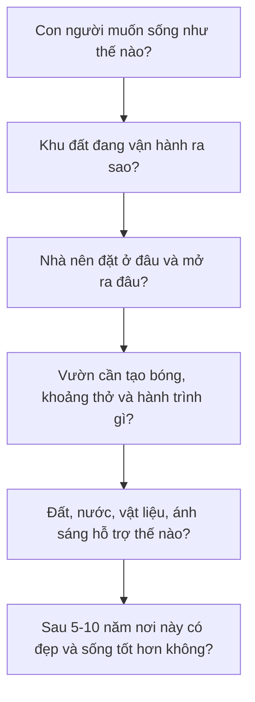

# GIÁO TRÌNH NỀN TẢNG THIẾT KẾ NHÀ VƯỜN NGHỈ DƯỠNG NHIỆT ĐỚI

Tài liệu tổng hợp này được tạo từ các module Markdown đã chuẩn hoá theo khung 15 phần.

---

<!-- Source: giao_trinh_nha_vuon_nghi_duong/00_muc_luc_va_huong_dan_hoc.md -->

# Bộ Giáo Trình Thiết Kế Nhà Vườn Nghỉ Dưỡng Nhiệt Đới

## Mục tiêu tổng quát

Bộ giáo trình này giúp người mới bắt đầu hiểu đúng và đủ bản chất của một nhà vườn nghỉ dưỡng: không phải là một ngôi nhà xây xong rồi thêm cây xanh, mà là một hệ sống trong đó kiến trúc, cảnh quan, con người, ánh sáng, gió, nước, đất và thời gian vận hành cùng nhau.

Sau khi học xong, người học cần có khả năng:

- Đọc một khu đất ở mức nền tảng nhưng đúng trọng tâm.
- Hiểu vì sao một phương án nhà vườn mát, bền, có chiều sâu và dễ chăm.
- Nhận ra các lỗi phổ biến trong bố cục, cây xanh, thoát nước, vật liệu và bảo trì.
- Xây dựng được một brief thiết kế đủ rõ để làm việc hiệu quả với kiến trúc sư, kiến trúc sư cảnh quan và đội thi công.
- Tự kiểm soát chất lượng phương án thay vì chỉ đánh giá bằng cảm tính.

## Tư duy xuyên suốt



## Cách học khuyến nghị

| Giai đoạn | Cách học | Kết quả cần đạt |
|---|---|---|
| 1. Nắm nền tảng | Học module 1-3 | Có ngôn ngữ tư duy đúng về cảm xúc, khu đất và trải nghiệm |
| 2. Hiểu cấu trúc thiết kế | Học module 4-7 | Biết kiểm tra nhà, vườn, cây, đất, nước và tính bền |
| 3. Hoàn thiện chất lượng sống | Học module 8-10 | Hiểu vật liệu, giác quan và bảo trì dài hạn |
| 4. Chuyển thành dự án thật | Học module 11-12 | Có brief, checklist và quy trình làm việc |

## Mục lục chi tiết

| Tài liệu | Nội dung | Đầu ra chính |
|---|---|---|
| [Module 01](modules/module-01-tu-duy-nen-tang.md) | Tư duy nền tảng | Tuyên ngôn thiết kế nhà vườn |
| [Module 02](modules/module-02-doc-khu-dat.md) | Đọc khu đất | Phiếu khảo sát nắng, gió, nước, đất, view |
| [Module 03](modules/module-03-trai-nghiem-con-nguoi.md) | Trải nghiệm con người | Hành trình không gian và điểm dừng |
| [Module 04](modules/module-04-kien-truc-nhiet-doi.md) | Kiến trúc nhiệt đới | Checklist nhà mát và hiên sống được |
| [Module 05](modules/module-05-quan-he-nha-va-vuon.md) | Quan hệ nhà - vườn | Sơ đồ kết nối trong nhà, hiên, sân, vườn |
| [Module 06](modules/module-06-cay-xanh-nhieu-tang.md) | Cây xanh nhiều tầng | Cụm cây có cấu trúc và vai trò rõ |
| [Module 07](modules/module-07-dat-nuoc-thoat-nuoc-tuoi.md) | Đất, nước, thoát nước, tưới | Bản đồ nước và yêu cầu kỹ thuật nền |
| [Module 08](modules/module-08-vat-lieu-mau-sac-chat-cam.md) | Vật liệu, màu sắc, chất cảm | Bảng vật liệu sơ bộ có lý do chọn |
| [Module 09](modules/module-09-anh-sang-am-thanh-mui-huong.md) | Ánh sáng và giác quan | Một góc nghỉ dưỡng thiết kế bằng 5 giác quan |
| [Module 10](modules/module-10-thoi-gian-va-bao-tri.md) | Thời gian và bảo trì | Kế hoạch chăm sóc 12 tháng và nhìn trước 5-10 năm |
| [Module 11](modules/module-11-quy-trinh-lam-viec.md) | Quy trình làm việc | Bộ câu hỏi kiểm soát đơn vị thiết kế và thi công |
| [Module 12](modules/module-12-brief-thiet-ke.md) | Brief tổng hợp | Brief thiết kế nhà vườn hoàn chỉnh |

## Chuẩn trình bày trong từng bài

Mỗi module đều dùng cùng một khung 15 phần để dễ học, dễ rà soát và đủ sâu khi áp dụng vào dự án thật:

1. Vai trò của module trong toàn bộ giáo trình.
2. Mục tiêu học tập.
3. Tư duy cốt lõi.
4. Bản chất vấn đề.
5. Kiến thức nền cần hiểu đúng.
6. Các nguyên lý thiết kế chính.
7. Công cụ phân tích.
8. Quy trình áp dụng từng bước.
9. Ví dụ thực tế.
10. Lỗi thường gặp và cách tránh.
11. Checklist kiểm tra.
12. Bài tập thực hành.
13. Tiêu chí tự đánh giá.
14. Liên kết với các module khác.
15. Ghi chú giới hạn chuyên môn.

## Thứ tự thiết kế đúng

```text
Cảm xúc sống
-> Đọc khu đất
-> Phân khu không gian
-> Đặt nhà
-> Tổ chức hiên và vùng chuyển tiếp
-> Tạo lối đi, điểm dừng, khung nhìn
-> Đặt cây lớn và khoảng mở
-> Hoàn thiện tầng cây thấp
-> Xử lý đất, nước, thoát nước, tưới
-> Chọn vật liệu, màu sắc, ánh sáng
-> Lập kế hoạch bảo trì theo thời gian
```

## Giới hạn của giáo trình

Giáo trình này đủ để hiểu bản chất, lập đề bài, đánh giá phương án và làm việc tốt hơn với chuyên gia. Tài liệu không thay thế:

- Hồ sơ thiết kế kiến trúc, kết cấu, cơ điện, cấp thoát nước.
- Tư vấn pháp lý xây dựng.
- Tính toán kỹ thuật chuyên sâu.
- Khuyến nghị cây trồng chính xác cho mọi vùng khí hậu.
- Dự toán chi phí và hồ sơ mời thầu.

---

<!-- Source: giao_trinh_nha_vuon_nghi_duong/modules/module-01-tu-duy-nen-tang.md -->

# Module 01. Tư Duy Nền Tảng Về Nhà Vườn Nghỉ Dưỡng

## 1. Vai trò của module trong toàn bộ giáo trình

Module này đặt hệ quy chiếu cho toàn bộ giáo trình. Nó nhận đầu vào từ mong muốn sống thật của chủ nhà và tạo ra bộ nguyên tắc để đọc khu đất, tổ chức trải nghiệm, kiểm tra khí hậu, chọn cây, chọn vật liệu và lập brief tổng hợp. Nếu phần tư duy nền sai, các module sau dễ biến thành thao tác trang trí rời rạc.

## 2. Mục tiêu học tập

- Nhận biết nhà vườn nghỉ dưỡng như một hệ sống, không phải phép cộng giữa nhà và cây.
- Giải thích được vì sao cảm xúc sống, khu đất, vận hành và thời gian phải đi trước phong cách.
- Phân tích được nhu cầu người dùng, mức bảo trì, điều cần tránh và hình ảnh khu vườn sau nhiều năm.
- Viết được tuyên ngôn thiết kế đủ rõ để kiểm tra mọi quyết định về sau.

## 3. Tư duy cốt lõi

> Đừng thiết kế “nhà + cây”. Hãy thiết kế một hệ sống nơi con người, kiến trúc, vườn, đất, nước, ánh sáng, gió và thời gian hỗ trợ lẫn nhau.

## 4. Bản chất vấn đề

Nhà vườn nghỉ dưỡng không phải là một phối cảnh đẹp đặt trên đất, mà là một môi trường sống có nhịp dùng hằng ngày, nhịp mùa và nhịp trưởng thành theo năm tháng.

Bản chất của thiết kế là chọn đúng mối quan hệ: nhà với vườn, người với không gian, cây với đất, nước với cao độ, vật liệu với khí hậu, mong muốn với khả năng chăm sóc.

Người mới thường bắt đầu bằng ảnh mẫu, phong cách hoặc danh sách cây. Cách này dễ bỏ qua câu hỏi quan trọng hơn: ai sẽ sống ở đây, họ muốn cảm thấy gì, khu đất cho phép điều gì, và thiết kế sẽ vận hành ra sao sau 1 năm, 3 năm, 5 năm.

## 5. Kiến thức nền cần hiểu đúng

### 5.1. Hệ sống

**Khái niệm:** Một hệ sống gồm nhiều thành phần ảnh hưởng qua lại: người, nhà, cây, đất, nước, gió, ánh sáng, vật liệu và bảo trì.

**Bản chất:** Nếu một phần sai, ví dụ thoát nước kém hoặc cây đặt quá sát nhà, chất lượng của nhiều phần khác cũng giảm theo.

**Hệ quả thiết kế:** Mọi quyết định phải được kiểm bằng tác động dây chuyền, không xem từng chi tiết riêng lẻ.

### 5.2. Chất lượng sống

**Khái niệm:** Chất lượng sống là cảm giác ở thật: mát, thoáng, riêng tư, an toàn, dễ dùng và có lý do để đi chậm lại.

**Bản chất:** Không gian nghỉ dưỡng thất bại khi chỉ đẹp để nhìn nhưng nóng, trơn, muỗi, thiếu bóng hoặc khó chăm.

**Hệ quả thiết kế:** Ưu tiên trải nghiệm sử dụng trước hình thức trang trí.

### 5.3. Thứ tự thiết kế

**Khái niệm:** Thứ tự đúng là xác định đời sống mong muốn, đọc khu đất, tổ chức quan hệ nhà-vườn, rồi mới chọn cây, vật liệu, đèn và chi tiết.

**Bản chất:** Làm ngược thứ tự khiến các quyết định sau phải sửa lỗi cho quyết định trước.

**Hệ quả thiết kế:** Không chọn chi tiết khi chưa rõ vai trò của nó trong tổng thể.

### 5.4. Tính trưởng thành

**Khái niệm:** Cây lớn lên, vật liệu cũ đi, nhu cầu gia đình đổi và hệ thống kỹ thuật xuống cấp.

**Bản chất:** Một thiết kế tốt phải đẹp lúc bàn giao và vẫn có phẩm chất khi già đi.

**Hệ quả thiết kế:** Mỗi phương án cần kịch bản 1 năm, 3 năm, 5 năm.

### 5.5. Năng lực vận hành

**Khái niệm:** Mức chăm sóc thực tế quyết định thiết kế có sống được không.

**Bản chất:** Vườn vượt quá thời gian, ngân sách hoặc kỹ năng chăm sóc sẽ nhanh xuống cấp.

**Hệ quả thiết kế:** Xác định mức bảo trì từ đầu và dùng nó làm ranh giới thiết kế.

## 6. Các nguyên lý thiết kế chính

| Nguyên lý | Vì sao quan trọng | Cách áp dụng |
|---|---|---|
| Cảm xúc trước hình thức | Cảm xúc là tiêu chí ra quyết định, hình thức chỉ là phương tiện. | Viết 3-5 từ khóa cảm xúc trước khi chọn phong cách. |
| Tổng thể trước chi tiết | Chi tiết đẹp sai chỗ làm tổng thể rối. | Chốt cấu trúc không gian, hành trình, khoảng mở rồi mới chọn cây, đá, đèn. |
| Ít nhưng đúng vai | Không gian nghỉ dưỡng cần khoảng thở. | Mỗi cây, ghế, đèn, hồ nước phải có vai trò rõ. |
| Dễ sống là tiêu chí cao | Đẹp nhưng khó dùng không phải thiết kế tốt. | Kiểm tra nóng, trơn, muỗi, ẩm, riêng tư, bảo trì trước khi duyệt. |
| Thiết kế cho thời gian | Nhà vườn thay đổi liên tục. | Hỏi phương án sẽ ra sao sau 1 năm, 3 năm, 5 năm. |

## 7. Công cụ phân tích

- Bản tuyên ngôn thiết kế 10-12 câu.
- Ma trận người dùng - hoạt động - cảm xúc - yêu cầu không gian.
- Danh sách điều không chấp nhận: nóng, ẩm, rối, khó chăm, thiếu riêng tư.
- Thang bảo trì: thấp, vừa, cao, kèm người chịu trách nhiệm.

## 8. Quy trình áp dụng từng bước

1. Ghi người sử dụng chính, người ghé thăm, người chăm và nhu cầu đặc biệt.
2. Viết 3-5 cảm xúc chủ đạo cần đạt.
3. Liệt kê 5 hoạt động quan trọng nhất sẽ diễn ra trong nhà vườn.
4. Xác định mức bảo trì có thể chấp nhận và các giới hạn ngân sách, thời gian, nhân lực.
5. Ghi 5 điều không muốn xảy ra trong vận hành.
6. Chuyển toàn bộ thành 5-7 nguyên tắc thiết kế dùng để review các module sau.

## 9. Ví dụ thực tế

| Tình huống | Dấu hiệu nhận biết | Nguyên nhân | Hướng xử lý |
|---|---|---|---|
| Gia đình muốn nghỉ cuối tuần | Nhu cầu thiên về phục hồi, tụ họp, ít chăm. | Nếu chạy theo khu vườn cầu kỳ sẽ mệt khi vận hành. | Ưu tiên hiên rộng, bóng mát, bếp kết nối ngoài trời, cây khỏe, ít chi tiết khó chăm. |
| Chủ nhà muốn cảm giác như rừng nhỏ | Mong muốn nhiều tầng xanh và cảm giác được bao bọc. | Nếu trồng dày thiếu kiểm soát sẽ tối, ẩm, muỗi. | Tạo cây nhiều tầng nhưng giữ khoảng mở, lối bảo trì và thông gió. |
| Đất nhỏ nhưng muốn nghỉ dưỡng | Không đủ chỗ cho nhiều tiểu cảnh. | Nhồi nhiều điểm nhấn làm mất chiều sâu. | Tập trung một khung nhìn chính, một hiên tốt và vài lớp cây chọn lọc. |
| Muốn vườn ít chăm | Năng lực vận hành thấp. | Chọn cây hoa mùa vụ hoặc vật liệu khó vệ sinh sẽ xuống cấp nhanh. | Dùng cấu trúc đơn giản, cây khỏe, phủ gốc, tưới theo vùng. |
| Thích nhiều phong cách ảnh mẫu | Tín hiệu thẩm mỹ bị phân tán. | Phối nhiều ngôn ngữ làm nhà-vườn thiếu bản sắc. | Quy về cảm xúc gốc rồi chọn một hệ vật liệu và cây nhất quán. |

## 10. Lỗi thường gặp và cách tránh

| Lỗi | Vì sao sai | Hậu quả | Cách tránh |
|---|---|---|---|
| Bắt đầu bằng ảnh mẫu | Ảnh mẫu che khuất điều kiện thật của khu đất. | Dễ sao chép hình thức sai khí hậu, sai nhu cầu. | Dùng ảnh mẫu chỉ để gọi tên cảm xúc, không sao chép bố cục. |
| Mua cây trước khi có tổng thể | Cây chưa có vai trò không gian. | Cây sai vị trí, khó sống, tốn chi phí di dời. | Chỉ chọn cây sau khi có sơ đồ lớp và điểm nhìn. |
| Làm quá nhiều điểm nhấn | Mắt không có nơi nghỉ. | Không gian mất chất nghỉ dưỡng. | Chọn một vài điểm chủ đạo, phần còn lại làm nền. |
| Không dự đoán cây lớn | Quên thời gian là một phần thiết kế. | Nhà tối, ẩm, rễ phá sân hoặc đường ống. | Kiểm tra kích thước cây trưởng thành. |
| Không tính người chăm | Thiết kế vượt năng lực vận hành. | Sau bàn giao nhanh xuống cấp. | Chốt mức bảo trì trước khi duyệt phương án. |

## 11. Checklist kiểm tra

| Câu hỏi kiểm tra | Dấu hiệu đạt | Rủi ro nếu chưa đạt | Hành động sửa |
|---|---|---|---|
| Đã có 3-5 cảm xúc chủ đạo chưa? | Cảm xúc cụ thể, không chỉ “đẹp” hoặc “sang”. | Thiết kế dễ chạy theo ảnh mẫu. | Viết lại bằng từ mô tả trải nghiệm sống. |
| Đã xác định người dùng chính chưa? | Có danh sách người ở, khách, người chăm, nhu cầu đặc biệt. | Không gian thiếu đúng người phục vụ. | Lập bảng người dùng và hoạt động. |
| Đã có mức bảo trì chưa? | Có mức thấp, vừa hoặc cao kèm người chịu trách nhiệm. | Vườn vượt khả năng chăm sóc. | Giảm chi tiết, chọn cây và vật liệu phù hợp. |
| Đã hình dung trạng thái sau 5 năm chưa? | Có kịch bản cây lớn, vật liệu cũ, nhu cầu thay đổi. | Thiết kế đẹp lúc đầu nhưng già đi xấu. | Bổ sung kịch bản trưởng thành. |
| Đã có nguyên tắc review xuyên suốt chưa? | Có 5-7 câu dùng để duyệt quyết định. | Các module sau thiếu tiêu chí chung. | Chuyển tuyên ngôn thành checklist. |

## 12. Bài tập thực hành

| Mức | Bài tập |
|---|---|
| Cơ bản | Viết 5 mong muốn sống thật và 5 điều không muốn xảy ra trong khu nhà vườn. |
| Trung cấp | Lập ma trận người dùng - hoạt động - cảm xúc - yêu cầu không gian cho một dự án giả định. |
| Nâng cao | Viết tuyên ngôn thiết kế 10-12 câu và rút ra 7 nguyên tắc review cho toàn bộ dự án. |

## 13. Tiêu chí tự đánh giá

| Mức | Biểu hiện |
|---|---|
| Cơ bản | Nêu được cảm xúc và nhu cầu nhưng còn chung. |
| Khá | Giải thích được vì sao nhu cầu đó ảnh hưởng tới thiết kế. |
| Tốt | Chuyển được nhu cầu thành nguyên tắc thiết kế cụ thể. |
| Xuất sắc | Tuyên ngôn đủ rõ để kiểm tra bản vẽ, vật liệu, cây, ánh sáng và brief. |

## 14. Liên kết với các module khác

Đầu vào từ mong muốn sống của chủ nhà. Đầu ra cho Module 02 khi đọc khu đất, Module 03 khi thiết kế trải nghiệm và Module 12 khi lập brief tổng hợp.

## 15. Ghi chú giới hạn chuyên môn

Đây là module định hướng tư duy, chưa thay thế khảo sát hiện trạng, thiết kế kỹ thuật hoặc tư vấn chuyên môn cho một dự án cụ thể.

---

<!-- Source: giao_trinh_nha_vuon_nghi_duong/modules/module-02-doc-khu-dat.md -->

# Module 02. Đọc Khu Đất: Nắng, Gió, Nước, Đất, View

## 1. Vai trò của module trong toàn bộ giáo trình

Module này chuyển tư duy nền tảng thành dữ liệu hiện trạng. Nó nhận nguyên tắc sống từ Module 01 và tạo bản đồ đầu vào cho kiến trúc nhiệt đới, trải nghiệm con người, quan hệ nhà-vườn, cây xanh, thoát nước và brief.

## 2. Mục tiêu học tập

- Nhận biết khu đất như một hệ có sẵn nắng, gió, nước, đất, cây, view, tiếng ồn và ranh giới.
- Giải thích được vì sao quan sát theo thời điểm quan trọng hơn nhìn một lần.
- Phân tích được cơ hội và rủi ro trên sơ đồ hiện trạng.
- Tạo được bản đồ đọc đất đủ rõ để đưa vào brief thiết kế.

## 3. Tư duy cốt lõi

> Khu đất không phải tờ giấy trắng. Nó là một hệ đang vận hành; nhiệm vụ đầu tiên là đọc đúng hệ đó.

## 4. Bản chất vấn đề

Đọc khu đất là tìm quy luật trước khi can thiệp. Nắng đi theo giờ, nước đi theo cao độ, gió đi theo khoảng trống và vật cản, cây phản ánh đất, còn view và tiếng ồn quyết định cách mở hoặc che.

Người mới thường nhìn khu đất như diện tích trống để đặt nhà và trồng cây. Cách đọc đúng là xem khu đất đang buộc ta phải tôn trọng điều gì và đang trao cơ hội gì.

Dữ liệu tốt phải có vị trí trên sơ đồ. Nhận xét bằng lời mà không gắn vào hướng, cao độ, khoảng cách và thời điểm sẽ khó dùng để thiết kế.

## 5. Kiến thức nền cần hiểu đúng

### 5.1. Nắng

**Khái niệm:** Nắng thay đổi theo giờ và theo mùa, nắng sáng thường dễ chịu hơn nắng chiều.

**Bản chất:** Nắng Tây/Tây Nam có bức xạ xiên, kéo dài, làm nóng tường, kính, sân và không gian sau đó.

**Hệ quả thiết kế:** Lập bản đồ nắng sáng, trưa, chiều và đánh dấu vùng cần che.

### 5.2. Gió

**Khái niệm:** Gió có hướng, tốc độ, mùa và chất lượng khác nhau.

**Bản chất:** Gió tốt làm mát nhưng cũng có thể mang bụi, mùi, tiếng ồn hoặc mưa tạt.

**Hệ quả thiết kế:** Ghi hướng gió tốt/xấu, vùng bí và vật cản gió.

### 5.3. Nước

**Khái niệm:** Nước mưa cho thấy cao độ thật và lỗi mặt bằng.

**Bản chất:** Điểm đọng nước thường báo trước nguy cơ trơn, bẩn, muỗi, úng cây và hư vật liệu.

**Hệ quả thiết kế:** Quan sát sau mưa, vẽ hướng nước chảy và điểm cần thoát.

### 5.4. Đất

**Khái niệm:** Đất quyết định sức khỏe rễ, khả năng thoát nước và lựa chọn cây.

**Bản chất:** Đất cát thoát nhanh nhưng nghèo dinh dưỡng, đất sét giữ nước nhưng dễ bí, đất nén làm rễ khó thở.

**Hệ quả thiết kế:** Ghi loại đất sơ bộ, vùng đất nén, vùng cần cải tạo.

### 5.5. View và riêng tư

**Khái niệm:** View đẹp cần mở có chủ đích, view xấu và hướng nhìn từ hàng xóm cần xử lý.

**Bản chất:** Không phải mọi hướng trống đều đáng mở cửa.

**Hệ quả thiết kế:** Đánh dấu view nên mở, view cần che, điểm nhìn bị lộ.

### 5.6. Cây hiện trạng

**Khái niệm:** Cây lớn khỏe là tài sản thời gian.

**Bản chất:** Loại bỏ cây sai có thể làm mất bóng mát nhiều năm; giữ cây bệnh có thể tạo rủi ro.

**Hệ quả thiết kế:** Lập bảng giữ, cắt tỉa, di dời, loại bỏ.

## 6. Các nguyên lý thiết kế chính

| Nguyên lý | Vì sao quan trọng | Cách áp dụng |
|---|---|---|
| Quan sát theo thời điểm | Khu đất thay đổi theo giờ và sau mưa. | Khảo sát sáng, trưa, chiều và ít nhất một lần sau mưa. |
| Ghi nhận bằng bản đồ | Dữ liệu không có vị trí thì khó thiết kế. | Đặt nắng, gió, nước, view, cây lên cùng sơ đồ. |
| Tách cơ hội và rủi ro | Không phải yếu tố nào cũng cần sửa. | Ghi mỗi điểm là giữ, mở, che, nâng, thoát, tránh hoặc xử lý. |
| Không chống lại khu đất | Chống quy luật tự nhiên thường tốn chi phí. | Đặt hoạt động phù hợp với nắng, gió, nước và view. |
| Chuyển quan sát thành yêu cầu | Khảo sát chỉ có giá trị khi dẫn tới quyết định. | Mỗi dữ liệu phải có hệ quả thiết kế. |

## 7. Công cụ phân tích

- Bản đồ 7 lớp: nắng, gió, nước, đất, cây, view, tiếng ồn.
- Bảng cơ hội - rủi ro - quyết định thiết kế.
- Album ảnh hiện trạng theo vị trí chụp và thời điểm.
- Danh sách 10 nhận định thiết kế quan trọng nhất.

## 8. Quy trình áp dụng từng bước

1. Vẽ sơ đồ đất, hướng Bắc, ranh, cổng, công trình, cây lớn, cao độ tương đối.
2. Chụp ảnh từ cổng, các góc đất, vị trí dự kiến hiên, cửa và điểm nhìn.
3. Đánh dấu nắng sáng, trưa, chiều, đặc biệt hướng Tây và Tây Nam.
4. Ghi gió tốt, gió xấu, vùng bí, nguồn bụi, mùi, tiếng ồn.
5. Sau mưa, đánh dấu hướng nước chảy, điểm đọng, vùng bùn, vùng trơn.
6. Kiểm tra đất và cây hiện trạng ở mức sơ bộ.
7. Tóm tắt thành 10 quyết định thiết kế ban đầu.

## 9. Ví dụ thực tế

| Tình huống | Dấu hiệu nhận biết | Nguyên nhân | Hướng xử lý |
|---|---|---|---|
| Phía Tây trống và nóng | Tường, sân hoặc phòng chính nhận nắng chiều. | Bức xạ xiên tích nhiệt mạnh. | Giảm kính, thêm hiên, lam, cây bóng mát hoặc đặt chức năng ít ở lâu. |
| Góc Đông Nam có gió mát | Có gió dễ chịu vào thời điểm sử dụng. | Hướng gió phù hợp với khoảng mở. | Ưu tiên hiên, cửa mở hoặc điểm nghỉ. |
| Nước đọng ở lối vào | Sau mưa có vũng hoặc bùn. | Cao độ và độ dốc mặt sân sai. | Xử lý cao độ, rãnh, vật liệu thấm trước khi trang trí. |
| Có view ruộng hoặc vườn xa | Tầm nhìn có chiều sâu. | View là tài sản không gian. | Giữ trục nhìn, không trồng cây chắn view quý. |
| Hàng xóm nhìn trực diện | Vị trí ngồi hoặc phòng ngủ bị lộ. | Thiếu lớp riêng tư. | Dùng cây, cao độ, lam hoặc đổi hướng mở. |

## 10. Lỗi thường gặp và cách tránh

| Lỗi | Vì sao sai | Hậu quả | Cách tránh |
|---|---|---|---|
| Chỉ khảo sát một lần | Một thời điểm không đại diện cho cả ngày và mùa. | Bỏ sót nắng chiều, nước sau mưa, gió xấu. | Khảo sát ít nhất sáng, trưa, chiều và sau mưa. |
| Không chụp ảnh hiện trạng | Ký ức dễ sai khi trao đổi. | Brief và thiết kế thiếu bằng chứng. | Chụp theo vị trí, đánh số và ghi hướng. |
| Xem cây hiện trạng là vật cản | Không định giá bóng mát và thời gian. | Mất cây lớn khỏe, khu đất nóng hơn. | Đánh giá cây trước khi quyết định bỏ. |
| Không kiểm tra nước | Lỗi nước thường lộ sau thi công. | Ngập, trơn, bẩn, úng cây. | Quan sát khi mưa và sau mưa. |
| Không ghi view xấu | Chỉ chú ý view đẹp. | Cửa và hiên mở sai hướng. | Đánh dấu cả view nên mở và view cần che. |

## 11. Checklist kiểm tra

| Câu hỏi kiểm tra | Dấu hiệu đạt | Rủi ro nếu chưa đạt | Hành động sửa |
|---|---|---|---|
| Có bản đồ nắng 3 thời điểm chưa? | Đánh dấu sáng, trưa, chiều trên sơ đồ. | Mở cửa, đặt hiên hoặc cây sai hướng. | Khảo sát lại theo giờ và bổ sung sơ đồ. |
| Có bản đồ nước sau mưa chưa? | Có hướng nước chảy và điểm đọng. | Ngập, trơn, bẩn, úng rễ. | Bổ sung cao độ, rãnh, vật liệu thấm. |
| Có phân loại cây hiện trạng chưa? | Có bảng giữ, tỉa, di dời, bỏ. | Mất tài sản bóng mát hoặc giữ cây rủi ro. | Mời chuyên gia cây kiểm tra cây lớn nếu cần. |
| Có ghi view và riêng tư chưa? | Có view mở, view che, điểm bị nhìn. | Cửa lớn mở sai hướng. | Điều chỉnh khung nhìn và lớp che. |
| Mỗi quan sát đã thành quyết định chưa? | Có hành động mở, che, nâng, thoát, giữ, bỏ. | Khảo sát không giúp thiết kế. | Viết bảng cơ hội - rủi ro - quyết định. |

## 12. Bài tập thực hành

| Mức | Bài tập |
|---|---|
| Cơ bản | Chụp 12 ảnh hiện trạng và ghi hướng, giờ, điều quan sát được. |
| Trung cấp | Vẽ bản đồ 7 lớp của một khu đất thật hoặc giả định. |
| Nâng cao | Tạo bảng 10 nhận định thiết kế, mỗi nhận định có dữ liệu, rủi ro và quyết định tương ứng. |

## 13. Tiêu chí tự đánh giá

| Mức | Biểu hiện |
|---|---|
| Cơ bản | Ghi nhận được hiện trạng chính nhưng còn rời rạc. |
| Khá | Phân biệt được cơ hội và rủi ro. |
| Tốt | Chuyển được dữ liệu hiện trạng thành yêu cầu thiết kế. |
| Xuất sắc | Bản đồ đọc đất đủ rõ để kiến trúc sư và cảnh quan dùng làm đầu vào. |

## 14. Liên kết với các module khác

Đầu vào từ Module 01. Đầu ra trực tiếp cho Module 03, 04, 05, 06, 07 và Module 12.

## 15. Ghi chú giới hạn chuyên môn

Khảo sát trong module này là nền tảng cho chủ nhà. Cao độ, địa chất, cây lớn, thoát nước phức tạp và ranh pháp lý vẫn cần chuyên gia kiểm tra.

---

<!-- Source: giao_trinh_nha_vuon_nghi_duong/modules/module-03-trai-nghiem-con-nguoi.md -->

# Module 03. Thiết Kế Trải Nghiệm Con Người

## 1. Vai trò của module trong toàn bộ giáo trình

Module này biến dữ liệu khu đất thành hành trình sống. Nó nhận cảm xúc từ Module 01 và dữ liệu hiện trạng từ Module 02, sau đó tạo nền cho quan hệ nhà-vườn, vị trí hiên, điểm dừng, ánh sáng, âm thanh và brief.

## 2. Mục tiêu học tập

- Nhận biết nhà vườn như một chuỗi trải nghiệm thay vì một mặt bằng tĩnh.
- Giải thích được vai trò của hành trình, điểm dừng, mở-kín, prospect-refuge và tỷ lệ cơ thể.
- Phân tích được vì sao một không gian đẹp có thể ít được dùng.
- Vẽ được sơ đồ hành trình một ngày và dùng nó để chỉnh phương án.

## 3. Tư duy cốt lõi

> Một không gian nghỉ dưỡng tốt không phơi bày mọi thứ cùng lúc; nó dẫn người đi chậm lại qua các lớp mở-kín, sáng-tối, động-tĩnh.

## 4. Bản chất vấn đề

Trải nghiệm không gian là cảm giác nối tiếp theo thời gian: tiếp cận, bước vào, dừng lại, nhìn ra, quay về, dùng ban ngày và dùng ban đêm.

Bản chất của module là thiết kế lý do để con người di chuyển và ở lại. Ghế, lối đi, hiên, cây, ánh sáng chỉ có giá trị khi chúng hỗ trợ hành vi thật.

Người mới thường thiết kế mặt bằng nhìn đẹp từ trên xuống nhưng quên cảm giác của người đứng trong không gian: nhìn gì, nắng ở đâu, có tựa lưng không, có bị nhìn thấy không, đường đi có mời gọi không.

## 5. Kiến thức nền cần hiểu đúng

### 5.1. Hành trình không gian

**Khái niệm:** Hành trình là chuỗi di chuyển từ cổng, sân, hiên, nhà, vườn và điểm nghỉ.

**Bản chất:** Hành trình tốt có nhịp, có chuyển tiếp và không làm người dùng mệt hoặc lạc.

**Hệ quả thiết kế:** Vẽ đường đi theo hoạt động thật, không chỉ theo lối kỹ thuật.

### 5.2. Điểm dừng

**Khái niệm:** Điểm dừng là nơi có lý do để ở lại.

**Bản chất:** Một chỗ ngồi tốt cần bóng, view, điểm tựa, an toàn và tiếp cận thuận tiện.

**Hệ quả thiết kế:** Không đặt ghế nếu chưa biết người ngồi nhìn gì và được che ra sao.

### 5.3. Mở-kín

**Khái niệm:** Mở cho cảm giác thoáng, kín cho cảm giác được ôm và riêng tư.

**Bản chất:** Chỉ mở toàn bộ làm mất chiều sâu, chỉ kín toàn bộ làm bí.

**Hệ quả thiết kế:** Tổ chức nhịp luân phiên bằng cây, tường thấp, mái, cao độ, ánh sáng.

### 5.4. Prospect-refuge

**Khái niệm:** Prospect là nhìn ra, refuge là được che chở.

**Bản chất:** Con người thường thích ngồi nơi có tầm nhìn phía trước và điểm tựa phía sau hoặc bên cạnh.

**Hệ quả thiết kế:** Thiết kế điểm nghỉ có lưng tựa, mép cây, tường thấp hoặc mái che.

### 5.5. Tỷ lệ cơ thể

**Khái niệm:** Khoảng cách, bậc, lối đi, ghế, tay vịn và tầm nhìn phải hợp cơ thể người thật.

**Bản chất:** Sai tỷ lệ làm không gian mỏi, nguy hiểm hoặc ít dùng.

**Hệ quả thiết kế:** Kiểm bằng người già, trẻ nhỏ, người mang đồ và sử dụng ban đêm.

## 6. Các nguyên lý thiết kế chính

| Nguyên lý | Vì sao quan trọng | Cách áp dụng |
|---|---|---|
| Thiết kế theo hoạt động | Không gian phải phục vụ hành vi thật. | Bắt đầu bằng lịch một ngày của người sử dụng. |
| Mỗi điểm ngồi phải có lý do | Ghế không có bóng, view hoặc riêng tư sẽ bị bỏ. | Kiểm tra bóng, nhìn gì, tựa đâu, đi tới ra sao. |
| Tạo nhịp mở-kín | Nhịp tạo chiều sâu nghỉ dưỡng. | Dùng lớp cây, mái, tường thấp và ánh sáng để dẫn dắt. |
| Ưu tiên cảm giác an toàn | Không an toàn thì người dùng không ở lại. | Kiểm tra trơn, tối, khuất, bị nhìn trực diện. |
| Thiết kế theo thời điểm | Sáng, chiều, tối có nhu cầu khác nhau. | Review cùng một điểm ở nhiều giờ. |

## 7. Công cụ phân tích

- Sơ đồ hành trình một ngày.
- Bảng điểm dừng: hoạt động, bóng, view, tựa, riêng tư, tiếp cận.
- Bản đồ mở-kín và vùng động-tĩnh.
- Ma trận người dùng: trẻ nhỏ, người già, khách, người chăm.

## 8. Quy trình áp dụng từng bước

1. Lập danh sách hoạt động trong ngày và trong tuần.
2. Vẽ đường di chuyển của từng hoạt động trên sơ đồ.
3. Chọn 3-5 điểm dừng quan trọng nhất.
4. Mô tả cảm giác mong muốn tại từng điểm dừng.
5. Kiểm tra từng điểm theo bóng, view, tựa, riêng tư, an toàn, tiếp cận.
6. Điều chỉnh lối đi để tránh cắt ngang vùng nghỉ tĩnh hoặc mở thẳng vào view xấu.

## 9. Ví dụ thực tế

| Tình huống | Dấu hiệu nhận biết | Nguyên nhân | Hướng xử lý |
|---|---|---|---|
| Từ cổng vào nhà | Đi thẳng thấy hết nhà và sân. | Thiếu lớp chuyển tiếp nên trải nghiệm bị phơi bày. | Thêm lớp cây, tường thấp hoặc đoạn ngoặt nhẹ để làm chậm nhịp. |
| Góc uống trà sáng | Có nắng nhẹ, view cây thấp, ít người đi ngang. | Điều kiện phù hợp hoạt động tĩnh. | Giữ góc này như điểm dừng chính, tránh đặt lối kỹ thuật cắt qua. |
| Bàn ăn ngoài hiên | Xa bếp hoặc mưa tạt. | Thiếu liên kết chức năng và che chắn. | Đặt gần bếp, đủ rộng, có mái che và đèn ấm. |
| Lối đi trong vườn | Quá thẳng và không có điểm dừng. | Chỉ là đường kỹ thuật, không tạo trải nghiệm. | Tạo đoạn mở, đoạn khép, một vài điểm nhìn và chỗ nghỉ nhỏ. |
| Khu trẻ chơi | Xa tầm nhìn người lớn. | An toàn thị giác bị thiếu. | Đặt trong tầm nhìn từ bếp, hiên hoặc phòng khách. |

## 10. Lỗi thường gặp và cách tránh

| Lỗi | Vì sao sai | Hậu quả | Cách tránh |
|---|---|---|---|
| Thiết kế chỉ theo mặt bằng đẹp | Mặt bằng không phản ánh cảm giác đứng trong không gian. | Không gian thiếu trải nghiệm sống thật. | Kiểm bằng hành trình người dùng. |
| Lối đi quá thẳng | Đi nhanh, không có nhịp nghỉ. | Mất cảm giác khám phá. | Tạo lớp chuyển tiếp và điểm dừng. |
| Điểm ngồi không có bóng | Không dùng được vào giờ nóng. | Ghế thành trang trí. | Kiểm nắng theo giờ trước khi đặt. |
| Mở toàn bộ view | Không còn chiều sâu và riêng tư. | Không gian bị phơi bày. | Chọn view chính, che view phụ. |
| Quên người già và trẻ nhỏ | Không xét tốc độ, tầm nhìn, nguy cơ ngã. | Bậc, nền, lối đi thành rủi ro. | Review bằng người dùng yếu thế nhất. |

## 11. Checklist kiểm tra

| Câu hỏi kiểm tra | Dấu hiệu đạt | Rủi ro nếu chưa đạt | Hành động sửa |
|---|---|---|---|
| Có hành trình một ngày chưa? | Có đường đi cho các hoạt động chính. | Thiết kế không bám đời sống thật. | Lập lịch và vẽ đường di chuyển. |
| Mỗi điểm dừng có lý do chưa? | Có hoạt động, bóng, view, tựa, riêng tư. | Điểm ngồi bị bỏ trống. | Bổ sung điều kiện sử dụng hoặc bỏ điểm thừa. |
| Có nhịp mở-kín chưa? | Có đoạn mở, đoạn khép, vùng chuyển tiếp. | Không gian phẳng và thiếu chiều sâu. | Thêm lớp cây, mái, cao độ hoặc tường thấp. |
| Có kiểm an toàn ban đêm chưa? | Đường đi đọc được, nền không trơn, không có góc khuất nguy hiểm. | Người dùng tránh ra vườn buổi tối. | Bổ sung ánh sáng dẫn hướng và xử lý nền. |
| Lối đi có tránh vùng nghỉ tĩnh không? | Không cắt ngang điểm ngồi chính. | Không gian nghỉ bị quấy nhiễu. | Điều chỉnh tuyến đi hoặc đổi vị trí điểm dừng. |

## 12. Bài tập thực hành

| Mức | Bài tập |
|---|---|
| Cơ bản | Ghi lại hành trình một ngày của một người dùng chính trong nhà vườn. |
| Trung cấp | Vẽ sơ đồ đường đi, 3 điểm dừng và phân tích bóng, view, tựa, riêng tư. |
| Nâng cao | Chỉnh một mặt bằng có sẵn để cải thiện nhịp mở-kín và chất lượng điểm dừng. |

## 13. Tiêu chí tự đánh giá

| Mức | Biểu hiện |
|---|---|
| Cơ bản | Có sơ đồ đường đi và vài điểm dừng. |
| Khá | Giải thích được vì sao điểm dừng dùng được hoặc không dùng được. |
| Tốt | Đề xuất được chỉnh sửa theo hành vi, bóng, view và riêng tư. |
| Xuất sắc | Hành trình đủ rõ để điều chỉnh mặt bằng, hiên, lối đi, cây và ánh sáng. |

## 14. Liên kết với các module khác

Nhận đầu vào từ Module 01 và 02. Tạo nền cho Module 05 về quan hệ nhà-vườn, Module 09 về giác quan và Module 12 về brief.

## 15. Ghi chú giới hạn chuyên môn

Module này định hướng trải nghiệm. Kích thước chi tiết, bậc, lan can, chiếu sáng kỹ thuật và an toàn cần kiểm tra theo tiêu chuẩn thiết kế hiện hành.

---

<!-- Source: giao_trinh_nha_vuon_nghi_duong/modules/module-04-kien-truc-nhiet-doi.md -->

# Module 04. Nguyên Lý Kiến Trúc Nhiệt Đới

## 1. Vai trò của module trong toàn bộ giáo trình

Module này chuyển dữ liệu nắng, gió, mưa và ẩm thành quyết định kiến trúc. Nó nhận bản đồ khu đất từ Module 02 và hành trình sử dụng từ Module 03, rồi tạo tiêu chí cho mái, hiên, cửa, kính, vật liệu, cây và brief.

## 2. Mục tiêu học tập

- Nhận biết các nguyên nhân làm nhà nóng, bí, chói, ẩm và mưa tạt.
- Giải thích được cơ chế bức xạ, dẫn nhiệt, đối lưu, bay hơi và tiện nghi nhiệt.
- Phân tích được mái, hiên, cửa, kính, sân, cây và vật liệu theo khí hậu nóng ẩm.
- Tạo checklist review phương án nhà vườn nhiệt đới ở mức có thể dùng với bản vẽ thật.

## 3. Tư duy cốt lõi

> Nhà mát không bắt đầu từ điều hòa, mà từ lớp vỏ biết che nắng, đón gió, giảm bức xạ, thoát khí nóng và tránh mưa tạt.

## 4. Bản chất vấn đề

Kiến trúc nhiệt đới giải quyết đồng thời nóng, ẩm, mưa, chói, gió và bảo trì. Nhà không chỉ cần nhiệt độ thấp hơn mà cần bề mặt ít phát nhiệt, không khí chuyển động, bóng râm đúng chỗ và vùng chuyển tiếp sống được.

Cảm giác nóng không chỉ đến từ nhiệt độ không khí. Sân bê tông, mái, tường Tây, kính nắng và vật liệu tối màu có thể phát nhiệt vào người dù phòng có gió.

Sai lầm phổ biến là dùng điều hòa hoặc kính lớn để bù cho lớp vỏ yếu. Thiết kế đúng phải giảm tải khí hậu từ bên ngoài trước khi dùng thiết bị cơ điện.

## 5. Kiến thức nền cần hiểu đúng

### 5.1. Tiện nghi nhiệt

**Khái niệm:** Tiện nghi nhiệt là cảm giác của cơ thể trước nhiệt độ không khí, độ ẩm, tốc độ gió, bức xạ và nhiệt bề mặt.

**Bản chất:** Độ ẩm cao làm mồ hôi khó bay hơi, bề mặt nóng làm người thấy nóng dù không khí không quá cao.

**Hệ quả thiết kế:** Giảm bức xạ, tăng gió có kiểm soát và giảm vật liệu tích nhiệt quanh người.

### 5.2. Bức xạ mặt trời

**Khái niệm:** Bức xạ truyền nhiệt trực tiếp vào mái, tường, kính và sân.

**Bản chất:** Nắng Tây nguy hiểm vì góc xiên, kéo dài và tích nhiệt cuối ngày.

**Hệ quả thiết kế:** Che nắng bên ngoài bằng mái, hiên, lam, cây, lùi cửa và giảm kính trực tiếp.

### 5.3. Mái nhiệt đới

**Khái niệm:** Mái là lớp nhận nắng và mưa lớn nhất.

**Bản chất:** Mái nóng truyền nhiệt xuống, mái thoát nước kém gây dột, bẩn và bảo trì cao.

**Hệ quả thiết kế:** Dùng mái đua, lớp cách nhiệt, khoảng thông gió, màu phù hợp và thoát nước rõ.

### 5.4. Hiên và vùng đệm

**Khái niệm:** Hiên là bộ lọc khí hậu giữa trong và ngoài.

**Bản chất:** Hiên quá nông không chặn nắng, mưa và không đủ dùng thật.

**Hệ quả thiết kế:** Thiết kế hiên đủ sâu, có bóng, gió, view, thoát nước và liên kết hoạt động.

### 5.5. Thông gió tự nhiên

**Khái niệm:** Gió cần cửa vào, cửa ra và đường đi qua vùng người ở.

**Bản chất:** Một cửa lớn một phía không tạo dòng chảy hiệu quả.

**Hệ quả thiết kế:** Tạo thông gió chéo, cửa thoát cao, kiểm soát mưa tạt, bụi và riêng tư.

### 5.6. Kính

**Khái niệm:** Kính mở view nhưng cũng đưa nhiệt, chói và mất riêng tư vào nhà.

**Bản chất:** Kính lớn sai hướng biến view thành tải nhiệt.

**Hệ quả thiết kế:** Đặt kính ở hướng phù hợp, lùi sau hiên, dùng che ngoài và kiểm soát chói.

### 5.7. Ẩm và mưa tạt

**Khái niệm:** Khí hậu nóng ẩm làm vật liệu lâu khô, dễ rêu, mốc, trơn và muỗi.

**Bản chất:** Mưa ngang có thể làm hỏng cửa, bậc, hiên và chân tường.

**Hệ quả thiết kế:** Tạo mái che, độ dốc, thoát nước, khe thoáng và vật liệu chịu ẩm.

## 6. Các nguyên lý thiết kế chính

| Nguyên lý | Vì sao quan trọng | Cách áp dụng |
|---|---|---|
| Che nắng trước khi làm mát | Nhiệt chặn bên ngoài hiệu quả hơn xử lý bên trong. | Ưu tiên mái, hiên, lam, cây và lớp vỏ. |
| Giảm bức xạ quanh người | Bề mặt nóng làm giảm tiện nghi. | Hạn chế sân bê tông trống, tường tối, mái thấp nóng, kính nắng. |
| Đón gió có kiểm soát | Gió tốt phải đi qua vùng sử dụng. | Mở cửa theo hướng gió, có cửa ra, vẫn chặn mưa, bụi, riêng tư. |
| Tạo vùng đệm sống được | Ranh giới trong-ngoài là nơi quan trọng nhất của nhà vườn. | Thiết kế hiên, sân bán ngoài trời, cây và mái đua như không gian thật. |
| Kiểm soát nước mưa | Nhiệt đới luôn đi kèm mưa lớn. | Mái, máng, cao độ, bậc, nền và cửa phải có đường nước rõ. |
| Phối hợp nhà với vườn | Vườn là hạ tầng vi khí hậu. | Dùng cây, mặt đất thấm, bóng đổ và khoảng mở để làm mát. |

## 7. Công cụ phân tích

- Bản đồ nắng theo giờ cho các mặt nhà.
- Sơ đồ đường gió vào, gió ra và vùng người ở.
- Ma trận mái-hiên-kính-cửa-sân-cây theo rủi ro nóng, chói, mưa, ẩm.
- Checklist review lớp vỏ nhiệt đới cho bản vẽ mặt bằng, mặt cắt và phối cảnh.

## 8. Quy trình áp dụng từng bước

1. Đánh dấu các mặt chịu nắng sáng, trưa, chiều, đặc biệt Tây và Tây Nam.
2. Kiểm tra mái: độ vươn, cách nhiệt, thoát nước, bảo vệ cửa và tường.
3. Kiểm tra hiên: độ sâu, bóng, gió, diện tích sử dụng, thoát nước và view.
4. Vẽ đường gió cho từng phòng chính, xác định cửa vào, cửa ra và vùng bí.
5. Kiểm tra kính: hướng, kích thước, chói, nắng trực tiếp, mưa tạt, riêng tư.
6. Kiểm tra sân và vật liệu: tích nhiệt, phản xạ chói, trơn, thấm, khô sau mưa.
7. Kết luận thành danh sách sửa: che thêm, mở thêm, giảm kính, lùi cửa, thêm cây, đổi vật liệu, xử lý cao độ.

## 9. Ví dụ thực tế

| Tình huống | Dấu hiệu nhận biết | Nguyên nhân | Hướng xử lý |
|---|---|---|---|
| Nhà mặt Tây dùng kính lớn | Phòng nóng và chói từ chiều đến tối. | Kính nhận bức xạ xiên và phát nhiệt vào trong. | Giảm kính trực tiếp, thêm hiên, lam, cây hoặc đổi chức năng ít ở lâu. |
| Phòng khách chỉ mở một mặt | Có cửa lớn nhưng không khí đứng. | Thiếu cửa ra hoặc chênh áp để tạo dòng gió. | Thêm cửa thoát gió, ô cao hoặc mở phụ hướng khác. |
| Hiên đẹp nhưng nông | Không đặt được bàn ghế, mưa tạt, nắng chiếu. | Hiên chỉ là chi tiết mặt đứng. | Tăng chiều sâu, gắn hoạt động, kiểm tra nắng mưa theo giờ. |
| Sân bê tông rộng không bóng | Nóng quanh nhà cả sau khi tắt nắng. | Bê tông tích nhiệt và phát nhiệt ngược. | Thêm cây, vật liệu thấm, mảng xanh, giảm diện tích cứng. |
| Cây trồng sát cửa quá dày | Có bóng nhưng tối, ẩm, muỗi. | Che sai lớp và cản gió. | Tạo khoảng cách, tỉa tán, dùng tầng cây hợp lý. |

## 10. Lỗi thường gặp và cách tránh

| Lỗi | Vì sao sai | Hậu quả | Cách tránh |
|---|---|---|---|
| Nghĩ nhiều kính là gần thiên nhiên | Nhầm view với tiện nghi khí hậu. | Nhà nóng, chói, phụ thuộc điều hòa. | Kính lớn phải đi cùng che nắng ngoài và thông gió. |
| Chỉ dựa vào điều hòa | Thiết bị bù cho lớp vỏ yếu. | Tốn chi phí, sốc nhiệt, mất chất lượng bán ngoài trời. | Giảm tải nhiệt bằng kiến trúc trước. |
| Làm hiên như trang trí | Hiên không đủ vai trò khí hậu. | Ít dùng, mưa tạt, cửa nhanh xuống cấp. | Thiết kế hiên như một phòng bán ngoài trời. |
| Không tính mưa tạt | Chỉ thiết kế cho ngày nắng. | Bậc, cửa, chân tường bẩn, trơn, hư. | Kiểm tra hướng mưa, mái che, độ dốc, thoát nước. |
| Cây che sai hướng | Chỉ nhìn bóng mà quên gió, ẩm, ánh sáng. | Nhà bí, tối, muỗi. | Dùng cây theo tầng, khoảng cách và hướng gió. |

## 11. Checklist kiểm tra

| Câu hỏi kiểm tra | Dấu hiệu đạt | Rủi ro nếu chưa đạt | Hành động sửa |
|---|---|---|---|
| Mái có giảm nhiệt và che mưa nắng chính chưa? | Có mái đua, cách nhiệt, thoát nước, bảo vệ cửa. | Nóng mái, dột, mưa tạt, tường xuống cấp. | Bổ sung lớp mái, trần, máng, mái đua hoặc che phụ. |
| Hiên có dùng thật được không? | Đủ sâu, có bóng, gió, view, thoát nước và chỗ đặt đồ. | Hiên chỉ để nhìn, không sống được. | Tăng chiều sâu, đổi vị trí hoặc gắn hoạt động. |
| Phòng chính có thông gió chéo chưa? | Có cửa vào và cửa ra, gió qua vùng người ở. | Bí, ẩm, phụ thuộc điều hòa. | Thêm mở phụ, ô thoáng, cửa cao hoặc sân trong. |
| Kính có được che ngoài không? | Không nhận nắng trực tiếp vào giờ nóng. | Nóng, chói, mất riêng tư. | Lùi kính, thêm hiên, lam, rèm ngoài, cây. |
| Sân quanh nhà có giảm tích nhiệt chưa? | Có bóng, vật liệu thấm, mảng xanh, không phản xạ chói. | Nhà nóng do vi khí hậu xấu. | Giảm sân cứng, thêm cây, đổi vật liệu. |

## 12. Bài tập thực hành

| Mức | Bài tập |
|---|---|
| Cơ bản | Chọn một ảnh nhà nhiệt đới và đánh dấu 5 điểm gây nóng, chói, bí hoặc mưa tạt. |
| Trung cấp | Lập bảng mái-hiên-kính-gió-sân-cây gồm vấn đề, nguyên nhân, giải pháp, cách kiểm tra. |
| Nâng cao | Review một mặt bằng hoặc phối cảnh thật bằng checklist khí hậu và đề xuất 10 chỉnh sửa có lý do. |

## 13. Tiêu chí tự đánh giá

| Mức | Biểu hiện |
|---|---|
| Cơ bản | Nhận ra được các điểm nóng, bí, chói rõ ràng. |
| Khá | Giải thích được nguyên nhân theo nắng, gió, mưa, vật liệu. |
| Tốt | Đề xuất được giải pháp kiến trúc và cảnh quan phù hợp khí hậu. |
| Xuất sắc | Tạo được checklist review lớp vỏ nhiệt đới có thể dùng với bản vẽ thật. |

## 14. Liên kết với các module khác

Nhận đầu vào từ Module 02 và 03. Tạo tiêu chí cho Module 05, 08, 09 và Module 12.

## 15. Ghi chú giới hạn chuyên môn

Các nội dung kỹ thuật như kết cấu mái, tính toán nhiệt, thông gió cơ khí, chống thấm và tiêu chuẩn an toàn cần kiến trúc sư, kỹ sư hoặc chuyên gia phù hợp kiểm tra khi triển khai.

---

<!-- Source: giao_trinh_nha_vuon_nghi_duong/modules/module-05-quan-he-nha-va-vuon.md -->

# Module 05. Quan Hệ Giữa Nhà Và Vườn

## 1. Vai trò của module trong toàn bộ giáo trình

Module này nối kiến trúc với cảnh quan thành một tổng thể sống được. Nó nhận hành trình từ Module 03 và nguyên lý khí hậu từ Module 04, sau đó tạo đầu vào cho cây xanh, vật liệu, giác quan và brief.

## 2. Mục tiêu học tập

- Nhận biết ranh giới trong-ngoài là vùng giá trị cao nhất của nhà vườn.
- Giải thích được vai trò của cửa, hiên, sân gần nhà, lối đi, khung nhìn và lớp cây.
- Phân tích được lỗi nhà đẹp riêng, vườn đẹp riêng nhưng sống không hay.
- Vẽ được sơ đồ quan hệ nhà-hiên-sân-vườn để review phương án.

## 3. Tư duy cốt lõi

> Nhà và vườn không nối với nhau bằng diện tích trống, mà bằng những lớp chuyển tiếp sống được.

## 4. Bản chất vấn đề

Quan hệ nhà-vườn là chất lượng của ranh giới: từ phòng trong nhà nhìn ra đâu, bước ra đâu, dừng ở đâu, được che thế nào và tiếp tục vào vườn ra sao.

Bản chất không phải là đặt nhiều cây quanh nhà, mà là làm cho trong-ngoài hỗ trợ nhau về view, gió, bóng, riêng tư, hoạt động và bảo trì.

Người mới thường thiết kế nhà trước rồi lấp vườn vào phần còn lại. Cách đúng là xem nhà, hiên, sân, cây, lối đi và khoảng mở như một chuỗi không gian liên tục.

## 5. Kiến thức nền cần hiểu đúng

### 5.1. Vị trí nhà

**Khái niệm:** Vị trí nhà quyết định phần vườn còn lại và chất lượng khoảng mở.

**Bản chất:** Đặt nhà sai có thể chia vụn vườn hoặc làm hiên nhìn vào khoảng xấu.

**Hệ quả thiết kế:** Đặt nhà theo nắng, gió, view, riêng tư và phần vườn chính.

### 5.2. Hiên và deck

**Khái niệm:** Hiên/deck là phòng bán ngoài trời.

**Bản chất:** Nếu không đủ sâu, bóng, riêng tư và gần chức năng trong nhà, nó ít được dùng.

**Hệ quả thiết kế:** Gắn hiên với bếp, khách, ngủ hoặc điểm nghỉ có hoạt động rõ.

### 5.3. Cửa và khung nhìn

**Khái niệm:** Cửa vừa để đi, lấy sáng, lấy gió, vừa tạo quan hệ với vườn.

**Bản chất:** Cửa lớn sai hướng gây nắng, chói, lộ riêng tư hoặc nhìn vào cảnh xấu.

**Hệ quả thiết kế:** Mỗi cửa lớn cần có view, che nắng, che mưa và lý do mở.

### 5.4. Sân gần nhà

**Khái niệm:** Sân gần nhà là vùng dùng hằng ngày, khác với vườn trang trí xa.

**Bản chất:** Nếu sân quá nóng, trơn hoặc thiếu bóng, người ở ít ra ngoài.

**Hệ quả thiết kế:** Thiết kế sân theo hoạt động: ăn, chơi, trà, tiếp khách, bảo trì.

### 5.5. Lớp cây sát nhà

**Khái niệm:** Cây gần nhà làm mềm kiến trúc và cải thiện vi khí hậu.

**Bản chất:** Trồng quá dày gây tối, ẩm, muỗi, khó bảo trì.

**Hệ quả thiết kế:** Dùng khoảng cách, tầng cây và lối bảo trì quanh nhà.

### 5.6. Lối đi kết nối

**Khái niệm:** Lối đi phải mời người ra vườn, không chỉ nối kỹ thuật.

**Bản chất:** Lối đi không gắn hoạt động làm vườn đẹp nhưng ít dùng.

**Hệ quả thiết kế:** Nối hiên, sân, điểm dừng và vườn sâu thành hành trình rõ.

## 6. Các nguyên lý thiết kế chính

| Nguyên lý | Vì sao quan trọng | Cách áp dụng |
|---|---|---|
| Trong-ngoài liên tục | Người dùng cần chuyển tiếp tự nhiên. | Tổ chức phòng-cửa-hiên-sân-vườn thành chuỗi. |
| Mở đúng view | View quyết định cửa lớn có giá trị hay không. | Mở vào cảnh đáng nhìn, che view xấu và điểm bị lộ. |
| Hiên là không gian sống | Hiên yếu làm ranh giới trong-ngoài yếu. | Thiết kế đủ sâu, đủ bóng, đủ tiện dùng. |
| Vườn ôm nhà nhưng không bịt nhà | Cây cần làm mềm mà vẫn thoáng. | Giữ khoảng thở, ánh sáng và lối bảo trì. |
| Riêng tư có lớp | Tường kín không phải giải pháp duy nhất. | Dùng cây, khoảng cách, cao độ, hướng nhìn, lam và mái. |

## 7. Công cụ phân tích

- Sơ đồ 5 lớp: phòng trong nhà, cửa/khung nhìn, hiên/deck, sân gần nhà, vườn sâu.
- Bảng mỗi cửa lớn: nhìn gì, đi ra đâu, nắng/mưa ra sao, riêng tư thế nào.
- Bản đồ hoạt động ngoài trời theo khoảng cách từ nhà.
- Checklist lối bảo trì quanh nhà và cây sát nhà.

## 8. Quy trình áp dụng từng bước

1. Xác định các phòng cần liên kết mạnh với vườn: khách, ăn, ngủ, làm việc.
2. Với mỗi phòng, chọn view nên mở và view cần che.
3. Xác định hiên/deck chính, hoạt động diễn ra và điều kiện khí hậu.
4. Tổ chức sân gần nhà theo nhu cầu dùng hằng ngày.
5. Nối sân, hiên, lối đi, điểm dừng và vườn sâu.
6. Bố trí cây theo lớp: cây xa tạo nền, cây gần tạo khung, cây thấp làm mềm mép nhà.
7. Kiểm tra riêng tư, mưa tạt, nóng, trơn và bảo trì quanh nhà.

## 9. Ví dụ thực tế

| Tình huống | Dấu hiệu nhận biết | Nguyên nhân | Hướng xử lý |
|---|---|---|---|
| Phòng khách nhìn ra vườn chính | Cửa lớn hướng ra khoảng xanh. | Đây là khung nhìn quan trọng nhưng dễ nóng nếu thiếu hiên. | Tạo hiên che, bố cục view và lớp cây nền. |
| Bếp muốn ăn ngoài trời | Bàn ăn ngoài xa bếp hoặc qua lối hẹp. | Liên kết chức năng yếu. | Đặt sân ăn gần bếp, đủ rộng, có mái hoặc bóng cây. |
| Phòng ngủ tầng trệt | Muốn view xanh nhưng bị lối đi nhìn vào. | Mở view và riêng tư xung đột. | Dùng lớp cây thấp, đổi hướng lối đi, nâng cao độ hoặc lùi cửa. |
| Nhà có cây lớn hiện trạng | Cây tạo bóng và điểm tựa không gian. | Cây là tài sản nếu đặt vào hành trình. | Xoay hiên, lối đi hoặc điểm ngồi để cây thành trung tâm. |
| Vườn nhỏ | Không đủ diện tích cho nhiều lớp rộng. | Chia nhỏ làm mất chiều sâu. | Tập trung một khung nhìn sâu, một hiên tốt, cây chọn lọc. |

## 10. Lỗi thường gặp và cách tránh

| Lỗi | Vì sao sai | Hậu quả | Cách tránh |
|---|---|---|---|
| Xây nhà xong mới nghĩ vườn | Vườn chỉ còn phần thừa. | Quan hệ trong-ngoài yếu và khó sửa. | Đặt nhà và vườn cùng lúc. |
| Cửa lớn không có hiên | Cửa mở trực tiếp ra nắng mưa. | Nóng, chói, mưa tạt, ít mở cửa. | Thêm hiên, mái đua, lam hoặc cây che. |
| Cây sát nhà quá dày | Muốn xanh nhanh nhưng thiếu khoảng thở. | Ẩm, tối, muỗi, khó bảo trì. | Giữ khoảng cách, chia tầng, có lối bảo trì. |
| Lối đi không gắn hoạt động | Đường có nhưng không có lý do đi. | Vườn ít được dùng. | Nối các điểm dừng và hoạt động thật. |
| Che riêng tư bằng tường kín | Giải pháp đơn lớp và nặng. | Mất thoáng, mất cảm giác nghỉ dưỡng. | Dùng nhiều lớp mềm hơn: cây, cao độ, lam, hướng nhìn. |

## 11. Checklist kiểm tra

| Câu hỏi kiểm tra | Dấu hiệu đạt | Rủi ro nếu chưa đạt | Hành động sửa |
|---|---|---|---|
| Có sơ đồ 5 lớp chưa? | Phòng-cửa-hiên-sân-vườn được nối rõ. | Nhà và vườn rời rạc. | Vẽ lại chuỗi chuyển tiếp. |
| Cửa lớn có view và che chắn chưa? | Mỗi cửa có cảnh đáng nhìn, che nắng mưa, riêng tư. | Cửa nóng, chói, ít dùng. | Điều chỉnh hướng mở, hiên, lam, cây. |
| Hiên/deck có đủ dùng thật không? | Có hoạt động, kích thước, bóng, gió, thoát nước. | Hiên thành trang trí. | Tăng chiều sâu hoặc đổi vai trò. |
| Sân gần nhà có vai trò rõ chưa? | Gắn với ăn, chơi, trà, tiếp khách hoặc bảo trì. | Sân nóng, trống, ít dùng. | Bổ sung hoạt động, bóng, vật liệu phù hợp. |
| Cây gần nhà có kiểm soát ẩm và bảo trì chưa? | Có khoảng cách, tầng cây, lối chăm. | Tối, ẩm, muỗi, hư vật liệu. | Tỉa lớp, đổi loài, tạo lối bảo trì. |

## 12. Bài tập thực hành

| Mức | Bài tập |
|---|---|
| Cơ bản | Vẽ sơ đồ 5 lớp của một nhà vườn: phòng, cửa, hiên, sân, vườn. |
| Trung cấp | Chọn 3 cửa lớn và phân tích view, nắng, mưa, riêng tư, hoạt động. |
| Nâng cao | Chỉnh một phương án nhà-vườn để tăng liên tục trong-ngoài và giảm lỗi hiên/cửa/cây sát nhà. |

## 13. Tiêu chí tự đánh giá

| Mức | Biểu hiện |
|---|---|
| Cơ bản | Xác định được các lớp chính. |
| Khá | Giải thích được vai trò và rủi ro của từng lớp. |
| Tốt | Đề xuất được chỉnh sửa cửa, hiên, sân, cây theo hoạt động thật. |
| Xuất sắc | Sơ đồ quan hệ nhà-vườn đủ dùng để review mặt bằng và brief thiết kế. |

## 14. Liên kết với các module khác

Nhận đầu vào từ Module 03 và 04. Tạo nền cho Module 06, 08, 09 và Module 12.

## 15. Ghi chú giới hạn chuyên môn

Quan hệ nhà-vườn cần phối hợp với kiến trúc, kết cấu, cao độ, chống thấm, thoát nước và quy định xây dựng khi triển khai kỹ thuật.

---

<!-- Source: giao_trinh_nha_vuon_nghi_duong/modules/module-06-cay-xanh-nhieu-tang.md -->

# Module 06. Thiết Kế Cây Xanh Nhiều Tầng

## 1. Vai trò của module trong toàn bộ giáo trình

Module này biến cây xanh từ trang trí thành cấu trúc không gian và vi khí hậu. Nó nhận dữ liệu khí hậu, hành trình và quan hệ nhà-vườn từ các module trước, rồi tạo đầu vào cho đất-nước, vật liệu, giác quan, bảo trì và brief.

## 2. Mục tiêu học tập

- Nhận biết cây xanh nhiều tầng như hệ cấu trúc gồm tầng cao, trung, bụi, nền và khoảng mở.
- Giải thích được vai trò của cây trong bóng mát, riêng tư, chiều sâu, vi khí hậu và bảo trì.
- Phân tích được rủi ro khi chọn cây sai tầng, sai vị trí, sai tốc độ lớn hoặc sai nhu cầu chăm sóc.
- Lập được sơ đồ tầng cây và bảng vai trò cây cho một khu vực cụ thể.

## 3. Tư duy cốt lõi

> Vườn đẹp lâu dài cần cấu trúc tầng lớp rõ: cây lớn tạo mái, cây trung tầng tạo chiều sâu, cây bụi làm mềm, cây nền giữ đất và khoảng mở để không gian thở.

## 4. Bản chất vấn đề

Cây là vật liệu sống có kích thước, tốc độ lớn, nhu cầu nước, ánh sáng, rễ, lá rụng và chu kỳ chăm sóc. Thiết kế cây là thiết kế tương lai, không chỉ chọn hình dáng lúc mua.

Bản chất cây nhiều tầng là tổ chức không gian theo lớp để tạo bóng, nền, chiều sâu, riêng tư, sinh thái và cảm xúc. Khoảng mở cũng là một lớp quan trọng, vì không có khoảng thở thì vườn sẽ rối và bí.

Người mới thường chọn cây theo sở thích hoặc ảnh đẹp, dẫn tới vườn quá dày, thiếu cây chủ, thiếu cây nền, sai cây sát nhà hoặc tốn chăm ngoài dự kiến.

## 5. Kiến thức nền cần hiểu đúng

### 5.1. Cây chủ

**Khái niệm:** Cây chủ tạo bản sắc, bóng mát hoặc điểm tựa không gian chính.

**Bản chất:** Vì ảnh hưởng lâu dài, cây chủ sai vị trí sẽ rất khó sửa.

**Hệ quả thiết kế:** Chọn ít, đặt đúng view, hiên, sân và khoảng cách công trình.

### 5.2. Tầng cao

**Khái niệm:** Tầng cao tạo mái xanh, bóng mát và vi khí hậu.

**Bản chất:** Tán, rễ, lá rụng và nguy cơ gãy đổ phải được kiểm soát.

**Hệ quả thiết kế:** Kiểm kích thước trưởng thành, khoảng cách nhà, đường ống, sân.

### 5.3. Tầng trung

**Khái niệm:** Tầng trung tạo chiều sâu, che view xấu và riêng tư mềm.

**Bản chất:** Quá dày sẽ cản gió và làm tối nhà.

**Hệ quả thiết kế:** Đặt theo lớp nhìn, hướng gió và khoảng bảo trì.

### 5.4. Cây bụi

**Khái niệm:** Cây bụi làm mềm chân tường, mép lối đi, quanh điểm ngồi.

**Bản chất:** Sai chiều cao dễ che mất view hoặc tạo ổ ẩm.

**Hệ quả thiết kế:** Chọn theo chiều cao trưởng thành, tần suất cắt tỉa và ánh sáng.

### 5.5. Cây nền

**Khái niệm:** Cây nền phủ đất, giảm bùn, giữ ẩm, hạn chế cỏ dại.

**Bản chất:** Thiếu cây nền làm đất trống, bắn bùn, nóng và cỏ mọc.

**Hệ quả thiết kế:** Dùng cây nền theo nắng/râm và khả năng giẫm đạp.

### 5.6. Khoảng mở

**Khái niệm:** Khoảng mở là nơi mắt nghỉ, sinh hoạt và thông gió.

**Bản chất:** Vườn không có khoảng mở dễ ngột ngạt.

**Hệ quả thiết kế:** Giữ sân cỏ, khoảng trống, mặt nước hoặc nền thoáng theo vai trò.

## 6. Các nguyên lý thiết kế chính

| Nguyên lý | Vì sao quan trọng | Cách áp dụng |
|---|---|---|
| Bắt đầu từ vai trò | Tên cây không quan trọng bằng việc nó làm gì. | Ghi vai trò trước khi chọn loài. |
| Thiết kế theo tầng | Tầng lớp tạo chiều sâu và ổn định. | Phối cây cao, trung, bụi, nền và khoảng mở. |
| Chọn theo trưởng thành | Cây lúc mua chưa phải cây tương lai. | Kiểm chiều cao, tán, rễ, lá rụng, tốc độ lớn. |
| Cân bằng bóng và thoáng | Nhiều bóng không đồng nghĩa vườn tốt. | Giữ gió, ánh sáng và khoảng thở. |
| Bảo trì là tiêu chí chọn cây | Cây đẹp nhưng chăm quá sức sẽ thất bại. | Chọn cây theo năng lực tưới, cắt tỉa, vệ sinh lá. |

## 7. Công cụ phân tích

- Sơ đồ tầng cây trên mặt bằng và mặt cắt.
- Bảng vai trò cây: che nắng, tạo nền, che view, dẫn lối, hương, điểm nhấn.
- Ma trận cây theo nắng/râm, nước, tốc độ lớn, rễ, lá rụng, bảo trì.
- Kịch bản vườn sau 1 năm, 3 năm, 5 năm.

## 8. Quy trình áp dụng từng bước

1. Xác định view cần mở, view cần che, vùng cần bóng và vùng cần thoáng.
2. Chọn cây chủ hoặc nhóm cây chủ theo vai trò không gian.
3. Bố trí tầng cao để tạo mái xanh nhưng giữ khoảng cách an toàn.
4. Bố trí tầng trung để tạo nền, riêng tư và chiều sâu.
5. Bố trí cây bụi và cây nền để làm mềm mép, phủ đất và giảm bùn.
6. Giữ khoảng mở cho sinh hoạt, gió, ánh sáng và bảo trì.
7. Kiểm tra cây theo kích thước trưởng thành, nước, rễ, lá rụng và công chăm.

## 9. Ví dụ thực tế

| Tình huống | Dấu hiệu nhận biết | Nguyên nhân | Hướng xử lý |
|---|---|---|---|
| Vườn trồng nhiều cây nhỏ rải đều | Không có cây chủ và nhịp không gian. | Tất cả cây ngang vai trò nên tổng thể rối. | Chọn vài cây chủ, gom mảng, tạo tầng và khoảng mở. |
| Cây lớn sát nhà | Có bóng nhanh nhưng tán/rễ gần công trình. | Thiếu tính toán trưởng thành. | Dời cây, đổi loài hoặc tạo khoảng cách an toàn. |
| Cây bụi che kín cửa | Nhà xanh nhưng tối và bí. | Tầng trung/bụi đặt sai cao độ nhìn và gió. | Hạ tầng cây, tỉa tán, mở đường gió. |
| Đất trống dưới tán cây | Bùn bắn, cỏ dại, đất nóng hoặc xói. | Thiếu cây nền hoặc phủ gốc. | Bổ sung cây nền chịu râm, mulch hoặc vật liệu thấm. |
| Vườn quá dày sau 3 năm | Ban đầu muốn xanh nhanh. | Không tính tốc độ lớn và bảo trì. | Tỉa cấu trúc, bỏ cây sai vai, giữ khoảng mở. |

## 10. Lỗi thường gặp và cách tránh

| Lỗi | Vì sao sai | Hậu quả | Cách tránh |
|---|---|---|---|
| Chỉ chọn cây theo thẩm mỹ | Không xét khí hậu, rễ, nước, lá rụng. | Cây khó sống hoặc gây rủi ro vận hành. | Chọn theo vai trò và điều kiện sinh trưởng. |
| Trồng dày để có hiệu quả nhanh | Muốn đẹp ngay lúc bàn giao. | Sau vài năm tối, ẩm, chen rễ, tốn tỉa. | Thiết kế theo kích thước trưởng thành. |
| Thiếu cây nền | Chỉ tập trung cây lớn và cây hoa. | Đất trống, bùn, cỏ dại, nóng. | Bổ sung lớp phủ sống hoặc phủ gốc. |
| Cây che sai view | Không phân tích khung nhìn. | Mất view đẹp hoặc không che view xấu. | Đặt cây theo sơ đồ view. |
| Không tính bảo trì lá và rễ | Xem cây như vật thể tĩnh. | Tắc máng, bẩn sân, phá nền, tốn chăm. | Kiểm rễ, lá rụng, chu kỳ cắt tỉa. |

## 11. Checklist kiểm tra

| Câu hỏi kiểm tra | Dấu hiệu đạt | Rủi ro nếu chưa đạt | Hành động sửa |
|---|---|---|---|
| Có sơ đồ tầng cây chưa? | Có tầng cao, trung, bụi, nền và khoảng mở. | Vườn rối hoặc phẳng. | Vẽ lại theo mặt bằng và mặt cắt. |
| Mỗi cây có vai trò chưa? | Có vai trò che, nền, riêng tư, dẫn lối, điểm nhấn. | Cây dư thừa và khó chăm. | Loại bỏ hoặc đổi cây không có vai trò. |
| Đã kiểm kích thước trưởng thành chưa? | Có chiều cao, tán, rễ, khoảng cách. | Sau vài năm bí, ẩm, phá công trình. | Điều chỉnh mật độ và vị trí. |
| Có giữ khoảng mở không? | Có chỗ mắt nghỉ, gió đi, sinh hoạt. | Vườn ngột ngạt và ít dùng. | Giảm cây, gom mảng, mở khoảng trống. |
| Bảo trì có phù hợp không? | Tưới, tỉa, quét lá, thay cây nằm trong khả năng. | Vườn xuống cấp nhanh. | Đổi cây khỏe hơn hoặc giảm độ phức tạp. |

## 12. Bài tập thực hành

| Mức | Bài tập |
|---|---|
| Cơ bản | Phân loại cây trong một ảnh vườn thành cây chủ, tầng cao, tầng trung, bụi, nền, khoảng mở. |
| Trung cấp | Lập bảng 10 cây hoặc nhóm cây theo vai trò, điều kiện nắng, nước, rễ, bảo trì. |
| Nâng cao | Thiết kế sơ đồ cây nhiều tầng cho một hiên hoặc sân, kèm kịch bản sau 3 năm. |

## 13. Tiêu chí tự đánh giá

| Mức | Biểu hiện |
|---|---|
| Cơ bản | Nhận diện được các tầng cây chính. |
| Khá | Giải thích được vai trò và rủi ro của từng tầng. |
| Tốt | Bố trí được cây theo view, bóng, riêng tư, gió và bảo trì. |
| Xuất sắc | Sơ đồ cây có thể chuyển thành yêu cầu brief và review phương án thật. |

## 14. Liên kết với các module khác

Nhận đầu vào từ Module 02, 03, 04 và 05. Tạo đầu vào cho Module 07, 09, 10 và Module 12.

## 15. Ghi chú giới hạn chuyên môn

Chọn loài cây cụ thể cần xét vùng khí hậu, đất, nguồn nước, sâu bệnh, an toàn rễ và quy định địa phương; nên có chuyên gia cảnh quan hoặc cây xanh kiểm tra khi triển khai.

---

<!-- Source: giao_trinh_nha_vuon_nghi_duong/modules/module-07-dat-nuoc-thoat-nuoc-tuoi.md -->

# Module 07. Đất, Nước, Thoát Nước Và Tưới

## 1. Vai trò của module trong toàn bộ giáo trình

Module này xử lý hạ tầng sống của khu vườn. Nó nhận dữ liệu khu đất, tầng cây và quan hệ nhà-vườn từ các module trước, sau đó tạo tiêu chí kỹ thuật cho vật liệu, bảo trì, thi công và brief.

## 2. Mục tiêu học tập

- Nhận biết đất, nước, cao độ, thoát nước và tưới là nền vận hành của vườn.
- Giải thích được vì sao cây chết, sân trơn, bồn úng và nhà ẩm thường bắt đầu từ nước và đất.
- Phân tích được hướng nước chảy, điểm đọng, khả năng thoát, nhu cầu tưới theo vùng.
- Lập được checklist đất-nước-tưới để đưa vào brief và nghiệm thu sơ bộ.

## 3. Tư duy cốt lõi

> Nước phải có đường đi, đất phải cho rễ thở, tưới phải đúng vùng; nếu ba điều này sai, mọi lớp cảnh quan phía trên đều yếu.

## 4. Bản chất vấn đề

Đất và nước là phần ít thấy nhưng quyết định tuổi thọ vườn. Một khu vườn đẹp lúc bàn giao có thể xuống cấp nhanh nếu cao độ sai, nước đọng, đất bí, bồn cây không thoát hoặc tưới cùng một lượng cho mọi vùng.

Bản chất của module là kiểm soát cân bằng: đủ nước nhưng không úng, đất giữ ẩm nhưng vẫn thoáng khí, sân thoát nhanh nhưng không xả nước gây hại, tưới tự động nhưng vẫn có khả năng điều chỉnh.

Người mới thường nghĩ cây yếu do chọn cây sai, trong khi nguyên nhân thật có thể là đất nén, rễ ngạt, tưới quá nhiều, thiếu thoát đáy hoặc nước mưa chảy về sai hướng.

## 5. Kiến thức nền cần hiểu đúng

### 5.1. Đất trồng

**Khái niệm:** Đất tốt cần thoáng khí, hữu cơ, giữ ẩm vừa đủ và phù hợp nhóm cây.

**Bản chất:** Rễ cần cả nước và oxy; đất quá chặt hoặc quá úng làm rễ ngạt.

**Hệ quả thiết kế:** Kiểm đất nén, cải tạo hữu cơ, thoát nước và chọn cây phù hợp.

### 5.2. Cao độ

**Khái niệm:** Cao độ quyết định nước chảy đi đâu.

**Bản chất:** Sai cao độ có thể làm nước hắt vào nhà, đọng ở lối đi hoặc úng bồn cây.

**Hệ quả thiết kế:** Vẽ hướng dốc, điểm thu nước, cao độ hiên, sân, bồn.

### 5.3. Thoát nước mặt

**Khái niệm:** Nước trên sân, lối đi, hiên cần thoát nhanh và an toàn.

**Bản chất:** Nước đọng gây trơn, rêu, bẩn, muỗi và hư vật liệu.

**Hệ quả thiết kế:** Dùng độ dốc, rãnh, khe thấm, vật liệu thấm và điểm thu rõ.

### 5.4. Thoát nước bồn cây

**Khái niệm:** Bồn cây cần thoát đáy và tránh nước bị khóa.

**Bản chất:** Bồn kín biến đất thành chậu úng lớn.

**Hệ quả thiết kế:** Thiết kế lớp thoát, lỗ thoát, vải lọc, đường xả bảo trì.

### 5.5. Tưới theo vùng

**Khái niệm:** Vùng nắng, râm, cây mới, cây lớn, cây chậu cần nước khác nhau.

**Bản chất:** Tưới đồng loạt gây chỗ úng, chỗ khô.

**Hệ quả thiết kế:** Chia zone tưới theo nhu cầu, có van và lịch điều chỉnh.

### 5.6. Phủ gốc

**Khái niệm:** Phủ gốc giảm bốc hơi, bùn bắn, cỏ dại và biến động nhiệt đất.

**Bản chất:** Đất trống dễ nóng, đóng váng và xói.

**Hệ quả thiết kế:** Dùng mulch, cây nền hoặc vật liệu thấm phù hợp.

## 6. Các nguyên lý thiết kế chính

| Nguyên lý | Vì sao quan trọng | Cách áp dụng |
|---|---|---|
| Đọc nước trước khi lát sân | Sau khi hoàn thiện rất khó sửa cao độ. | Kiểm hướng nước trước vật liệu và cây. |
| Cho rễ thở | Cây không chỉ cần nước mà cần oxy. | Tránh đất nén, bồn úng, tưới quá nhiều. |
| Tách nước sạch và nước bẩn | Nước mưa, bùn, lá và rác cần đường đi rõ. | Thiết kế điểm thu dễ vệ sinh. |
| Tưới đúng vùng | Mỗi vùng có nhu cầu khác nhau. | Chia zone tưới theo nắng, loại cây, tuổi cây. |
| Thiết kế để bảo trì | Hệ nước luôn cần vệ sinh. | Có nắp thăm, đường xả, vị trí van dễ tiếp cận. |

## 7. Công cụ phân tích

- Bản đồ cao độ và hướng nước chảy.
- Bảng điểm đọng nước sau mưa.
- Ma trận đất: loại đất, thoát nước, hữu cơ, độ nén, cây phù hợp.
- Sơ đồ zone tưới theo nắng/râm, cây mới/cây lớn, bồn/sân.

## 8. Quy trình áp dụng từng bước

1. Quan sát khu đất trong mưa hoặc sau mưa, ghi hướng chảy và điểm đọng.
2. Đánh dấu cao độ tương đối của nhà, hiên, sân, bồn cây, ranh đất.
3. Kiểm tra đất sơ bộ: dính, tơi, thoát nước, nén chặt, hữu cơ.
4. Xác định vùng cây cần đất sâu, vùng bồn cây, vùng cây chậu, vùng nền phủ.
5. Thiết kế đường thoát nước mặt và thoát nước bồn.
6. Chia vùng tưới theo điều kiện nắng, loại cây và tuổi cây.
7. Lập lịch kiểm tra sau thi công: sau mưa lớn, sau 1 tháng, sau 3 tháng, sau mùa mưa.

## 9. Ví dụ thực tế

| Tình huống | Dấu hiệu nhận biết | Nguyên nhân | Hướng xử lý |
|---|---|---|---|
| Nước đọng trước cửa | Sau mưa có vũng ở lối vào. | Độ dốc hoặc điểm thu sai. | Chỉnh cao độ, thêm rãnh thu, đổi vật liệu thấm. |
| Bồn cây xanh lúc đầu rồi vàng lá | Đất luôn ướt và có mùi bí. | Thoát đáy kém hoặc tưới quá nhiều. | Mở thoát, cải tạo đất, giảm tưới, kiểm lỗ xả. |
| Cây nắng và cây râm tưới cùng lịch | Vùng râm ướt, vùng nắng khô. | Không chia zone tưới. | Tách van và lịch tưới theo nhu cầu. |
| Sân lát kín quanh gốc cây | Nước và khí khó vào rễ. | Bề mặt bị bịt kín và đất nén. | Tạo ô thấm, phủ gốc, nới đất quanh rễ. |
| Rãnh thoát nước khó vệ sinh | Rác lá gây tắc. | Thiếu nắp thăm hoặc điểm gom rác. | Thiết kế nắp mở, lưới chắn rác, lịch vệ sinh. |

## 10. Lỗi thường gặp và cách tránh

| Lỗi | Vì sao sai | Hậu quả | Cách tránh |
|---|---|---|---|
| Chỉ xử lý nước sau khi lát xong | Cao độ bị khóa. | Sửa tốn chi phí và phá hoàn thiện. | Thiết kế thoát nước trước vật liệu. |
| Tưới nhiều để cây nhanh khỏe | Nhầm nước với sức sống. | Úng rễ, nấm bệnh, muỗi. | Tưới theo độ ẩm đất và nhóm cây. |
| Bồn cây không có thoát đáy | Nước bị giữ trong bồn. | Cây chết chậm, mùi hôi, thấm công trình. | Thiết kế lớp thoát và đường xả. |
| Đất trồng quá nặng | Đất sét hoặc đất nén giữ nước quá lâu. | Rễ thiếu oxy. | Cải tạo đất bằng hữu cơ, vật liệu thoáng, thoát nước. |
| Không có lối bảo trì hệ tưới | Van, lọc, đầu tưới bị giấu. | Khó sửa khi tắc hoặc rò. | Bố trí van và nắp thăm dễ tiếp cận. |

## 11. Checklist kiểm tra

| Câu hỏi kiểm tra | Dấu hiệu đạt | Rủi ro nếu chưa đạt | Hành động sửa |
|---|---|---|---|
| Đã có bản đồ nước sau mưa chưa? | Có hướng chảy, điểm đọng, điểm xả. | Ngập, trơn, rêu, muỗi. | Khảo sát lại sau mưa và chỉnh cao độ. |
| Đất có cho rễ thở không? | Đất tơi, thoát vừa, không nén quá mức. | Cây yếu dù tưới đủ. | Cải tạo đất và tránh nén trong thi công. |
| Bồn cây có thoát đáy chưa? | Có lớp thoát, lỗ xả, đường bảo trì. | Úng, thấm, cây chết. | Bổ sung cấu tạo thoát nước bồn. |
| Tưới đã chia zone chưa? | Zone theo nắng/râm, loại cây, cây mới/cũ. | Chỗ úng, chỗ khô. | Tách van, chỉnh lịch và đầu tưới. |
| Hệ thoát/tưới có bảo trì được không? | Có nắp thăm, lọc, van, đường vệ sinh. | Tắc rãnh, rò nước khó sửa. | Bổ sung điểm tiếp cận và lịch kiểm tra. |

## 12. Bài tập thực hành

| Mức | Bài tập |
|---|---|
| Cơ bản | Quan sát một khu sân sau mưa và ghi ít nhất 5 điểm nước chảy hoặc đọng. |
| Trung cấp | Vẽ sơ đồ cao độ tương đối, hướng nước chảy, điểm thu nước và vùng tưới. |
| Nâng cao | Lập checklist nghiệm thu đất-nước-tưới cho một sân vườn, kèm rủi ro và cách sửa. |

## 13. Tiêu chí tự đánh giá

| Mức | Biểu hiện |
|---|---|
| Cơ bản | Nhận diện được điểm đọng nước, đất bí hoặc tưới sai rõ ràng. |
| Khá | Giải thích được nguyên nhân theo cao độ, đất, thoát nước, tưới. |
| Tốt | Đề xuất được giải pháp phù hợp từng vùng. |
| Xuất sắc | Tạo được sơ đồ và checklist có thể đưa vào brief, thi công và nghiệm thu sơ bộ. |

## 14. Liên kết với các module khác

Nhận đầu vào từ Module 02, 05 và 06. Tạo nền cho Module 08, 10, 11 và Module 12.

## 15. Ghi chú giới hạn chuyên môn

Thiết kế thoát nước, chống thấm, cao độ kỹ thuật, hệ tưới tự động và xử lý đất phức tạp cần kỹ sư, kiến trúc sư cảnh quan hoặc đơn vị chuyên môn kiểm tra.

---

<!-- Source: giao_trinh_nha_vuon_nghi_duong/modules/module-08-vat-lieu-mau-sac-chat-cam.md -->

# Module 08. Vật Liệu, Màu Sắc Và Chất Cảm

## 1. Vai trò của module trong toàn bộ giáo trình

Module này chuyển mục tiêu cảm xúc, khí hậu và vận hành thành quyết định vật liệu. Nó nhận dữ liệu từ Module 01, 04, 05 và 07, sau đó tạo tiêu chí cho giác quan, bảo trì, thi công và brief.

## 2. Mục tiêu học tập

- Nhận biết vật liệu như yếu tố tạo cảm giác, an toàn, nhiệt, tuổi thọ và bảo trì.
- Giải thích được vì sao màu, bề mặt, độ nhám, tích nhiệt, chống trơn và già đi ảnh hưởng trực tiếp tới nhà vườn.
- Phân tích được vật liệu ngoài trời theo khí hậu nóng ẩm và cách sử dụng thật.
- Lập được bảng tiêu chí vật liệu cho sân, hiên, tường, lối đi, bậc và điểm ngồi.

## 3. Tư duy cốt lõi

> Vật liệu tốt trong nhà vườn phải đẹp khi mới, an toàn khi dùng và già đi có phẩm chất.

## 4. Bản chất vấn đề

Vật liệu không chỉ là lớp hoàn thiện thị giác. Nó quyết định bàn chân có nóng không, bậc có trơn khi mưa không, tường có bám rêu không, sân có tích nhiệt không và tổng thể có hòa với cây hay cạnh tranh với cây.

Bản chất của chọn vật liệu là chọn hành vi theo thời gian: vật liệu sẽ ướt, khô, bẩn, bạc màu, rêu, nứt, giãn nở, được lau rửa hoặc bị bỏ quên.

Người mới thường chọn vật liệu theo showroom hoặc ảnh khô ráo. Nhà vườn cần kiểm vật liệu trong nắng, mưa, đất, lá rụng, dép ướt, trẻ nhỏ, người già và bảo trì thật.

## 5. Kiến thức nền cần hiểu đúng

### 5.1. Chất cảm

**Khái niệm:** Chất cảm là cảm giác bề mặt khi nhìn, chạm và bước lên.

**Bản chất:** Thô, nhám, mịn, lạnh, ấm, mềm, cứng tạo trải nghiệm khác nhau.

**Hệ quả thiết kế:** Chọn chất cảm theo vị trí: đi chân trần, bậc, tường, ghế, tay vịn.

### 5.2. Màu nền

**Khái niệm:** Màu nền hỗ trợ cây, bóng đổ và kiến trúc.

**Bản chất:** Màu quá mạnh hoặc quá nhiều làm cây mất vai trò chủ đạo.

**Hệ quả thiết kế:** Dùng bảng màu tiết chế, ưu tiên nền bền và hợp ánh sáng.

### 5.3. Tích nhiệt

**Khái niệm:** Vật liệu tối, đặc, cứng như đá, bê tông, gạch đặc có thể hấp nhiệt.

**Bản chất:** Sân tích nhiệt làm vi khí hậu quanh nhà nóng hơn.

**Hệ quả thiết kế:** Giảm diện tích cứng, tăng bóng, chọn màu và bề mặt phù hợp.

### 5.4. Chống trơn

**Khái niệm:** Ngoài trời luôn có mưa, rêu, bùn, dép ướt.

**Bản chất:** Vật liệu đẹp nhưng trơn là lỗi an toàn nghiêm trọng.

**Hệ quả thiết kế:** Kiểm độ nhám, độ dốc, thoát nước và vệ sinh.

### 5.5. Già đi đẹp

**Khái niệm:** Vật liệu sẽ bạc màu, bám bẩn, nứt hoặc tạo patina.

**Bản chất:** Không phải cũ đi nào cũng đẹp.

**Hệ quả thiết kế:** Chọn vật liệu có kịch bản lão hóa phù hợp tinh thần dự án.

### 5.6. Bảo trì

**Khái niệm:** Mọi vật liệu đều cần chăm ở mức nào đó.

**Bản chất:** Vật liệu không hợp mức chăm sẽ nhanh xấu.

**Hệ quả thiết kế:** Ghi rõ vệ sinh, chống thấm, sơn lại, thay thế, chống rêu.

## 6. Các nguyên lý thiết kế chính

| Nguyên lý | Vì sao quan trọng | Cách áp dụng |
|---|---|---|
| Chọn theo vị trí dùng | Một vật liệu không phù hợp mọi nơi. | Phân loại sân nắng, hiên ướt, bậc, lối đi, tường, ghế. |
| An toàn trước hiệu ứng | Vật liệu đẹp mà trơn hoặc nóng là thất bại. | Kiểm chống trơn, nhiệt bề mặt, cạnh sắc. |
| Làm nền cho cây | Nhà vườn cần vật liệu đỡ cho cảnh quan. | Giữ bảng màu nền, tránh quá nhiều họa tiết cạnh tranh. |
| Kiểm dưới nắng và mưa | Showroom không đại diện thực tế. | Xem mẫu khi khô, ướt, nắng gắt, có bụi đất. |
| Thiết kế cho lão hóa | Vật liệu sẽ đổi trạng thái. | Chọn vật liệu cũ đi có phẩm chất hoặc dễ thay thế. |

## 7. Công cụ phân tích

- Bảng vật liệu theo vị trí: sân, hiên, lối đi, bậc, tường, ghế, quanh hồ.
- Ma trận đánh giá: nóng, trơn, thấm, bẩn, rêu, bền màu, bảo trì, thay thế.
- Bảng màu nền chính-phụ-điểm nhấn.
- Mẫu thử vật liệu kiểm dưới nắng, mưa và đất.

## 8. Quy trình áp dụng từng bước

1. Liệt kê các bề mặt người dùng chạm, bước, ngồi, nhìn gần và nhìn xa.
2. Phân vùng vật liệu theo nắng, mưa, ẩm, tần suất đi lại và nguy cơ trơn.
3. Chọn bảng màu nền để hỗ trợ cây và kiến trúc.
4. Đánh giá từng vật liệu theo tích nhiệt, chống trơn, bám bẩn, rêu, bảo trì.
5. Kiểm mẫu ngoài trời trong điều kiện khô, ướt và nắng.
6. Ghi tiêu chí vật liệu vào brief và hồ sơ thi công.

## 9. Ví dụ thực tế

| Tình huống | Dấu hiệu nhận biết | Nguyên nhân | Hướng xử lý |
|---|---|---|---|
| Sân đá tối màu không bóng | Bề mặt nóng khi nắng. | Đá tối và đặc hấp nhiệt mạnh. | Giảm diện tích, thêm bóng, đổi màu sáng hơn hoặc vật liệu thấm. |
| Gạch nhẵn ở lối đi ngoài trời | Trơn khi mưa hoặc rêu. | Chọn theo vẻ sạch lúc khô. | Dùng bề mặt nhám, độ dốc và vệ sinh định kỳ. |
| Nhiều màu vật liệu cạnh cây | Tường, sân, đá, gạch đều nổi bật. | Vật liệu cạnh tranh với cây. | Giảm bảng màu, chọn nền trung tính và một điểm nhấn. |
| Gỗ ngoài trời xuống màu nhanh | Bạc màu, cong vênh, trơn nếu thiếu chăm. | Không có kịch bản bảo trì. | Chọn loại phù hợp, xử lý bề mặt, chấp nhận patina hoặc đổi vật liệu. |
| Bậc đá cạnh sắc | Đẹp nhưng nguy hiểm khi trượt. | Không xét người già, trẻ nhỏ, dép ướt. | Bo cạnh, chống trơn, thêm tay vịn hoặc đèn dẫn hướng. |

## 10. Lỗi thường gặp và cách tránh

| Lỗi | Vì sao sai | Hậu quả | Cách tránh |
|---|---|---|---|
| Chọn vật liệu theo ảnh khô ráo | Không kiểm điều kiện mưa, đất, rêu. | Trơn, bẩn, nóng, nhanh xấu. | Thử mẫu ngoài trời. |
| Dùng quá nhiều vật liệu | Muốn phong phú nhưng thiếu hệ. | Tổng thể rối và khó bảo trì. | Giới hạn bảng vật liệu chính-phụ. |
| Quên nhiệt bề mặt | Chỉ xét màu và giá. | Sân nóng, hiên khó dùng. | Kiểm nắng, bóng và tích nhiệt. |
| Quên chống trơn | Xem nhẹ an toàn ngoài trời. | Ngã, đặc biệt khi mưa. | Ưu tiên bề mặt phù hợp và thoát nước. |
| Không tính lão hóa | Chỉ nhìn ngày bàn giao. | Bạc màu, rêu, bong tróc gây thất vọng. | Chọn vật liệu theo trạng thái sau 3-5 năm. |

## 11. Checklist kiểm tra

| Câu hỏi kiểm tra | Dấu hiệu đạt | Rủi ro nếu chưa đạt | Hành động sửa |
|---|---|---|---|
| Vật liệu có phù hợp vị trí dùng không? | Mỗi vùng có tiêu chí riêng. | Sân, bậc, hiên dùng sai vật liệu. | Phân vùng lại theo nắng, mưa, tần suất dùng. |
| Có kiểm nóng bề mặt chưa? | Vật liệu nắng không quá nóng hoặc có bóng che. | Người dùng tránh sân/hiên. | Đổi màu, đổi vật liệu, thêm bóng. |
| Có kiểm chống trơn khi ướt chưa? | Bề mặt đủ nhám, thoát nước tốt. | Nguy cơ té ngã. | Đổi hoàn thiện, tăng dốc, thêm rãnh. |
| Bảng màu có làm nền cho cây không? | Màu chính tiết chế, cây vẫn là chủ thể. | Tổng thể rối, thiếu nghỉ dưỡng. | Giảm màu và họa tiết. |
| Có kế hoạch bảo trì vật liệu chưa? | Có vệ sinh, chống thấm, sơn lại, thay thế. | Vật liệu nhanh xuống cấp. | Ghi yêu cầu bảo trì vào brief. |

## 12. Bài tập thực hành

| Mức | Bài tập |
|---|---|
| Cơ bản | Chọn 5 vật liệu ngoài trời và ghi rủi ro nóng, trơn, bẩn, bảo trì. |
| Trung cấp | Lập ma trận vật liệu cho sân, hiên, lối đi, bậc và tường. |
| Nâng cao | Đề xuất bảng vật liệu cho một nhà vườn, kèm lý do khí hậu, cảm xúc và kịch bản sau 5 năm. |

## 13. Tiêu chí tự đánh giá

| Mức | Biểu hiện |
|---|---|
| Cơ bản | Nhận diện được vật liệu nóng, trơn hoặc khó chăm. |
| Khá | Giải thích được nguyên nhân theo bề mặt, màu, nước và sử dụng. |
| Tốt | Chọn được vật liệu phù hợp từng vị trí và tinh thần thiết kế. |
| Xuất sắc | Tạo được bảng tiêu chí vật liệu có thể đưa vào brief và review mẫu thi công. |

## 14. Liên kết với các module khác

Nhận đầu vào từ Module 01, 04, 05 và 07. Tạo nền cho Module 09, 10, 11 và Module 12.

## 15. Ghi chú giới hạn chuyên môn

Thông số chống trơn, chống thấm, kết cấu nền, độ bền ngoài trời và quy cách thi công cần kiểm bằng mẫu thật, tài liệu kỹ thuật và đơn vị chuyên môn.

---

<!-- Source: giao_trinh_nha_vuon_nghi_duong/modules/module-09-anh-sang-am-thanh-mui-huong.md -->

# Module 09. Ánh Sáng, Âm Thanh, Mùi Hương Và Giác Quan

## 1. Vai trò của module trong toàn bộ giáo trình

Module này hoàn thiện chiều sâu trải nghiệm sau khi đã có cấu trúc không gian, khí hậu, cây, nước và vật liệu. Nó tạo tiêu chí cho cảnh quan ban ngày, ban đêm, cảm giác an toàn, sự thư giãn và brief.

## 2. Mục tiêu học tập

- Nhận biết nhà vườn nghỉ dưỡng là trải nghiệm đa giác quan, không chỉ là hình ảnh.
- Giải thích được vai trò của cường độ ánh sáng, âm thanh, mùi hương, xúc giác và cảm giác an toàn.
- Phân tích được vì sao một không gian đẹp để nhìn vẫn có thể khó chịu khi ở lâu.
- Lập được bản đồ giác quan cho các điểm dừng và hành trình chính.

## 3. Tư duy cốt lõi

> Thiết kế giác quan là thiết kế cường độ: sáng vừa đủ, âm vừa đủ, mùi vừa đủ, chất cảm vừa đủ và cảm giác an toàn luôn rõ.

## 4. Bản chất vấn đề

Không gian nghỉ dưỡng được cảm qua mắt, tai, mũi, da, bàn chân và cảm giác an toàn. Nếu chỉ chăm phần nhìn, khu vườn có thể vẫn chói, ồn, nồng mùi, trơn, tối hoặc bất an.

Bản chất của module là điều tiết cường độ. Ánh sáng đẹp không phải luôn sáng mạnh; tiếng nước thư giãn không phải luôn to; cây thơm không phải càng nhiều càng tốt.

Người mới thường tạo quá nhiều hiệu ứng: đèn điểm nhấn dày, hồ nước ồn, cây hương mạnh, vật liệu gồ ghề, khiến trải nghiệm bị kích thích quá mức thay vì thư giãn.

## 5. Kiến thức nền cần hiểu đúng

### 5.1. Ánh sáng ban ngày

**Khái niệm:** Ánh sáng ban ngày gồm nắng trực tiếp, bóng râm, ánh sáng lọc và phản xạ.

**Bản chất:** Ánh sáng dịu qua hiên hoặc tán cây tạo cảm giác nghỉ dưỡng hơn nắng gắt.

**Hệ quả thiết kế:** Thiết kế bóng, lớp lọc sáng và tránh chói ở điểm ngồi.

### 5.2. Ánh sáng ban đêm

**Khái niệm:** Đèn ngoài trời cần dẫn hướng, an toàn, tạo chiều sâu và không gây chói.

**Bản chất:** Đèn quá sáng làm mất cảm giác đêm và lộ riêng tư.

**Hệ quả thiết kế:** Dùng ánh sáng thấp, ấm, giấu nguồn chói, nhấn điểm vừa đủ.

### 5.3. Âm thanh

**Khái niệm:** Âm thanh gồm tiếng gió, lá, nước, côn trùng, xe, máy, hàng xóm.

**Bản chất:** Âm dễ chịu có thể che tiếng xấu nhưng quá to sẽ mệt.

**Hệ quả thiết kế:** Đọc nguồn ồn, tạo lớp cây, tường mềm, nước nhẹ hoặc đổi vị trí điểm nghỉ.

### 5.4. Mùi hương

**Khái niệm:** Mùi từ cây, đất ẩm, nước, bếp, rác, cống đều ảnh hưởng trải nghiệm.

**Bản chất:** Mùi thơm quá mạnh hoặc đặt sai chỗ có thể khó chịu.

**Hệ quả thiết kế:** Đặt cây thơm gần lối đi hoặc điểm dừng, kiểm gió và mùa nở.

### 5.5. Xúc giác

**Khái niệm:** Xúc giác gồm nền, ghế, tay vịn, gió, ẩm, nhiệt bề mặt.

**Bản chất:** Bàn chân và da đọc không gian rất nhanh.

**Hệ quả thiết kế:** Chọn vật liệu, bóng, gió, độ nhám theo cách dùng thật.

### 5.6. Cảm giác an toàn

**Khái niệm:** An toàn là cảm giác thấy đường, không trơn, không khuất, không bị nhìn trộm.

**Bản chất:** Không gian đẹp nhưng bất an sẽ bị tránh.

**Hệ quả thiết kế:** Thiết kế ánh sáng dẫn hướng, tầm nhìn, mép bậc và riêng tư.

## 6. Các nguyên lý thiết kế chính

| Nguyên lý | Vì sao quan trọng | Cách áp dụng |
|---|---|---|
| Điều tiết cường độ | Nghỉ dưỡng cần vừa đủ hơn là nhiều hiệu ứng. | Giảm chói, giảm ồn, giảm mùi mạnh, giữ điểm nhấn chọn lọc. |
| Thiết kế theo thời điểm | Giác quan thay đổi sáng, chiều, tối, sau mưa. | Review từng điểm dừng theo nhiều thời điểm. |
| Ưu tiên an toàn kín đáo | An toàn không cần làm thô không gian. | Dùng đèn dẫn hướng, vật liệu chống trơn, tầm nhìn rõ. |
| Tạo lớp nền và điểm nhấn | Không phải mọi nơi đều cần nổi bật. | Chọn vài điểm giác quan chính, phần còn lại làm nền. |
| Không tách giác quan khỏi vận hành | Nước, đèn, cây thơm, vật liệu đều cần chăm. | Kiểm tiếng máy bơm, vệ sinh nước, thay đèn, cắt tỉa cây. |

## 7. Công cụ phân tích

- Bản đồ giác quan theo hành trình: nhìn, nghe, ngửi, chạm, an toàn.
- Bảng điểm dừng ngày/đêm: ánh sáng, âm, mùi, nhiệt, riêng tư.
- Sơ đồ đèn 3 lớp: dẫn hướng, sinh hoạt, điểm nhấn.
- Ma trận nguồn âm/mùi: tốt, xấu, cần che, cần khuếch đại.

## 8. Quy trình áp dụng từng bước

1. Chọn các hành trình và điểm dừng chính từ Module 03.
2. Ghi trải nghiệm mong muốn cho từng điểm: yên, ấm, sáng dịu, riêng tư, sinh động.
3. Đọc ánh sáng ban ngày: chói, bóng, phản xạ, điểm tối.
4. Đọc ban đêm: đường đi, bậc, nguồn chói, vùng khuất.
5. Đọc âm thanh và mùi theo hướng gió, thời điểm, nguồn tốt/xấu.
6. Chọn vật liệu và cây hỗ trợ xúc giác, hương, âm và an toàn.
7. Tổng hợp thành bản đồ giác quan và yêu cầu brief.

## 9. Ví dụ thực tế

| Tình huống | Dấu hiệu nhận biết | Nguyên nhân | Hướng xử lý |
|---|---|---|---|
| Đèn sân quá sáng | Sân rõ nhưng chói và lộ nhà. | Dùng chiếu sáng như công trình thương mại. | Giảm công suất, giấu nguồn, dùng đèn thấp và lớp sáng ấm. |
| Tiếng nước quá mạnh | Ban đầu ấn tượng nhưng ở lâu mệt. | Không kiểm cường độ âm theo khoảng cách. | Giảm lưu lượng, đổi cao độ rơi nước, đặt xa phòng ngủ. |
| Cây thơm đặt sát cửa ngủ | Mùi mạnh vào một số mùa. | Không xét hướng gió và cường độ hương. | Dời cây, dùng loài hương nhẹ, đặt gần lối đi thay vì cửa ngủ. |
| Lối đi đẹp nhưng tối | Ban đêm khó đọc mép bậc. | Thiếu ánh sáng dẫn hướng. | Bổ sung đèn thấp, rọi mép bậc, tránh chói mắt. |
| Nền sỏi đẹp nhưng khó đi chân trần | Chất cảm không hợp hoạt động. | Chọn theo hình ảnh, quên bàn chân. | Dùng sỏi ở vùng nhìn, vật liệu êm hơn ở vùng đi chính. |

## 10. Lỗi thường gặp và cách tránh

| Lỗi | Vì sao sai | Hậu quả | Cách tránh |
|---|---|---|---|
| Chỉ thiết kế để chụp ảnh | Ảnh không ghi âm, mùi, trơn, chói. | Không gian đẹp nhưng khó ở. | Review bằng trải nghiệm sử dụng thật. |
| Dùng quá nhiều đèn điểm nhấn | Muốn lung linh nhưng thiếu phân cấp. | Rối, chói, tốn điện, mất cảm giác đêm. | Dùng 3 lớp sáng và giảm điểm nhấn. |
| Tiếng nước để che ồn quá mức | Lấy một tiếng ồn che tiếng ồn khác. | Người dùng mệt khi ở lâu. | Giảm nguồn ồn, dùng cây/lớp che, nước nhẹ. |
| Mùi hương quá dày | Nghĩ thơm là tốt. | Nồng, dị ứng, khó chịu. | Dùng hương theo mùa, điểm và hướng gió. |
| Quên cảm giác an toàn | Chỉ chú ý mood. | Người dùng tránh không gian tối, trơn, khuất. | Kiểm đèn, nền, tầm nhìn, riêng tư. |

## 11. Checklist kiểm tra

| Câu hỏi kiểm tra | Dấu hiệu đạt | Rủi ro nếu chưa đạt | Hành động sửa |
|---|---|---|---|
| Điểm dừng có ánh sáng dịu chưa? | Không chói, có bóng, đủ sáng để dùng. | Nóng, lóa, khó ở lâu. | Thêm lớp che, đổi hướng ngồi, giảm phản xạ. |
| Ban đêm có đọc được lối đi không? | Bậc, mép, lối chính rõ nhưng không chói. | Nguy cơ ngã và không dùng buổi tối. | Thêm đèn dẫn hướng, đèn thấp, xử lý mép bậc. |
| Nguồn âm đã được phân loại chưa? | Có âm tốt, âm xấu, hướng xử lý. | Điểm nghỉ bị ồn hoặc nước quá to. | Đổi vị trí, thêm lớp che, điều chỉnh nước. |
| Mùi hương có kiểm soát chưa? | Hương nhẹ, đúng điểm, đúng mùa, không xung đột. | Nồng hoặc có mùi xấu từ rác/cống/nước. | Đổi cây, xử lý nguồn mùi, kiểm gió. |
| Xúc giác có phù hợp hoạt động không? | Nền, ghế, tay vịn, vật liệu hợp cách dùng. | Khó đi, nóng chân, trơn, khó ngồi. | Đổi vật liệu hoặc phân vùng lại. |

## 12. Bài tập thực hành

| Mức | Bài tập |
|---|---|
| Cơ bản | Chọn một góc vườn và ghi 5 giác quan: nhìn, nghe, ngửi, chạm, an toàn. |
| Trung cấp | Lập bản đồ giác quan cho hành trình từ cổng đến hiên vào ban ngày và ban đêm. |
| Nâng cao | Thiết kế lại một điểm ngồi bằng ánh sáng, âm thanh, mùi hương, vật liệu và cây, kèm tiêu chí kiểm tra. |

## 13. Tiêu chí tự đánh giá

| Mức | Biểu hiện |
|---|---|
| Cơ bản | Nhận diện được yếu tố giác quan chính. |
| Khá | Giải thích được vì sao một giác quan đang hỗ trợ hoặc gây khó chịu. |
| Tốt | Đề xuất được giải pháp điều tiết cường độ theo thời điểm. |
| Xuất sắc | Tạo được bản đồ giác quan có thể đưa vào brief, thiết kế đèn, cây và vật liệu. |

## 14. Liên kết với các module khác

Nhận đầu vào từ Module 03, 04, 05, 06 và 08. Tạo đầu vào cho Module 10, 11 và Module 12.

## 15. Ghi chú giới hạn chuyên môn

Chiếu sáng ngoài trời, điện, chống nước, âm thanh kỹ thuật, hồ nước và cây có mùi cần kiểm tra an toàn, kỹ thuật và điều kiện sức khỏe người dùng.

---

<!-- Source: giao_trinh_nha_vuon_nghi_duong/modules/module-10-thoi-gian-va-bao-tri.md -->

# Module 10. Thiết Kế Theo Thời Gian Và Bảo Trì

## 1. Vai trò của module trong toàn bộ giáo trình

Module này kiểm tra toàn bộ thiết kế bằng thời gian vận hành. Nó nhận đầu vào từ cây, nước, vật liệu, giác quan và quy trình thi công, rồi tạo tiêu chí bảo trì cho brief và nghiệm thu.

## 2. Mục tiêu học tập

- Nhận biết nhà vườn là công trình sống thay đổi sau bàn giao.
- Giải thích được các mốc 6 tháng, 1 năm, 3 năm, 5 năm và 10 năm ảnh hưởng tới cây, vật liệu, nước, đèn và thói quen.
- Phân tích được rủi ro bảo trì nếu thiết kế vượt năng lực chăm sóc.
- Lập được lịch bảo trì và kịch bản trưởng thành cho một dự án nhà vườn.

## 3. Tư duy cốt lõi

> Thiết kế đẹp ngày đầu chưa đủ; thiết kế xuất sắc phải có kịch bản trưởng thành và bảo trì.

## 4. Bản chất vấn đề

Nhà vườn không đứng yên. Sau bàn giao, cây hồi phục hoặc chết, rễ lan, tán che, vật liệu bạc màu, nước lộ lỗi, đèn hỏng, người dùng thay đổi thói quen và chi phí chăm sóc bắt đầu xuất hiện.

Bản chất của thiết kế theo thời gian là dự đoán thay đổi để không bất ngờ. Một phương án tốt phải có đường đi bảo trì, cây có chỗ lớn, vật liệu có kế hoạch vệ sinh, hệ nước có điểm kiểm tra và thiết kế có khả năng điều chỉnh.

Người mới thường đánh giá thiết kế ở ngày bàn giao. Chuyên gia hỏi: sau mùa mưa đầu tiên chuyện gì xảy ra, sau 3 năm cây có làm tối nhà không, sau 5 năm vật liệu có đẹp không, ai sẽ chăm và bằng lịch nào.

## 5. Kiến thức nền cần hiểu đúng

### 5.1. 6 tháng đầu

**Khái niệm:** Giai đoạn cây hồi phục, hệ tưới cần chỉnh, lỗi nước dễ lộ.

**Bản chất:** Nhiều vấn đề chưa phải lỗi thiết kế vĩnh viễn nhưng cần theo dõi sát.

**Hệ quả thiết kế:** Lập lịch kiểm tra cây, tưới, thoát nước, lún nền.

### 5.2. 1 năm

**Khái niệm:** Một năm cho thấy đủ mùa nắng/mưa.

**Bản chất:** Đây là thời điểm đánh giá khí hậu, nước, cây và vật liệu thực tế.

**Hệ quả thiết kế:** Review sau mùa mưa và mùa nắng.

### 5.3. 3 năm

**Khái niệm:** Cấu trúc cây bắt đầu rõ, tán và rễ tăng mạnh.

**Bản chất:** Vườn có thể đẹp hơn hoặc bắt đầu bí nếu mật độ sai.

**Hệ quả thiết kế:** Tỉa tạo khung, loại cây sai vai, điều chỉnh tầng cây.

### 5.4. 5 năm

**Khái niệm:** Vườn có chiều sâu nhưng rủi ro ẩm, rễ, vật liệu, hệ tưới tăng.

**Bản chất:** Thiết kế không có đường bảo trì sẽ khó chăm.

**Hệ quả thiết kế:** Kiểm cây lớn, tường, sân, nước, đèn, chống thấm.

### 5.5. 10 năm

**Khái niệm:** Cần cải tạo chọn lọc.

**Bản chất:** Một số cây, vật liệu, thiết bị đến chu kỳ thay hoặc nâng cấp.

**Hệ quả thiết kế:** Chuẩn bị kế hoạch cải tạo và thay thế theo ưu tiên.

### 5.6. Lịch bảo trì

**Khái niệm:** Bảo trì gồm cây, đất, nước, vật liệu, đèn, vệ sinh, an toàn.

**Bản chất:** Không có lịch thì chất lượng giảm dần và khó truy nguyên lỗi.

**Hệ quả thiết kế:** Chia công việc theo tuần, tháng, mùa, năm.

## 6. Các nguyên lý thiết kế chính

| Nguyên lý | Vì sao quan trọng | Cách áp dụng |
|---|---|---|
| Thiết kế cho trạng thái trưởng thành | Ngày bàn giao chỉ là điểm bắt đầu. | Kiểm kích thước cây, rễ, vật liệu, đường bảo trì. |
| Bảo trì theo năng lực thật | Không phải gia đình nào cũng chăm giống nhau. | Chọn mức thấp, vừa, cao và thiết kế theo đó. |
| Dễ tiếp cận để sửa | Cái gì khó với tới sẽ bị bỏ quên. | Có lối bảo trì, nắp thăm, van, ổ cắm, vị trí thay đèn. |
| Theo dõi theo mốc thời gian | Mỗi mốc lộ một loại vấn đề. | Lập checklist 6 tháng, 1 năm, 3 năm, 5 năm. |
| Cải tạo chọn lọc | Không phải xuống cấp là phá bỏ. | Tỉa, thay, bổ sung, giảm tải theo nguyên nhân. |

## 7. Công cụ phân tích

- Bảng kịch bản 6 tháng, 1 năm, 3 năm, 5 năm, 10 năm.
- Lịch bảo trì tuần-tháng-mùa-năm.
- Ma trận hạng mục: cây, đất, nước, vật liệu, đèn, an toàn, chi phí.
- Sổ theo dõi lỗi sau mưa, sau nắng nóng, sau sự kiện sử dụng lớn.

## 8. Quy trình áp dụng từng bước

1. Xác định mức bảo trì chấp nhận từ Module 01.
2. Liệt kê hạng mục cần chăm: cây, đất, tưới, thoát nước, vật liệu, đèn, hồ, vệ sinh.
3. Dự báo trạng thái từng hạng mục ở 6 tháng, 1 năm, 3 năm, 5 năm.
4. Kiểm tra đường tiếp cận bảo trì quanh nhà, bồn cây, hệ tưới, đèn, rãnh thoát.
5. Ghi lịch chăm theo tuần, tháng, mùa và năm.
6. Gắn trách nhiệm: chủ nhà, người chăm, đơn vị bảo trì, nhà thầu.
7. Đưa yêu cầu bảo trì vào brief và hồ sơ nghiệm thu.

## 9. Ví dụ thực tế

| Tình huống | Dấu hiệu nhận biết | Nguyên nhân | Hướng xử lý |
|---|---|---|---|
| Vườn đẹp lúc bàn giao nhưng sau 1 năm rối | Cây trồng dày và không tỉa. | Không có kịch bản trưởng thành. | Tỉa cấu trúc, giảm cây, lập lịch chăm. |
| Hệ tưới tự động nhưng cây vẫn chết | Tưới không chỉnh theo mùa và vùng. | Tự động không có nghĩa là đúng mãi. | Kiểm ẩm đất, chỉnh zone và lịch tưới. |
| Đèn sân hỏng khó thay | Đèn đặt kín hoặc không có lối kỹ thuật. | Thiếu thiết kế bảo trì. | Chọn đèn dễ thay, có hộp nối và lối tiếp cận. |
| Sân bị rêu trơn sau mùa mưa | Vật liệu và thoát nước không hợp. | Không tính chu kỳ vệ sinh. | Tăng thoát, vệ sinh định kỳ, xử lý bề mặt. |
| Cây lớn làm phòng tối sau 5 năm | Tán phát triển vượt dự kiến. | Không kiểm trưởng thành. | Tỉa tán, thay cây sai vai, mở lại khoảng sáng. |

## 10. Lỗi thường gặp và cách tránh

| Lỗi | Vì sao sai | Hậu quả | Cách tránh |
|---|---|---|---|
| Chỉ thiết kế ngày bàn giao | Dùng phối cảnh làm tiêu chí cuối. | Sau vài năm xuống cấp khó kiểm soát. | Luôn có kịch bản thời gian. |
| Không có ngân sách bảo trì | Chi phí sau bàn giao bị bỏ quên. | Vườn bị bỏ mặc hoặc sửa chắp vá. | Dự trù chi phí chăm định kỳ. |
| Giấu hệ kỹ thuật quá kỹ | Đẹp lúc đầu nhưng khó sửa. | Tắc, rò, hỏng không xử lý kịp. | Thiết kế điểm tiếp cận kín đáo nhưng rõ. |
| Không tỉa cây định kỳ | Cây lớn tự do theo hướng bất lợi. | Bí, tối, gãy cành, mất dáng. | Lập lịch tỉa tạo khung. |
| Không review sau mùa mưa | Bỏ qua bài kiểm tra thật nhất. | Lỗi nước lặp lại nhiều năm. | Kiểm sau mưa lớn và cập nhật sửa. |

## 11. Checklist kiểm tra

| Câu hỏi kiểm tra | Dấu hiệu đạt | Rủi ro nếu chưa đạt | Hành động sửa |
|---|---|---|---|
| Có kịch bản 1-3-5 năm chưa? | Có trạng thái cây, vật liệu, nước, đèn theo mốc. | Thiết kế bất ngờ khi già đi. | Bổ sung bảng dự báo trưởng thành. |
| Mức bảo trì có phù hợp năng lực không? | Có người, thời gian, ngân sách cụ thể. | Vườn vượt khả năng chăm. | Giảm phức tạp hoặc thuê bảo trì. |
| Có lối tiếp cận bảo trì chưa? | Tới được rãnh, bồn, van, đèn, mái, cây sát nhà. | Hỏng nhỏ thành lỗi lớn. | Bổ sung lối, nắp thăm, vị trí kỹ thuật. |
| Có lịch kiểm sau mưa/nắng không? | Có mốc theo mùa. | Không phát hiện lỗi nước và nhiệt. | Lập checklist mùa mưa, mùa khô. |
| Có tiêu chí cải tạo chọn lọc không? | Biết khi nào tỉa, thay, giảm, nâng cấp. | Sửa cảm tính và tốn kém. | Ghi tiêu chí theo hạng mục. |

## 12. Bài tập thực hành

| Mức | Bài tập |
|---|---|
| Cơ bản | Liệt kê 10 hạng mục nhà vườn cần bảo trì định kỳ. |
| Trung cấp | Lập lịch bảo trì tuần-tháng-mùa-năm cho một sân vườn nhỏ. |
| Nâng cao | Viết kịch bản 6 tháng, 1 năm, 3 năm, 5 năm cho một phương án cây, nước, vật liệu, đèn. |

## 13. Tiêu chí tự đánh giá

| Mức | Biểu hiện |
|---|---|
| Cơ bản | Nhận diện được các hạng mục cần chăm. |
| Khá | Giải thích được rủi ro nếu thiếu bảo trì. |
| Tốt | Lập được lịch bảo trì phù hợp năng lực thật. |
| Xuất sắc | Tạo được kịch bản trưởng thành và checklist nghiệm thu sau bàn giao. |

## 14. Liên kết với các module khác

Nhận đầu vào từ Module 01, 06, 07, 08 và 09. Tạo đầu vào cho Module 11 và Module 12.

## 15. Ghi chú giới hạn chuyên môn

Bảo trì kỹ thuật như điện, chống thấm, hệ tưới, cây lớn, hồ nước, xử lý hóa chất và an toàn làm việc cần đơn vị chuyên môn phù hợp.

---

<!-- Source: giao_trinh_nha_vuon_nghi_duong/modules/module-11-quy-trinh-lam-viec.md -->

# Module 11. Quy Trình Làm Việc Với Kiến Trúc Sư, Cảnh Quan Và Thi Công

## 1. Vai trò của module trong toàn bộ giáo trình

Module này biến kiến thức của chủ nhà thành cách làm việc hiệu quả với chuyên gia. Nó nhận toàn bộ tiêu chí từ các module trước và chuẩn bị cho Module 12 bằng quy trình brief, duyệt concept, hồ sơ kỹ thuật, thi công, nghiệm thu và bảo trì.

## 2. Mục tiêu học tập

- Nhận biết vai trò khác nhau của chủ nhà, kiến trúc sư, thiết kế cảnh quan, kỹ sư, nhà thầu và đơn vị bảo trì.
- Giải thích được vì sao brief, khảo sát, concept, hồ sơ kỹ thuật, mẫu vật liệu và nghiệm thu không thể thay thế nhau.
- Phân tích được điểm cần hỏi, cần duyệt và cần kiểm ở từng giai đoạn.
- Tạo được checklist làm việc với đơn vị thiết kế-thi công để giảm duyệt cảm tính.

## 3. Tư duy cốt lõi

> Brief rõ giúp thiết kế ít lệch; checklist đúng giúp review bớt cảm tính; nghiệm thu tốt giúp tránh lỗi vận hành.

## 4. Bản chất vấn đề

Chủ nhà không cần làm thay chuyên gia, nhưng cần đặt đề bài đúng, cung cấp dữ liệu đúng, hỏi đúng câu và duyệt theo tiêu chí đúng. Quy trình yếu làm phương án đẹp nhưng sai nhu cầu, sai kỹ thuật hoặc khó thi công.

Bản chất của làm việc chuyên nghiệp là chuyển mong muốn thành tiêu chí kiểm được. Mỗi giai đoạn phải có đầu ra rõ: brief, khảo sát, concept, thiết kế cơ sở, hồ sơ kỹ thuật, mẫu, tiến độ, nghiệm thu, bảo trì.

Người mới thường duyệt theo phối cảnh hoặc cảm xúc tức thời. Cách đúng là duyệt từng lớp: công năng, khí hậu, nhà-vườn, cây, nước, vật liệu, giác quan, bảo trì và ngân sách.

## 5. Kiến thức nền cần hiểu đúng

### 5.1. Brief

**Khái niệm:** Brief mô tả mục tiêu, người dùng, khu đất, ưu tiên, giới hạn và tiêu chí thành công.

**Bản chất:** Brief mơ hồ làm thiết kế lệch ngay từ đầu.

**Hệ quả thiết kế:** Viết brief bằng dữ liệu và tiêu chí, không chỉ ảnh tham khảo.

### 5.2. Khảo sát

**Khái niệm:** Khảo sát là dữ liệu thật về nắng, gió, nước, đất, view, hiện trạng, kỹ thuật.

**Bản chất:** Thiếu khảo sát làm concept dựa trên giả định.

**Hệ quả thiết kế:** Yêu cầu bản đồ hiện trạng và ảnh có ghi chú.

### 5.3. Concept

**Khái niệm:** Concept là ý tưởng không gian: zoning, vị trí nhà, hành trình, mood, cấu trúc cây.

**Bản chất:** Concept không phải phối cảnh đẹp đơn lẻ.

**Hệ quả thiết kế:** Duyệt concept bằng sơ đồ và nguyên lý trước hình ảnh.

### 5.4. Hồ sơ kỹ thuật

**Khái niệm:** Hồ sơ kỹ thuật biến ý tưởng thành thứ thi công được.

**Bản chất:** Thiếu cao độ, thoát nước, điện, tưới, vật liệu sẽ phát sinh hiện trường.

**Hệ quả thiết kế:** Yêu cầu bản vẽ đủ lớp kỹ thuật.

### 5.5. Thi công

**Khái niệm:** Thi công là giai đoạn kiểm mẫu, cao độ, chi tiết, cây và thay đổi thực tế.

**Bản chất:** Sai nhỏ tại hiện trường có thể phá ý tưởng lớn.

**Hệ quả thiết kế:** Kiểm mốc quan trọng trước khi che lấp hoặc hoàn thiện.

### 5.6. Nghiệm thu

**Khái niệm:** Nghiệm thu không chỉ nhìn đẹp mà kiểm vận hành.

**Bản chất:** Nếu không kiểm nước, đèn, trơn, tưới, cây, bảo trì, lỗi sẽ lộ sau bàn giao.

**Hệ quả thiết kế:** Dùng checklist nghiệm thu theo hạng mục.

## 6. Các nguyên lý thiết kế chính

| Nguyên lý | Vì sao quan trọng | Cách áp dụng |
|---|---|---|
| Không duyệt bằng phối cảnh trước | Phối cảnh dễ che lỗi cấu trúc. | Duyệt sơ đồ, mặt bằng, khí hậu, vận hành trước. |
| Mỗi giai đoạn có đầu ra rõ | Không rõ đầu ra thì khó quản lý. | Ghi tài liệu cần nhận và tiêu chí duyệt. |
| Hỏi theo rủi ro | Câu hỏi tốt tìm lỗi trước khi thi công. | Hỏi về nắng, nước, gió, vật liệu, bảo trì, ngân sách. |
| Chốt mẫu trước thi công đại trà | Mẫu thật khác ảnh và catalogue. | Duyệt mẫu vật liệu, cây, đèn, chi tiết quan trọng. |
| Nghiệm thu theo vận hành | Đẹp chưa đủ. | Kiểm sau mưa, ban đêm, tưới, thoát, chống trơn, bảo trì. |

## 7. Công cụ phân tích

- Checklist câu hỏi cho từng giai đoạn: brief, khảo sát, concept, kỹ thuật, thi công, nghiệm thu.
- Bảng trách nhiệm RACI đơn giản: ai quyết, ai tư vấn, ai thi công, ai kiểm.
- Biên bản duyệt mẫu vật liệu, cây, đèn và chi tiết.
- Danh sách mốc kiểm tra hiện trường trước khi che lấp.

## 8. Quy trình áp dụng từng bước

1. Chuẩn bị brief sơ bộ từ các module trước.
2. Yêu cầu khảo sát hiện trạng và thống nhất dữ liệu đầu vào.
3. Duyệt concept bằng sơ đồ, nguyên lý, hành trình, khí hậu và ngân sách sơ bộ.
4. Duyệt thiết kế phát triển bằng mặt bằng, mặt cắt, vật liệu, cây, nước, đèn.
5. Kiểm hồ sơ kỹ thuật: cao độ, thoát nước, tưới, điện, chi tiết, chủng loại.
6. Trong thi công, duyệt mẫu và kiểm mốc trước khi hoàn thiện.
7. Nghiệm thu vận hành và lập lịch bảo trì sau bàn giao.

## 9. Ví dụ thực tế

| Tình huống | Dấu hiệu nhận biết | Nguyên nhân | Hướng xử lý |
|---|---|---|---|
| Chủ nhà chỉ gửi ảnh Pinterest | Đề bài nhiều hình nhưng thiếu dữ liệu. | Ảnh không nói người dùng, đất, khí hậu, bảo trì. | Chuyển ảnh thành cảm xúc, tiêu chí và điều cần tránh. |
| Concept đẹp nhưng thiếu cao độ | Mặt bằng tốt nhưng không rõ nước chảy. | Concept chưa được kỹ thuật hóa. | Yêu cầu sơ đồ cao độ và thoát nước trước khi duyệt sâu. |
| Đổi vật liệu tại hiện trường | Nhà thầu đề xuất vật liệu tương tự. | Tương tự về màu nhưng khác chống trơn, nhiệt, bảo trì. | Duyệt mẫu theo tiêu chí, không chỉ màu. |
| Cây giao nhỏ hơn thiết kế | Tổng thể mất tỷ lệ lúc bàn giao. | Không quy định size và chất lượng cây. | Ghi quy cách cây, bầu, chiều cao, tán, thay thế. |
| Nghiệm thu khi trời khô | Không thấy lỗi nước. | Mưa mới lộ đọng, tạt, trơn. | Có bước kiểm sau mưa hoặc mô phỏng tưới nước. |

## 10. Lỗi thường gặp và cách tránh

| Lỗi | Vì sao sai | Hậu quả | Cách tránh |
|---|---|---|---|
| Brief quá cảm tính | Chỉ nói đẹp, chill, xanh. | Đơn vị thiết kế phải đoán. | Viết tiêu chí cụ thể theo người dùng và khu đất. |
| Duyệt phối cảnh quá sớm | Hình ảnh đẹp làm bỏ qua lỗi mặt bằng. | Sửa về sau tốn kém. | Duyệt logic không gian trước hình ảnh. |
| Không kiểm hồ sơ kỹ thuật | Tin concept là đủ. | Thi công phát sinh và sai vận hành. | Rà cao độ, nước, điện, tưới, vật liệu. |
| Không có biên bản thay đổi | Thay đổi miệng dễ sai và khó quy trách nhiệm. | Mất kiểm soát chi phí, chất lượng. | Ghi mọi thay đổi quan trọng. |
| Nghiệm thu chỉ nhìn thẩm mỹ | Không kiểm dùng thật. | Lỗi nước, đèn, trơn, tưới lộ sau. | Nghiệm thu theo checklist vận hành. |

## 11. Checklist kiểm tra

| Câu hỏi kiểm tra | Dấu hiệu đạt | Rủi ro nếu chưa đạt | Hành động sửa |
|---|---|---|---|
| Brief đã đủ dữ liệu chưa? | Có người dùng, cảm xúc, hiện trạng, ưu tiên, giới hạn, tiêu chí. | Thiết kế lệch đề bài. | Bổ sung brief trước concept. |
| Khảo sát có bản đồ và ảnh chưa? | Có nắng, gió, nước, cây, view, cao độ sơ bộ. | Concept dựa trên giả định. | Yêu cầu khảo sát lại hoặc bổ sung. |
| Concept đã kiểm khí hậu và hành trình chưa? | Có sơ đồ nhà-vườn, hiên, cửa, gió, nắng, điểm dừng. | Đẹp nhưng khó sống. | Review theo Module 03-05. |
| Hồ sơ kỹ thuật đã đủ lớp chưa? | Có cao độ, thoát nước, tưới, điện, vật liệu, cây. | Thi công phát sinh. | Yêu cầu hoàn thiện trước báo giá/thi công. |
| Nghiệm thu có kiểm vận hành chưa? | Có nước, đèn, chống trơn, tưới, cây, bảo trì. | Lỗi lộ sau bàn giao. | Nghiệm thu theo checklist và ghi tồn tại. |

## 12. Bài tập thực hành

| Mức | Bài tập |
|---|---|
| Cơ bản | Viết 15 câu hỏi cần hỏi đơn vị thiết kế trước khi bắt đầu. |
| Trung cấp | Lập bảng đầu ra cần có ở từng giai đoạn: brief, khảo sát, concept, kỹ thuật, thi công, nghiệm thu. |
| Nâng cao | Tạo checklist duyệt phương án và nghiệm thu cho một dự án nhà vườn giả định. |

## 13. Tiêu chí tự đánh giá

| Mức | Biểu hiện |
|---|---|
| Cơ bản | Biết các giai đoạn và vai trò chính. |
| Khá | Giải thích được rủi ro khi thiếu brief, khảo sát hoặc hồ sơ kỹ thuật. |
| Tốt | Tạo được câu hỏi và checklist duyệt theo từng giai đoạn. |
| Xuất sắc | Quản lý được quy trình bằng tiêu chí, biên bản, mẫu duyệt và nghiệm thu vận hành. |

## 14. Liên kết với các module khác

Nhận đầu vào từ Module 01-10. Chuẩn bị trực tiếp cho Module 12 về brief tổng hợp.

## 15. Ghi chú giới hạn chuyên môn

Module này giúp chủ nhà làm việc có tiêu chí, không thay thế hợp đồng pháp lý, quản lý dự án chuyên nghiệp, tư vấn kỹ thuật hoặc giám sát thi công độc lập khi dự án phức tạp.

---

<!-- Source: giao_trinh_nha_vuon_nghi_duong/modules/module-12-brief-thiet-ke.md -->

# Module 12. Bài Tập Tổng Hợp: Xây Brief Thiết Kế Nhà Vườn

## 1. Vai trò của module trong toàn bộ giáo trình

Module này là đầu ra tổng hợp của toàn bộ giáo trình. Nó nhận kết quả từ Module 01-11 và biến thành một brief có thể gửi cho kiến trúc sư, cảnh quan, nhà thầu hoặc dùng để tự review phương án.

## 2. Mục tiêu học tập

- Nhận biết brief là công cụ thiết kế và kiểm soát, không chỉ là bản mô tả mong muốn.
- Giải thích được các phần bắt buộc của brief: tinh thần, người dùng, hiện trạng, hoạt động, yêu cầu kiến trúc, cảnh quan, kỹ thuật, bảo trì, tiêu chí đánh giá.
- Phân tích được brief mơ hồ và chuyển nó thành đề bài rõ.
- Hoàn thành được brief nhà vườn đủ dữ liệu, ưu tiên và checklist review.

## 3. Tư duy cốt lõi

> Brief xuất sắc không nói “tôi muốn đẹp”; nó nói rõ đẹp theo nghĩa nào, cho ai, trên khu đất nào, ưu tiên gì, tránh gì và kiểm bằng tiêu chí nào.

## 4. Bản chất vấn đề

Brief là cầu nối giữa mong muốn sống và hành động thiết kế. Nó giúp đội ngũ chuyên môn hiểu đúng mục tiêu, giới hạn, dữ liệu hiện trạng, ưu tiên và tiêu chí thành công.

Bản chất của brief tốt là đủ rõ để ra quyết định và đủ mở để chuyên gia sáng tạo. Brief không nên áp đặt mọi giải pháp, nhưng phải nêu rõ vấn đề, trải nghiệm mong muốn, rủi ro cần tránh và cách đánh giá.

Người mới thường viết brief bằng cảm xúc chung chung hoặc danh sách ảnh. Cách chuyên nghiệp là tổng hợp từng module thành yêu cầu kiểm được: cảm xúc, đất, hành trình, khí hậu, nhà-vườn, cây, nước, vật liệu, giác quan, bảo trì, quy trình.

## 5. Kiến thức nền cần hiểu đúng

### 5.1. Tinh thần dự án

**Khái niệm:** Tinh thần là 3-5 từ khóa cảm xúc và một câu mô tả dự án.

**Bản chất:** Nó định hướng mọi lựa chọn sau này.

**Hệ quả thiết kế:** Viết rõ cảm giác sống, không chỉ phong cách.

### 5.2. Người dùng

**Khái niệm:** Người dùng gồm người ở, khách, trẻ nhỏ, người già, người chăm, thú cưng nếu có.

**Bản chất:** Mỗi nhóm tạo yêu cầu khác nhau về an toàn, riêng tư, bảo trì.

**Hệ quả thiết kế:** Lập bảng người dùng và hoạt động.

### 5.3. Hiện trạng

**Khái niệm:** Hiện trạng gồm nắng, gió, nước, đất, view, cây, tiếng ồn, ranh, hạ tầng.

**Bản chất:** Thiếu hiện trạng làm brief thành mong muốn không bám đất.

**Hệ quả thiết kế:** Đính kèm bản đồ đọc đất và ảnh ghi chú.

### 5.4. Yêu cầu không gian

**Khái niệm:** Gồm nhà, hiên, sân, vườn, lối đi, điểm dừng, khung nhìn.

**Bản chất:** Nó chuyển trải nghiệm thành cấu trúc không gian.

**Hệ quả thiết kế:** Mô tả hoạt động và quan hệ giữa các lớp.

### 5.5. Yêu cầu kỹ thuật

**Khái niệm:** Gồm cao độ, thoát nước, tưới, điện ngoài trời, vật liệu, chống trơn, bảo trì.

**Bản chất:** Kỹ thuật là điều kiện để thiết kế sống lâu.

**Hệ quả thiết kế:** Ghi tiêu chí, không bỏ sang giai đoạn sau.

### 5.6. Tiêu chí đánh giá

**Khái niệm:** Tiêu chí giúp duyệt phương án ít cảm tính.

**Bản chất:** Không có tiêu chí thì mỗi người hiểu đẹp theo một cách.

**Hệ quả thiết kế:** Viết checklist thành công và điều không chấp nhận.

## 6. Các nguyên lý thiết kế chính

| Nguyên lý | Vì sao quan trọng | Cách áp dụng |
|---|---|---|
| Tổng hợp theo lớp | Brief phải gom đủ các module. | Đi từ cảm xúc đến hiện trạng, không gian, kỹ thuật, vận hành. |
| Nói bằng tiêu chí kiểm được | Cụ thể giúp giảm hiểu lầm. | Thay “đẹp” bằng “mát, có bóng, dễ chăm, riêng tư, dùng được buổi tối”. |
| Phân biệt bắt buộc và mong muốn | Không phải yêu cầu nào cũng ngang nhau. | Ghi must-have, should-have, nice-to-have. |
| Mở cho chuyên gia đề xuất | Brief không nên khóa hết giải pháp. | Nêu vấn đề, mục tiêu, ràng buộc và tiêu chí. |
| Dùng brief để review | Brief không kết thúc khi gửi đi. | Mang checklist brief vào từng buổi duyệt phương án. |

## 7. Công cụ phân tích

- Mẫu brief 10 phần.
- Bảng must-have, should-have, nice-to-have.
- Checklist review phương án theo 11 module trước.
- Phụ lục bản đồ: hiện trạng, hành trình, khí hậu, nhà-vườn, cây, nước, vật liệu, giác quan, bảo trì.

## 8. Quy trình áp dụng từng bước

1. Tóm tắt tinh thần dự án bằng 3-5 từ khóa và một câu mô tả.
2. Ghi người dùng, hoạt động chính, lịch sử dụng và mức bảo trì.
3. Đính kèm dữ liệu hiện trạng: nắng, gió, nước, đất, view, cây, tiếng ồn.
4. Mô tả yêu cầu trải nghiệm: hành trình, điểm dừng, riêng tư, mở-kín.
5. Ghi yêu cầu kiến trúc nhiệt đới: mái, hiên, cửa, kính, thông gió, mưa tạt.
6. Ghi yêu cầu quan hệ nhà-vườn, cây xanh, đất-nước, vật liệu, ánh sáng, bảo trì.
7. Phân loại ưu tiên và điều không chấp nhận.
8. Tạo checklist đánh giá phương án và câu hỏi cho đơn vị thiết kế.

## 9. Ví dụ thực tế

| Tình huống | Dấu hiệu nhận biết | Nguyên nhân | Hướng xử lý |
|---|---|---|---|
| Brief mơ hồ: muốn xanh và chill | Không có người dùng, đất, hoạt động, bảo trì. | Đội thiết kế phải đoán nghĩa của xanh và chill. | Viết lại thành cảm xúc, hoạt động, vị trí xanh, mức chăm, tiêu chí mát/riêng tư. |
| Muốn nhiều cây nhưng ít chăm | Mong muốn và năng lực mâu thuẫn. | Không phân loại ưu tiên. | Chọn cây khỏe, ít tầng phức tạp, tưới theo vùng, giảm cây hoa mùa vụ. |
| Muốn kính lớn nhìn vườn | Có nguy cơ nóng, chói, mưa tạt. | Chỉ nêu view mà thiếu khí hậu. | Ghi yêu cầu kính có hiên che, kiểm nắng Tây, thông gió và riêng tư. |
| Muốn sân rộng cho trẻ chơi | Cần an toàn, bóng, vật liệu, tầm nhìn người lớn. | Nếu chỉ ghi sân rộng sẽ thiếu chất lượng dùng. | Thêm tiêu chí chống trơn, bóng mát, quan sát từ bếp/hiên. |
| Muốn hồ nước thư giãn | Có rủi ro muỗi, an toàn, bảo trì, tiếng ồn. | Chỉ nghĩ đến hình ảnh. | Ghi tiêu chí an toàn, lọc nước, vệ sinh, tiếng nước vừa đủ. |

## 10. Lỗi thường gặp và cách tránh

| Lỗi | Vì sao sai | Hậu quả | Cách tránh |
|---|---|---|---|
| Brief chỉ là ảnh tham khảo | Ảnh không đủ dữ liệu thiết kế. | Thiết kế sao chép hoặc lệch nhu cầu. | Chuyển ảnh thành từ khóa, nguyên lý và tiêu chí. |
| Không ghi điều không chấp nhận | Chỉ nêu mong muốn tích cực. | Phương án có thể đẹp nhưng nóng, khó chăm, thiếu riêng tư. | Ghi danh sách rủi ro phải tránh. |
| Không phân loại ưu tiên | Mọi yêu cầu đều quan trọng như nhau. | Khó ra quyết định khi xung đột ngân sách hoặc diện tích. | Chia must-have, should-have, nice-to-have. |
| Bỏ qua kỹ thuật trong brief | Nghĩ kỹ thuật để sau. | Concept đẹp nhưng khó thi công hoặc vận hành. | Ghi yêu cầu cao độ, nước, tưới, điện, vật liệu từ đầu. |
| Không dùng brief để review | Brief viết xong rồi bỏ. | Duyệt phương án lại cảm tính. | Biến brief thành checklist duyệt. |

## 11. Checklist kiểm tra

| Câu hỏi kiểm tra | Dấu hiệu đạt | Rủi ro nếu chưa đạt | Hành động sửa |
|---|---|---|---|
| Brief có tinh thần rõ chưa? | Có 3-5 từ khóa và một câu định hướng. | Thiết kế thiếu bản sắc. | Viết lại cảm xúc thành ngôn ngữ cụ thể. |
| Brief có dữ liệu hiện trạng chưa? | Có bản đồ nắng, gió, nước, đất, view, cây. | Thiết kế không bám khu đất. | Bổ sung khảo sát và ảnh ghi chú. |
| Brief có người dùng và hoạt động chưa? | Có ai dùng, dùng khi nào, làm gì. | Không gian thiếu đúng nhu cầu. | Lập bảng người dùng-hoạt động. |
| Brief có yêu cầu kỹ thuật và bảo trì chưa? | Có nước, tưới, vật liệu, đèn, chống trơn, lịch chăm. | Đẹp nhưng khó vận hành. | Bổ sung tiêu chí kỹ thuật và bảo trì. |
| Brief có checklist review chưa? | Có tiêu chí duyệt phương án và điều không chấp nhận. | Duyệt cảm tính. | Chuyển brief thành bảng kiểm. |

## 12. Bài tập thực hành

| Mức | Bài tập |
|---|---|
| Cơ bản | Viết brief một trang gồm tinh thần, người dùng, hoạt động, điều cần tránh. |
| Trung cấp | Bổ sung bản đồ hiện trạng, yêu cầu khí hậu, nhà-vườn, cây, nước, vật liệu, giác quan. |
| Nâng cao | Hoàn thiện brief đầy đủ kèm checklist review phương án và bảng ưu tiên must-have, should-have, nice-to-have. |

## 13. Tiêu chí tự đánh giá

| Mức | Biểu hiện |
|---|---|
| Cơ bản | Brief nêu được mong muốn và người dùng chính. |
| Khá | Brief giải thích được lý do, hiện trạng và rủi ro chính. |
| Tốt | Brief có yêu cầu không gian, kỹ thuật, bảo trì và tiêu chí đánh giá rõ. |
| Xuất sắc | Brief đủ để gửi chuyên gia, so sánh phương án, kiểm soát duyệt thiết kế và nghiệm thu sơ bộ. |

## 14. Liên kết với các module khác

Tổng hợp đầu ra từ Module 01-11. Đây là đầu ra cuối của giáo trình và là tài liệu làm việc với đội ngũ thiết kế, thi công, bảo trì.

## 15. Ghi chú giới hạn chuyên môn

Brief là tài liệu định hướng và kiểm soát chất lượng. Nó không thay thế hợp đồng, hồ sơ thiết kế kỹ thuật, dự toán, giấy phép, khảo sát chuyên môn hoặc trách nhiệm nghề nghiệp của đơn vị tư vấn.

---

<!-- Source: giao_trinh_nha_vuon_nghi_duong/phu_luc/checklist_tong_hop.md -->

# Phụ Lục A. Checklist Tổng Hợp Đánh Giá Nhà Vườn

## Cách sử dụng

Checklist này dùng để rà nhanh một concept, một mặt bằng hoặc một phương án thiết kế đã phát triển. Không nên chỉ đánh dấu theo cảm tính. Mỗi câu trả lời “Đạt” cần đi kèm bản vẽ, ghi chú hoặc bằng chứng cụ thể.

| Nhóm kiểm tra | Câu hỏi | Đạt/Chưa | Ghi chú |
|---|---|---|---|
| Tư duy | Phương án có diễn đạt rõ cảm xúc và tinh thần dự án không? |  |  |
| Khu đất | Nắng, gió, nước, view đã được khảo sát chưa? |  |  |
| Trải nghiệm | Có hành trình đi, điểm dừng và vùng chuyển tiếp rõ chưa? |  |  |
| Kiến trúc | Nhà có mái, hiên, bóng đổ và thông gió phù hợp chưa? |  |  |
| Nhà - vườn | Cửa, hiên, sân và lối đi liên kết hợp lý chưa? |  |  |
| Cây xanh | Có đủ tầng cây và khoảng mở chưa? |  |  |
| Kỹ thuật | Có cao độ, thoát nước, tưới, điện ngoài trời hợp lý chưa? |  |  |
| Vật liệu | Vật liệu có chống trơn, chịu khí hậu và già đi đẹp không? |  |  |
| Giác quan | Ánh sáng đêm, âm thanh, mùi hương có được kiểm soát không? |  |  |
| Bảo trì | Có kế hoạch chăm sóc và lối tiếp cận bảo trì không? |  |  |

## Gợi ý đọc kết quả

| Số nhóm đạt | Nhận định |
|---|---|
| 0-3 | Phương án còn rất sơ khai, cần quay lại brief và khảo sát |
| 4-6 | Đã có cấu trúc nhưng còn lỗ hổng quan trọng |
| 7-8 | Khá tốt, cần tinh chỉnh chi tiết và rủi ro vận hành |
| 9-10 | Có nền tảng tốt để chuyển sang bước kỹ thuật hoặc chốt thiết kế |

---

<!-- Source: giao_trinh_nha_vuon_nghi_duong/phu_luc/lo_trinh_hoc_30_ngay.md -->

# Phụ Lục B. Lộ Trình Học 30 Ngày

| Ngày | Nội dung | Đầu ra cụ thể |
|---|---|---|
| 1 | Hiểu nhà vườn là hệ sống | 3 cảm xúc chủ đạo |
| 2 | Phân tích ảnh tham chiếu | 10 điều thích và 10 điều không thích |
| 3 | Phác sơ đồ khu đất | Sơ đồ hiện trạng |
| 4 | Đọc nắng | Bản đồ nắng sáng - trưa - chiều |
| 5 | Đọc gió | Mũi tên hướng gió tốt/xấu |
| 6 | Đọc nước | Điểm đọng nước và hướng chảy |
| 7 | Tổng hợp khảo sát | Phiếu khảo sát khu đất |
| 8 | Hành trình từ cổng vào | Sơ đồ chuyển tiếp |
| 9 | Mở - kín | Vùng cần mở, vùng cần che |
| 10 | Điểm dừng | 3 điểm ngồi có lý do |
| 11 | Góc refuge | Một góc vừa nhìn ra vừa được che chở |
| 12 | Hiên chính | Vị trí và vai trò hiên |
| 13 | Khung nhìn | 5 view quan trọng |
| 14 | Tổng kết trải nghiệm | Zoning sơ bộ |
| 15 | Kiến trúc nhiệt đới | Checklist mái, hiên, thông gió |
| 16 | Bóng đổ | Điểm nóng và giải pháp che |
| 17 | Cửa và mưa tạt | Ghi chú rủi ro |
| 18 | Vật liệu | Bảng vật liệu sơ bộ |
| 19 | Màu sắc | Bảng màu nền và màu nhấn |
| 20 | Chiếu sáng đêm | Sơ đồ đèn cơ bản |
| 21 | Tổng kết kiến trúc | Concept nhà - vườn |
| 22 | Cây nhiều tầng | Sơ đồ 4 tầng cây |
| 23 | Cây theo sáng | Nhóm cây nắng, bán râm, râm |
| 24 | Cây chủ | Vị trí cây tạo bản sắc |
| 25 | Cây nền | Vùng phủ đất và chống bùn |
| 26 | Đất và tưới | Yêu cầu kỹ thuật sơ bộ |
| 27 | Thoát nước | Bản đồ nước |
| 28 | Bảo trì | Kế hoạch 12 tháng |
| 29 | Viết brief | Brief đầy đủ |
| 30 | Rà soát cuối | Bản brief 1 trang + checklist |

---

<!-- Source: giao_trinh_nha_vuon_nghi_duong/phu_luc/mau_phieu_khao_sat_khu_dat.md -->

# Phụ Lục C. Mẫu Phiếu Khảo Sát Khu Đất

## 1. Thông tin chung

| Nội dung | Ghi chú |
|---|---|
| Địa điểm |  |
| Diện tích ước tính |  |
| Hướng chính |  |
| Ngày khảo sát |  |
| Thời tiết |  |
| Người khảo sát |  |

## 2. Nắng, gió, nước

| Chủ đề | Ghi nhận |
|---|---|
| Nắng buổi sáng |  |
| Nắng buổi trưa |  |
| Nắng buổi chiều |  |
| Hướng gió mát |  |
| Hướng gió nóng/bụi/mùi |  |
| Hướng nước chảy |  |
| Điểm đọng nước |  |

## 3. Đất, view, tiếng ồn

| Chủ đề | Ghi nhận |
|---|---|
| Loại đất sơ bộ |  |
| Vùng đất yếu hoặc nén chặt |  |
| View đẹp nên mở |  |
| View xấu nên che |  |
| Nguồn tiếng ồn |  |
| Vị trí thiếu riêng tư |  |

## 4. Cây hiện trạng

| Cây/nhóm cây | Tình trạng | Đề xuất |
|---|---|---|
|  |  | Giữ / cắt tỉa / di dời / loại bỏ |
|  |  | Giữ / cắt tỉa / di dời / loại bỏ |
|  |  | Giữ / cắt tỉa / di dời / loại bỏ |

## 5. Kết luận khảo sát

| Nhóm | 3 ý quan trọng nhất |
|---|---|
| Cơ hội |  |
| Rủi ro |  |
| Cần kiểm tra thêm |  |

---

<!-- Source: giao_trinh_nha_vuon_nghi_duong/phu_luc/mau_brief_thiet_ke.md -->

# Phụ Lục D. Mẫu Brief Thiết Kế Nhà Vườn Nghỉ Dưỡng

## 1. Tinh thần dự án

| Câu hỏi | Trả lời |
|---|---|
| Không gian này dành cho ai? |  |
| 3 cảm xúc chủ đạo là gì? |  |
| Điều tuyệt đối không muốn? |  |
| Câu mô tả dự án trong 1 dòng? |  |

## 2. Người dùng và hoạt động

| Nhóm người | Hoạt động chính | Yêu cầu đặc biệt |
|---|---|---|
|  |  |  |
|  |  |  |
|  |  |  |

## 3. Khu đất

| Lớp thông tin | Tóm tắt |
|---|---|
| Nắng |  |
| Gió |  |
| Nước |  |
| Đất |  |
| View |  |
| Cây hiện trạng |  |

## 4. Yêu cầu bắt buộc

| Ưu tiên | Yêu cầu |
|---|---|
| 1 |  |
| 2 |  |
| 3 |  |
| 4 |  |
| 5 |  |

## 5. Yêu cầu thiết kế

| Nhóm | Nội dung |
|---|---|
| Kiến trúc |  |
| Cảnh quan |  |
| Vật liệu |  |
| Ánh sáng |  |
| Kỹ thuật |  |
| Bảo trì |  |

## 6. Tiêu chí đánh giá phương án

| Tiêu chí | Cách kiểm tra |
|---|---|
| Mát |  |
| Thoáng |  |
| Có cảm xúc |  |
| Bền |  |
| Dễ chăm |  |

---

<!-- Source: giao_trinh_nha_vuon_nghi_duong/phu_luc/mau_danh_gia_thiet_ke.md -->

# Phụ Lục E. Mẫu Đánh Giá Phương Án Thiết Kế

## Thông tin chung

| Nội dung | Ghi chú |
|---|---|
| Tên phương án |  |
| Đơn vị thiết kế |  |
| Ngày đánh giá |  |
| Hồ sơ đã xem |  |

## Bảng chấm điểm

Chấm theo thang 1-5, trong đó 1 là yếu và 5 là rất tốt.

| Tiêu chí | Điểm | Nhận xét |
|---|---:|---|
| Đọc khu đất |  |  |
| Kiến trúc nhiệt đới |  |  |
| Quan hệ nhà - vườn |  |  |
| Trải nghiệm người dùng |  |  |
| Cây xanh nhiều tầng |  |  |
| Đất, nước, thoát nước |  |  |
| Vật liệu và chất cảm |  |  |
| Ánh sáng và giác quan |  |  |
| Bảo trì 5-10 năm |  |  |
| Khả năng thi công |  |  |

## Kết luận review

| Nội dung | Ghi chú |
|---|---|
| Điểm mạnh nhất |  |
| Rủi ro lớn nhất |  |
| Việc phải sửa trước khi duyệt |  |
| Việc có thể xử lý ở bước sau |  |
| Quyết định | Duyệt / Sửa / Tạm dừng |

---

<!-- Source: giao_trinh_nha_vuon_nghi_duong/phu_luc/ban_tom_tat_1_trang.md -->

# Phụ Lục F. Bản Tóm Tắt 1 Trang

## Câu nói cốt lõi

Nhà vườn nghỉ dưỡng đẹp không phải là nhà đẹp cộng nhiều cây, mà là một hệ sống nơi con người, kiến trúc, cây xanh, đất, nước, ánh sáng, gió và thời gian cùng tạo ra chất lượng sống bền vững.

## Thứ tự thiết kế đúng

```text
Cảm xúc sống
-> Đọc khu đất
-> Phân khu
-> Đặt nhà
-> Hiên và vùng chuyển tiếp
-> Lối đi và điểm dừng
-> Cây lớn và khoảng mở
-> Cây tầng thấp
-> Đất, nước, vật liệu, ánh sáng
-> Bảo trì dài hạn
```

## 5 câu hỏi kiểm tra

| Câu hỏi | Ý nghĩa |
|---|---|
| Có mát không? | Hợp khí hậu |
| Có thoáng không? | Có gió và khoảng thở |
| Có muốn ngồi lâu không? | Có cảm xúc |
| Có dễ chăm không? | Có khả năng vận hành |
| 5 năm nữa có đẹp hơn không? | Có tư duy thời gian |

---

<!-- Source: giao_trinh_nha_vuon_nghi_duong/kiem_dinh_chat_luong.md -->

# Kiểm Định Chất Lượng Bộ Giáo Trình

## Phạm vi rà soát

Bộ tài liệu đã được kiểm soát lại theo ba yêu cầu chính:

1. Toàn bộ nội dung là tiếng Việt có dấu đầy đủ.
2. Mỗi bài học có chiều sâu hơn bản khung ban đầu, đủ để hiểu đúng bản chất trước khi áp dụng.
3. Cấu trúc trình bày thống nhất giữa các module, phụ lục và mục lục.

## Tiêu chí đã kiểm soát

| Nhóm | Tiêu chí | Trạng thái |
|---|---|---|
| Ngôn ngữ | Tiêu đề, thân bài, bảng, checklist dùng tiếng Việt có dấu | Đạt |
| Cấu trúc | Đủ 12 module, 6 phụ lục, 1 mục lục, 1 báo cáo kiểm định | Đạt |
| Độ sâu | Mỗi module có vai trò, bản chất vấn đề, kiến thức nền, công cụ phân tích, quy trình, ví dụ, lỗi, checklist và bài tập | Đạt |
| Trực quan | Có bảng phân tích, checklist, ma trận và cấu trúc dễ rà soát | Đạt |
| Học tập | Mỗi bài đều có đầu ra và tiêu chí tự đánh giá | Đạt |
| Ứng dụng | Có brief, phiếu khảo sát, checklist và mẫu review phương án | Đạt |

## Những nguyên tắc nội dung được giữ nhất quán

- Luôn bắt đầu từ con người và khu đất trước khi đi vào hình thức.
- Luôn phân biệt cảm giác sống thật với hình ảnh minh họa đẹp mắt.
- Luôn gắn cảnh quan với nước, đất, ánh sáng và bảo trì.
- Luôn xem thời gian 5-10 năm là một biến số thiết kế.
- Luôn coi brief và checklist là công cụ kiểm soát chất lượng.

## Điểm còn phụ thuộc dự án thật

| Nội dung | Vì sao cần chuyên gia khi áp dụng |
|---|---|
| Cây trồng cụ thể | Phụ thuộc vi khí hậu, nguồn nước, đất và nguồn cây địa phương |
| Thoát nước chi tiết | Cần cao độ, lưu lượng và điều kiện thoát thực tế |
| Kết cấu, điện, chiếu sáng ngoài trời | Cần hồ sơ kỹ thuật và tiêu chuẩn an toàn |
| Dự toán và pháp lý | Phụ thuộc địa điểm, quy định và phạm vi công trình |

## Chuẩn module xuất sắc đã áp dụng

Tất cả 12 module đã được chuẩn hóa theo 15 phần bắt buộc:

1. Vai trò của module trong toàn bộ giáo trình.
2. Mục tiêu học tập.
3. Tư duy cốt lõi.
4. Bản chất vấn đề.
5. Kiến thức nền cần hiểu đúng.
6. Các nguyên lý thiết kế chính.
7. Công cụ phân tích.
8. Quy trình áp dụng từng bước.
9. Ví dụ thực tế.
10. Lỗi thường gặp và cách tránh.
11. Checklist kiểm tra.
12. Bài tập thực hành.
13. Tiêu chí tự đánh giá.
14. Liên kết với các module khác.
15. Ghi chú giới hạn chuyên môn.

Mục tiêu của chuẩn này là biến mỗi module thành một bài học độc lập: người học hiểu được vai trò trong toàn bộ giáo trình, nắm bản chất, có công cụ phân tích, biết áp dụng, có bài tập đầu ra và có tiêu chí tự kiểm tra.

## Kết luận

Phiên bản hiện tại đã được nâng từ bộ khung sang bộ giáo trình tiếng Việt có dấu, trình bày thống nhất và có chiều sâu đủ để học tuần tự hoặc dùng như tài liệu làm việc. Mức độ hoàn chỉnh hiện phù hợp cho giai đoạn đào tạo nền tảng, lập brief và kiểm soát chất lượng thiết kế.

---
