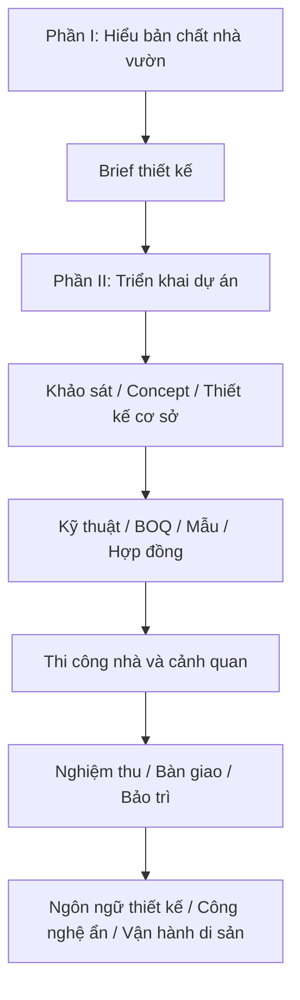

# Bộ Giáo Trình Thiết Kế Nhà Vườn Nghỉ Dưỡng Nhiệt Đới

## Mục tiêu tổng quát

Bộ giáo trình này giúp người học hiểu bản chất của nhà vườn nghỉ dưỡng và làm chủ quá trình triển khai dự án từ tư duy, brief, khảo sát, thiết kế, thi công, nghiệm thu đến bảo trì. Mục tiêu không phải thay thế chuyên gia, mà là đủ năng lực đặt đề bài đúng, hỏi đúng, duyệt đúng và kiểm soát chất lượng bằng tiêu chí.

Sau khi học xong, người học cần có khả năng:

- Đọc khu đất, khí hậu, trải nghiệm, cây, nước, vật liệu và bảo trì ở mức nền tảng vững.
- Xây dựng brief thiết kế và brief triển khai đủ rõ.
- Kiểm soát concept, thiết kế cơ sở, hồ sơ kỹ thuật, BOQ, mẫu, tiến độ, thi công, nghiệm thu và bảo trì.
- Làm việc hiệu quả với kiến trúc sư, cảnh quan, kỹ sư, nhà thầu và đơn vị bảo trì.
- Tự kiểm tra dự án bằng checklist thay vì duyệt cảm tính.
- Đọc, lập nhiệm vụ và duyệt thiết kế phần nhà: pháp lý, công năng, mặt bằng, mặt cắt, vỏ nhà, kết cấu, MEP, vật liệu và hồ sơ.
- Kiểm soát ngôn ngữ thiết kế tổng thể, công nghệ ẩn và vận hành dài hạn để công trình có khả năng trở thành di sản.

## Tư duy xuyên suốt

## Cách học khuyến nghị

| Giai đoạn | Cách học | Kết quả cần đạt |
|---|---|---|
| 1. Nắm nền tảng | Học Module 01-12 | Có ngôn ngữ đúng về nhà vườn, khí hậu, trải nghiệm, cây, nước, vật liệu, bảo trì và brief |
| 2. Làm chủ triển khai | Học Module 13-19 | Biết kiểm soát brief, khảo sát, concept, thiết kế cơ sở, kỹ thuật, BOQ và ngân sách |
| 3. Kiểm soát thi công | Học Module 20-25 | Biết duyệt mẫu, chọn đội ngũ, quản lý hiện trường, thi công nhà-vườn, nghiệm thu và bàn giao |
| 4. Vận hành dài hạn | Học Module 26 và phụ lục | Có kế hoạch bảo trì 12 tháng và kịch bản 1-3-5 năm |
| 5. Đi sâu thiết kế nhà | Học Module 27-34 | Có brief kiến trúc, zoning, mặt cắt, checklist vỏ nhà, phối hợp kỹ thuật và tiêu chuẩn duyệt hồ sơ |
| 6. Nâng cấp thành tài sản di sản | Học Module 35-37 và phụ lục S-U | Có ngôn ngữ thiết kế thống nhất, công nghệ ẩn và hồ sơ vận hành 20-50 năm |

## Mục lục chi tiết

### Phần I. Nền tảng thiết kế nhà vườn

| Tài liệu | Nội dung | Đầu ra chính |
|---|---|---|
| [Module 01](modules/module-01-tu-duy-nen-tang.md) | Tư duy nền tảng | Tuyên ngôn thiết kế nhà vườn |
| [Module 02](modules/module-02-doc-khu-dat.md) | Đọc khu đất | Phiếu khảo sát nắng, gió, nước, đất, view |
| [Module 03](modules/module-03-trai-nghiem-con-nguoi.md) | Trải nghiệm con người | Hành trình không gian và điểm dừng |
| [Module 04](modules/module-04-kien-truc-nhiet-doi.md) | Kiến trúc nhiệt đới | Checklist nhà mát và hiên sống được |
| [Module 05](modules/module-05-quan-he-nha-va-vuon.md) | Quan hệ nhà - vườn | Sơ đồ kết nối trong nhà, hiên, sân, vườn |
| [Module 06](modules/module-06-cay-xanh-nhieu-tang.md) | Cây xanh nhiều tầng | Sơ đồ tầng cây và vai trò cây |
| [Module 07](modules/module-07-dat-nuoc-thoat-nuoc-tuoi.md) | Đất, nước, thoát nước, tưới | Bản đồ nước và yêu cầu kỹ thuật nền |
| [Module 08](modules/module-08-vat-lieu-mau-sac-chat-cam.md) | Vật liệu, màu sắc, chất cảm | Bảng vật liệu có lý do chọn |
| [Module 09](modules/module-09-anh-sang-am-thanh-mui-huong.md) | Ánh sáng và giác quan | Bản đồ giác quan |
| [Module 10](modules/module-10-thoi-gian-va-bao-tri.md) | Thời gian và bảo trì | Kế hoạch chăm sóc và kịch bản 5 năm |
| [Module 11](modules/module-11-quy-trinh-lam-viec.md) | Quy trình làm việc | Bộ câu hỏi kiểm soát thiết kế-thi công |
| [Module 12](modules/module-12-brief-thiet-ke.md) | Brief tổng hợp | Brief thiết kế nhà vườn hoàn chỉnh |

### Phần II. Triển khai dự án nhà vườn từ brief đến bảo trì

| Tài liệu | Nội dung | Đầu ra chính |
|---|---|---|
| [Module 13](modules/module-13-tong-quan-lo-trinh-trien-khai-du-an.md) | Tổng quan lộ trình triển khai | Master roadmap dự án |
| [Module 14](modules/module-14-brief-trien-khai-va-yeu-cau-dau-bai.md) | Brief triển khai | Master brief triển khai |
| [Module 15](modules/module-15-khao-sat-hien-trang-phap-ly-do-dac-ha-tang.md) | Khảo sát hiện trạng, pháp lý, đo đạc, hạ tầng | Báo cáo khảo sát đầu vào |
| [Module 16](modules/module-16-concept-tong-the-nha-vuon.md) | Concept tổng thể nhà - vườn | Checklist duyệt concept |
| [Module 17](modules/module-17-thiet-ke-co-so-va-phuong-an-thiet-ke.md) | Thiết kế cơ sở | Checklist duyệt thiết kế cơ sở |
| [Module 18](modules/module-18-ho-so-ky-thuat-kien-truc-ket-cau-mep-canh-quan.md) | Hồ sơ kỹ thuật | Ma trận hồ sơ kỹ thuật |
| [Module 19](modules/module-19-du-toan-boq-pham-vi-cong-viec-ngan-sach.md) | Dự toán, BOQ, phạm vi, ngân sách | BOQ và kiểm soát ngân sách |
| [Module 20](modules/module-20-mau-mockup-vat-lieu-cay-thiet-bi-duyet-mau.md) | Mẫu, mockup và duyệt mẫu | Phiếu duyệt mẫu |
| [Module 21](modules/module-21-lua-chon-doi-ngu-hop-dong-tien-do-quan-ly-thay-doi.md) | Đội ngũ, hợp đồng, tiến độ, thay đổi | Khung quản lý hợp đồng-tiến độ |
| [Module 22](modules/module-22-chuan-bi-thi-cong-quan-ly-hien-truong-an-toan-chat-luong.md) | Chuẩn bị thi công và hiện trường | Checklist trước khởi công |
| [Module 23](modules/module-23-thi-cong-phan-nha-tho-hoan-thien-he-thong-ky-thuat.md) | Thi công phần nhà | Checklist mốc che lấp và hoàn thiện |
| [Module 24](modules/module-24-thi-cong-canh-quan-dat-nuoc-cay-tuoi-den-vat-lieu-ngoai-troi.md) | Thi công cảnh quan | Checklist đất-nước-cây-tưới-đèn |
| [Module 25](modules/module-25-nghiem-thu-ban-giao-van-hanh-thu-ho-so-hoan-cong.md) | Nghiệm thu và bàn giao | Checklist bàn giao và hồ sơ hoàn công |
| [Module 26](modules/module-26-bao-tri-theo-doi-sau-ban-giao-kich-ban-1-3-5-nam.md) | Bảo trì sau bàn giao | Kế hoạch 12 tháng và kịch bản 1-3-5 năm |

### Phần III. Thiết kế nhà nghỉ dưỡng gia đình trong khu nhà vườn

| Tài liệu | Nội dung | Đầu ra chính |
|---|---|---|
| [Module 27](modules/module-27-nhiem-vu-thiet-ke-nha-va-chuan-dau-vao-du-an.md) | Nhiệm vụ thiết kế nhà và chuẩn đầu vào dự án | Brief kiến trúc, ma trận người dùng-hoạt động-không gian |
| [Module 28](modules/module-28-phap-ly-quy-hoach-giay-phep-va-gioi-han-thiet-ke.md) | Pháp lý, quy hoạch, giấy phép và giới hạn thiết kế | Checklist pháp lý, sơ đồ vùng được xây |
| [Module 29](modules/module-29-cong-nang-zoning-va-ma-tran-quan-he-phong.md) | Công năng, zoning và ma trận quan hệ phòng | Sơ đồ zoning, ma trận quan hệ phòng |
| [Module 30](modules/module-30-mat-bang-mat-cat-cao-do-va-to-chuc-hinh-khoi.md) | Mặt bằng, mặt cắt, cao độ và tổ chức hình khối | Mặt cắt chính, sơ đồ cao độ, bảng so sánh phương án |
| [Module 31](modules/module-31-thiet-ke-khi-hau-cho-vo-nha-mai-hien-cua-kinh-lam.md) | Thiết kế khí hậu cho vỏ nhà | Ma trận mái-hiên-cửa-kính-lam |
| [Module 32](modules/module-32-phoi-hop-ket-cau-mep-va-ky-thuat-van-hanh.md) | Phối hợp kết cấu, MEP và kỹ thuật vận hành | Checklist phối hợp bộ môn, sơ đồ vùng kỹ thuật |
| [Module 33](modules/module-33-vat-lieu-cau-tao-chong-tham-chong-nong-va-bao-tri.md) | Vật liệu, cấu tạo, chống thấm, chống nóng và bảo trì | Bảng vật liệu, checklist cấu tạo rủi ro |
| [Module 34](modules/module-34-ho-so-thiet-ke-checklist-duyet-phuong-an-va-tieu-chuan-nghiem-thu.md) | Hồ sơ thiết kế, checklist duyệt và tiêu chuẩn nghiệm thu | Danh mục hồ sơ, mẫu nghiệm thu thiết kế |

### Phần IV. Thiết kế tổng thể, công nghệ ẩn và vận hành di sản

| Tài liệu | Nội dung | Đầu ra chính |
|---|---|---|
| [Module 35](modules/module-35-ngon-ngu-thiet-ke-tong-the-noi-that-ngoai-that-canh-quan.md) | Ngôn ngữ thiết kế tổng thể, nội thất - ngoại thất - cảnh quan | Tuyên ngôn ngôn ngữ thiết kế, material board, checklist duyệt tổng thể |
| [Module 36](modules/module-36-cong-nghe-an-an-ninh-an-toan-tien-nghi-khong-pho-truong.md) | Công nghệ ẩn, an ninh, an toàn và tiện nghi không phô trương | Ma trận công nghệ ẩn, kịch bản vận hành, checklist bàn giao số |
| [Module 37](modules/module-37-van-hanh-tu-dong-bao-tri-du-bao-ho-so-tai-san-di-san.md) | Vận hành tự động, bảo trì dự báo và hồ sơ tài sản sau bàn giao | Asset register, kế hoạch 20-50 năm, sổ tay di sản |

## Phụ lục thực hành

| Phụ lục | Nội dung |
|---|---|
| [Phụ lục A](phu_luc/checklist_tong_hop.md) | Checklist tổng hợp đánh giá nhà vườn |
| [Phụ lục B](phu_luc/lo_trinh_hoc_30_ngay.md) | Lộ trình học 30 ngày |
| [Phụ lục C](phu_luc/mau_phieu_khao_sat_khu_dat.md) | Mẫu phiếu khảo sát khu đất |
| [Phụ lục D](phu_luc/mau_brief_thiet_ke.md) | Mẫu brief thiết kế nhà vườn nghỉ dưỡng |
| [Phụ lục E](phu_luc/mau_danh_gia_thiet_ke.md) | Mẫu đánh giá phương án thiết kế |
| [Phụ lục F](phu_luc/ban_tom_tat_1_trang.md) | Bản tóm tắt 1 trang |
| [Phụ lục G](phu_luc/mau_master_brief_trien_khai_du_an.md) | Mẫu master brief triển khai dự án |
| [Phụ lục H](phu_luc/phieu_khao_sat_hien_trang_phap_ly.md) | Phiếu khảo sát hiện trạng và pháp lý |
| [Phụ lục I](phu_luc/checklist_duyet_concept.md) | Checklist duyệt concept |
| [Phụ lục J](phu_luc/checklist_duyet_thiet_ke_co_so.md) | Checklist duyệt thiết kế cơ sở |
| [Phụ lục K](phu_luc/ma_tran_ho_so_ky_thuat_can_co.md) | Ma trận hồ sơ kỹ thuật cần có |
| [Phụ lục L](phu_luc/mau_duyet_vat_lieu_cay_thiet_bi.md) | Mẫu duyệt vật liệu/cây/thiết bị |
| [Phụ lục M](phu_luc/mau_boq_pham_vi_cong_viec.md) | Mẫu BOQ/phạm vi công việc |
| [Phụ lục N](phu_luc/mau_tien_do_tong_the.md) | Mẫu tiến độ tổng thể |
| [Phụ lục O](phu_luc/mau_nhat_ky_thay_doi_phat_sinh.md) | Mẫu nhật ký thay đổi và phát sinh |
| [Phụ lục P](phu_luc/checklist_kiem_tra_hien_truong.md) | Checklist kiểm tra hiện trường |
| [Phụ lục Q](phu_luc/checklist_nghiem_thu_ban_giao.md) | Checklist nghiệm thu bàn giao |
| [Phụ lục R](phu_luc/ke_hoach_bao_tri_12_thang_1_3_5_nam.md) | Kế hoạch bảo trì 12 tháng và kịch bản 1-3-5 năm |
| [Phụ lục S](phu_luc/checklist_ngon_ngu_thiet_ke_tong_the.md) | Checklist duyệt ngôn ngữ thiết kế tổng thể |
| [Phụ lục T](phu_luc/ma_tran_cong_nghe_an_an_ninh_an_toan_tien_nghi.md) | Ma trận công nghệ ẩn, an ninh, an toàn và tiện nghi |
| [Phụ lục U](phu_luc/mau_ho_so_tai_san_va_ke_hoach_van_hanh_di_san_20_50_nam.md) | Mẫu hồ sơ tài sản và kế hoạch vận hành di sản 20-50 năm |

## Chuẩn trình bày trong từng module

Mỗi module đều dùng cùng một khung 15 phần để dễ học, dễ rà soát và đủ sâu khi áp dụng vào dự án thật:

1. Vai trò của module trong toàn bộ giáo trình.
2. Mục tiêu học tập.
3. Tư duy cốt lõi.
4. Bản chất vấn đề.
5. Kiến thức nền cần hiểu đúng.
6. Các nguyên lý chính.
7. Công cụ phân tích.
8. Quy trình áp dụng từng bước.
9. Ví dụ thực tế.
10. Lỗi thường gặp và cách tránh.
11. Checklist kiểm tra.
12. Bài tập thực hành.
13. Tiêu chí tự đánh giá.
14. Liên kết với các module khác.
15. Ghi chú giới hạn chuyên môn.

Module 27-34 dùng khung chuyên sâu hơn cho phần nhà: vai trò, mục tiêu, kiến thức đầu vào, khái niệm cốt lõi, nguyên lý thiết kế, quy chuẩn/pháp lý cần kiểm tra, công cụ phân tích, quy trình, đầu ra bắt buộc, ví dụ, lỗi thường gặp, checklist, bài tập, tiêu chí tự đánh giá và giới hạn chuyên môn.

Module 35-37 dùng khung chuyên sâu cho lớp tổng thể và vận hành di sản: ngôn ngữ thiết kế, công nghệ ẩn, an ninh, an toàn, tiện nghi, hồ sơ tài sản, bảo trì dự báo, kế hoạch vòng đời và nguyên tắc chuyển giao 20-50 năm.

## Giới hạn của giáo trình

Giáo trình đủ để chủ nhà hiểu bản chất, lập đề bài, kiểm soát thiết kế, làm việc với chuyên gia, theo dõi thi công và nghiệm thu ở mức có tiêu chí. Tài liệu không thay thế hồ sơ thiết kế, tư vấn pháp lý, tính toán kỹ thuật, giám sát chuyên môn, hợp đồng pháp lý hoặc trách nhiệm nghề nghiệp của các đơn vị tư vấn-thi công.
