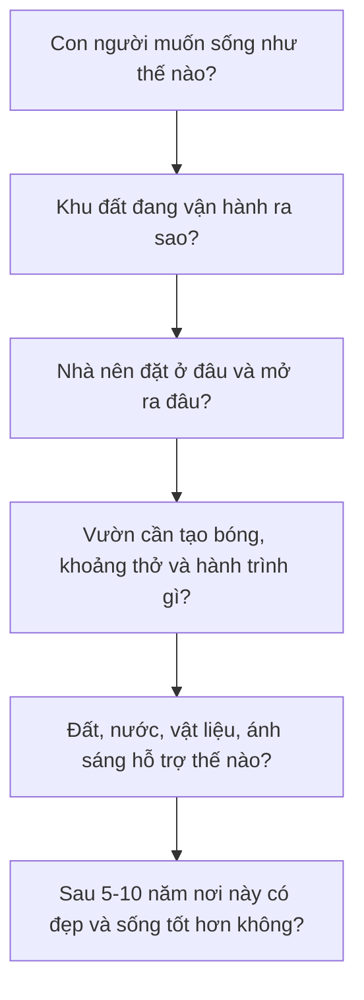

# Bộ Giáo Trình Thiết Kế Nhà Vườn Nghỉ Dưỡng Nhiệt Đới

## Mục tiêu tổng quát

Bộ giáo trình này giúp người mới bắt đầu hiểu đúng và đủ bản chất của một nhà vườn nghỉ dưỡng: không phải là một ngôi nhà xây xong rồi thêm cây xanh, mà là một hệ sống trong đó kiến trúc, cảnh quan, con người, ánh sáng, gió, nước, đất và thời gian vận hành cùng nhau.

Sau khi học xong, người học cần có khả năng:

- Đọc một khu đất ở mức nền tảng nhưng đúng trọng tâm.
- Hiểu vì sao một phương án nhà vườn mát, bền, có chiều sâu và dễ chăm.
- Nhận ra các lỗi phổ biến trong bố cục, cây xanh, thoát nước, vật liệu và bảo trì.
- Xây dựng được một brief thiết kế đủ rõ để làm việc hiệu quả với kiến trúc sư, kiến trúc sư cảnh quan và đội thi công.
- Tự kiểm soát chất lượng phương án thay vì chỉ đánh giá bằng cảm tính.

## Tư duy xuyên suốt



## Cách học khuyến nghị

| Giai đoạn | Cách học | Kết quả cần đạt |
|---|---|---|
| 1. Nắm nền tảng | Học module 1-3 | Có ngôn ngữ tư duy đúng về cảm xúc, khu đất và trải nghiệm |
| 2. Hiểu cấu trúc thiết kế | Học module 4-7 | Biết kiểm tra nhà, vườn, cây, đất, nước và tính bền |
| 3. Hoàn thiện chất lượng sống | Học module 8-10 | Hiểu vật liệu, giác quan và bảo trì dài hạn |
| 4. Chuyển thành dự án thật | Học module 11-12 | Có brief, checklist và quy trình làm việc |

## Mục lục chi tiết

| Tài liệu | Nội dung | Đầu ra chính |
|---|---|---|
| [Module 01](modules/module-01-tu-duy-nen-tang.md) | Tư duy nền tảng | Tuyên ngôn thiết kế nhà vườn |
| [Module 02](modules/module-02-doc-khu-dat.md) | Đọc khu đất | Phiếu khảo sát nắng, gió, nước, đất, view |
| [Module 03](modules/module-03-trai-nghiem-con-nguoi.md) | Trải nghiệm con người | Hành trình không gian và điểm dừng |
| [Module 04](modules/module-04-kien-truc-nhiet-doi.md) | Kiến trúc nhiệt đới | Checklist nhà mát và hiên sống được |
| [Module 05](modules/module-05-quan-he-nha-va-vuon.md) | Quan hệ nhà - vườn | Sơ đồ kết nối trong nhà, hiên, sân, vườn |
| [Module 06](modules/module-06-cay-xanh-nhieu-tang.md) | Cây xanh nhiều tầng | Cụm cây có cấu trúc và vai trò rõ |
| [Module 07](modules/module-07-dat-nuoc-thoat-nuoc-tuoi.md) | Đất, nước, thoát nước, tưới | Bản đồ nước và yêu cầu kỹ thuật nền |
| [Module 08](modules/module-08-vat-lieu-mau-sac-chat-cam.md) | Vật liệu, màu sắc, chất cảm | Bảng vật liệu sơ bộ có lý do chọn |
| [Module 09](modules/module-09-anh-sang-am-thanh-mui-huong.md) | Ánh sáng và giác quan | Một góc nghỉ dưỡng thiết kế bằng 5 giác quan |
| [Module 10](modules/module-10-thoi-gian-va-bao-tri.md) | Thời gian và bảo trì | Kế hoạch chăm sóc 12 tháng và nhìn trước 5-10 năm |
| [Module 11](modules/module-11-quy-trinh-lam-viec.md) | Quy trình làm việc | Bộ câu hỏi kiểm soát đơn vị thiết kế và thi công |
| [Module 12](modules/module-12-brief-thiet-ke.md) | Brief tổng hợp | Brief thiết kế nhà vườn hoàn chỉnh |

## Chuẩn trình bày trong từng bài

Mỗi module đều dùng cùng một khung 15 phần để dễ học, dễ rà soát và đủ sâu khi áp dụng vào dự án thật:

1. Vai trò của module trong toàn bộ giáo trình.
2. Mục tiêu học tập.
3. Tư duy cốt lõi.
4. Bản chất vấn đề.
5. Kiến thức nền cần hiểu đúng.
6. Các nguyên lý thiết kế chính.
7. Công cụ phân tích.
8. Quy trình áp dụng từng bước.
9. Ví dụ thực tế.
10. Lỗi thường gặp và cách tránh.
11. Checklist kiểm tra.
12. Bài tập thực hành.
13. Tiêu chí tự đánh giá.
14. Liên kết với các module khác.
15. Ghi chú giới hạn chuyên môn.

## Thứ tự thiết kế đúng

```text
Cảm xúc sống
-> Đọc khu đất
-> Phân khu không gian
-> Đặt nhà
-> Tổ chức hiên và vùng chuyển tiếp
-> Tạo lối đi, điểm dừng, khung nhìn
-> Đặt cây lớn và khoảng mở
-> Hoàn thiện tầng cây thấp
-> Xử lý đất, nước, thoát nước, tưới
-> Chọn vật liệu, màu sắc, ánh sáng
-> Lập kế hoạch bảo trì theo thời gian
```

## Giới hạn của giáo trình

Giáo trình này đủ để hiểu bản chất, lập đề bài, đánh giá phương án và làm việc tốt hơn với chuyên gia. Tài liệu không thay thế:

- Hồ sơ thiết kế kiến trúc, kết cấu, cơ điện, cấp thoát nước.
- Tư vấn pháp lý xây dựng.
- Tính toán kỹ thuật chuyên sâu.
- Khuyến nghị cây trồng chính xác cho mọi vùng khí hậu.
- Dự toán chi phí và hồ sơ mời thầu.
