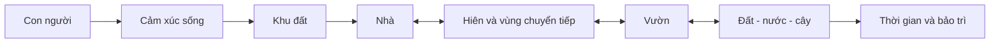

# Module 01. Tư Duy Nền Tảng Về Nhà Vườn Nghỉ Dưỡng

## 1. Mục tiêu học tập

- Hiểu nhà vườn nghỉ dưỡng là một hệ sống, không phải phép cộng giữa nhà và cây.
- Biết đặt câu hỏi đúng trước khi chọn phong cách, cây, vật liệu hoặc phối cảnh.
- Nhận ra các lỗi tư duy khiến nhà vườn nhanh xuống cấp sau 1-3 năm.
- Tạo được tuyên ngôn thiết kế làm nền cho toàn bộ dự án.

## 2. Vì sao module này quan trọng

Module này là nền móng của toàn bộ giáo trình. Nếu tư duy ban đầu sai, các quyết định sau như đặt nhà, mở cửa, chọn cây, làm hồ nước, lát sân hoặc bố trí đèn đều dễ trở thành trang trí rời rạc. Một khu nhà vườn nghỉ dưỡng chỉ thật sự có giá trị khi nó tạo ra chất lượng sống lâu dài: mát, thoáng, có chiều sâu, dễ chăm và càng ở càng thấy gắn bó.

## 3. Tư duy cốt lõi

> Đừng thiết kế “nhà + cây”. Hãy thiết kế một hệ sống nơi con người, kiến trúc, vườn, đất, nước, ánh sáng, gió và thời gian hỗ trợ lẫn nhau.

## 4. Kiến thức nền cần hiểu đúng

### 4.1. Hệ sống

Một hệ sống là tổng thể có nhiều phần liên quan với nhau. Nhà che chở con người, vườn điều hòa vi khí hậu, đất nuôi cây, nước quyết định sức khỏe cảnh quan, ánh sáng tạo nhịp ngày đêm, còn thời gian làm mọi thứ thay đổi. Nếu một phần sai, các phần khác bị ảnh hưởng.

### 4.2. Chất lượng sống

Nhà vườn nghỉ dưỡng không chỉ để ngắm. Nó phải giúp người ở cảm thấy thư giãn, an toàn, được riêng tư vừa đủ, có nơi sinh hoạt ngoài trời và có lý do để đi chậm lại.

### 4.3. Thứ tự thiết kế

Thứ tự đúng là cảm xúc sống, đọc khu đất, phân khu, đặt nhà, tổ chức hiên/lối đi/khoảng mở, rồi mới chọn cây, vật liệu, đèn và trang trí.

### 4.4. Tính trưởng thành

Cây lớn lên, vật liệu cũ đi, thói quen gia đình thay đổi. Vì vậy, thiết kế tốt không dừng ở ngày bàn giao mà phải hình dung được sau 5-10 năm.

### 4.5. Bảo trì

Bảo trì không phải việc phụ. Một phương án cần nhiều chăm sóc hơn khả năng thực tế sẽ nhanh mất chất lượng, dù ban đầu rất đẹp.
## 5. Nguyên lý thiết kế

| Nguyên lý | Cách áp dụng |
|---|---|
| Cảm xúc trước hình thức | Nói rõ muốn yên tĩnh, ấm cúng, mộc mạc, sang trọng hay gần rừng trước khi chọn vật liệu và cây. |
| Tổng thể trước chi tiết | Không chọn cây, đá, đèn khi chưa rõ bố cục, khoảng mở và hành trình. |
| Ít nhưng đúng vai | Một cây chủ đúng chỗ tốt hơn nhiều cây đặt ngẫu hứng. |
| Thiết kế cho thời gian | Mọi cây lớn, vật liệu, mặt nước và lối đi đều cần kịch bản sau vài năm. |
| Dễ sống là tiêu chí cao | Không gian đẹp nhưng nóng, trơn, muỗi, ẩm, khó chăm thì chưa đạt. |

## 6. Sơ đồ trực quan

## 7. Quy trình áp dụng từng bước

1. Viết 3 cảm xúc chủ đạo mà dự án phải tạo ra.
2. Liệt kê người sử dụng thường xuyên và nhu cầu thật của họ.
3. Ghi 5 hoạt động quan trọng nhất sẽ diễn ra trong nhà vườn.
4. Xác định mức bảo trì có thể chấp nhận: thấp, vừa hay cao.
5. Ghi 5 điều không muốn xảy ra, ví dụ nóng, ẩm, muỗi, rối, khó chăm.
6. Chuyển các ý trên thành 5-7 nguyên tắc thiết kế để dùng xuyên suốt dự án.

## 8. Ví dụ thực tế

| Tình huống | Cách đọc hoặc xử lý |
|---|---|
| Gia đình muốn nơi nghỉ cuối tuần | Ưu tiên hiên rộng, phòng ngủ nhìn ra vườn, bếp kết nối bàn ăn ngoài trời, ít chi tiết khó chăm. |
| Chủ nhà thích cảm giác như rừng nhỏ | Cần cây nhiều tầng nhưng vẫn phải có khoảng thở, lối bảo trì và kiểm soát muỗi/ẩm. |
| Đất nhỏ nhưng muốn nghỉ dưỡng | Không cố nhồi nhiều tiểu cảnh; tập trung một khung nhìn đẹp, một hiên tốt và vài lớp cây chọn lọc. |
| Muốn vườn ít chăm | Chọn cây khỏe, cấu trúc đơn giản, giảm hoa mùa vụ, dùng phủ gốc và tưới theo vùng. |

## 9. Lỗi thường gặp và cách tránh

| Lỗi thường gặp | Hậu quả |
|---|---|
| Bắt đầu bằng phong cách ảnh mẫu | Dễ sao chép hình thức mà bỏ qua khu đất thật. |
| Mua cây trước khi có tổng thể | Cây sai vị trí, khó sống, tốn chi phí di dời. |
| Làm quá nhiều điểm nhấn | Không gian mất sự nghỉ dưỡng, mắt không có nơi nghỉ. |
| Không dự đoán cây lớn | Sau vài năm nhà tối, ẩm, rễ ảnh hưởng sân hoặc đường ống. |
| Không tính người chăm | Thiết kế vượt quá khả năng vận hành thực tế. |

## 10. Checklist kiểm tra

### Tư duy

| Câu hỏi | Đạt/Chưa | Ghi chú |
|---|---|---|
| Đã định nghĩa 3 cảm xúc chủ đạo chưa? |  |  |
| Đã biết dự án phục vụ ai trước tiên chưa? |  |  |
| Đã có thứ tự ưu tiên rõ chưa? |  |  |

### Vận hành

| Câu hỏi | Đạt/Chưa | Ghi chú |
|---|---|---|
| Đã xác định mức bảo trì chưa? |  |  |
| Đã nghĩ tới trạng thái sau 5 năm chưa? |  |  |
| Đã ghi các điều không chấp nhận chưa? |  |  |

## 11. Bài tập thực hành

Viết “Tuyên ngôn thiết kế nhà vườn” dài 10-12 câu. Bài làm phải có: người sử dụng chính, cảm xúc mong muốn, hoạt động quan trọng, mức bảo trì, điều cần tránh và hình ảnh khu vườn sau 5 năm.

## 12. Tiêu chí tự đánh giá

| Mức | Biểu hiện |
|---|---|
| Đạt | Nêu được cảm xúc và nhu cầu nhưng còn chung chung. |
| Tốt | Có nguyên tắc thiết kế rõ và liên hệ với cách sống thật. |
| Xuất sắc | Tuyên ngôn đủ cụ thể để làm tiêu chuẩn kiểm tra mọi quyết định thiết kế sau này. |

## 13. Liên kết với các module khác

Module này tạo đầu vào cho Module 02 khi đọc khu đất và Module 12 khi viết brief tổng hợp.

## 14. Ghi chú giới hạn chuyên môn

Đây là module tư duy, chưa thay thế khảo sát hiện trạng hoặc tư vấn thiết kế cụ thể.
