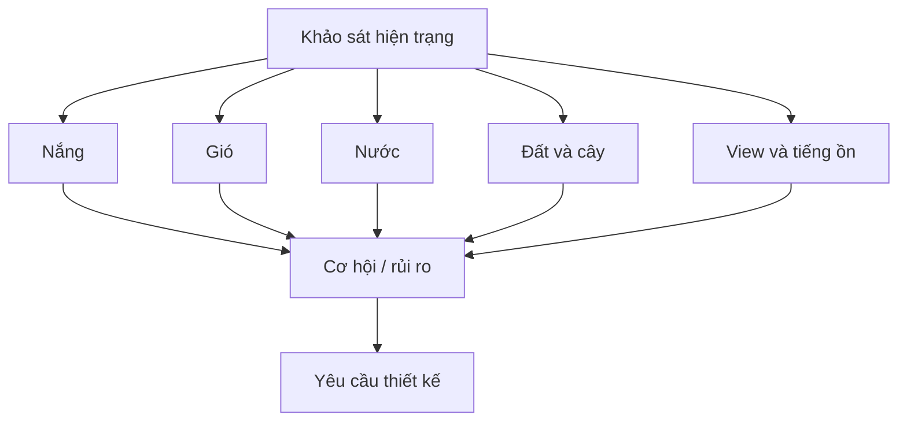

# Module 02. Đọc Khu Đất: Nắng, Gió, Nước, Đất, View

## 1. Mục tiêu học tập

- Biết quan sát khu đất trước khi đề xuất ý tưởng.
- Lập được bản đồ nắng, gió, nước, đất, view ở mức nền tảng.
- Phân biệt cơ hội và rủi ro của khu đất.
- Chuyển dữ liệu khảo sát thành yêu cầu thiết kế.

## 2. Vì sao module này quan trọng

Một phương án nhà vườn tốt không thể sinh ra từ phối cảnh trước. Khu đất luôn có những quy luật sẵn: hướng nắng, hướng gió, điểm đọng nước, cây đang khỏe, view đẹp, view xấu, tiếng ồn và vùng riêng tư. Nếu không đọc đúng, nhà có thể nóng, vườn có thể úng, lối đi có thể trơn và những khung nhìn quan trọng có thể bị lãng phí.

## 3. Tư duy cốt lõi

> Khu đất không phải tờ giấy trắng. Nó là một hệ đang vận hành; nhiệm vụ đầu tiên là đọc đúng hệ đó.

## 4. Kiến thức nền cần hiểu đúng

### 4.1. Nắng

Nắng sáng thường dễ chịu hơn nắng chiều. Nắng Tây và Tây Nam thường gây nóng, chói và tăng tải nhiệt cho tường, kính, sân.

### 4.2. Gió

Gió tốt giúp nhà thoáng và giảm cảm giác nóng. Nhưng gió cũng có thể mang bụi, mùi, tiếng ồn hoặc mưa tạt.

### 4.3. Nước

Nước mưa cho biết cao độ và dòng chảy thật. Điểm đọng nước là dấu hiệu cần xử lý trước khi lát sân hoặc trồng cây.

### 4.4. Đất

Đất cát thoát nhanh nhưng giữ dinh dưỡng kém; đất sét giữ nước nhưng dễ bí; đất nén chặt làm rễ khó thở.

### 4.5. View

View đẹp cần được mở có chủ đích. View xấu, hướng nhìn từ hàng xóm và nguồn tiếng ồn cần được che hoặc làm mềm.

### 4.6. Cây hiện trạng

Cây lớn khỏe là tài sản thời gian. Cây sâu bệnh, rễ nguy hiểm hoặc che sai hướng cần đánh giá kỹ.
## 5. Nguyên lý thiết kế

| Nguyên lý | Cách áp dụng |
|---|---|
| Quan sát theo thời điểm | Ít nhất cần xem sáng, trưa, chiều và sau mưa. |
| Ghi nhận bằng bản đồ | Thông tin phải được đặt lên sơ đồ, không chỉ ghi bằng lời. |
| Kết luận thiết kế | Mỗi quan sát cần dẫn tới một quyết định: mở, che, nâng, thoát, giữ, bỏ. |
| Không chống lại khu đất | Ý tưởng đẹp nhưng trái với nắng, nước, gió thường tốn chi phí và khó bền. |

## 6. Sơ đồ trực quan

## 7. Quy trình áp dụng từng bước

1. Vẽ sơ đồ đất, đánh dấu hướng chính và các mốc cố định.
2. Chụp ảnh từ cổng, các góc đất và từ trong nhà nhìn ra nếu đã có nhà.
3. Ghi vùng nắng sáng, trưa, chiều; đặc biệt chú ý mặt Tây.
4. Quan sát gió tốt, gió xấu, vùng bí và nguồn tiếng ồn.
5. Sau mưa, đánh dấu hướng nước chảy và điểm đọng.
6. Kiểm tra đất bằng quan sát độ tơi, độ dính, thoát nước và cây đang sống.
7. Lập bảng cây hiện trạng: giữ, cắt tỉa, di dời, loại bỏ.
8. Tóm tắt thành 10 nhận định thiết kế quan trọng nhất.

## 8. Ví dụ thực tế

| Tình huống | Cách đọc hoặc xử lý |
|---|---|
| Phía Tây trống và nóng | Cần che nắng bằng mái, lam, cây bóng mát hoặc giảm cửa kính trực tiếp. |
| Góc Đông Nam có gió mát | Có thể ưu tiên hiên, cửa mở hoặc điểm nghỉ. |
| Nước đọng ở lối vào | Phải xử lý cao độ, rãnh hoặc vật liệu thấm trước khi làm đẹp. |
| Có view ruộng/vườn xa | Nên giữ trục nhìn, không trồng cây chắn view quý. |
| Hàng xóm nhìn trực diện vào sân | Cần lớp cây đệm hoặc thay đổi vị trí điểm ngồi. |

## 9. Lỗi thường gặp và cách tránh

| Lỗi thường gặp | Hậu quả |
|---|---|
| Chỉ khảo sát một lần | Bỏ sót thay đổi theo giờ và theo mưa. |
| Không chụp ảnh hiện trạng | Khó trao đổi chính xác với đơn vị thiết kế. |
| Xem cây hiện trạng là vật cản | Dễ mất tài sản bóng mát có sẵn. |
| Không kiểm tra nước | Lỗi ngập, trơn, bẩn thường lộ sau thi công. |
| Không ghi view xấu | Cửa và hiên có thể mở sai hướng. |

## 10. Checklist kiểm tra

### Nắng - gió

| Câu hỏi | Đạt/Chưa | Ghi chú |
|---|---|---|
| Có bản đồ nắng 3 thời điểm chưa? |  |  |
| Có ghi hướng gió tốt/xấu chưa? |  |  |
| Có xác định vùng bí chưa? |  |  |

### Nước - đất - cây

| Câu hỏi | Đạt/Chưa | Ghi chú |
|---|---|---|
| Có điểm đọng nước sau mưa chưa? |  |  |
| Có nhận xét đất sơ bộ chưa? |  |  |
| Có danh sách cây hiện trạng chưa? |  |  |

### View - riêng tư

| Câu hỏi | Đạt/Chưa | Ghi chú |
|---|---|---|
| Có view nên mở chưa? |  |  |
| Có view nên che chưa? |  |  |
| Có nguồn tiếng ồn/rủi ro riêng tư chưa? |  |  |

## 11. Bài tập thực hành

Hoàn thành một “bản đồ đọc đất” gồm sơ đồ tay, ảnh hiện trạng, bảng 7 lớp khảo sát và danh sách 10 quyết định thiết kế rút ra từ khảo sát.

## 12. Tiêu chí tự đánh giá

| Mức | Biểu hiện |
|---|---|
| Đạt | Có ghi nhận hiện trạng cơ bản. |
| Tốt | Biết phân loại cơ hội và rủi ro. |
| Xuất sắc | Mỗi dữ liệu khảo sát đều chuyển thành yêu cầu thiết kế rõ ràng. |

## 13. Liên kết với các module khác

Dữ liệu từ module này là đầu vào trực tiếp cho Module 03, 04, 05, 06 và brief ở Module 12.

## 14. Ghi chú giới hạn chuyên môn

Khảo sát trong module này là nền tảng cho chủ nhà; các vấn đề cao độ, địa chất, thoát nước phức tạp vẫn cần chuyên gia.
