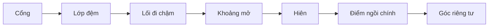

# Module 03. Thiết Kế Trải Nghiệm Con Người

## 1. Mục tiêu học tập

- Hiểu nhà vườn như một chuỗi trải nghiệm chứ không chỉ là mặt bằng.
- Biết tổ chức hành trình từ cổng vào, hiên, sân, lối đi và điểm nghỉ.
- Áp dụng được các nguyên lý mở - kín, điểm dừng, khung nhìn và prospect - refuge.
- Tạo được bài tập hành trình một ngày làm đầu vào cho thiết kế.

## 2. Vì sao module này quan trọng

Nhiều khu vườn đẹp trên ảnh nhưng ít được sử dụng vì không có hành trình hợp lý, không có điểm dừng dễ chịu hoặc chỗ ngồi bị nắng, gió, thiếu riêng tư. Module này giúp chuyển từ tư duy “bố trí đồ vật” sang tư duy “thiết kế cảm giác khi con người di chuyển và ở lại”.

## 3. Tư duy cốt lõi

> Một không gian nghỉ dưỡng tốt không phơi bày mọi thứ cùng lúc; nó dẫn người đi chậm lại qua các lớp mở - kín, sáng - tối, động - tĩnh.

## 4. Kiến thức nền cần hiểu đúng

### 4.1. Hành trình không gian

Hành trình là chuỗi chuyển động từ lúc tiếp cận khu đất đến khi vào nhà, ra hiên, đi trong vườn và dừng lại. Hành trình tốt có nhịp, có bất ngờ vừa đủ và không làm người dùng bị lạc hoặc mệt.

### 4.2. Điểm dừng

Điểm dừng là nơi người dùng có lý do ở lại: ngồi uống trà, đọc sách, nhìn cây, nghe nước, trò chuyện hoặc đơn giản là thở. Điểm dừng phải có bóng, tầm nhìn, chỗ tựa và cảm giác an toàn.

### 4.3. Mở - kín

Không gian mở cho cảm giác thở và nhìn xa; không gian kín cho cảm giác được ôm và riêng tư. Thiết kế tốt cần luân phiên hai trạng thái này.

### 4.4. Prospect - refuge

Prospect là khả năng nhìn ra; refuge là cảm giác được che chở. Một chỗ ngồi tốt thường có tầm nhìn phía trước và điểm tựa phía sau hoặc bên cạnh.

### 4.5. Khung nhìn

Khung nhìn là cảnh được chọn có chủ đích qua cửa, hiên, lối đi hoặc kẽ cây. Không phải view nào cũng nên mở; có view cần che.

### 4.6. Tỷ lệ cơ thể

Lối đi, bậc, ghế, khoảng cách tới cây và chiều cao tường/cây đều cần phù hợp cơ thể người thật, đặc biệt nếu có trẻ nhỏ hoặc người già.
## 5. Nguyên lý thiết kế

| Nguyên lý | Cách áp dụng |
|---|---|
| Đi chậm có chủ đích | Lối đi nên dẫn dắt, không chỉ nối thẳng điểm đầu và điểm cuối. |
| Mỗi điểm ngồi phải có lý do | Không đặt ghế nếu không biết người ngồi nhìn gì và được che ra sao. |
| Tạo nhịp mở - kín | Dùng cây, tường thấp, mái, ánh sáng để tạo lớp chuyển tiếp. |
| Ưu tiên cảm giác an toàn | Chỗ nghỉ cần đủ sáng, không trơn, không bị nhìn trực diện. |
| Thiết kế theo thời điểm | Sáng, chiều và tối có ánh sáng, gió và nhu cầu khác nhau. |

## 6. Sơ đồ trực quan

## 7. Quy trình áp dụng từng bước

1. Lập danh sách hoạt động trong một ngày: về nhà, ăn, nghỉ, đọc sách, tiếp khách, đi dạo.
2. Vẽ đường di chuyển của từng hoạt động trên sơ đồ.
3. Chọn 3 điểm dừng quan trọng nhất và mô tả cảm giác mong muốn.
4. Kiểm tra từng điểm dừng theo bốn câu: có bóng không, nhìn gì, tựa vào đâu, đi tới có dễ không.
5. Đánh dấu vùng cần mở để nhìn xa và vùng cần kín để riêng tư.
6. Điều chỉnh lối đi để tránh cắt ngang nơi nghỉ tĩnh hoặc mở thẳng vào view xấu.

## 8. Ví dụ thực tế

| Tình huống | Cách đọc hoặc xử lý |
|---|---|
| Từ cổng vào nhà | Nên có lớp cây hoặc tường mềm làm chậm nhịp, tránh nhìn thẳng toàn bộ nhà. |
| Góc uống trà sáng | Đặt ở nơi có nắng nhẹ hoặc bóng dịu, nhìn ra khoảng cây thấp và không bị lối đi chính quấy nhiễu. |
| Bàn ăn ngoài hiên | Cần gần bếp, đủ rộng, có đèn ấm, tránh gió mạnh và mưa tạt. |
| Lối đi trong vườn | Nên có đoạn mở ra, đoạn khép lại và một vài điểm dừng nhỏ. |
| Khu trẻ chơi | Cần nền an toàn và có tầm nhìn từ nơi người lớn thường ngồi. |

## 9. Lỗi thường gặp và cách tránh

| Lỗi thường gặp | Hậu quả |
|---|---|
| Thiết kế chỉ theo mặt bằng đẹp | Không gian có thể thiếu trải nghiệm sống thật. |
| Lối đi quá thẳng | Mất cảm giác khám phá và nghỉ dưỡng. |
| Điểm ngồi không có bóng | Không ai dùng vào thời điểm nóng. |
| Mở toàn bộ view | Không gian thiếu riêng tư và thiếu chiều sâu. |
| Quên người già/trẻ nhỏ | Bậc, nền và lối đi có thể trở thành rủi ro. |

## 10. Checklist kiểm tra

### Hành trình

| Câu hỏi | Đạt/Chưa | Ghi chú |
|---|---|---|
| Có lối vào rõ và dễ chịu chưa? |  |  |
| Có nhịp chuyển tiếp từ ngoài vào trong chưa? |  |  |
| Lối đi có tránh cắt ngang vùng nghỉ không? |  |  |

### Điểm dừng

| Câu hỏi | Đạt/Chưa | Ghi chú |
|---|---|---|
| Có ít nhất 3 điểm dừng có lý do chưa? |  |  |
| Mỗi điểm dừng có bóng và tầm nhìn chưa? |  |  |
| Có điểm riêng tư và điểm sinh hoạt chung chưa? |  |  |

### An toàn

| Câu hỏi | Đạt/Chưa | Ghi chú |
|---|---|---|
| Bậc, nền, lối đi có an toàn không? |  |  |
| Có xét nhu cầu trẻ nhỏ/người già không? |  |  |
| Ban đêm có đọc được hành trình không? |  |  |

## 11. Bài tập thực hành

Vẽ “hành trình một ngày” của một người sử dụng chính. Bài nộp gồm sơ đồ đường đi, 3 điểm dừng, cảm giác mong muốn ở từng điểm và 5 lỗi cần tránh.

## 12. Tiêu chí tự đánh giá

| Mức | Biểu hiện |
|---|---|
| Đạt | Có sơ đồ đường đi và một số điểm dừng. |
| Tốt | Mỗi điểm dừng có lý do, view và điều kiện sử dụng rõ. |
| Xuất sắc | Hành trình tạo được nhịp cảm xúc và có thể dùng để chỉnh mặt bằng thật. |

## 13. Liên kết với các module khác

Dùng dữ liệu từ Module 01 và 02; tạo nền cho Module 05 khi tổ chức quan hệ nhà - vườn.

## 14. Ghi chú giới hạn chuyên môn

Phần này định hướng trải nghiệm; các chi tiết kích thước, bậc, lan can và an toàn cần kiểm tra theo thiết kế kỹ thuật.
