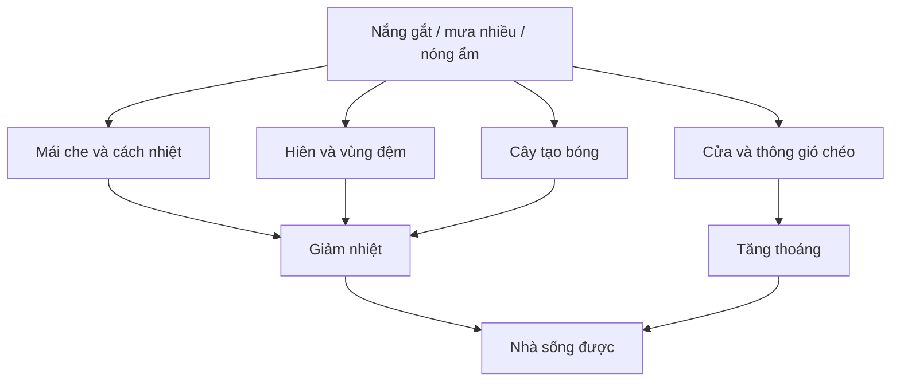

# Module 04. Nguyên Lý Kiến Trúc Nhiệt Đới

## 1. Mục tiêu học tập

- Hiểu vì sao kiến trúc nhiệt đới phải ưu tiên che nắng, thông gió và vùng chuyển tiếp.
- Biết phân tích mái, hiên, cửa, kính, bóng đổ và vật liệu theo tác động khí hậu.
- Nhận ra các lỗi khiến nhà vườn nóng, bí, mưa tạt hoặc phụ thuộc điều hòa.
- Tạo được checklist kiểm tra một phương án nhà ở khí hậu nóng ẩm.

## 2. Vì sao module này quan trọng

Khí hậu nóng ẩm, nắng gắt và mưa nhiều đòi hỏi kiến trúc phải biết che, thở, chuyển tiếp và phối hợp với cảnh quan.

## 3. Tư duy cốt lõi

> Nhà mát không bắt đầu từ điều hòa mà từ lớp vỏ biết che nắng, đón gió, giảm bức xạ và tránh mưa tạt.

## 4. Kiến thức nền cần hiểu đúng

### 4.1. Nắng và bức xạ

Nhiệt không chỉ đến từ không khí nóng mà còn từ bức xạ mặt trời lên mái, tường, kính và sân. Mặt Tây thường nguy hiểm vì nắng xiên, mạnh và kéo dài vào cuối ngày.

### 4.2. Mái

Mái là lớp phòng thủ đầu tiên. Mái tốt không chỉ che mưa mà còn giảm nhiệt truyền xuống trong nhà, tạo bóng và bảo vệ tường/cửa.

### 4.3. Hiên

Hiên là phòng bán ngoài trời. Một hiên tốt phải đủ sâu, đủ bóng, có gió, có view và dùng được thật chứ không chỉ làm đẹp mặt đứng.

### 4.4. Thông gió chéo

Gió cần cửa vào và cửa ra. Nếu chỉ có một phía mở, không khí dễ đứng lại; nếu cửa sai hướng, gió tốt không đi qua vùng người ở.

### 4.5. Cửa kính

Kính mở view nhưng cũng đưa nhiệt và chói vào nhà. Kính lớn cần được lùi, che, lọc sáng hoặc đặt ở hướng phù hợp.

### 4.6. Bóng cây

Cây là lớp che nắng sống. Tuy nhiên cây cần đặt đúng để làm mát mà không làm nhà tối, ẩm hoặc bí.

### 4.7. Vật liệu vỏ nhà

Màu, độ nhám, độ dày, khả năng tích nhiệt và chống trơn của vật liệu ảnh hưởng trực tiếp tới cảm giác nóng/lạnh và an toàn.
## 5. Nguyên lý thiết kế

| Nguyên lý | Cách áp dụng |
|---|---|
| Che nắng trước khi làm mát | Giảm nhiệt ngay từ mái, hiên, lam, cây và lớp vỏ. |
| Đón gió có kiểm soát | Mở cửa theo hướng gió tốt, vẫn kiểm soát mưa, bụi và riêng tư. |
| Tạo vùng đệm | Hiên, sân bán ngoài trời, cây và mái đua giúp giảm sốc nhiệt giữa trong và ngoài. |
| Kiểm soát kính | Kính lớn phải đi kèm giải pháp che và thông gió. |
| Phối hợp nhà với vườn | Cây, mặt đất và bóng đổ là một phần của chiến lược khí hậu. |

## 6. Sơ đồ trực quan

## 7. Quy trình áp dụng từng bước

1. Đánh dấu các mặt nhà chịu nắng sáng, trưa, chiều; đặc biệt là hướng Tây và Tây Nam.
2. Kiểm tra mái: độ vươn, lớp che, khả năng giảm nhiệt và bảo vệ tường/cửa.
3. Kiểm tra hiên: có đủ sâu, đủ bóng, đủ gió và đủ diện tích sử dụng không.
4. Kiểm tra thông gió: mỗi phòng chính có đường gió vào và ra không.
5. Kiểm tra cửa kính: hướng, kích thước, mức chói, che mưa, che nắng và riêng tư.
6. Kiểm tra vật liệu sân/hiên: có nóng chân, trơn khi mưa hoặc tích nhiệt quá mạnh không.
7. Kết luận thành danh sách sửa: che thêm, mở thêm, giảm kính, lùi cửa, thêm cây, đổi vật liệu hoặc xử lý cao độ.

## 8. Ví dụ thực tế

| Tình huống | Cách đọc hoặc xử lý |
|---|---|
| Nhà mặt Tây dùng kính lớn | Cần giảm kính trực tiếp, thêm lam/hiên/cây hoặc chuyển chức năng ít ở lâu về hướng này. |
| Phòng khách chỉ mở một mặt | Dù cửa lớn vẫn có thể bí; cần cửa thoát gió hoặc ô thoáng ở hướng khác. |
| Hiên đẹp nhưng nông | Không đặt được bàn ghế, mưa tạt và nắng chiếu, nên không thành không gian sống. |
| Sân bê tông rộng không bóng | Tích nhiệt mạnh, làm nóng quanh nhà; cần cây, vật liệu thấm hoặc mảng xanh. |
| Cây trồng sát cửa quá dày | Có bóng nhưng gây ẩm, tối, muỗi; cần khoảng cách và tầng cây hợp lý. |

## 9. Lỗi thường gặp và cách tránh

| Lỗi thường gặp | Hậu quả |
|---|---|
| Nghĩ nhiều cửa kính là gần thiên nhiên | Nếu không che, nhà nóng và chói. |
| Chỉ dựa vào điều hòa | Tăng chi phí vận hành và bỏ lỡ chất lượng sống tự nhiên. |
| Làm hiên như chi tiết trang trí | Hiên không đủ sâu sẽ ít được dùng. |
| Không tính mưa tạt | Vùng cửa, bậc và hiên nhanh bẩn, trơn và xuống cấp. |
| Cây che sai hướng | Cản gió tốt hoặc làm nhà thiếu sáng. |

## 10. Checklist kiểm tra

### Mái và hiên

| Câu hỏi | Đạt/Chưa | Ghi chú |
|---|---|---|
| Mái có che được mưa nắng chính chưa? |  |  |
| Hiên có đủ sâu để dùng thật chưa? |  |  |
| Vùng chuyển tiếp có giảm nóng và mưa tạt chưa? |  |  |

### Gió và cửa

| Câu hỏi | Đạt/Chưa | Ghi chú |
|---|---|---|
| Phòng chính có thông gió chéo chưa? |  |  |
| Cửa có mở vào hướng gió tốt không? |  |  |
| Cửa kính có được che nắng và kiểm soát chói không? |  |  |

### Vườn và vật liệu

| Câu hỏi | Đạt/Chưa | Ghi chú |
|---|---|---|
| Cây có hỗ trợ bóng mát mà không gây bí không? |  |  |
| Sân/hiên có vật liệu không quá nóng và không trơn không? |  |  |
| Có kiểm tra phương án trong mùa mưa chưa? |  |  |

## 11. Bài tập thực hành

Chọn một mặt bằng hoặc ảnh nhà nhiệt đới. Lập bảng 4 cột: điểm nóng, nguyên nhân, giải pháp kiến trúc/cảnh quan, cách kiểm tra sau khi sửa. Cần có ít nhất 6 nhận xét, trong đó có mái, hiên, cửa, gió, kính và sân ngoài trời.

## 12. Tiêu chí tự đánh giá

| Mức | Biểu hiện |
|---|---|
| Đạt | Nhận ra được các điểm nóng hoặc bí cơ bản. |
| Tốt | Phân tích được nguyên nhân và đề xuất giải pháp phù hợp khí hậu. |
| Xuất sắc | Tạo được checklist kiểm tra nhà mát có thể dùng để review bản vẽ thật. |

## 13. Liên kết với các module khác

Module này sử dụng dữ liệu từ các module trước và tạo đầu vào cho Module 12 khi lập brief tổng hợp.

## 14. Ghi chú giới hạn chuyên môn

Các nội dung kỹ thuật chi tiết cần được kiểm tra bởi kiến trúc sư, kỹ sư hoặc chuyên gia phù hợp khi triển khai dự án thật.
