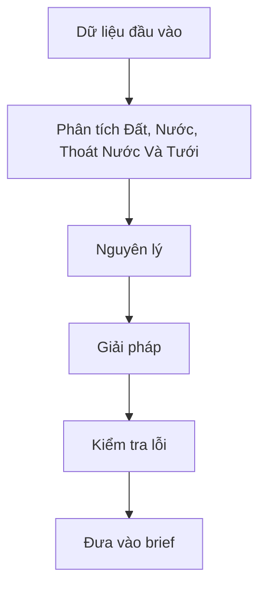

# Module 07. Đất, Nước, Thoát Nước Và Tưới

## 1. Mục tiêu học tập

- Hiểu đúng bản chất của đất, nước, thoát nước và tưới.
- Biết áp dụng kiến thức vào một khu đất hoặc phương án cụ thể.
- Nhận diện lỗi thường gặp và hậu quả vận hành.
- Tạo được đầu ra thực hành có thể đưa vào brief hoặc checklist.

## 2. Vì sao module này quan trọng

Đây là phần ít hào nhoáng nhưng quyết định tuổi thọ khu vườn. Nhiều vườn xuống cấp không phải vì chọn cây xấu mà vì nước, đất, cao độ và tưới sai.

## 3. Tư duy cốt lõi

> Nước phải có đường đi, đất phải cho rễ thở, tưới phải đúng vùng; nếu ba điều này sai, mọi lớp cảnh quan phía trên đều yếu.

## 4. Kiến thức nền cần hiểu đúng

### 4.1. Đất trồng

Đất cần thoáng, có hữu cơ, giữ ẩm vừa đủ và phù hợp từng nhóm cây.

### 4.2. Cao độ

Cao độ quyết định nước chảy về đâu và có hắt vào nhà hay không.

### 4.3. Thoát nước mặt

Nước trên sân, lối đi, hiên cần thoát nhanh và an toàn.

### 4.4. Thoát nước trong bồn cây

Bồn cây phải tránh úng rễ và có lớp thoát phù hợp.

### 4.5. Tưới theo vùng

Vùng nắng, vùng râm, cây mới, cây lớn cần lượng nước khác nhau.

### 4.6. Phủ gốc

Giảm bốc hơi, bắn bùn, cỏ dại và biến động nhiệt đất.
## 5. Nguyên lý thiết kế

| Nguyên lý | Cách áp dụng |
|---|---|
| Bắt đầu từ vai trò | Mỗi yếu tố phải trả lời nó phục vụ điều gì. |
| Phù hợp khu đất | Không áp công thức chung lên mọi dự án. |
| Cân bằng cảm xúc và vận hành | Đẹp phải đi cùng an toàn, bền và dễ chăm. |
| Thiết kế theo lớp | Mọi quyết định cần liên hệ với các lớp không gian khác. |
| Kiểm tra bằng thời gian | Luôn hỏi sau 1 năm, 3 năm, 5 năm sẽ ra sao. |

## 6. Sơ đồ trực quan

## 7. Quy trình áp dụng từng bước

1. Thu thập dữ liệu từ các module trước: cảm xúc, khu đất, hành trình, khí hậu.
2. Xác định các vị trí quan trọng trên sơ đồ.
3. Phân tích vấn đề theo từng khái niệm nền trong bài.
4. Đề xuất giải pháp có lý do, tránh chọn theo sở thích rời rạc.
5. Kiểm tra rủi ro vận hành và bảo trì.
6. Ghi kết luận thành checklist hoặc yêu cầu brief.

## 8. Ví dụ thực tế

| Tình huống | Cách đọc hoặc xử lý |
|---|---|
| Phương án đẹp nhưng khó dùng | Cần kiểm lại vị trí, khí hậu, lối đi, ánh sáng và bảo trì. |
| Một chi tiết được lặp quá nhiều | Cần giảm để tổng thể có nhịp và khoảng nghỉ. |
| Khu vực ít được dùng | Thường do thiếu bóng, thiếu tiện tiếp cận, thiếu riêng tư hoặc thiếu lý do ở lại. |
| Giải pháp tốt nhưng sai chỗ | Cần đưa về đúng điều kiện nắng, gió, nước, hoạt động. |

## 9. Lỗi thường gặp và cách tránh

| Lỗi thường gặp | Hậu quả |
|---|---|
| Chỉ chọn theo thẩm mỹ | Dễ sai vận hành. |
| Không liên hệ khu đất | Giải pháp thiếu căn cứ. |
| Không xét bảo trì | Nhanh xuống cấp. |
| Thiếu tiêu chí đánh giá | Khó review với đơn vị thiết kế. |
| Tách khỏi tổng thể | Không gian bị rời rạc. |

## 10. Checklist kiểm tra

### Hiểu đúng

| Câu hỏi | Đạt/Chưa | Ghi chú |
|---|---|---|
| Đã xác định vai trò của chủ đề trong dự án chưa? |  |  |
| Đã liên hệ với khu đất và người dùng chưa? |  |  |
| Đã biết rủi ro nếu làm sai chưa? |  |  |

### Áp dụng

| Câu hỏi | Đạt/Chưa | Ghi chú |
|---|---|---|
| Đã có giải pháp cụ thể chưa? |  |  |
| Đã có tiêu chí kiểm tra chưa? |  |  |
| Đã đưa được vào brief/ch checklist chưa? |  |  |

## 11. Bài tập thực hành

Lập bảng phân tích đất, nước, thoát nước và tưới cho một khu vực cụ thể. Bảng gồm: hiện trạng, vấn đề, nguyên lý liên quan, giải pháp, rủi ro và tiêu chí kiểm tra.

## 12. Tiêu chí tự đánh giá

| Mức | Biểu hiện |
|---|---|
| Đạt | Nhận diện được các yếu tố chính. |
| Tốt | Phân tích được vấn đề và giải pháp tương ứng. |
| Xuất sắc | Đầu ra đủ rõ để dùng trong brief hoặc review phương án thật. |

## 13. Liên kết với các module khác

Module này liên kết với các module trước và tạo đầu vào cho Module 12.

## 14. Ghi chú giới hạn chuyên môn

Khi triển khai thật, các chi tiết kỹ thuật cần chuyên gia kiểm tra theo điều kiện dự án.
